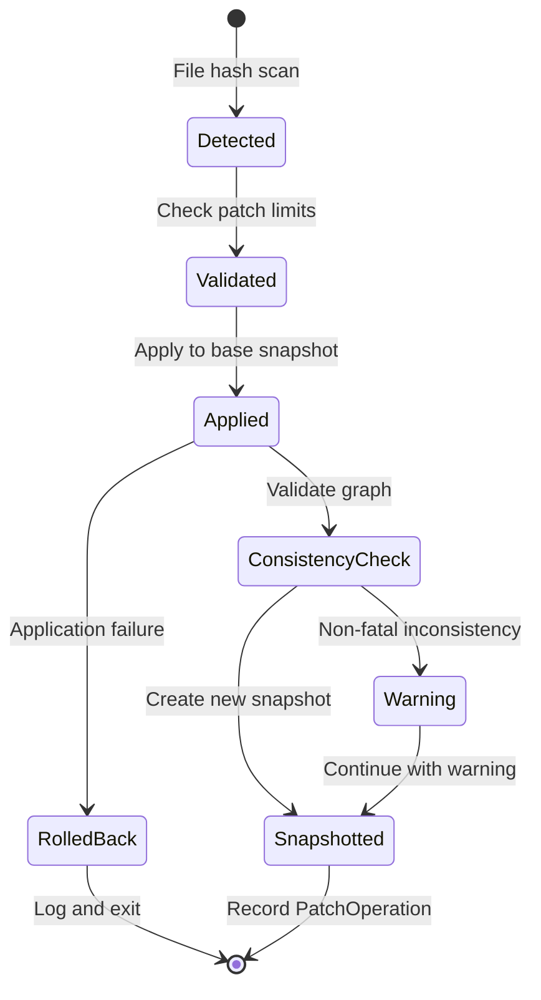

# 5. Time Machine & Incremental Patching

## 5.1 Snapshot Format

Snapshots capture the complete state of the code graph at a point in time:

```json
{
  "snapshot_id": "batho_<uuid>_<timestamp>",
  "schema_version": "snapshot.v1",
  "root": "/path/to/repo",
  "created_at": "2026-05-17T12:00:00Z",
  "graph": { /* InMemoryGraph serialized */ },
  "bsg": { /* BSGMap serialized */ },
  "metadata": {
    "git_commit": "abc123",
    "entity_count": 15420,
    "relationship_count": 48230
  }
}
```

## 5.2 Incremental Patch Lifecycle

The patch lifecycle ensures atomic updates with proper validation:



### Patch States

| State | Description | Next Possible States |
|-------|-------------|---------------------|
| **Detected** | File changes identified via hash scan | Validated, RolledBack |
| **Validated** | Change limits checked, within bounds | Applied, RolledBack |
| **Applied** | Changes applied to base snapshot | ConsistencyCheck, RolledBack |
| **ConsistencyCheck** | Graph validation running | Snapshotted, Warning |
| **Warning** | Non-fatal issues detected | Snapshotted |
| **Snapshotted** | New snapshot persisted | [*] |
| **RolledBack** | Failure occurred, changes reverted | [*] |

## 5.3 Patch Operation Record

Each patch operation is recorded with full audit trail:

| Field | Type | Description |
|-------|------|-------------|
| `operation_id` | UUID | Unique patch identifier |
| `base_snapshot_id` | string | Source snapshot |
| `new_snapshot_id` | string | Result snapshot |
| `changes_applied` | FileChange[] | Ordered change list |
| `patch_chain` | string[] | Lineage chain |
| `metrics` | object | Timing, token size, file counts |
| `checksum` | SHA-256 | Integrity hash |

### FileChange Structure

```json
{
  "file_path": "src/services/user.py",
  "change_type": "modified",
  "entity_changes": [
    {
      "entity_id": "UserService.create",
      "change_type": "updated"
    }
  ]
}
```

## 5.4 CLI Commands

### Snapshot Management

| Command | Purpose |
|---------|---------|
| `batho index --root . --snapshot` | Create snapshot |
| `batho snapshots --root .` | List snapshots |
| `batho diff-snapshots --root . A B` | Compare two snapshots |

### Patch Operations

| Command | Purpose |
|---------|---------|
| `batho patch --root . --scan` | Auto-detect and apply changes |
| `batho patches --root . --format timeline` | List patch history |
| `batho patch-info --root . --patch-id ID` | Show patch details |
| `batho apply-patch --root . --base-snapshot ID --diff-file changes.diff` | Apply from diff |
| `batho cherry-pick --root . --patch-id ID --target-snapshot ID` | Cross-snapshot cherry-pick |
