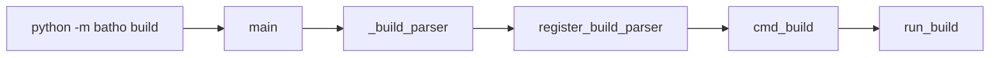
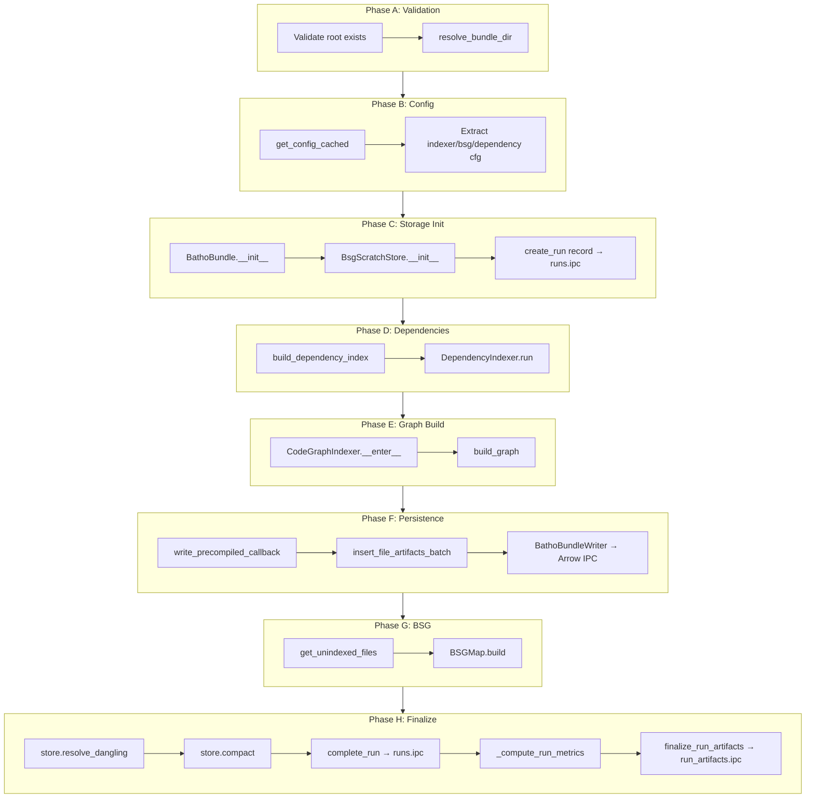
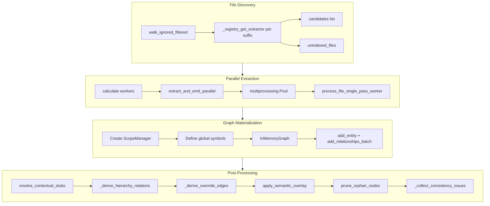
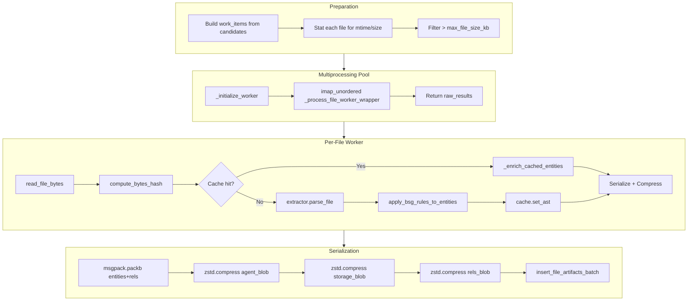
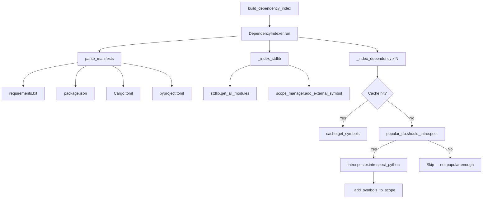
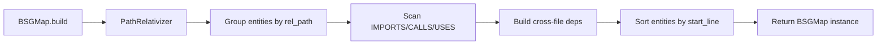
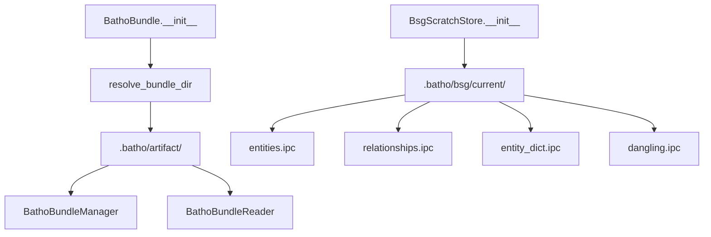

# Batho Build Execution Flow

Complete deep-dive into the `batho build` command — from CLI entry to Arrow IPC persistence.

---

## High-Level Overview

```
┌─────────────┐     ┌──────────────┐     ┌─────────────────┐
│   CLI Layer │────▶│ Orchestrator │────▶│   Graph Build   │
│  (build.py) │     │  (build.py)  │     │ (codegraph.py)  │
└─────────────┘     └──────┬───────┘     └────────┬────────┘
                           │                      │
                           ▼                      ▼
                    ┌──────────────┐     ┌─────────────────┐
                    │   Storage    │     │  Extraction Pipe  │
                    │   Engine     │     │  (pipeline.py)    │
                    │  (bundle.py) │     └─────────────────┘
                    └──────────────┘
```

---

## 1. CLI Entry Point

**File:** `batho_cli.py` → `batho/cli/build.py`



### Key Functions

| Function | File | Role |
|----------|------|------|
| `main()` | `batho_cli.py:38` | Entry point, configures logging, parses args, dispatches |
| `_build_parser()` | `batho_cli.py` | Builds argparse with all subcommands |
| `cmd_build(args)` | `batho/cli/build.py:47` | CLI handler, builds `BuildOptions`, calls orchestrator |

---

## 2. Orchestrator: `run_build()`

**File:** `batho/orchestrator/build.py:100`

This is the central conductor. It runs phases A–L sequentially.



### Phase Details

#### Phase A — Validation & Setup
```python
root = options.root.resolve()
batho_dir = root / ".batho"  # resolve_bundle_dir reads artifact_dir from config
```

**Guard:** If `bsg/current/` exists and `force_full=False`, returns early with `already_built` warning.

#### Phase B — Config Loading
```python
cfg = get_config_cached()
dep_cfg = cfg.get("dependency", {})
bsg_cfg = cfg.get("bsg", {})
indexer_cfg = cfg.get("indexer", {})
extraction_cfg = cfg.get("extraction", {})
extraction_cache_cfg = extraction_cfg.get("cache", {})
```

#### Phase C — Storage Initialization
- `BathoBundle(root)` → resolves `artifact_dir` via `resolve_bundle_dir(root)` (config-driven, default `.batho/artifact/`)
  - Creates Arrow IPC artifact directory
  - `BathoBundleManager` + `BathoBundleReader` initialized
- `BsgScratchStore(run_uuid, batho_dir, run_internal_id)` → initializes `.batho/bsg/current/` for entity/relationship writes
- `db.create_run(run_uuid, root_path, git_commit, git_branch)` → writes run record to `runs.ipc`

#### Phase D — Dependency Indexing (CDEU)
```python
dep_stats = build_dependency_index(
    root=root,
    scope_manager=dep_scope_manager,
    cfg=dep_cfg,
    cache_dir=cfg.get("paths", {}).get("cache_dir", ".batho/cache"),
)
```

Populates `ScopeManager` with stdlib + third-party symbols.

#### Phase E — Graph Build
```python
# Determine AST cache directory from extraction config
ast_cache_dir = None
if extraction_cache_cfg.get("enabled", True):
    cache_dir = cfg.get("paths", {}).get("cache_dir")
    if cache_dir:
        ast_cache_dir = str(Path(cache_dir))
    else:
        ast_cache_dir = str(root / ".batho" / "cache")

with CodeGraphIndexer(
    cache_path=str(db_path),
    root=str(root),
    ast_cache_dir=ast_cache_dir,
) as indexer:
    graph = indexer.build_graph(
        root=str(root),
        max_workers=options.max_workers or 0,
        max_file_size_kb=...,
        verbose=options.verbose,
        index_id=run_id,
        ast_cache_enabled=True,
        include_gaps=include_gaps_flag,
        write_callback=write_precompiled_callback,
        external_scope_manager=dep_scope_manager,
    )
```

Returns `InMemoryGraph` with entities + relationships.

#### Phase F — File Artifact Persistence (Callback-Driven)
- Each parsed file emits: `agent_blob`, `storage_blob`, `rels_blob`
- `write_precompiled_callback` batches in `precompiled_write_batch`
- Threshold: 500 items or 15MB → `db.insert_file_artifacts_batch()` → `BathoBundleWriter` writes Arrow IPC files per file

#### Phase G — Opaque Snapshots + BSG Map
- Iterates `indexer.get_unindexed_files()` (files with no AST extractor)
- Builds `FileSnapshot` for each
- `bsg_map = BSGMap.build(graph, str(root), opaque_snapshots=opaque_snapshots)`

#### Phase H — Finalize

The finalize phase compacts in-flight Arrow IPC stream buffers and stamps the run as complete.

1. **`store.resolve_dangling(db)`** — Symbol resolution pass. During parsing, cross-file forward references are written to `dangling.ipc` instead of `relationships.ipc`. This step:
   - Reads all unresolved rows from `BsgScratchStore.dangling_path`
   - Builds an in-memory name→entity lookup from the entity dict
   - For each dangling ref, tries fallback candidate chains (exact name → strip alias → strip path/module prefix)
   - Uses a proximity scorer (same file > same dir > shared path depth) to pick the best match
   - Appends resolved rows into `relationships.ipc`
   - Clears `dangling.ipc`
   - Returns resolved count (`count=0` means no unresolved cross-file refs existed)

2. **`store.compact()`** — Flushes all `_stream/` intermediate buffers into final `bsg/current/*.ipc` plain Arrow IPC files (memory-mappable, zero-copy read). Also rebuilds `entity_dict.ipc` and updates `meta.json`.

3. **`db.complete_run(run_uuid, entity_count, rel_count, file_count, duration_ms)`** — Stamps `status='completed'` + final counts into `runs.ipc` via `BathoBundleManager.commit_patch()`.

4. **`_compute_run_metrics(db, run_internal_id, root)`** — Aggregates statistics from `BsgScratchStore` Arrow tables into three payloads: `context_overview`, `structural_metrics`, `artifact_payload`.

5. **`db.finalize_run_artifacts(run_internal_id, artifacts, blob_config)`** — Writes all metric payloads + telemetry + security audit + delta stats + artifact_payload into `run_artifacts.ipc` via `BathoBundleManager.commit_patch()`. This is the v1.1.0 replacement for the earlier `_flush_run_artifacts()` method — it accepts a typed `artifacts` dict with explicit keys (`context_overview`, `telemetry_metrics`, `structural_metrics`, `security_audit`, `artifact_payload`, `delta_stats`) and an optional `blob_config` for artifact storage options.

---

## 3. Graph Build: `CodeGraphIndexer.build_graph()`

**File:** `batho/modules/graph/builder/codegraph.py:861`



### File Discovery
- `walk_ignored_filtered(root_path, spec=ignore_spec)` — respects `.gitignore`-style patterns
- `_registry_get_extractor(suffix)` — maps `.py` → PythonExtractor, `.js` → JSExtractor, etc.
- No extractor → `unindexed_files` (stored as opaque snapshots later)

### Worker Auto-Calculation
| File Count | Workers |
|-----------|---------|
| ≤50       | 4       |
| ≤200      | 8       |
| ≤1000     | 16      |
| >1000     | min(32, cpu_count × 2) |

---

## 4. Extraction Pipeline: `extract_and_emit_parallel()`

**File:** `batho/modules/extraction/pipeline.py:629`



### `process_file_single_pass_worker()` Steps

1. `read_file_bytes(filepath, max_size_kb, detect_binary=True)` — reads content, skips binaries
2. `compute_bytes_hash(content)` — SHA256 for cache key
3. **Cache check:** `cache.get_ast(filepath, content_hash, cache_variant)` — reads from disk-based `AstCache` (flat-file msgpack in `<cache_dir>/ast/`)
4. **Cache hit:** `_enrich_cached_entities()` — recomputes `raw_content`, `raw_bytes`, whitespace, parent/children from current file bytes
5. **Cache miss:** `extractor.parse_file()` → returns `(entities, relationships)`
6. **BSG Rules:** `apply_bsg_rules_to_entities()` — tags security/semantic metadata
7. **Cache write:** `cache.set_ast(...)` — serializes entities/relationships to msgpack and writes to disk. TTL expiry is checked on read.
8. **File snapshot:** `_create_file_snapshot()` (if `include_gaps`)
9. **Serialization:** `msgpack.packb()` + `zstd.compress()` → hollow, agent, storage, rels blobs
10. **Returns:** `(filepath, content_hash, hollow_bytes, rel_bytes, agent_blob, storage_blob, global_manifest, file_security_audit, local_hits)`

---

## 5. Dependency Indexing: `build_dependency_index()`

**File:** `batho/modules/dependency/indexer.py:173`



### `DependencyIndexer.run()`
1. `self.parser.parse_manifests(self.root)` — discovers manifest files
2. `self._index_stdlib()` — registers built-in modules per language
3. `self._index_dependency(dep)` for each manifest dependency:
   - `cache.get_symbols(dep.name, dep.version_spec, dep.manager.value)`
   - `popular_db.should_introspect(dep.language, dep.name, full_scan)`
   - `introspector.introspect_python(dep.name, venv_path)` — runtime introspection
   - `_add_symbols_to_scope(dep, symbols_map)` — SCIP-style IDs

---

## 6. BSG Map: `BSGMap.build()`

**File:** `batho/modules/compression/bsg_map/__init__.py:173`



### What it does
- `by_file: dict[str, list[Entity]]` — groups entities by relative file path
- `dependencies: dict[str, set[str]]` — scans `IMPORTS`/`CALLS`/`USES` relationships, builds cross-file dependency map
- Sorts entities within each file by `start_line`
- Stores `opaque_snapshots` for unindexed files
- Stores all `graph.relationships` for later rendering

---

## 7. Storage Engine: `BathoBundle` + `BsgScratchStore`

**Files:** `batho/modules/storage/arrow_bundle/bundle.py`, `batho/modules/storage/arrow_store/store.py`

See [`docs/STORAGE_ENGINE.md`](STORAGE_ENGINE.md) for the full Arrow IPC storage spec, including:
- `IncrementalEngine` for change detection (§5)
- `BathoCache` (UnifiedCache) used by workers (§6)
- Full Arrow schema tables for all IPC tables (§7)
- The CI/CD export/load cycle (§8)



### Key Methods Called During Build

| Method | Class | When | What |
|--------|-------|------|------|
| `create_run(...)` | `BathoBundle` | Phase C | Writes run record row, returns `run_internal_id` |
| `insert_file_artifacts_batch(...)` | `BathoBundle` | Phase F | Writes `agent_blob`, `storage_blob`, `rels_blob` via `BathoBundleWriter` to Arrow IPC files |
| `complete_run(...)` | `BathoBundle` | Phase H | Stamps `status='completed'` + final counts to `runs.ipc` |
| `_flush_run_artifacts(...)` | `BathoBundle` | Phase H | Writes context/telemetry/audit payloads to `run_artifacts.ipc` |
| `BsgScratchStore.compact()` | `BsgScratchStore` | Phase H | Compacts streamed entity/relationship writes into final `current/*.ipc` files |
| `store.resolve_dangling(db)` | `BsgScratchStore` | Phase H | Resolves forward cross-file refs into the scratch store |

### Arrow IPC Storage Layout
```
.batho/
  artifact/          ← BathoBundle working dir (config: paths.artifact_dir)
    runs.ipc           — build run records
    file_tracking.ipc  — file metadata (mtime, hash, size, inode)
    file_changelog.ipc — per-run file change log
    run_artifacts.ipc  — context overview, telemetry, security audit
    agents/            — per-file agent_view Arrow IPC files
    rels/              — per-file relationship Arrow IPC files
  bsg/
    current/         ← BsgScratchStore persistent graph (config: paths.bsg_dir)
      entities.ipc     — all indexed entities
      relationships.ipc — all indexed relationships
      entity_dict.ipc  — entity key → integer ID map
      dangling.ipc     — unresolved cross-file references
      meta.json        — run_uuid, run_internal_id, schema version
    _stream/         ← temporary flush buffers (auto-cleaned after compact)
```

---

## 8. Post-Processing Passes (Inside `build_graph`)

After graph materialization, several passes run sequentially on the main thread:

### 8.1 `resolve_contextual_stubs(graph, scope_manager)`
Resolves `json.dumps`-style dotted references:
1. `scope_manager.resolve_symbol_dotpath(target_name)`
2. Parent stub chaining via incoming relationships
3. Directory-relative path resolution fallback
4. Rewires `target_id` from stub → resolved symbol

### 8.2 `_derive_hierarchy_relations(graph)`
Derives `INHERITS`/`IMPLEMENTS` from entity metadata (`bases`, `extends`, `implements`):
- `_lookup_candidates(ref_text)` → `_normalize_ref_token()` → name-to-ID lookup

### 8.3 `_derive_override_edges(graph)`
Derives `OVERRIDES` edges:
- Scans `CONTAINS` (class→method) + `INHERITS` (class→class)
- DFS ancestor traversal, matches method names

### 8.4 `apply_semantic_overlay(graph, root_path, logger)`
Semantic tagging pass — adds domain-specific metadata to entities.

### 8.5 `prune_orphan_nodes(graph)`
Removes entities with zero edges (unless entry point or exported).

### 8.6 `_collect_consistency_issues(graph)`
Validates graph integrity:
- `IncrementalGraphUpdater.validate_graph_consistency(graph)` — broken relationship check
- `find_cycles(graph, RelationshipType.IMPORTS)` — iterative DFS
- `find_cycles(graph, RelationshipType.INHERITS)` — inheritance cycle detection

---

## 9. Complete Call Graph (Text)

```
batho_cli.py:main()
  └── cli/build.py:cmd_build(args)
        └── orchestrator/build.py:run_build(options)
              ├── storage/arrow_bundle/bundle.py:resolve_bundle_dir(root)
              ├── storage/arrow_bundle/bundle.py:BathoBundle(root)
              │     ├── BathoBundleManager(artifact_dir)
              │     └── BathoBundleReader(artifact_dir)
              ├── storage/arrow_store/store.py:BsgScratchStore(run_uuid, batho_dir, run_internal_id)
              ├── modules/dependency/indexer.py:build_dependency_index(root, scope_manager, cfg)
              │     └── DependencyIndexer.run()
              │           ├── ManifestParser.parse_manifests(root)
              │           ├── _index_stdlib()
              │           │     └── stdlib.get_all_modules(lang)
              │           └── _index_dependency(dep)
              │                 ├── cache.get_symbols(...)
              │                 ├── popular_db.should_introspect(...)
              │                 ├── introspector.introspect_python(...)
              │                 └── _add_symbols_to_scope(dep, symbols_map)
              ├── modules/graph/builder/codegraph.py:CodeGraphIndexer.build_graph(...)
              │     ├── walk_ignored_filtered(root_path, spec=ignore_spec)
              │     ├── _registry_get_extractor(suffix)
              │     ├── extract_and_emit_parallel(candidates, ..., ast_cache_dir=ast_cache_dir_str)
              │     │     ├── _calculate_optimal_chunk_size(candidates, num_workers)
              │     │     ├── multiprocessing.Pool(actual_workers)
              │     │     │     └── _initialize_worker(..., ast_cache_dir)
              │     │     │           └── BathoCache(cache_path, ast_cache_dir=ast_dir)
              │     │     │                 └── AstCache(cache_dir) [if enabled]
              │     │     └── pool.imap_unordered(_process_file_worker_wrapper, work_items)
              │     │           └── process_file_single_pass_worker(..., ast_cache_dir)
              │     │                 ├── read_file_bytes(filepath, ...)
              │     │                 ├── compute_bytes_hash(content)
              │     │                 ├── cache.get_ast(filepath, content_hash, variant)
              │     │                 │     └── AstCache.get_ast [disk read]
              │     │                 │     └── cache hit: _enrich_cached_entities(...)
              │     │                 ├── extractor.parse_file(filepath, content, ...)
              │     │                 │     └── returns (entities, relationships)
              │     │                 ├── apply_bsg_rules_to_entities(entities, relationships, ...)
              │     │                 ├── cache.set_ast(filepath, content_hash, entities, ...)
              │     │                 │     └── AstCache.set_ast [disk write]
              │     │                 ├── _create_file_snapshot(filepath, ...)
              │     │                 ├── _minify_graph_payload(agent_view)
              │     │                 ├── msgpack.packb(...)
              │     │                 └── zstd.compress(...)
              │     ├── _merge_external_scope(scope_manager, external_scope_manager)
              │     ├── InMemoryGraph()
              │     ├── graph.add_entity(ent)
              │     ├── graph.add_relationships_batch(relationships)
              │     ├── resolve_contextual_stubs(graph, scope_manager)
              │     ├── _derive_hierarchy_relations(graph)
              │     │     └── _lookup_candidates(ref_text)
              │     │           └── _normalize_ref_token()
              │     ├── _derive_override_edges(graph)
              │     ├── apply_semantic_overlay(graph, root_path, logger)
              │     ├── prune_orphan_nodes(graph)
              │     └── _collect_consistency_issues(graph)
              │           ├── IncrementalGraphUpdater.validate_graph_consistency(graph)
              │           └── find_cycles(graph, ...)
              ├── write_precompiled_callback(file_rel, blob_data) [batched]
              │     └── db.insert_file_artifacts_batch(run_id, batch)
              │           └── BathoBundleWriter.write_file_artifact(file_id, agent, storage, rels)
              ├── modules/compression/bsg_map/__init__.py:BSGMap.build(graph, root, opaque_snapshots)
              │     └── PathRelativizer(root)
              ├── store.resolve_dangling(db)         [resolve forward cross-file refs]
              ├── store.compact()                    [flush _stream/ → current/*.ipc]
              ├── db.complete_run(run_uuid, entity_count, rel_count, file_count, duration_ms)
              ├── _compute_run_metrics(db, run_id, root)
              ├── db._flush_run_artifacts(run_uuid)  [writes run_artifacts.ipc]
              └── BathoBundleManager.commit_patch(tables, run_uuid)
```

---

## 10. Data Flow: File → Database

```
File on Disk
    │
    ▼
read_file_bytes()
    │
    ▼
+--------------+     +--------------+     +---------------+
│  Parse AST   │────▶│   Entities   │────▶│  msgpack +    │
│  (extractor) │     │Relationships │     │  zstd compress│
+--------------+     +--------------+     +---------------+
    │                                            │
    ▼                                            ▼
+--------------+                          +---------------+
│  AstCache    │                          │  Precompiled  │
│  (disk:      │                          │  Blobs        │
│  .batho/     │                          │  (file_artifacts)
│  cache/ast/) │                          +---------------+
+--------------+
                                                 │
    ┌────────────────────────────────────────────┘
    ▼
+---------------+
│  Graph Build  │
│  (InMemoryGraph)│
+---------------+
    │
    ▼
+---------------+     +---------------+
│  BSGMap.build │────▶│  BSG Views    │
│               │     │  (agent/storage)│
+---------------+     +---------------+
    │
    ▼
+---------------+
│  finalize_run_│
│  artifacts()  │
+---------------+
    │
    ▼
+-------------------+     +----------------------+
│  .batho/artifact/ │     │  .batho/bsg/current/ │
│  (Arrow IPC files)│     │  (Arrow IPC files)   │
+-------------------+     +----------------------+
```

---

## 11. Key Configuration Knobs

| Config Key | Default | Controls |
|-----------|---------|----------|
| `indexer.max_file_size_kb` | 500 | Skip files larger than this |
| `indexer.max_workers` | 0 (auto) | Parallel worker count |
| `bsg.bidirectional.include_gaps` | true | Store full file snapshots for reconstruction |
| `dependency.enabled` | true | Run CDEU (dependency indexing) |
| `extraction.cache.enabled` | true | Persist parsed AST to disk for cross-session reuse |
| `extraction.cache.ttl_days` | 30 | AST cache entry TTL |
| `rules.enabled` | true | Enable BSG rule plugins during indexing |
| `rules.plugins_dir` | (built-in) | Custom plugin directory scanned by `_discover_packaged_plugins()` |
| `persistence.batch_size` | 500 | `BathoBundle` batch insert threshold |
| `persistence.batch_bytes_threshold` | 15728640 (15 MB) | `BathoBundle` batch bytes threshold |

---

## 12. Exit Codes

| Code | Meaning |
|------|---------|
| `0` | Success |
| `1` | Failure (errors logged to stderr) |
| `0` + warning | Database already exists, use `batho patch` |

---

## 13. Related Documentation

| Doc | Description |
|-----|-------------|
| [ORCHESTRATOR_PATCH_SPEC.md](ORCHESTRATOR_PATCH_SPEC.md) | `batho patch` incremental update — change detection, copy-on-write BSG, node diff |
| [ORCHESTRATOR_EXPORT_SPEC.md](ORCHESTRATOR_EXPORT_SPEC.md) | `batho export` views, pack mode, filter pipeline |
| [ORCHESTRATOR_GC_SPEC.md](ORCHESTRATOR_GC_SPEC.md) | `batho gc` storage maintenance |
| [ORCHESTRATOR_LOAD_SPEC.md](ORCHESTRATOR_LOAD_SPEC.md) | `batho load` transport ZIP ingestion |
| [STORAGE_ENGINE.md](STORAGE_ENGINE.md) | Arrow IPC storage format and schemas |
| [GRAPH_MODULE_SPEC.md](GRAPH_MODULE_SPEC.md) | CodeGraphIndexer, InMemoryGraph, node diff, reconstructor |
| [EXTRACTION_MODULE_SPEC.md](EXTRACTION_MODULE_SPEC.md) | AST extraction pipeline, AstCache, ScopeManager |
| [DEPENDENCY_MODULE_SPEC.md](DEPENDENCY_MODULE_SPEC.md) | CDEU dependency indexing |
| [COMPRESSION_MODULE_SPEC.md](COMPRESSION_MODULE_SPEC.md) | BSGMap, BSG rule engine |
| [CICD_INTEGRATION_GUIDE.md](CICD_INTEGRATION_GUIDE.md) | GitHub Actions, GitLab CI, pack/load workflow |
| [CLI_REFERENCE.md](CLI_REFERENCE.md) | All CLI commands and flags |
| [config.md](config.md) | Complete configuration reference |

---

*Updated for Batho v1.1.0 — corrected finalize_run_artifacts naming in Phase H, added §13 cross-references*
