**Product Definition Document: Sageoz Platform**

**Version:** 1.3
**Status:** Active Development (v1 Launch Targeted: Q3 2026)
**Product Line:** Sageoz — AI‑Driven Software Development & Architectural Memory Platform
**Document Owner:** Engineering & Product Team
**Last Updated:** March 19, 2026
**Distribution:** Internal (Shareholders, CTO, Leadership Team)

---

## **Table of Contents**

### **1. Executive Summary**

- [1.1 The Paradigm Shift in Software Development](#11-the-paradigm-shift-in-software-development)
- [1.2 Vision Statement](#12-vision-statement)
- [1.3 Core Innovation: Living Architectural Memory](#13-core-innovation-living-architectural-memory)
- [1.4 Market Opportunity & Impact](#14-market-opportunity--impact)
- [1.5 Strategic Differentiation](#15-strategic-differentiation)
- [1.6 Business Model & Go-to-Market](#16-business-model--go-to-market)
- [1.7 Success Metrics & Projections](#17-success-metrics--projections)

### **2. The Problem We Solve**

- [2.1 Current Challenges & Impact](#21-current-challenges--impact)
- [2.2 The Solution (High-Level)](#22-the-solution-high-level)

### **3. Target Personas & Use Cases**

- [3.1 Founders / C-Suite Executives](#31-founders--c-suite-executives)
- [3.2 CTO / VP Engineering](#32-cto--vp-engineering)
- [3.3 Developers](#33-developers)
- [3.4 Product Managers](#34-product-managers)
- [3.5 QA Engineers, Security Engineers, Engineering Managers](#35-qa-engineers-security-engineers-engineering-managers)

### **4. Product Scope: v1 (Launch Q3 2026)**

- [4.1 Universal Code Graph Indexer (CodeGraphIndexer)](#41-universal-code-graph-indexer-codegraphindexer)
- [4.2 Context Compression Engine (RepoMap)](#42-context-compression-engine-repomap)
- [4.3 High-Performance Ingestion Engine](#43-high-performance-ingestion-engine)
- [4.4 Time Machine (Historical Event Sourcing)](#44-time-machine-historical-event-sourcing)
- [4.5 Agentic Architecture Generation](#45-agentic-architecture-generation)
- [4.6 Standards-Compliant Documentation Generation](#46-standards-compliant-documentation-generation)
- [4.7 Live State Engine (Ticket Sync)](#47-live-state-engine-ticket-sync)
- [4.8 MR Validation & Auto-Approval Engine](#48-mr-validation--auto-approval-engine)
- [4.9 Command Surface (CLI / API)](#49-command-surface-cli--api)

### **5. Roadmap & New Strategic Feature Priorities**

- [5.1 v1.1 (Q4 2026): Code Intelligence Hub & Governance](#51-v11-q4-2026--code-intelligence-hub--governance)
- [5.2 v1.2 (Q1 2027): Enterprise Hardening & Persona Dashboards](#52-v12-q1-2027--enterprise-hardening--persona-dashboards)
- [5.3 v2.0 (H2 2027): Intelligence Layer & Structural Insight](#53-v20-h2-2027--intelligence-layer--structural-insight)
- [5.4 v2.1 (2028): Compliance & Governance at Scale](#54-v21-2028--compliance--governance-at-scale)

### **6. Non-Functional Requirements (NFRs)**

### **7. Integration Architecture**

### **8. Security & Compliance**

- [8.1 Data Protection](#81-data-protection)
- [8.2 Audit & Compliance](#82-audit--compliance)
- [8.3 OWASP Security Scanning](#83-owasp-security-scanning)

### **9. Pricing & Deployment Model**

- [9.1 Deployment Options](#91-deployment-options)
- [9.2 Licensing](#92-licensing)

### **10. Success Metrics & KPIs**

### **11. Competitive Positioning**

### **12. Risk Mitigation, GTM, FAQ, Approval**

- [12.1 Risk Mitigation](#121-risk-mitigation)
- [12.2 Go-to-Market Strategy](#122-go-to-market-strategy)
- [12.3 Frequently Asked Questions (FAQ)](#123-frequently-asked-questions-faq)
- [12.4 Document Approval](#124-document-approval)

---

## **1. Executive Summary**

### **1.1 The Paradigm Shift in Software Development**

AI tools promise unprecedented developer productivity, yet large‑scale codebases remain opaque, documentation drifts, and technical debt silently accumulates. Developers ship code faster than ever, but understanding the architectural impact of those changes has become exponentially harder, especially in monorepos and multi‑service systems.

Sageoz is a **living, self‑updating architectural memory system** that continuously ingests your repositories, builds a code graph, tracks historical evolution, validates every MR against business intent, and keeps C4 diagrams, SRS, security audits, and roadmaps automatically in sync.

### **1.2 Vision Statement**

**For Startups & General Users**
Sageoz is an **AI‑driven software development platform** that turns messy monorepos into always‑current design documents, validates every MR against the roadmap, and keeps teams aligned without needing a dedicated architect.
**For Enterprises & MNCs**
Sageoz is the **enterprise‑grade intent‑driven development and governance layer** for AI‑first engineering organizations. It bridges strategic vision and technical execution by orchestrating AI‑human collaboration on top of a shared architectural memory, enabling faster planning, verification, and approvals without compromising on security, compliance, or governance.

### **1.3 Core Innovation: Living Architectural Memory**

At the core, Sageoz maintains a **comprehensive, queryable graph** of your entire software ecosystem, updated in near real time as developers write and merge code.

**Key innovation pillars:**

1. **Graph as Source of Truth (Zero‑Hallucination Architecture)**
   The code graph is canonical; LLMs are stateless transformers over that graph, minimizing hallucinations and making insights auditable.

2. **Sub‑5‑Second Incremental Updates**
   Standard PR diffs (≤ 50 files) patch the graph in ≤ 5 seconds via webhook‑driven incremental updates, enabling real‑time feedback loops.

3. **Enterprise‑Scale Compression (RepoMap)**
   Deterministic, hierarchical compression allows repositories with > 5M LOC to be compressed into bounded LLM contexts (~10:1) while preserving architectural integrity.

4. **Intent‑Driven Validation**
   Every MR is validated against linked tickets and architectural intent using diff‑to‑ticket analysis grounded in the graph instead of free‑text heuristics.

### **1.4 Market Opportunity & Impact**

#### **Market Sizing Analysis (TAM/SAM/SOM)**

| Market Segment                   | Total Addressable Market (TAM) | Serviceable Addressable Market (SAM) | Serviceable Obtainable Market (SOM) | Growth Rate     |
| -------------------------------- | ------------------------------ | ------------------------------------ | ----------------------------------- | --------------- |
| **Developer Tools**              | $45B (2025)                    | $13.5B (30% of TAM)                  | $675M (5% of SAM)                   | 15% CAGR        |
| **AI Code Assistants**           | $12B (2025)                    | $6B (50% of TAM)                     | $600M (10% of SAM)                  | 35% CAGR        |
| **Technical Debt Management**    | $8B (2025)                     | $4B (50% of TAM)                     | $400M (10% of SAM)                  | 25% CAGR        |
| **Enterprise Code Intelligence** | **$65B Combined**              | **$23.5B**                           | **$1.675B**                         | **20-35% CAGR** |

**Our Target Market:** Enterprise code intelligence and architectural governance: **$3.2B SAM by 2028**, focusing on organizations with 100+ repositories or complex monorepo architectures.

#### **Market Validation & Early Traction**

**Customer Interviews & Validation:**

- **15+ enterprise CTOs** interviewed (Fortune 500, high-growth startups)
- **100%** identified documentation drift and technical debt opacity as critical issues
- **80%** willing to pay for automated MR validation and architectural insights
- **3 LOIs** secured for beta program (2 PE firms, 1 enterprise tech company)

**Market Drivers:**

- **AI Adoption Acceleration:** 85% of enterprises now using AI coding tools (Stack Overflow 2025)
- **M&A Technical Due Diligence:** 70% of deals require technical assessment (PitchBook 2025)
- **Compliance Pressure:** SOC 2, ISO 27001 requirements driving documentation needs
- **Developer Productivity Crisis:** 65% report spending >20% time on code understanding

#### **Competitive Landscape Analysis**

| Competitor           | Category            | Market Cap/Funding | Key Limitation                                 | Sageoz Differentiation                     |
| -------------------- | ------------------- | ------------------ | ---------------------------------------------- | ------------------------------------------ |
| **GitHub Copilot**   | AI Code Assistant   | Microsoft-backed   | Context window limits, no architectural memory | Graph-backed memory + time machine         |
| **Sourcegraph Cody** | Code Graph Platform | $2.6B valuation    | No MR validation or documentation generation   | Integrated workflow + governance           |
| **SonarQube**        | Static Analysis     | $1B+ valuation     | Rule-based, no business context                | Intent-aware + architectural understanding |
| **Greptile**         | AI Code Analysis    | $12M Series A      | No persistent memory or time versioning        | Complete architectural memory system       |
| **CodeRabbit**       | AI PR Review        | $8M Seed           | Diff-only, no historical context               | Time-versioned graph + validation          |
| **Snyk**             | Security Scanner    | $7.5B valuation    | Security-focused only                          | Comprehensive platform + governance        |

**Our Sustainable Competitive Advantage:**

1. **Network Effects:** Each repo indexed makes the platform more valuable for cross-repo analysis
2. **Data Moat:** Time-versioned architectural graphs become increasingly valuable over time
3. **Workflow Integration:** Deep integration into existing developer workflows reduces switching costs
4. **Multi-Persona Value:** Serves 7+ distinct personas vs. competitors' single focus

Graph‑based code intelligence and AI‑assisted code understanding are emerging as distinct categories, with platforms like Sourcegraph Cody, Greptile, and graph‑based PoCs validating demand for whole‑repo reasoning over hundreds of thousands of files. Sageoz extends this category by unifying code graphs, historical timelines, MR intent validation, and standards‑aligned documentation into a **single, persona‑aware platform**.

### **1.5 Strategic Differentiation**

Competitors typically focus on one slice of the problem: AI PR review, static analysis, security scanning, or code graph navigation. Sageoz provides the **architectural intelligence and governance layer** that connects all of them.

| Competitor Category        | Their Limitation                                                       | Sageoz Advantage                                                                             |
| :------------------------- | :--------------------------------------------------------------------- | :------------------------------------------------------------------------------------------- |
| AI Code Assistants         | Context window limits; hallucinate on large repos.                     | Graph‑backed memory; zero‑hallucination architecture for code understanding.                 |
| Static Analysis / Security | Rule‑based; poor understanding of business intent and architecture.    | Graph‑aware, intent‑aware MR validation plus OWASP‑aligned audits.                           |
| Documentation Tools        | Manual, quickly stale; lives outside the codebase.                     | Auto‑generated, version‑controlled artifacts (SRS, C4, ADRs, OWASP) committed into the repo. |
| AI PR Review Tools         | Diff‑only, no persistent architectural memory or time‑versioned state. | Whole‑repo, time‑versioned graph with diff‑to‑ticket validation and historical context.      |

### **1.6 Business Model & Go‑to‑Market**

Sageoz follows a tiered model:

- **Open‑Source Core:** CodeGraphIndexer and RepoMap as OSS library.
- **Pro Tier:** Time Machine, MR Validation, persona dashboards, MCP/IDE/CI integrations.
- **Enterprise Tier:** Multi‑org management, policy‑as‑code, compliance packs, on‑prem deployment, dedicated support.

**Go‑to‑market is phased:**

1. **Early Adopters (Q3 2026):** OSS adoption, free tier for OSS projects, YC/startup pilots, PE diligence pilots.

2. **Product‑Market Fit (Q4 2026 – Q1 2027):** Pro tier monetization, ROI case studies, webinars, and integration marketplace.

3. **Scale (H2 2027+):** Enterprise sales motion, deep MCP/agent partnerships, and system integrator channel.

### **1.7 Success Metrics & Projections**

By the end of v1 (Q3 2026):

- 50+ organizations, 500+ projects, 5,000+ monthly active users.
- ≥ 30% reduction in MR review cycle times at enterprise customers.
- ≥ 90% accuracy in requirement‑to‑code correlation.
- 10M ARR within 18 months of launch.

---

## **2. The Problem We Solve**

### **2.1 Current Challenges & Impact**

| Challenge              | Current State                                                                                   | Impact                                                             |
| :--------------------- | :---------------------------------------------------------------------------------------------- | :----------------------------------------------------------------- |
| Technical Debt Opacity | Teams spend weeks reverse‑engineering legacy or M\&A‑acquired codebases.                        | Delayed refactors, increased bug surface, slower feature velocity. |
| Documentation Drift    | SRS, design docs, and architecture diagrams diverge from production code.                       | Knowledge loss, onboarding friction, compliance risk.              |
| LLM Context Collapse   | Standard AI tools fail or hallucinate on very large repos (e.g., Linux kernel‑scale monorepos). | Enterprises cannot safely use AI on large estates.                 |
| MR Validation Labor    | Reviewers manually verify that each PR satisfies ticket requirements.                           | 20–40% of review cycles spent on tedious verification.             |

### **2.2 The Solution (High‑Level)**

Sageoz operates as an **intent‑driven development and governance platform** that:

1. Indexes the codebase into a compressed, queryable graph (CodeGraphIndexer).
2. Compresses this graph into LLM‑friendly views (RepoMap).
3. Continuously monitors repos via webhooks, incrementally patching the graph (Time Machine).
4. Validates MRs against linked tickets and policies (MR Validation Engine).
5. Routes MRs to appropriate personas and auto‑updates engineering artifacts.
6. Generates and maintains C4 diagrams, SRS, OWASP audits, and ADRs directly from the live graph.

---

## **3. Target Personas & Use Cases**

Sageoz serves organizations from lean startups to global enterprises, with tailored workflows for each key persona.

### **3.1 Founders / C‑Suite Executives**

**Context:** M\&A technical due diligence, portfolio oversight, and strategic technology assessments.

**Goal:** Understand technical health, risk, and scalability of codebases quickly without deep technical dives.

**How Sageoz Helps (examples):**

- Runs **M\&A due‑diligence** in hours instead of 4–6 weeks via external audits.
- Provides portfolio‑wide dashboards of technical health, tech stack choices, and security posture.
- Generates data‑driven investment and modernization recommendations.

### **3.2 CTO / VP Engineering**

**Context:** Owning architecture, technical debt, and cross‑team engineering excellence.

**Goal:** Maintain real‑time visibility into architecture, govern tech stack decisions, and reduce technical debt systematically.

Sageoz delivers:

- Organization‑wide architecture dashboard and cross‑team dependency mapping.
- Quantified technical debt and progress tracking over time.
- Technology stack analytics and modernization guidance.

### **3.3 Developers**

**Context:** Writing code, understanding unfamiliar areas, getting code reviews, and onboarding to new projects.

**Goal:** Fast context, high‑quality reviews, and reduced friction in shipping features.

Key benefits:

- Graph‑backed explanations of flows and call paths.
- MR diff‑to‑ticket validation with line‑level evidence.
- Automated documentation updates on merge.

### **3.4 Product Managers**

**Context:** Defining requirements, tracking delivery, and communicating progress to stakeholders.

**Goal:** Maintain visibility into feature delivery and ensure requirements traceability.

Sageoz provides:

- Live SRS documents auto‑generated from code.
- Feature‑to‑code traceability and progress dashboards.
- Auto‑generated status reports based on MR and graph state.

### **3.5 QA Engineers, Security Engineers, Engineering Managers**

These personas leverage Sageoz for regression impact analysis, OWASP scanning, compliance reporting, sprint planning, and productivity/quality metrics. The platform surfaces change impact, critical paths, vulnerability findings, team workload, and velocity trends from a single underlying graph.

---

## **4. Product Scope: v1 (Launch Q3 2026)**

### **4.1 Universal Code Graph Indexer (CodeGraphIndexer)**

- Multi‑language AST extraction for 30+ languages (Python, TypeScript, Go, Rust, Java, C\#, Kotlin, etc.).
- Relational topology mapping (IMPORTS, CALLS, USES) into an InMemoryGraph.
- Stack detection (frameworks, package managers, deployment primitives like Dockerfiles, pyproject.toml, package.json).
- Incremental invalidation and sub‑5‑second re‑indexing for PR diffs.

### **4.2 Context Compression Engine (RepoMap)**

- Token‑budgeted rendering for configurable context ceilings (e.g., 100K or 200K tokens).
- Hierarchical symbol view of directories, functions, classes, and relationships.
- Lossy compression with integrity preservation (ranked pruning of leaves before hubs).
- JSON output for programmatic use and Markdown for human review.

### **4.3 High-Performance Ingestion Engine**

- JSON file‑state cache (mtime + SHA‑256) skips unchanged files.
- Parallel AST extraction using ThreadPoolExecutor.
- Safe parsing with binary/minified file detection via magic bytes, entropy, and null‑byte ratios.
- Staleness scoring per repo (0.0–1.0) based on last index time, changed files ratio, and MR frequency.
- Strict `.gitignore` and `.bathoignore` enforcement.

### **4.4 Time Machine (Historical Event Sourcing)**

```
- Versioned snapshots with unique immutable IDs (`batho_<uuid>_<timestamp>`).
```

- GitHub webhook integration (push, pull_request, pull_request_review) over default branches.
- Incremental graph patching with ≤ 5s target latency for standard PR diffs.
- Depth‑configurable timeline queries and `diff_command` for structural deltas between snapshots.

### **4.5 Agentic Architecture Generation**

- Bottom‑up summarization generating `README-summary.md` per directory.
- Reverse‑engineered C4 L1 (System), L2 (Container), L3 (Component) models from APIs, deployables, data flows, and service boundaries.
- Export to PlantUML, Mermaid, PNG, and SVG.

### **4.6 Standards‑Compliant Documentation Generation**

- IEEE 830 / ISO 29148 SRS extraction from the graph: endpoints, domain models, workflows, configuration‑driven NFRs.
- OWASP security audit detecting missing auth, unvalidated inputs, secrets, improper error handling, and classic web vulnerabilities.
- ADR generation from commit history + code graph, producing machine‑drafted ADRs for human review.

### **4.7 Live State Engine (Ticket Sync)**

- GitHub/Jira issue ingestion mapped to AST nodes (functions, classes, endpoints).
- Delta roadmapping: current state vs desired state (prompt/spec) into chunked, prioritized tickets.
- Backlog health reports (stale tickets, drifted components, reprioritization suggestions).

### **4.8 MR Validation & Auto-Approval Engine**

**Purpose:** Validate code changes against business intent, route approvals by role, and automatically update documentation — enabling teams to ship faster while maintaining quality and governance.

- **Ticket-MR Linking** – extracts ticket IDs from PR branch names, commit messages, or configured naming conventions; fetches the associated Jira/GitHub issue and its acceptance criteria

- **Diff-to-Ticket Analysis** – using the indexed CodeGraphIndexer output, compares changed AST nodes against the ticket's requirements:
  - "Added endpoint /users" → checks if it matches acceptance criteria
  - "Implemented OTP validation" → checks implementation completeness
  - "Added security guard" → verifies auth middleware is present
  - Produces a **Pass/Fail summary** with line-level evidence

- **Persona-Based Routing** – automatically assigns the MR to the user in the organization who holds the configured reviewer persona for that project:
  - Ticket tagged "Backend / Security" → routes to user with "Security Reviewer" persona
  - Ticket tagged "Frontend" → routes to user with "Frontend Reviewer" persona
  - Ticket tagged "QA" → routes to user with "QA Lead" persona

- **Approval-Driven Automatic Updates** – upon approval, Sageoz:
  - Updates the CodeGraphIndexer graph to reflect new functions, endpoints, classes
  - Regenerates affected SRS sections (API spec, data model, security requirements)
  - Regenerates C4 diagrams if architecture changed
  - Commits updated artifacts to a sageoz/ folder in the repo (version-controlled, auditable)
  - Updates roadmap_command output: ticket marked complete, next prioritized tickets surfaced
  - Posts a changelog comment summarizing the change and its impact

- **Feedback Loop** – if a PR fails validation:
  - Posts a detailed comment listing mismatches (e.g., "Ticket requires OTP validation; implementation found regex but no rate limiting")
  - Suggests corrective actions with code pointers
  - Allows developer to push new commits without re-assigning; Sageoz re-validates automatically

- **Org Structure Support**:
  - **Multi-Org Management** – create multiple organizations, each with billing, member management, and access control
  - **Multi-Project Assignments** – assign users to projects with specific personas (Implementer, Reviewer, QA, Architect, SecurityReviewer, etc.)
  - **Permission Model** – org admins can assign/revoke personas, manage approver routing rules, and configure ticket linking strategy

### **4.9 Command Surface (CLI / API)**

| Command          | Description                                                                            | Input                                | Output                                                                    |
| :--------------- | :------------------------------------------------------------------------------------- | :----------------------------------- | :------------------------------------------------------------------------ |
| index_command    | Entry point — parses repo, builds graph, caches state, computes staleness score        | repo_url or folder_path              | CodeGraphIndexer \+ RepoMap \+ staleness score                            |
| analyze_command  | Runs architecture generation pipeline (C4, SRS, OWASP audit) on the latest index       | Latest graph \+ optional config      | C4 diagrams (PlantUML/Mermaid), SRS document, OWASP audit report          |
| timeline_command | Walks MR history to user-defined depth N, builds versioned snapshots                   | repo_url, depth: int                 | Versioned snapshots indexed with batho\_\<uuid\>                          |
| diff_command     | Compares two versioned index snapshots, outputs structural delta                       | snapshot_1_id, snapshot_2_id         | Diff report: added/removed/refactored entities                            |
| roadmap_command  | Generates prioritized tickets and roadmap from latest analysis \+ desired state prompt | Latest graph \+ desired state prompt | GitHub Issues / Jira JSON ready for import                                |
| status_command   | Displays staleness score, last index metadata, graph health summary                    | repo_url                             | JSON: staleness, last update time, file count, LOC, language distribution |

---

## **5. Roadmap & New Strategic Feature Priorities**

This roadmap integrates competitive analysis and sets clear priorities.

### **5.1 v1.1 (Q4 2026): Code Intelligence Hub & Governance**

**Goal:** Make Sageoz the default repo‑context backend for AI agents, IDEs, and CI/CD, while establishing governance foundations.

**Priority features:**

1. **MCP Server for Sageoz (High)**
   - Expose graph queries, RepoMap slices, Time Machine, and MR validation as MCP tools/resources for Claude, Cursor, and other MCP clients.

2. **CI/CD Integration Packs (High)**
   - GitHub Actions / GitLab CI templates for `index_command` + `analyze_command` + OWASP audit + MR validation with configurable "warn/block" behavior.

3. **IDE Plugins (VS Code / JetBrains) (High)**
   - "Explain flow", "Impact of this change?", "Generate tests for impacted paths" backed by Sageoz, not raw file prompts.

4. **Policy‑as‑Code Engine (Medium–High)**
   - OPA‑style policies evaluated against the graph and diffs (e.g., layering rules, PII constraints, auth invariants).

5. **Founders / PE Diligence Workflow (Medium)**
   - One‑click "Technical Diligence Report": architecture summary, security, technical debt, and risk scoring in PDF form.

### **5.2 v1.2 (Q1 2027): Enterprise Hardening & Persona Dashboards**

**Goal:** Make persona value obvious and support large estates.

**Priority features:**

1. **Multi‑Repo & System‑of‑Systems Graphing (High)**
   - Cross‑repo dependency graphs and impact analysis across services in a portfolio.

2. **Persona Dashboards (High)**
   - CTO, Developer, PM, QA/Security, EM dashboards built on the same graph (coverage, staleness, MR cycle time, vulnerabilities, velocity, etc.).

3. **MR Risk Scoring (Medium–High)**
   - Risk scores based on diff complexity, dependency centrality, security touchpoints, and historical defects.

4. **Compliance Packs (Medium)**
   - Prebuilt SOC 2 / ISO 27001 / PCI‑DSS rules and report templates powered by OWASP, ADRs, and MR audit logs.

5. **Cost‑Aware Multi‑Model Support (Medium)**
   - LLM abstraction layer with routing and cost‑forecasting dashboards (Claude, Mistral, OSS models).

### **5.3 v2.0 (H2 2027): Intelligence Layer & Structural Insight**

**Goal:** Deliver higher‑level architectural and process intelligence.

- **Architectural Anomaly Detection (High)** — detect circular dependencies, god objects, unstable interfaces using graph metrics/unsupervised models.
- **Graph‑Aware Test Impact & Recommendations (Medium–High)** — link diffs to critical execution paths and propose prioritized regression suites.
- **Natural Language Graph Queries (Medium)** — "What depends on auth?", "Which modules touch PII?", answered via LLMs over the graph.
- **Team Behavior Analytics (Medium)** — identify review bottlenecks, ownership gaps, and skill distribution.

### **5.4 v2.1 (2028): Compliance & Governance at Scale**

**Goal:** Establish Sageoz as a core compliance and governance system.

- Automated mapping from code and SRS/ADRs to regulatory controls (GDPR, HIPAA, PCI‑DSS).
- Graph‑based blast‑radius analysis for high‑risk changes.
- Deep integration with policy‑as‑code engines and external GRC tools.

---

## **6. Non‑Functional Requirements (NFRs)**

| NFR                           | Target                                                                                                                                        | Rationale                                                                                  |
| :---------------------------- | :-------------------------------------------------------------------------------------------------------------------------------------------- | :----------------------------------------------------------------------------------------- |
| **Indexing Latency**          | Full index for standard repo (< 1M LOC) in < 10 minutes                                                                                       | Enables rapid on-demand indexing during onboarding                                         |
| **Incremental Patch Latency** | PR diff (< 50 files) patched to graph in ≤ 5 seconds                                                                                          | Enables real-time webhook-driven updates; feedback loops to developers within review cycle |
| **Context Compression Ratio** | 10:1 minimum (compress 10M tokens to 1M) without losing top-level architecture                                                                | Enables enterprise-scale repos in bounded LLM context windows                              |
| **Scalability**               | Repos > 5M LOC, > 100k files, > 10 years of git history                                                                                       | Targets Linux kernel, Kubernetes, Supabase, large enterprise monorepos                     |
| **Security**                  | No un-sandboxed code execution; strict .gitignore / .bathoignore enforcement; treat all untrusted payloads as non-executable                  | Prevents RCE, data leaks, or accidental exposure of sensitive files                        |
| **Resiliency**                | Graph state uncorrupted if LLM generation step fails (timeout, rate limit, malformed output); immediate retry capability without re-indexing  | Decouples graph integrity from LLM availability                                            |
| **Observability**             | All indexing runs, graph mutations, LLM calls emit structured logs with cost tracking (tokens, latency, cache hit rate)                       | Enables cost optimization, performance tuning, and audit trails for compliance             |
| **Availability**              | GitHub webhook monitor runs as persistent background service with automatic restart on crash; uses exponential backoff for transient failures | Ensures Time Machine stays fresh even if main service restarts                             |
| **Multi‑Repo Scalability**    | 100+ repos per org without degrading Time Machine or queries                                                                                  | Supports enterprise portfolios and system-of-systems analysis                              |

---

## **7. Integration Architecture**

Sageoz is structured as four layers:

1. **Persona Access Layer:** Dashboards, reports, and notifications for each persona (Founders, CTOs, Developers, PMs, QA, Security, EMs, AI agents).
2. **Core Engine:** CodeGraphIndexer, RepoMap, Time Machine, MR Validation Engine.
3. **Outputs & Artifacts:** C4 diagrams, SRS, OWASP reports, ADRs, roadmaps, dashboards.
4. **External Systems:** GitHub, GitLab/Bitbucket (v1.1+), Jira, CI/CD, MCP/AI agents.### High-Level System Architecture

```mermaid
graph LR
    %% Configuration for better visibility
    classDef persona fill:#e1f5fe,stroke:#01579b,stroke-width:2px,color:#000000
    classDef core fill:#f3e5f5,stroke:#4a148c,stroke-width:2px,color:#000000
    classDef output fill:#e8f5e8,stroke:#1b5e20,stroke-width:2px,color:#000000
    classDef external fill:#fff3e0,stroke:#e65100,stroke-width:2px,color:#000000

    %% Persona Access Layer - Vertical arrangement
    subgraph Personas["Persona Access Layer"]
        direction TB
        P1[Founders/C-Suite]:::persona
        P2[CTO/VP Engineering]:::persona
        P3[Developers]:::persona
        P4[Product Managers]:::persona
        P5[Security Engineers]:::persona
        P6[QA Engineers]:::persona
        P7[Engineering Managers]:::persona
        P8[AI Agents]:::persona
    end

    %% Core Engine Layer - Vertical arrangement
    subgraph Core["Core Engine (Sageoz)"]
        direction TB
        CodeGraph["CodeGraphIndexer<br/>→ InMemoryGraph"]:::core
        RepoMap["RepoMap<br/>(compression)"]:::core
        TimeMachine["Time Machine<br/>(versioned snapshots)"]:::core
        MREngine["MR Validation<br/>& Approval Engine"]:::core

        CodeGraph --> RepoMap
        RepoMap --> TimeMachine
        TimeMachine --> MREngine
    end

    %% Outputs Layer - Vertical arrangement
    subgraph Outputs["Outputs & Artifacts"]
        direction TB
        O1["C4 Diagrams<br/>PlantUML/Mermaid/SVG"]:::output
        O2["SRS Document<br/>IEEE 830-compliant"]:::output
        O3["OWASP Security<br/>Audit Report"]:::output
        O4["ADR Drafts<br/>Architecture Decision Records"]:::output
        O5["Prioritized Roadmap<br/>GitHub Issues/Jira"]:::output
        O6["Executive Dashboards<br/>/& Metrics"]:::output
    end

    %% External Systems Layer - Vertical arrangement
    subgraph External["External Integrations"]
        direction TB
        GitHub[GitHub Webhooks]:::external
        Jira[Jira Issues]:::external
    end

    %% Data Flow Connections - Left to Right
    Personas --> Core
    Core --> Outputs
    External --> Core

    %% Styling for better visibility
    linkStyle 0 stroke:#01579b,stroke-width:2px
    linkStyle 1 stroke:#4a148c,stroke-width:2px
    linkStyle 2 stroke:#e65100,stroke-width:2px,stroke-dasharray: 5 5
```



### Data Flow Architecture

**Phase 1: Repository Indexing**

- Repository discovery and cloning
- Multi-language AST parsing
- InMemoryGraph construction
- RepoMap compression
- Artifact commitment to `sageoz/` folder
  **Performance:** Full index < 10 minutes for 1M LOC

**Phase 2: Analysis & Documentation Generation**

- Graph-based architectural analysis
- C4 model generation (System Context, Container, Component diagrams)
- IEEE 830-compliant SRS document creation
- OWASP security audit execution
- ADR (Architecture Decision Record) inference
  **Output:** Version-controlled documentation in multiple formats

**Phase 3: Continuous Monitoring**

- Incremental diff extraction
- Graph patching (≤ 5 seconds for < 50 files)
- Staleness score calculation
- Background service persistence
  **Reliability:** Exponential backoff, automatic restart, rate-limit tracking

**Phase 4: MR Validation & Approval**

- Ticket extraction and correlation
- Diff-to-ticket requirement analysis
- Persona-based reviewer routing
- Automated validation feedback
- Approval-driven documentation updates
  **Workflow:** Human-in-the-loop with AI acceleration

### Technical Integration Details

**Background Service Architecture**

- **Implementation:** Persistent webhook monitor using TrackedProvider + EventLog pattern
- **Features:** Rate-limit tracking, cost accounting, automatic restart
- **Performance:** p99 latency ≤ 8 seconds for incremental patches
- **Reliability:** Exponential backoff for transient failures

**Data Persistence Strategy**

- **Graph Storage:** In-memory with JSON serialization
- **Version Control:** All artifacts committed to repository `sageoz/` folder
- **Cache Strategy:** SHA-256 based file state caching with mtime validation
- **Backup:** Git-based versioning with full history

**API Integration Framework**

- **REST Endpoints:** All commands exposed as HTTP APIs
- **Webhook Support:** GitHub (v1.0), GitLab/Bitbucket (v1.1+)
- **Authentication:** OAuth2, API tokens, SSH keys
- **Rate Limiting:** Token bucket algorithm with per-client limits

---

## **8. Security & Compliance**

**Data Protection**

- Read‑only, AST‑only parsing (no code execution).
- `.gitignore` / `.bathoignore` and binary/minified detection applied at ingestion.
- Air‑gap‑compatible, on‑prem or private VPC operation.

**Audit & Compliance**

- Structured event logging with user IDs, timestamps, and cost metrics.
- All generated artifacts committed into the repo (e.g., `sageoz/` folder) with full git history.
- MR approvals logged with persona and validation results, enabling audits (SOC 2, ISO 27001, etc.).

**OWASP Security Scanning**

- Continuous scanning of the graph for auth gaps, input validation issues, secrets, and classic web vulnerabilities.
- Severity ranking (Critical/High/Medium/Low) and remediation suggestions.
- Foundation for compliance packs (SOC 2/ISO/PCI).

---

## **9. Pricing & Deployment Model**

**Deployment Options**

- **Self‑Hosted:** On‑prem or private VPC with optional GitHub/GitLab/Bitbucket integrations.
- **Managed SaaS (planned):** Hosted, multi‑tenant service with integrated billing.

**Licensing**

- **Open‑Source Foundation:** Core indexing and graph engine.
- **Pro Tier:** Time Machine, MR validation, multi‑org, dashboards, MCP/CI/IDE.
- **Enterprise Tier:** On‑prem, SSO, compliance packs, custom integrations, SLAs.

---

## **10. Success Metrics & KPIs**

| KPI                                     | Target                                                             | Owner          |
| :-------------------------------------- | :----------------------------------------------------------------- | :------------- |
| **Time to Architectural Understanding** | < 1 hour for 500k LOC codebase (vs. manual 2-4 weeks)              | Product        |
| **Documentation Staleness Score**       | < 0.2 (on 0.0–1.0 scale) on approved repos                         | Engineering    |
| **MR Review Cycle Time**                | 30% reduction (via auto-validation + parallelized approval)        | Product        |
| **Technical Debt Quantification**       | OWASP audit surfaces > 80% of known vulnerabilities (recall)       | Engineering    |
| **LLM Cost Efficiency**                 | > 10:1 compression ratio on enterprise repos (vs. naive prompting) | Infrastructure |
| **Webhook Latency (p99)**               | ≤ 8 seconds for incremental patch                                  | Infrastructure |
| **User Adoption**                       | 50+ orgs, 500+ projects, 5000+ monthly active users by end of v1   | Growth         |
| **Customer Satisfaction (NPS)**         | > 50 (promoters − detractors) / total respondents                  | Product        |

**Persona-Specific KPIs:**

| Persona                  | KPI                          | Target                                             | Owner       |
| :----------------------- | :--------------------------- | :------------------------------------------------- | :---------- |
| **Founders/C-Suite**     | M&A Due Diligence Time       | < 4 hours for comprehensive technical assessment   | Product     |
| **CTO/VP Engineering**   | Architecture Visibility      | 100% of org repos indexed and monitored            | Engineering |
| **Developers**           | Onboarding Time              | < 1 day to understand new codebase (vs. 2-4 weeks) | Product     |
| **Product Managers**     | Requirements Traceability    | 100% ticket-to-code correlation                    | Product     |
| **QA Engineers**         | Test Planning Efficiency     | 50% reduction in test planning time                | QA          |
| **Security Engineers**   | Vulnerability Detection Rate | > 80% of OWASP Top 10 detected                     | Security    |
| **Engineering Managers** | Sprint Planning Accuracy     | ±20% effort estimation accuracy                    | Engineering |

Representative KPIs:- **Time to Architectural Understanding:** 1 hour for a 500k LOC codebase (vs 2–4 weeks).

- **Documentation Staleness Score:** ≤ 0.2 on a 0.0–1.0 scale for actively managed repos.
- **MR Review Cycle Time:** ≥ 30% reduction.
- **Vulnerability Detection:** ≥ 80% coverage of OWASP Top 10 patterns.
- **LLM Cost Efficiency:** ≥ 10:1 reduction in effective tokens via RepoMap vs naive prompting.
- **Adoption:** 50 orgs, 500 projects, 5,000 MAUs by end of v1.

---

## **11. Competitive Positioning**

Sageoz is positioned as the **architectural memory and governance layer** above:

- AI code assistants and PR tools (Graphite, CodeRabbit, Panto AI).
- Code graph platforms (Greptile, Sourcegraph Cody).
- Static analysis and security scanners (SonarQube, Snyk, Code Intelligence, Qwiet AI).
- Graph‑based modernization PoCs (Infosys KGCI, reView).

The differentiation is clear: **graph + time machine + MR intent validation + standards‑aligned documents + multi‑persona workflows**, all in one product.

---

## **12. Risk Mitigation, GTM, FAQ, Approval**

**Risk Mitigation**

| Risk                          | Impact   | Likelihood | Mitigation Strategy                                                                                                                | Timeline    | Owner       |
| :---------------------------- | :------- | :--------- | :--------------------------------------------------------------------------------------------------------------------------------- | :---------- | :---------- |
| **LLM Dependency**            | High     | Medium     | Graph is source of truth; LLM failures don't corrupt data. Fallback to rule-based C4 generation. Multi-model support planned v1.2. | Q1 2027     | Engineering |
| **Large Repo Scalability**    | High     | Low        | Incremental patching + smart caching; parallel processing; lossy compression as fallback. Proven on 5M+ LOC repos.                 | Q4 2026     | Engineering |
| **Multi-Language Complexity** | Medium   | Medium     | Modular AST extractor framework; community contributions encouraged (open-source core). New languages added quarterly.             | Ongoing     | Engineering |
| **Security (Code Execution)** | Critical | Low        | Never execute code; AST-only parsing; magic byte + entropy validation. Sandbox all processing.                                     | Implemented | Security    |
| **Documentation Drift**       | Medium   | Low        | Background service with auto-restart; exponential backoff; manual re-index fallback. 99.9% uptime target.                          | Q3 2026     | Engineering |
| **Vendor Lock-In (GitHub)**   | Medium   | Low        | Support GitLab, Bitbucket, Gitea out of the box; abstractions allow swap-out. Multi-VCS support v1.1.                              | Q4 2026     | Engineering |
| **Market Adoption**           | High     | Medium     | Free OSS tier + strategic partnerships; YC pilot programs; ROI case studies. Target 50+ orgs by EOY v1.                            | Q3 2026     | Growth      |
| **Competitive Response**      | Medium   | Medium     | First-mover advantage with graph + time machine combo; continuous innovation; patent pending on core algorithms.                   | Ongoing     | Product     |
| **Talent Acquisition**        | Medium   | Medium     | Remote-first culture; technical equity; open-source community attraction. Target 15 engineers by EOY.                              | Q4 2026     | Leadership  |

**Key Risk Mitigation Principles:**

- **Defense in Depth:** Multiple fallback mechanisms for critical components
- **Open Source Core:** Community contributions reduce development risk
- **Incremental Delivery:** MVP approach with rapid iteration cycles
- **Customer Co-development:** Strategic partners provide early feedback and validation

**Go-to-Market Strategy**

Three phases: Early Adopter, Product‑Market Fit, and Scale, with emphasis on OSS community, ROI storytelling, and enterprise sales.

**Frequently Asked Questions (FAQ)**

### **Investor & Business Questions**

**Q: What is your total addressable market and how did you calculate it?**  
A: We operate at the intersection of three high-growth markets: Developer Tools ($45B, 15% CAGR), AI Code Assistants ($12B, 35% CAGR), and Technical Debt Management ($8B, 25% CAGR). Our Serviceable Addressable Market (SAM) is $3.2B by 2028, focusing on enterprise code intelligence and architectural governance.

**Q: What are your revenue projections and when do you expect profitability?**  
A: We project $10M ARR within 18 months of launch (Q1 2028), targeting 50+ organizations and 5,000+ MAUs. With our tiered model (OSS core, Pro tier at $50/seat/month, Enterprise at $200/seat/month), we expect to reach profitability in Q3 2028.

**Q: Who are your main competitors and what is your sustainable advantage?**  
A: Competitors focus on single-point solutions (AI assistants, static analysis, documentation). Our sustainable advantage is the combination of graph + time machine + MR validation + standards-aligned documents + multi-persona workflows. This creates a powerful moat as each component reinforces the others.

**Q: What are your key customer acquisition costs and lifetime value metrics?**  
A: Estimated CAC: $2,500 for enterprise customers, $150 for Pro tier. LTV: $25,000 for enterprise (3-year avg), $1,800 for Pro tier. LTV:CAC ratios of 10:1 (enterprise) and 12:1 (Pro).

### **Technical & Implementation Questions**

**Q: Does Sageoz execute any code from the repository?**  
A: No. Sageoz is read-only and AST-based. It parses code without executing it. This eliminates security risks and ensures safe operation on any codebase.

**Q: How does Sageoz handle monorepos with 50+ services?**  
A: Lossy compression with ranked pruning. Leaf nodes are pruned first; hub nodes (frequently used modules) are preserved to maintain architectural integrity. A 5M LOC monorepo compresses to ~100K tokens for LLM consumption.

**Q: What if my repository is private?**  
A: Sageoz can run on-premises or in your private VPC. GitHub webhooks require read-only token; no code is sent externally. All processing happens within your infrastructure.

**Q: Can Sageoz work with multiple Git hosting platforms?**  
A: Yes. v1 launches with GitHub; v1.1 adds GitLab, Bitbucket, Gitea support. Custom git server support via self-hosted webhook.

**Q: How do we ensure the MR Validation doesn't miss critical issues?**  
A: Validation is best-effort diff-to-ticket matching. It accelerates obvious failures and reduces reviewer load but does not replace human review for security-critical changes. Human approval is always required; Sageoz just pre-validates.

**Q: What's the cost impact of continuous webhook-driven indexing?**  
A: Incremental patching (< 5 seconds) uses zero LLM tokens. Full re-index (~10 minutes for 500k LOC) is ~5K tokens ($0.02–0.05 depending on model). Typically runs once per day per repo.

**Q: Can we integrate Sageoz with our internal tools (custom ticketing system, deployment pipeline)?**  
A: Yes. v1 ships with GitHub/Jira integration. Custom integrations available via REST API and webhook framework.

### **Security & Compliance Questions**

**Q: How do you ensure data privacy and compliance?**  
A: All processing is AST-only (no code execution), with strict .gitignore/.bathoignore enforcement. For regulated industries, we offer on-prem deployment with full data residency control.

**Q: What security certifications do you have or plan to obtain?**  
A: SOC 2 Type II certification planned for Q2 2027. ISO 27001 and GDPR compliance frameworks built into our enterprise offering.

**Q: How do you handle sensitive data like secrets or PII?**  
A: Binary/minified file detection prevents indexing of sensitive files. Magic byte and entropy validation identify and exclude secrets. PII detection capabilities available in Enterprise tier.

**Document Approval**

| Role          | Name           | Date           | Signature |
| :------------ | :------------- | :------------- | :-------- |
| Product Lead  | [Your Name]    | March 19, 2026 | _____ |
| CTO           | [CTO Name]     |                | _____ |
| Founder       | [Founder Name] |                | _____ |
| Head of Sales | [Sales Lead]   |                | _____ |

---
