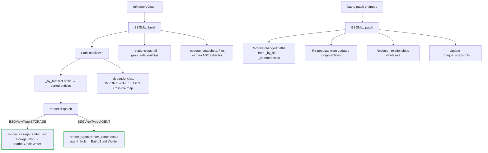

# Batho Compression Module Specification

This document describes the Batho Compression Module: how an `InMemoryGraph` is transformed into compressed, multi-view BSG artifacts, how YAML rule plugins are loaded and applied, and how the plugin system can be extended.

---

## 1. Overview

The compression module sits between graph construction and artifact persistence in the build pipeline. It has two independent subsystems:

- **BSGMap** — Converts an `InMemoryGraph` into a flat symbol index (`_by_file`), serializes it into three output views (storage JSON, agent text, developer text), and supports incremental updates via `patch()`.
- **Rule Engine** — Loads YAML plugin files, validates them against a JSON Schema, compiles them into frozen `RuleDefinition` objects (cached on disk with zstd+msgpack), and applies them per-entity during file extraction inside worker processes.

**Pipeline position:**
```
Phase E: Graph Build (codegraph.py)
    └── apply_bsg_rules_to_entities()  [workers, per-file]
    └── apply_semantic_overlay()       [main thread, post-graph]
Phase G: BSG Map
    └── BSGMap.build(graph, root)      [main thread]
Phase H: Finalize
    └── finalize_run_artifacts()       [uses BSGMap output]
```

---

## 2. File Structure

| File / Directory | Purpose |
|---|---|
| `bsg.py` | Public entry-point shim (thin re-export) |
| `rules.py` | Rule engine core (~3700 lines): plugin loader, matcher pipeline, action executor, Green Cache, semantic overlay |
| `core_engine/__init__.py` | Public re-exports of the rule engine API (`apply_rule_plugins`, `load_effective_rules`, etc.) |
| `bsg_map/__init__.py` | `BSGMap` dataclass: `build()`, `patch()`, `from_dict()`, `render_json()`, `render_delta()`, `render_storage_view()` |
| `bsg_map/render_storage.py` | Storage view renderer: `render_json()`, `render_files_json()`, free helper functions |
| `bsg_map/render_agent.py` | Agent/LLM view: `render_compressed()` with token-budget enforcement |
| `bsg_map/constants.py` | `EXT_TO_LANGUAGE_DISPLAY`, `EXT_TO_LANGUAGE_ID` — extension → language mappings |
| `bsg_map/relativizer.py` | `PathRelativizer` — cached absolute → repo-relative path conversion |
| `plugins/foundation/` | 28 built-in foundation YAML plugins |
| `plugins/interceptors/` | 10 interception YAML plugins |
| `schemas/bsg-plugin-schema-v1.json` | Legacy plugin schema (v1) |
| `schemas/bsg-plugin-schema-v2.json` | Current plugin schema (Draft 2020-12, `bsg-plugin.v2`) |

---

## 3. BSGMap: Build & Patch Flow



### `BSGMap.build(graph, root, serialization_config, opaque_snapshots)`

1. Validates `graph` is an `InMemoryGraph`
2. Creates `PathRelativizer(root)` — computes `root.resolve()` once
3. Iterates `graph.entities.values()` → groups by relative file path → sorts by `start_line`
4. Iterates `graph.relationships` — filters `IMPORTS`/`CALLS`/`USES` → builds cross-file dependency map
5. Builds `opaque_map` from `FileSnapshot` list (files with no AST extractor)
6. Returns `BSGMap` instance with all state set

### `BSGMap.patch(changes, graph, cache)`

- Receives `list[FileChange]` from `orchestrator/patch.py`
- Only mutates `_by_file` and `_dependencies` for changed paths
- Replaces `_relationships` **wholesale** (requires full merged graph, not partial)
- Updates `_opaque_snapshots` via `BathoCache.get_file_snapshot()` for newly-added non-AST files
- Does **not** re-run rule plugins (rules ran in workers during extraction)

### `BSGMap.from_dict(data)`

Reconstructs a `BSGMap` from a previously serialized dict. Supports two input shapes:
- `{nodes: [...]}` — node-list format (newer)
- `{filepath: [entities]}` — legacy per-file dict format

---

## 4. BSGMap: Render Views

### 4.1 Storage View (`render_storage.py`)

Main entry: `render_json(bsg, view_type, config) -> str`

Produces the canonical JSON artifact written via `BathoBundleWriter` to `artifact/agents/<file_id>.ipc`. Output shape:

```json
{
  "schema_version": "bsg.v2",
  "generated_at": "2026-06-05T...",
  "root": "/repo/root",
  "files": [
    {
      "name": "api/users.py",
      "path": "api/users.py",
      "category": "SOURCE",
      "language": "Python",
      "scope_tier": "PUBLIC",
      "service_tag": "UserService",
      "entity_summary": {"function": 4, "class": 1},
      "entities": [...]
    }
  ],
  "summary": {
    "total_files": 42,
    "total_entities": 312,
    "languages": {"Python": 30, "TypeScript": 12},
    "categories": {"SOURCE": 35, "TEST": 5, "CONFIG": 2}
  },
  "relationships": [...]
}
```

#### Free Helper Functions (promoted from `BSGMap` instance methods)

All live in `render_storage.py` as module-level free functions:

| Function | Input | Returns | Logic |
|---|---|---|---|
| `_derive_scope_tier(entity)` | `Entity` | `"PUBLIC"` / `"INTERNAL"` / `"PRIVATE"` | Maps `entity.type` — `MODULE`/`CLASS`/`FUNCTION` → PUBLIC; `METHOD`/`PROPERTY` → INTERNAL; `VARIABLE`/`CONSTANT` → PRIVATE |
| `_derive_category(file_path, entities)` | `str`, `list[Entity]` | `"SOURCE"` / `"TEST"` / `"CONFIG"` / `"INFRA"` / `"DOC"` | Path-prefix + extension heuristics; checks `bsg.category` metadata set by rule plugins |
| `_derive_language(file_path)` | `str` | `str` (display name) | Looks up extension in `EXT_TO_LANGUAGE_DISPLAY` from `constants.py` |
| `_derive_service_tag(entities)` | `list[Entity]` | `str \| None` | Tokenizes entity names; intersects with `_API_HINT_TOKENS`, `_AUTH_HINT_TOKENS`, `_DB_HINT_TOKENS`, etc. |
| `_normalize_category(cat)` | `str` | `str` | Maps internal keys (`"TEST"` → `"Test Artifact"`, etc.) |

#### `render_files_json(bsg, ...) -> list[dict]`

- Iterates `bsg._by_file` items
- For each file: calls `_derive_category`, `_derive_language`, `_derive_scope_tier`, `_derive_service_tag`
- Checks entity `metadata["bsg.category"]` set by rule plugins (takes precedence over heuristics)
- Builds per-entity dicts including `name`, `type`, `start_line`, `end_line`, `signature`, `metadata`, `usn_tags`

### 4.2 Agent View (`render_agent.py`)

Entry: `render_compressed(bsg, budget, fail_on_overflow=True) -> (str, stats)`

- Renders a compact, token-budget-capped summary for LLM injection
- Token counting: `_text_tokens(text) = max(1, len(text) >> 2)` (4-chars-per-token heuristic)
- Iterates `bsg._by_file` — writes `filepath:` header then `  EntityName (type)` per entity
- **Budget enforcement**: truncates at file boundary (not mid-file), appends `[...N more entries truncated]`
- If `fail_on_overflow=True` and budget exceeded → raises `ValueError`
- Returns `stats = {"tokens_used": int, "budget": int, "truncated_files": int}`

### ~~4.3 Developer View~~ (removed)

`render_bsg.py`, `render_full()`, `render_hierarchical()`, and `group_by_directory()` have been deleted. They had no production callers — `BSGViewType` only has `STORAGE` and `AGENT`. `BSGViewType.HUMAN` (the planned hook for this view) was also removed from `core/schemas.py`.

---

## 5. Rule Engine Architecture

### 5.1 Data Model

All dataclasses are `frozen=True` (immutable, hashable, safe for multiprocessing pickling).

#### `RuleDefinition`

| Field | Type | Description |
|---|---|---|
| `rule_id` | `str` | Unique identifier (`plugin_id.rule_id` format) |
| `name` | `str` | Display name |
| `description` | `str` | Human description |
| `severity` | `str` | `"info"` / `"warning"` / `"block"` |
| `priority` | `int` | Higher = applied first (range: 0–1000) |
| `score` | `int` | Interception score (0–1000, used by security audit) |
| `enabled` | `bool` | Disabled rules are skipped at load time |
| `plugin` | `str` | Source plugin ID |
| `match` | `RuleMatch` | Compiled matcher spec |
| `actions` | `RuleActions` | Action spec |
| `tags` | `tuple[str, ...]` | Classification tags |
| `bidirectional` | `bool` | If `True`, also matches gap entities |
| `schema_version` | `str` | Always `"bsg-plugin.v2"` |

#### `RuleMatch`

| Field | Type | Description |
|---|---|---|
| `entity_types` | `tuple[str, ...]` | Match on entity type (lowercase); `"*"` = any |
| `name_patterns` | `tuple[str, ...]` | fnmatch glob patterns against `entity.name.lower()` |
| `file_patterns` | `tuple[str, ...]` | fnmatch glob patterns against relative file path (lower) |
| `content_patterns` | `tuple[str, ...]` | Literal strings that must appear in file content |
| `regex_patterns` | `tuple[RegexMatcher, ...]` | Compiled regex matchers (AND semantics) |
| `usn_tags_any` | `tuple[str, ...]` | Entity must have at least one of these USN tags |
| `ast_edges_any` | `tuple[ASTEdgeMatcher, ...]` | At least one edge must match |
| `ast_edges_all` | `tuple[ASTEdgeMatcher, ...]` | All edges must match |
| `metadata_conditions` | `tuple[MetadataCondition, ...]` | Conditions on `entity.metadata` fields |
| `gap_entity_types` | `tuple[str, ...]` | Bidirectional: match `SYNTAX_GLUE`, `COMMENT_BLOCK`, etc. |
| `has_raw_content` | `bool \| None` | Match on presence of `entity.raw_content` |
| `has_coverage_gap` | `bool \| None` | Match entities with byte coverage gaps |

Pre-computed sets stored as non-init fields for O(1) lookup: `_entity_types_set`, `_usn_tags_any_set`, `_name_patterns_lower`, `_file_patterns_lower`.

#### `RuleActions`

| Field | Type | Description |
|---|---|---|
| `metadata` | `dict[str, Any]` | Merge into `entity.metadata` unconditionally |
| `add_usn_tags` | `tuple[str, ...]` | Append to `entity.metadata["bsg.usn"]` |
| `derive_scope_tier` | `bool` | Compute and set `bsg.scope_tier` from entity type |
| `derive_service_tag` | `bool` | Detect service from directory path pattern |
| `truncate_docstring` | `bool` | Trim `entity.docstring` to `max_docstring_length` chars |
| `max_docstring_length` | `int` | Default: 150 |
| `normalize_entry_point` | `bool` | Mark entity as entry point |
| `detect_language` | `dict` | Detect and set `bsg.language` metadata |
| `detect_framework` | `dict` | Detect and set `bsg.framework` metadata |
| `detect_package_manager` | `dict` | Detect and set `bsg.package_manager` metadata |
| `detect_infra` | `dict` | Detect and set `bsg.infra` metadata |
| `assign_category` | `dict` | Override `bsg.category` metadata |
| `when` | `WhenClause` | Conditional gate: suppress actions unless metadata conditions pass |
| `verify_coverage` | `bool` | Bidirectional: validate byte coverage |
| `verify_integrity` | `bool` | Bidirectional: verify file integrity |
| `add_reconstruction_metadata` | `dict` | Add reconstruction-specific metadata |
| `flag_for_reconstruction` | `bool` | Mark entity for bidirectional reconstruction |
| `apply_token_budget` | `int \| None` | Apply token budget to agent view rendering |

#### `RegexMatcher`

```python
@dataclass(frozen=True)
class RegexMatcher:
    pattern: str
    target: str = "name"        # "name" | "file_path" | "signature" | "metadata"
    metadata_key: str | None = None
    case_insensitive: bool = True
```

All regex matchers in a rule have **AND semantics** — all must match.

#### `ASTEdgeMatcher`

```python
@dataclass(frozen=True)
class ASTEdgeMatcher:
    edge: str                              # RelationshipType name (e.g. "CALLS", "IMPORTS")
    direction: str = "either"             # "inbound" | "outbound" | "either"
    target_entity_types: tuple[str, ...] = ()
    target_usn_tags_any: tuple[str, ...] = ()
    target_name_patterns: tuple[str, ...] = ()
    target_metadata_equals: tuple[tuple[str, Any], ...] = ()
    min_count: int = 1                     # Minimum number of matching edges required
```

#### `MetadataCondition`

```python
@dataclass(frozen=True)
class MetadataCondition:
    key: str
    operator: str    # exists | length_gt | length_lt | contains_any | contains_all
                     # in | not_in | eq | neq | regex_match
    value: Any = None
```

#### `WhenClause`

```python
@dataclass(frozen=True)
class WhenClause:
    all_: tuple[MetadataCondition, ...] = ()   # All conditions must pass
    any_: tuple[MetadataCondition, ...] = ()   # At least one must pass
```

If `WhenClause.is_empty` → actions fire unconditionally.

---

### 5.2 Plugin Loading: `load_effective_rules(rules_cfg, root_path)`

**File:** `rules.py` (called from `_init_worker()` in `pipeline.py`)

```python
def load_effective_rules(
    rules_cfg: dict[str, Any],
    root_path: Path,
    strict_validation: bool = False,
) -> tuple[list[RuleDefinition], dict[str, Any]]:
```

**Step-by-step:**

1. **Enabled check** — if `rules_cfg["enabled"] == False`, returns `([], stats)` immediately.

2. **Plugin discovery** — `_discover_packaged_plugins()` uses `importlib.resources` to scan both `plugins/foundation/` and `plugins/interceptors/`, returning a `dict[plugin_id, Path]` catalog.

3. **Plugin selection:**
   - If `auto_load_all_plugins: true` (default) → all 38 plugins loaded
   - Else → only plugins listed in `builtin_plugins:` config key
   - Alias resolution: `bsg_core` → `bsg_graph_foundation` via `_PLUGIN_ALIASES`
   - Deduplication: each canonical plugin ID loaded at most once

4. **Green Cache check:**
   - Computes `source_hashes` = SHA-256 of each selected plugin YAML file's content
   - Computes `config_fingerprint` = hash of `(source_hashes, relevant_config_keys)`
   - Reads `_CACHE_FILENAME = "rules_cache.bin"` (zstd+msgpack on disk)
   - If fingerprint + source hashes match → returns cached `list[RuleDefinition]` immediately (`cache_hit=True`)

5. **Validation** — `validate_plugin_file(path)` (also `_validate_plugin_document()` internally):
   - Reads YAML
   - Checks `schema_version` field
   - Validates against `bsg-plugin-schema-v2.json` via `jsonschema.Draft202012Validator`
   - Disabled plugins (`enabled: false` at top level) are skipped

6. **Rule compilation** — Each YAML rule → `RuleDefinition` with compiled `RuleMatch` (pre-built sets/tuples for fast matching).

7. **Dependency ordering** — `depends_on` list respected; plugins processed in dependency order.

8. **Cache write** — Compiled rules serialized to `rules_cache.bin` via `_write_cache()`.

9. **Returns** `(list[RuleDefinition], load_stats)` where `load_stats` includes:
   - `rules_loaded` — total compiled `RuleDefinition` objects
   - `builtin_plugins_loaded` — count of plugins successfully loaded
   - `rules_disabled` — rules skipped due to `enabled: false`
   - `cache_hit` — whether Green Cache was used
   - `errors` — validation error messages (non-fatal unless `strict_validation=True`)

**Telemetry note:** `rules_loaded` is injected into `local_hits["rules_loaded"]` at worker return in `pipeline.py`, then accumulated in `codegraph.py:build_graph_from_results()` as the final reported count (e.g. `rules_loaded=194` = 38 plugins × ~5 rules/plugin average).

---

### 5.3 Rule Application: `apply_rule_plugins(entities, relationships, rules, graph, ...)`

Called per-file inside `process_file_single_pass_worker()` in `pipeline.py`.

**Execution model:**

1. Rules are **sorted descending by `priority`** before the loop.
2. For each entity in `entities`:
   - Pre-compute: `entity_type_lower`, `entity_name_lower`, `rel_file_path_lower`, `entity_tags` (USN tag set)
   - Build `outbound` and `inbound` edge index once per entity from `relationships`
   - For each rule (priority order): call `_matches_rule()` → if True → `_apply_actions()`
3. Bidirectional rules (`rule.bidirectional=True`) additionally iterate gap entities (`SYNTAX_GLUE`, `COMMENT_BLOCK`, `IMPORT_BLOCK`, `GLOBAL_STATEMENT`)

**Matcher pipeline in `_matches_rule()` (short-circuits on first miss):**

```
1. entity_types      → set membership check (_entity_types_set); "*" skips check
2. usn_tags_any      → set intersection with _usn_tags_any_set
3. name_patterns     → fnmatch on entity.name.lower() against _name_patterns_lower
4. file_patterns     → fnmatch on rel_file_path.lower() against _file_patterns_lower
5. regex_patterns    → all RegexMatcher must match (AND), compiled+cached per call
6. content_patterns  → literal string search in file content (read from disk, cached)
7. ast_edges         → outbound/inbound edge checks with target filters
8. metadata_conditions → MetadataCondition operator evaluation on entity.metadata
9. gap_entity_types  → bidirectional: check against _gap_entity_types_lower
10. has_raw_content  → entity.raw_content is not None
11. has_coverage_gap → entity.start_byte > entity.end_byte
```

**Action execution in `_apply_actions()`:**
- `metadata` → `entity.metadata.update(actions.metadata)`
- `add_usn_tags` → append to `entity.metadata["bsg.usn"]` (deduped + sorted)
- `derive_scope_tier` → compute from entity type → set `bsg.scope_tier`
- `derive_service_tag` → parse directory path pattern → set `bsg.service_tag`
- `truncate_docstring` → trim `entity.docstring` in-place
- Detection actions (`detect_language`, `detect_framework`, etc.) → set corresponding `bsg.*` metadata keys
- `when` clause evaluated first: if conditions fail, metadata/tag actions are skipped

**Security audit accumulation:**
- Each plugin match increments `interceptions[plugin_id]` counter
- Returned in `local_hits["security_audit"]` from worker → merged in `build_graph_from_results()`
- Reported as `build_graph_complete.security_audit.plugins.<id>.interceptions` in logs

---

### 5.4 Semantic Overlay: `apply_semantic_overlay(graph, root_path, logger)`

Called on the **main thread** from `codegraph.py` after all workers complete, not in workers.

Unlike `apply_rule_plugins` (YAML-driven), `apply_semantic_overlay` is **Python-coded** heuristics:

1. **`_apply_semantic_usn_tags(graph, root_path)`** — For each entity, calls `_infer_semantic_tags(entity, rel_file_path)` which uses `_tokenize_identifier(entity.name)` and intersects against hint token sets:

   | Token Set | Tag Applied |
   |---|---|
   | `_API_HINT_TOKENS` | `APIEndpoint` |
   | `_AUTH_HINT_TOKENS` | `AuthBoundary` |
   | `_ORM_HINT_TOKENS` | `DatabaseSchema` |
   | `_DB_HINT_TOKENS` | `DatabaseExecution` |
   | `_ENV_HINT_TOKENS` or `NAME_IS_UPPER_CASE` | `EnvironmentVariable` |
   | `_INFRA_FILE_SUFFIXES` or `_INFRA_PATH_HINT_TOKENS` | `InfrastructureConfig` |
   | `_LOOP_HINT_TOKENS` | `LoopStatement` |
   | `_RESOURCE_HINT_TOKENS` | `ResourceAllocation` |
   | `_EXCEPTION_HINT_TOKENS` | `ExceptionHandler`, `CatchClause` |

   Also promotes entity type: if `InfrastructureConfig` tag → type becomes `INFRASTRUCTURE_CONFIG`; if `EnvironmentVariable` → type becomes `ENVIRONMENT_VARIABLE`.

2. **`_derive_semantic_relations(graph)`** — Derives additional `Relationship` edges from semantic tag patterns (e.g., resource allocation → cleanup function pairing).

---

### 5.5 Worker Cache: `_WORKER_RULES_CACHE`

```python
_WORKER_RULES_CACHE: list[RuleDefinition] | None = None  # module-level singleton
```

- Initialized **once per worker process** inside `_init_worker()` in `pipeline.py`
- Subsequent files processed by the same worker reuse the compiled rules (no re-load)
- `rules_loaded = len(_WORKER_RULES_CACHE)` injected into both paths:
  - Fresh-parse: after `_serialize_extraction_result()` returns
  - Cache-hit: after cached result enrichment
- This is why `rules_loaded` appears once in the main log (accumulated from workers) — **not** from the main process

---

## 6. Plugin Schema Reference (v2)

Schema file: `schemas/bsg-plugin-schema-v2.json`  
Validator: `jsonschema.Draft202012Validator`  
Schema ID: `https://sageoz.org/batho/schemas/bsg-plugin-schema-v2.json`

### Plugin Top-Level Fields

| Field | Type | Required | Description |
|---|---|---|---|
| `schema_version` | `"bsg-plugin.v2"` | ✓ | Must exactly match `_SCHEMA_VERSION` constant |
| `plugin_id` | `string` | ✓ | Unique snake_case identifier (used in audit logs and aliases) |
| `name` | `string` | ✓ | Human-readable display name |
| `version` | `string` | ✓ | SemVer string (e.g. `"1.0.0"`) |
| `enabled` | `boolean` | ✓ | Top-level toggle; `false` skips entire plugin at load time |
| `bidirectional` | `boolean` | | Enable gap entity matching (bidirectional flow support) |
| `depends_on` | `string[]` | | Plugin IDs that must be loaded before this one |
| `description` | `string` | | Human description (not validated beyond type) |
| `rules` | `Rule[]` | ✓ | Array of rule objects |

### Rule Fields

| Field | Type | Required | Description |
|---|---|---|---|
| `rule_id` | `string` | ✓ | Unique within plugin |
| `name` | `string` | ✓ | Display name |
| `description` | `string` | ✓ | What the rule detects/does |
| `severity` | `"info"` / `"warning"` / `"block"` | ✓ | Audit severity level |
| `priority` | `integer` | ✓ | Execution order (higher = first); typical range 0–400 |
| `enabled` | `boolean` | ✓ | Per-rule toggle |
| `score` | `integer` (0–1000) | | Interception score for security audit weighting |
| `tags` | `string[]` | | Classification tags for the rule itself |
| `bidirectional` | `boolean` | | Override plugin-level bidirectional flag per rule |
| `matchers` | `Matchers` | ✓ | Matcher spec (can be empty object `{}` to match all) |
| `actions` | `Actions` | ✓ | Action spec |

### Matcher Fields

| Field | Type | Description |
|---|---|---|
| `entity_types` | `string[]` | Entity type names (lowercase); `["*"]` matches any |
| `name_patterns` | `string[]` | fnmatch globs against `entity.name` (case-insensitive) |
| `file_patterns` | `string[]` | fnmatch globs against relative file path (case-insensitive) |
| `content_patterns` | `string[]` | Literal strings required in file content |
| `regex_patterns` | `RegexMatcher[]` | Compiled regex matchers (ALL must match) |
| `usn_tags_any` | `string[]` | Entity must have at least one of these USN tags |
| `metadata_conditions` | `MetadataCondition[]` | Conditions on `entity.metadata` |
| `ast_edges` | `{any: EdgeMatcher[], all: EdgeMatcher[]}` | Graph edge requirements |
| `gap_entity_types` | `string[]` | Bidirectional: `SYNTAX_GLUE`, `COMMENT_BLOCK`, `IMPORT_BLOCK`, `GLOBAL_STATEMENT` |
| `has_raw_content` | `boolean` | Match entities with `raw_content` field present |
| `has_coverage_gap` | `boolean` | Match entities with byte coverage gaps |

### Action Fields

| Field | Type | Description |
|---|---|---|
| `metadata` | `object` | Key-value pairs merged into `entity.metadata` |
| `add_usn_tags` | `string[]` | USN tags appended to `entity.metadata["bsg.usn"]` |
| `derive_scope_tier` | `boolean` | Compute and set `bsg.scope_tier` from entity type |
| `derive_service_tag` | `boolean` | Detect service from directory path |
| `truncate_docstring` | `boolean` | Trim docstring to `max_docstring_length` |
| `max_docstring_length` | `integer` | Characters to keep (default: 150) |
| `normalize_entry_point` | `boolean` | Mark entity as entry point |
| `detect_language` | `object` | Set `bsg.language` metadata |
| `detect_framework` | `object` | Set `bsg.framework` metadata |
| `detect_package_manager` | `object` | Set `bsg.package_manager` metadata |
| `detect_infra` | `object` | Set `bsg.infra` metadata |
| `assign_category` | `object` | Override `bsg.category` |
| `when` | `WhenClause` | Condition gate: suppresses metadata/tag actions if conditions fail |
| `verify_coverage` | `boolean` | Bidirectional: validate entity byte coverage |
| `verify_integrity` | `boolean` | Bidirectional: verify file integrity against snapshot |
| `add_reconstruction_metadata` | `object` | Reconstruction-specific metadata additions |
| `flag_for_reconstruction` | `boolean` | Flag entity for bidirectional reconstruction |
| `apply_token_budget` | `integer` | Apply token budget for agent view |

### `RegexMatcher` Object

| Field | Type | Required | Values |
|---|---|---|---|
| `pattern` | `string` | ✓ | Python regex pattern |
| `target` | `string` | | `"name"` (default), `"file_path"`, `"signature"`, `"metadata"` |
| `metadata_key` | `string` | | Required when `target = "metadata"` |
| `case_insensitive` | `boolean` | | Default: `true` |

### `MetadataCondition` Object

| Field | Type | Required | Notes |
|---|---|---|---|
| `key` | `string` | ✓ | `entity.metadata` key to inspect |
| `operator` | `string` | ✓ | `exists`, `length_gt`, `length_lt`, `contains_any`, `contains_all`, `in`, `not_in`, `eq`, `neq`, `regex_match` |
| `value` | any | | Comparison value (type depends on operator) |

### `EdgeMatcher` Object

| Field | Type | Required | Notes |
|---|---|---|---|
| `edge` | `string` | ✓ | `RelationshipType` name (e.g. `"CALLS"`, `"IMPORTS"`, `"INHERITS"`) |
| `direction` | `string` | | `"inbound"`, `"outbound"`, `"either"` (default) |
| `target_entity_types` | `string[]` | | Filter by target entity type |
| `target_usn_tags_any` | `string[]` | | Target must have at least one of these tags |
| `target_name_patterns` | `string[]` | | fnmatch globs against target entity name |
| `target_metadata_equals` | `object` | | Key-value pairs that must match in target metadata |
| `min_count` | `integer` (≥1) | | Minimum number of matching edges (default: 1) |

---

## 7. Plugin Catalog

### 7.1 Foundation Plugins (28)

#### Graph / Bidirectional (4)

| Plugin ID | What It Does | Key Tags / Metadata Set |
|---|---|---|
| `bsg_graph_foundation` | Baseline category, scope, and service tagging | `bsg.category` (TEST/DOC/CONFIG/INFRA), `TestArtifact`, `Documentation`, `Configuration`, `InfrastructureConfig`; `derive_service_tag`, `derive_scope_tier` |
| `bsg_bidirectional_foundation` | Validates gap entity coverage and integrity for bidirectional reconstruction | `bsg.bidirectional.verified`, `bsg.reconstruction.eligible` |
| `test_bidirectional_integrity` | Tests bidirectional integrity checks | Integrity metadata |
| `test_bidirectional_reconstruction` | Tests bidirectional reconstruction coverage | Reconstruction metadata |
| `test_bidirectional_gap_coverage` | Tests gap coverage validation | Gap coverage metadata |

#### Detection / Language (13)

| Plugin ID | Languages / Platforms Detected | Key Metadata Set |
|---|---|---|
| `bsg_detection_foundation` | Python, JS/TS, Go, Rust, Java, Ruby, PHP | `bsg.language`, `bsg.language_id` |
| `bsg_detection_cicd` | GitHub Actions, GitLab CI, Jenkins, CircleCI, Buildkite | `bsg.cicd.platform`, `CICDConfig` |
| `bsg_detection_cloud_providers` | AWS, GCP, Azure, DigitalOcean | `bsg.cloud.provider`, `CloudConfig` |
| `bsg_detection_cpp` | C, C++, headers | `bsg.language=C/C++`, `bsg.language_id=cpp` |
| `bsg_detection_csharp` | C#, .NET, ASP.NET | `bsg.language=C#`, `bsg.framework` |
| `bsg_detection_dart` | Dart, Flutter | `bsg.language=Dart`, `FlutterComponent` |
| `bsg_detection_elixir` | Elixir, Phoenix | `bsg.language=Elixir`, `PhoenixEndpoint` |
| `bsg_detection_kotlin` | Kotlin, Android, Spring | `bsg.language=Kotlin`, `AndroidComponent` |
| `bsg_detection_php` | PHP, Laravel, Symfony, WordPress | `bsg.language=PHP`, `bsg.framework` |
| `bsg_detection_ruby` | Ruby, Rails, Sinatra | `bsg.language=Ruby`, `RailsController` |
| `bsg_detection_scala` | Scala, Akka, Play | `bsg.language=Scala`, `AkkaActor` |
| `bsg_detection_swift` | Swift, iOS, macOS, SwiftUI | `bsg.language=Swift`, `SwiftUIView` |
| `bsg_detection_test_frameworks` | Jest, Pytest, JUnit, RSpec, Mocha, Go test | `TestFramework`, `bsg.test.framework` |

#### Categorization (1)

| Plugin ID | What It Does | Key Metadata |
|---|---|---|
| `bsg_file_categorization` | Detailed file-type classification beyond basic category | `bsg.file_type`, `bsg.layer` (controller/service/repository/model) |

#### Framework Detection (8)

| Plugin ID | Detected Framework | Key Metadata / Tags |
|---|---|---|
| `bsg_framework_angular` | Angular components, modules, services | `AngularComponent`, `bsg.framework=angular` |
| `bsg_framework_django` | Django views, models, urls, admin | `DjangoView`, `bsg.framework=django` |
| `bsg_framework_flask` | Flask routes, blueprints | `FlaskRoute`, `bsg.framework=flask` |
| `bsg_framework_nodejs` | Express, NestJS, Fastify, Koa, Hapi | `ExpressRoute`, `NestController`, `bsg.framework` |
| `bsg_framework_other` | FastAPI, Gin, Echo, Spring, Rails, Laravel | `FastAPIRoute`, `SpringController`, `bsg.framework` |
| `bsg_framework_python` | SQLAlchemy, Celery, Pydantic, Click | `SQLAlchemyModel`, `CeleryTask`, `bsg.framework` |
| `bsg_framework_react` | React components, hooks, context | `ReactComponent`, `ReactHook`, `bsg.framework=react` |
| `bsg_framework_vue` | Vue components, Vuex, Vue Router | `VueComponent`, `bsg.framework=vue` |

#### Optimization (1)

| Plugin ID | What It Does |
|---|---|
| `bsg_token_optimization` | Truncates long docstrings, normalizes entry points to reduce token count in agent view |

---

### 7.2 Interceptor Plugins (10)

Interceptors have `severity: block` or `severity: warning` and accumulate `bsg.intercept.*` metadata. They contribute to `security_audit.plugins.<id>.interceptions` in build logs.

| Plugin ID | What It Intercepts | Severity | Key Metadata Set |
|---|---|---|---|
| `bsg_hardcoded_secret_catcher` | Variables/constants matching `*secret*`, `*token*`, `*apikey*`, `*password*`, `*api_key*` | `block` | `bsg.intercept.category=SECURITY`, `SecretCandidate` |
| `bsg_auth_boundary_shield` | Auth/session functions without proper guard patterns | `warning` | `bsg.intercept.category=AUTH`, `AuthBoundaryViolation` |
| `bsg_api_contract_guardian` | API endpoints missing input validation patterns | `warning` | `bsg.intercept.category=API`, `APIContractViolation` |
| `bsg_nplus1_query_catcher` | ORM calls inside loop-tagged functions | `warning` | `bsg.intercept.category=PERFORMANCE`, `NPlusOneCandidate` |
| `bsg_resource_leak_preventer` | Resource allocation entities without corresponding cleanup | `warning` | `bsg.intercept.category=RESOURCE`, `ResourceLeakCandidate` |
| `bsg_silent_failure_catcher` | Exception handlers with empty/noop bodies | `warning` | `bsg.intercept.category=RELIABILITY`, `SilentFailureCandidate` |
| `bsg_schema_migration_enforcer` | Schema migration files without integrity annotations | `warning` | `bsg.intercept.category=DATA`, `MigrationRisk` |
| `bsg_dependency_blast_radius` | Highly-connected entities (many inbound CALLS/IMPORTS edges) | `info` | `bsg.intercept.category=ARCHITECTURE`, `HighBlastRadius` |
| `bsg_iac_drift_sentinel` | IaC entities missing state-tracking metadata | `warning` | `bsg.intercept.category=INFRASTRUCTURE`, `IaCDriftRisk` |
| `bsg_reconstruction_interceptors` | Gap entities failing bidirectional reconstruction checks | `block` | `bsg.intercept.category=INTEGRITY`, reconstruction metadata |

---

### 7.3 Authoring Guide: Writing a New Plugin

#### Step 1: Create the YAML file

Place it in:
- `plugins/foundation/` — for tagging, detection, categorization rules
- `plugins/interceptors/` — for security/quality interception rules

Filename convention: `bsg_<descriptive_name>.yaml`

#### Step 2: Minimal plugin skeleton

```yaml
schema_version: bsg-plugin.v2
plugin_id: bsg_my_plugin
name: My Plugin
version: 1.0.0
enabled: true
description: What this plugin does.
rules:
  - rule_id: my-rule-001
    name: my-rule-001
    description: Detect something useful.
    severity: info       # info | warning | block
    priority: 150        # 0–400; higher = applied first
    enabled: true
    matchers:
      entity_types:
        - function
        - method
      name_patterns:
        - '*handler*'
        - '*controller*'
    actions:
      metadata:
        bsg.my_tag: MyValue
      add_usn_tags:
        - MySemanticTag
```

#### Step 3: Matcher selection guide

| Use this matcher | When you want to... |
|---|---|
| `entity_types` | Filter by entity kind (most selective — use first) |
| `name_patterns` | Match on function/class/variable name (fnmatch globs) |
| `file_patterns` | Match on file path (e.g. `tests/**`, `**/views.py`) |
| `regex_patterns` | Complex patterns on name, signature, or metadata values |
| `usn_tags_any` | Chain off another rule's tags (e.g. detect after `APIEndpoint` tag set) |
| `ast_edges` | Graph-structural matching (e.g. "called by a class", "imports a specific module") |
| `metadata_conditions` | Conditional actions — only act if prior rule set a specific metadata value |
| `content_patterns` | File-content substring matching (slowest — use last, combine with other matchers) |

#### Step 4: Action guide

- Use `metadata:` for arbitrary key-value pairs — any key is valid
- Use `add_usn_tags:` for semantic labels readable by other rules via `usn_tags_any`
- Use `when:` to make actions conditional (e.g. only apply if `bsg.category` is already `SOURCE`)
- Use `derive_scope_tier: true` / `derive_service_tag: true` instead of hardcoding values
- Prefer `severity: info` for tagging rules; `severity: block` only for hard security violations

#### Step 5: Test your plugin

```bash
uv run batho_cli.py build --root . --full
```

Check `security_audit.plugins.bsg_my_plugin.interceptions` in the `build_graph_complete` log line. A non-zero value confirms at least one entity matched.

#### Step 6: Green Cache invalidation

Any change to your plugin YAML file automatically invalidates the Green Cache (`rules_cache.bin`). No manual action needed — `load_effective_rules` recomputes the `config_fingerprint` on every worker init.

#### Common pitfalls

- **Empty `matchers: {}`** — valid; matches every entity. Use only with low `priority`.
- **`entity_types` values are lowercase** — `"function"`, not `"FUNCTION"`. Check `EntityType` enum for valid values.
- **`name_patterns` use fnmatch, not regex** — `*handler*` works; `.+handler.+` does not (use `regex_patterns` for that).
- **`depends_on`** — only affects load order, not runtime execution order. Runtime order is controlled by `priority`.
- **Interceptors need `bsg.intercept.category`** — without this key in `metadata:`, the security audit won't group the plugin correctly.

---

## 8. Key Configuration

```yaml
rules:
  enabled: true                       # Master toggle for entire rule engine
  auto_load_all_plugins: true         # Load all 38 built-in plugins (default)
  builtin_plugins:                    # Used only when auto_load_all_plugins: false
    - bsg_graph_foundation
    - bsg_file_categorization
  disabled_rules: []                  # List of rule_ids to skip globally
  custom_rules_path: null             # Path to a custom YAML plugin file
  strict_validation: false            # If true, plugin validation errors abort the build
  cache:
    enabled: true
    path: .batho/cache                # Directory for rules_cache.bin
```

**Alias:**  `bsg_core` is an alias for `bsg_graph_foundation` (defined in `_PLUGIN_ALIASES`).

---

## 9. Telemetry Reference

All values appear in the `build_graph_complete` structured log line.

| Log Field | Source | Meaning |
|---|---|---|
| `rules_loaded` | `len(_WORKER_RULES_CACHE)` per worker, accumulated | Total compiled `RuleDefinition` objects across all loaded plugins. ~194 for default config (38 plugins × ~5 rules/plugin average). |
| `rules_applied` | `len(rules_applied_set)` per file, summed across workers | Distinct `rule_id` strings that matched at least one entity across all files. Measures breadth, not total match count. |
| `entities_updated` | `entities_tagged` counter per worker, summed | Entities that had at least one rule action applied (metadata set or USN tag added). |
| `security_audit.plugins.<id>.interceptions` | Per-plugin match counter per file, merged | Times any rule in plugin `<id>` matched any entity across all files. Zero for a plugin means no entity triggered its matchers. |
| `security_audit.plugins.<id>.rules` | Per-rule sub-dict | `{rule_id: {matches: int, severity: str}}` breakdown within each plugin. |

**Important:** `security_audit.plugins` is **empty on cache-hit builds** (`batho patch` when files are unchanged). Rule execution is skipped for cached files — only fresh-parsed files contribute to the audit.

---

## 10. Known Behaviors & Edge Cases

- **`security_audit` empty on cache-hit builds** — Rules run per-file inside workers. If a file's AST cache is valid, the worker returns early without re-running rules. The security audit only reflects files that were actually parsed in the current run.
- **`rules_loaded` vs YAML file count** — `rules_loaded` counts compiled `RuleDefinition` objects (individual `rules:` entries), not YAML plugin files. One plugin YAML can contain 5–15 rules.
- **`bsg_core` alias** — Resolved to `bsg_graph_foundation` via `_PLUGIN_ALIASES`. Using `bsg_core` in config is valid and equivalent.
- **`INHERITS_FROM` edge alias** — Resolved to `INHERITS` via `_EDGE_ALIASES` in `ast_edges` matchers.
- **Green Cache invalidation** — Any byte-level change to any loaded plugin YAML (including comments) triggers full rule recompilation on next build. The fingerprint includes all source file hashes.
- **`apply_semantic_overlay` vs `apply_rule_plugins`** — The semantic overlay runs on the main thread after all workers finish, operating on the merged `InMemoryGraph`. It uses Python-coded heuristics and can override entity types (`INFRASTRUCTURE_CONFIG`, `ENVIRONMENT_VARIABLE`). YAML rules run per-file in workers and cannot change `entity.type`.
- **Bidirectional gap entity types** — `SYNTAX_GLUE`, `COMMENT_BLOCK`, `IMPORT_BLOCK`, `GLOBAL_STATEMENT` entities are only present when `bsg.bidirectional.include_gaps: true` is set in config.
- **`BSGMap.patch()` requires full graph** — The `_relationships` field is replaced wholesale; passing a partial graph silently drops relationships from unchanged files.

---

*Generated for Batho v1.1.0*
