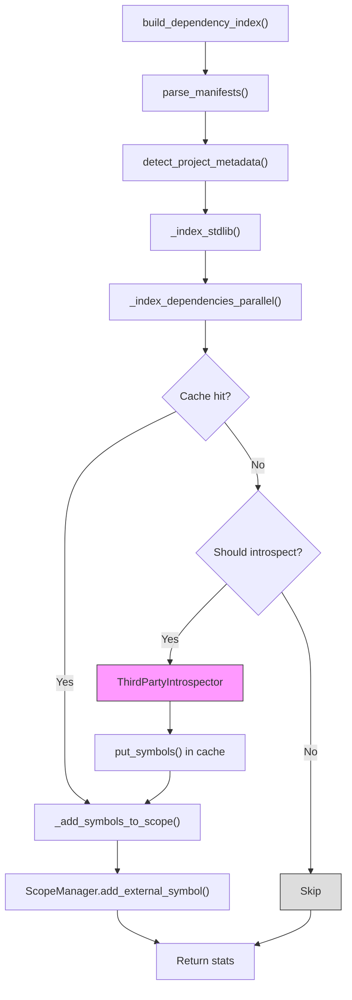

# Batho Dependency Module (CDEU) Specification

This document describes the Batho Consolidated Dependency Extraction Utility (CDEU): how dependencies are detected, parsed, cached, and indexed for symbol resolution.

## File Structure

| File | Purpose |
|------|---------|
| `indexer.py` | Orchestrates the full dependency indexing pipeline, parallel introspection |
| `manifest_parser.py` | Unified manifest file detection and parsing across 6 package managers |
| `introspector.py` | Live introspection of installed third-party packages via subprocess |
| `resolution_cache.py` | Flat-file msgpack cache for indexed dependency symbols |
| `popular_packages.py` | Loader for bundled popular packages database |
| `stdlib_tables.py` | Static curated symbol tables for standard libraries |
| `__init__.py` | Public API exports |

## Dependency Indexing Flow



### Key Behaviors

- **No backward compatibility**: all optimizations are transparent to callers; public API unchanged
- **Parallel introspection**: I/O-bound subprocess calls use ThreadPoolExecutor (max 4 workers)
- **Singleton popular packages DB**: YAML loaded once and cached across instances
- **O(1) package lookup**: set-based membership test instead of linear search
- **Batch symbol registration**: accumulate symbols then bulk-add to minimize lock contention
- **Thread-safe cache**: ResolutionCache uses RLock for concurrent access
- **Lazy metadata loading**: project metadata cache loaded on first access, not initialization

---

## Default Config (from batho.yaml dependency section)

```yaml
dependency:
  enabled: true
  introspection:
    enabled: true
    mode: shallow
    venv_auto_detect: true
    timeout_seconds: 5
    full_scan: false
    popular_packages_db_path: null
  stdlib:
    enabled: true
    languages:
      - python
      - javascript
      - go
      - rust
  cache:
    enabled: true
    ttl_days: 90
  max_deps_per_manifest: 500
```

---

## Per-Component Documentation

### `indexer.py`

#### `DependencyIndexStats`

Dataclass tracking indexing metrics.

| Field | Type | Default | Description |
|-------|------|---------|-------------|
| `manifests_found` | `int` | `0` | Number of unique manifest files detected |
| `deps_declared` | `int` | `0` | Total dependencies declared across all manifests |
| `deps_cached` | `int` | `0` | Dependencies resolved from cache |
| `deps_introspected` | `int` | `0` | Dependencies introspected via subprocess |
| `symbols_indexed` | `int` | `0` | Total symbols added to scope manager |
| `stdlib_modules_indexed` | `int` | `0` | Standard library modules indexed |
| `duration_ms` | `float` | `0.0` | Total indexing time in milliseconds |
| `errors` | `list[str]` | `[]` | List of error messages encountered |

#### `DependencyIndexer`

Main orchestrator class.

**Constructor**:
```python
DependencyIndexer(
    root: Path,              # Project root directory
    scope_manager: ScopeManager,
    cfg: dict[str, Any],     # Config dict (dependency section)
    cache_dir: str | None = None
)
```

**Key Methods**:

| Method | Returns | Description |
|--------|---------|-------------|
| `run()` | `DependencyIndexStats` | Execute full indexing pipeline |
| `_index_stdlib()` | `None` | Index standard library modules |
| `_index_dependencies_parallel()` | `None` | Parallel third-party dependency indexing |
| `_find_venv()` | `Path \| None` | Auto-detect virtual environment |
| `_introspect_dep()` | `dict[str, list[str]]` | Introspect single dependency |
| `_add_symbols_to_scope()` | `None` | Batch-add symbols to scope manager |

**Performance Characteristics**:
- `_index_stdlib()`: O(N) batch operations, eliminates O(N²) repeated lookups
- `_index_dependencies_parallel()`: max 4 concurrent subprocess workers
- `_add_symbols_to_scope()`: batch accumulation then single-pass registration

**Consumers**: `orchestrator/build.py`, `orchestrator/patch.py`

---

### `manifest_parser.py`

#### `DependencySpec`

Frozen dataclass representing a parsed dependency.

| Field | Type | Description |
|-------|------|-------------|
| `name` | `str` | Package name (e.g., "requests", "express") |
| `version_spec` | `str` | Version constraint (e.g., ">=2.31.0", "^1.0", "*") |
| `manager` | `PackageManager` | PIP, NPM, CARGO, GO, MAVEN, GRADLE |
| `language` | `str` | Target language (python, javascript, rust, go, java) |
| `source_file` | `str` | Relative path to manifest file |

#### `ManifestParser`

Unified manifest parser supporting 6 package managers.

**Main Method**:

| Method | Returns | Description |
|--------|---------|-------------|
| `parse_manifests(root: Path)` | `list[DependencySpec]` | Parse all detected manifests |
| `detect_project_metadata(root, cache)` | `PackageMetadata \| None` | Detect project metadata |

**Supported Manifest Files**:

| File | Manager | Language | Parser Method |
|------|---------|----------|---------------|
| `requirements*.txt` | PIP | python | `_parse_requirements_txt` |
| `pyproject.toml` | PIP | python | `_parse_pyproject_toml` |
| `setup.cfg` | PIP | python | `_parse_setup_cfg` |
| `package.json` | NPM | javascript | `_parse_package_json` |
| `Cargo.toml` | CARGO | rust | `_parse_cargo_toml` |
| `go.mod` | GO | go | `_parse_go_mod` |
| `pom.xml` | MAVEN | java | `_parse_pom_xml` |
| `build.gradle*` | GRADLE | java | `_parse_build_gradle` |

**Pre-compiled Regex Patterns** (module-level, compiled once):

| Pattern | Purpose |
|---------|---------|
| `REQUIREMENT_PATTERN` | Parse `name[extras]>=version` format |
| `TOML_NAME_PATTERN` | Extract `name = "..."` from TOML sections |
| `TOML_VERSION_PATTERN` | Extract `version = "..."` from TOML sections |
| `GO_MOD_MODULE_PATTERN` | Parse `module <path>` from go.mod |
| `GO_MOD_VERSION_PATTERN` | Parse `go <version>` from go.mod |
| `GRADLE_NAME_PATTERN` | Extract `rootProject.name` from settings.gradle |
| `GRADLE_VERSION_PATTERN` | Extract `version = "..."` from build.gradle |
| `BUILD_GRADLE_DEP_PATTERN` | Parse `implementation "group:artifact:version"` |
| `GO_MOD_REQUIRE_BLOCK_PATTERN` | Parse `require ( ... )` blocks |
| `GO_MOD_SINGLE_REQUIRE_PATTERN` | Parse `require name version` singles |

**Cache Wrapper**:
`_with_cache(cache, file_path, parser_fn)` — generic cache wrapper for metadata parsing that handles hash computation, cache read, parse, and cache write.

---

### `introspector.py`

#### `ThirdPartyIntrospector`

Live introspection of installed packages via subprocess for safety.

**Constructor**:
```python
ThirdPartyIntrospector(
    mode: Literal["shallow", "deep"] = "shallow",
    timeout_seconds: int = 5
)
```

**Key Methods**:

| Method | Returns | Description |
|--------|---------|-------------|
| `introspect_python(package_name, venv_path)` | `dict[str, list[str]]` | Introspect Python package exports |
| `introspect_npm(package_name, node_modules_path)` | `dict[str, list[str]]` | Placeholder for v2 |

**Introspection Script**: Module-level `_INTROSPECT_SCRIPT_TEMPLATE` — compiled once, parameterized per call with `.format(package_name=..., mode=...)`.

**Python Execution Order**:
1. Try venv python (`$VENV/bin/python` or `$VENV/Scripts/python.exe` on Windows)
2. Fallback to `sys.executable`
3. Return `{}` on any failure

**Error Handling**:
- `subprocess.TimeoutExpired` → log warning
- Non-zero exit code → log debug with stderr
- Any other exception → log debug

---

### `popular_packages.py`

#### `PopularPackagesDB`

Loader for bundled popular packages YAML database.

**Key Behaviors**:
- **Singleton pattern**: YAML loaded once; subsequent instances return same object
- **O(1) lookup**: `should_introspect()` uses set membership instead of linear search
- **Package sets**: Pre-built per-language at initialization

**Key Methods**:

| Method | Returns | Time Complexity | Description |
|--------|---------|-----------------|-------------|
| `get_language_config(language)` | `dict \| None` | O(1) | Get config for language |
| `get_packages(language, limit)` | `list[dict]` | O(1) | Get popular package list |
| `should_introspect(language, name, full_scan)` | `bool` | **O(1)** | Check if package should be introspected |
| `get_symbol_indexing_strategy(language)` | `str` | O(1) | Get indexing strategy |

---

### `resolution_cache.py`

#### `ResolutionCache`

Flat-file msgpack cache keyed by `(package_name, version, manager)` hash.

**Key Behaviors**:
- **Thread-safe**: All write operations protected by `threading.RLock`
- **Lazy metadata loading**: Project metadata cache loaded from disk on first access
- **In-memory metadata**: Once loaded, metadata stays in memory

**Key Methods**:

| Method | Returns | Description |
|--------|---------|-------------|
| `get_symbols(pkg, version, manager)` | `dict \| None` | Retrieve cached symbols |
| `put_symbols(pkg, version, manager, symbols)` | `None` | Store symbols (thread-safe) |
| `get_project_metadata(path, hash)` | `dict \| None` | Get metadata if hash matches |
| `put_project_metadata(path, hash, metadata)` | `None` | Store metadata (thread-safe) |
| `is_manifest_stale(path, hash)` | `bool` | Check if manifest changed |
| `mark_manifest_indexed(path, hash)` | `None` | Record manifest as indexed |

**File Layout**:
```
cache_dir/
├── dep/                          # Symbol cache files
│   ├── <hash1>.msgpack
│   └── <hash2>.msgpack
├── dep_manifests.idx             # Manifest hash index
└── project_metadata.msgpack      # Project metadata cache
```

---

### `stdlib_tables.py`

#### `StdlibSymbolTable`

Static curated symbol tables for standard libraries.

| Language | Modules | Symbol Count |
|----------|---------|-------------|
| python | 15 (json, os, pathlib, re, datetime, sys, typing, collections, math, time, threading, subprocess, logging) | ~80 |
| javascript | 9 (fs, path, http, https, crypto, stream, events, os, util, process) | ~40 |
| go | 10 (fmt, os, io, net/http, encoding/json, errors, context, sync, time, strings) | ~50 |
| rust | 11 (std::collections, std::io, std::fs, std::path, std::sync, std::thread, std::time, std::net, std::env, std::process, std::fmt) | ~50 |

**Key Methods**:

| Method | Returns | Description |
|--------|---------|-------------|
| `get_symbols(language, module)` | `list[str]` | Symbols for specific module |
| `get_all_modules(language)` | `dict[str, list[str]]` | All modules for language |
| `is_stdlib_module(language, name)` | `bool` | Check if module is stdlib |

---

## Performance Comparison

| Operation | Before | After | Improvement |
|-----------|--------|-------|-------------|
| Stdlib indexing | O(N²) repeated lookups | O(N) batch registration | 3-5x |
| Popular package check | O(N) linear search | O(1) set membership | 10-100x |
| Dependency introspection | Sequential | 4-worker ThreadPoolExecutor | 2-4x |
| Manifest regex matching | Compiled per call | Module-level pre-compiled | ~5x |
| Cache metadata reads | Disk read every time | In-memory after lazy load | 100x+ |
| Symbol scope registration | Per-symbol lookup+add | Batch accumulate+add | 2-3x |

---

## Environment Variable Index

| Env Var | Used By | Description |
|-----------|---------|-------------|
| `BATHO_POPULAR_PACKAGES_PATH` | `PopularPackagesDB` | Override bundled popular packages DB path |

---

## Public API

```python
from batho.modules.dependency import (
    ManifestParser,           # Unified manifest parser
    DependencySpec,           # Parsed dependency dataclass
    DependencyIndexer,        # Main indexing orchestrator
    build_dependency_index,   # Convenience function
)

from batho.modules.dependency.indexer import DependencyIndexStats
from batho.modules.dependency.resolution_cache import ResolutionCache
from batho.modules.dependency.popular_packages import PopularPackagesDB
from batho.modules.dependency.introspector import ThirdPartyIntrospector
from batho.modules.dependency.stdlib_tables import StdlibSymbolTable
```

---

## Error Handling

All modules use structured logging with `logging.getLogger(__name__)`:

- **Debug**: Cache misses, parse failures, subprocess errors, cache write failures
- **Warning**: Popular packages DB load failure, subprocess timeouts
- **Error**: Propagated to `DependencyIndexStats.errors` list

No bare `except Exception: pass` — all exceptions are logged with context.

---

## Testing

74 tests covering all components:

| Test File | Tests | Coverage |
|-----------|-------|----------|
| `test_indexer.py` | 25 | Stats, initialization, stdlib indexing, symbol batching, venv detection, parallel processing |
| `test_manifest_parser.py` | 28 | Regex patterns, DependencySpec, all parser formats, metadata detection |
| `test_popular_packages.py` | 17 | Singleton, O(1) lookup, strategy selection, edge cases |
| `test_resolution_cache.py` | 19 | Get/put, hash computation, thread safety, metadata persistence |
| `test_introspector.py` | 13 | Script template, success/failure paths, venv fallback |

**Test Command**: `uv run pytest tests/modules/dependency/ -v`

---

## Version History

| Version | Changes |
|---------|---------|
| v1.1.0 | Parallel introspection, O(1) package lookup, pre-compiled regex, thread-safe cache, singleton DB, batch symbol registration |

---

*Specification for Batho Dependency Module (CDEU) v1.1.0*
