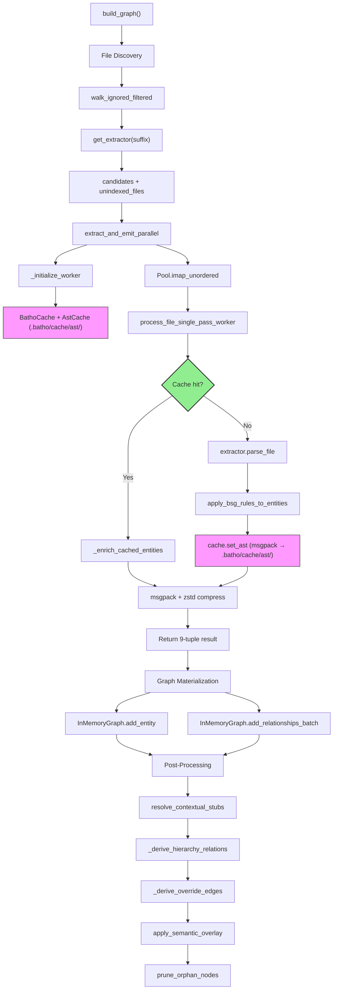

# Batho Extraction Module Specification

This document describes the Batho Extraction Module: how source files are parsed into AST entities and relationships, cached, and fed into the graph builder.

## File Structure

| File | Purpose |
|------|---------|
| `extractor.py` | Base `ASTExtractor` class — tree-sitter parsing, entity/relationship extraction |
| `pipeline.py` | Multiprocessing pipeline for parallel file processing |
| `scope_manager.py` | Symbol resolution scope manager with reader-writer lock |
| `ast_cache.py` | Disk-persistent flat-file msgpack cache for parsed AST results |
| `symbol_table.py` | Intermediate representation (`FileSymbolTable`, `SymbolDefinition`, `ImportStatement`) |
| `incremental_engine.py` | Delta detection — tracks added/modified/deleted files across runs |
| `extraction_result.py` | Result dataclasses (`ExtractionResult`, `ExtractionError`, `ExtractionStatus`) |
| `fallback_parser.py` | Fallback parser for files without a dedicated tree-sitter grammar |
| `submodules/parser_factory/registry.py` | Extension-to-extractor registry with lazy auto-discovery |
| `submodules/parser_factory/factory.py` | `ConfigurableExtractor` factory — eliminates per-language boilerplate |
| `submodules/parser_factory/detector.py` | Multi-strategy language detection (extension, shebang, magic bytes, heuristics) |
| `submodules/parser_factory/_queries.py` | Tree-sitter SCM query registry for all supported languages |
| `submodules/languages/*.py` | Language-specific extractor modules (CSS, HCL, HTML, JSON, Markdown, TOML, YAML) |
| `__init__.py` | Public API exports |

---

## Extraction Flow



### Key Behaviors

- **No backward compatibility**: the old in-memory LRU AST cache has been removed in favor of disk-persistent `AstCache`
- **Per-file exception isolation**: one bad file will not abort the whole scan
- **Max file size guard**: default 500KB skip for generated/minified files
- **Encoding detection fallback**: UTF-8 → latin-1 → replace
- **Deterministic output**: same source always produces same entities (frozen Pydantic models)
- **Process-level parser pooling**: `_TS_PARSER_CACHE` pools tree-sitter parsers per language
- **Multiprocessing for CPU-bound parsing**: `spawn` context to bypass GIL for tree-sitter operations
- **Disk-persistent AST cache**: cross-session reuse, reduces memory usage, TTL-based expiry
- **Reader-writer lock scope manager**: fair FIFO prevents writer starvation during concurrent access
- **Auto-discovery of languages**: registry uses importlib to discover new language modules automatically

---

## Default Config (from batho.yaml extraction section)

```yaml
extraction:
  cache:
    enabled: true           # Persist parsed AST to disk for cross-session reuse
    ttl_days: 30             # Days before cached AST entries expire
    max_entries: 5000        # Maximum cached files (oldest evicted first)
```

---

## Per-Component Documentation

### `extractor.py`

#### `ASTExtractor`

Base class for all language-specific extractors. Uses tree-sitter to parse source code and extract `Entity` + `Relationship` objects.

**Constructor**:
```python
ASTExtractor(
    language: str,                    # tree-sitter language identifier
    parsing_config: dict[str, Any] | None = None
)
```

**Key Methods**:

| Method | Returns | Description |
|--------|---------|-------------|
| `parse_file(filepath, content, include_gaps=False)` | `(list[Entity], list[Relationship])` | Main entry point — parse source bytes into entities and relationships |
| `_build_query()` | `Query` | Compile tree-sitter query from `_query_source()` |
| `_execute_query(root_node)` | `dict[str, list[Node]]` | Execute query and group captures by name |
| `_extract_entities(...)` | `list[Entity]` | Convert capture groups into Entity objects |
| `_extract_relationships(...)` | `list[Relationship]` | Derive relationships (CONTAINS, CALLS, IMPORTS, etc.) |
| `_resolve_fqn_stack(...)` | `list[str]` | Build fully qualified name via monotonic stack |

**Performance Characteristics**:
- Parser pooling: one parser per language per process via `_TS_PARSER_CACHE`
- Query compilation: cached per extractor instance
- FQN resolution: monotonic stack — O(depth) per entity
- Binary detection: early exit via magic bytes

**Capture Naming Convention**:

| Capture | Description |
|---------|-------------|
| `@def.<type>.name` | Identifier node of a definition |
| `@def.<type>.params` | Parameter list node |
| `@def.<type>.return_type` | Return type annotation node |
| `@def.<type>.visibility` | Visibility modifier node |
| `@def.<type>.docstring` | Docstring / comment node |
| `@def.<type>.bases` | Base class list (Python) |
| `@def.<type>.implements` | Interface list (Java / TS) |
| `@def.<type>.extends` | Superclass (Java) |
| `@def.<type>.trait` | Trait name (Rust impl) |
| `@def.<type>.receiver` | Method receiver (Go) |
| `@def.<type>.type` | Field / variable type |
| `@ref.call` | Function call reference |
| `@ref.import.module` | Import reference |

**Consumers**: `pipeline.py` workers, `codegraph.py`, language-specific extractor modules

---

### `pipeline.py`

#### `extract_and_emit_parallel()`

Orchestrates parallel file processing using `multiprocessing.Pool` (spawn context) to bypass Python's GIL for CPU-bound tree-sitter parsing.

**Signature**:
```python
extract_and_emit_parallel(
    candidates: list[tuple[Path, str]],
    configured_max_file_size_kb: int,
    bsg_cfg: dict[str, Any],
    package_dict: dict | None = None,
    index_id: str | None = None,
    include_gaps: bool = False,
    result_callback: Callable[[tuple], None] | None = None,
    ast_cache_dir: str | None = None,
) -> tuple[list[tuple], int, dict[str, Any]]
```

**Key Behaviors**:
- Auto-calculates workers: min(cpu_count, max_workers, len(candidates))
- Optimal chunk size calculation based on file count and worker count
- Graceful fallback to sequential processing on multiprocessing failure
- Worker initialization: logging config, `BathoCache` + `AstCache`, BSG rules pre-load

#### `process_file_single_pass_worker()`

Worker function for parallel single-pass extraction. Must be picklable for multiprocessing.

**Returns**: `(filepath, content_hash, hollow_bytes, rel_bytes, agent_blob, storage_blob, global_manifest, file_security_audit, local_hits)` (9-tuple)

**Steps**:
1. `read_file_bytes()` — reads content, skips binaries
2. `compute_bytes_hash()` — SHA256 for cache key
3. `cache.get_ast()` — disk-based cache read (AstCache)
4. Cache hit: `_enrich_cached_entities()` — recomputes raw_content, raw_bytes, whitespace
5. Cache miss: `extractor.parse_file()` → returns `(entities, relationships)`
6. `apply_bsg_rules_to_entities()` — tags security/semantic metadata
7. `cache.set_ast()` — serializes to msgpack, writes to disk
8. `_create_file_snapshot()` (if `include_gaps`)
9. `msgpack.packb()` + `zstd.compress()` → hollow, agent, storage, rels blobs
10. Returns 8-tuple with global manifest of exported symbols

**Performance Characteristics**:
- Sequential fallback when parallel disabled or empty candidates
- Worker pool reused across chunks
- BSG rules cached per worker process (`_WORKER_RULES_CACHE`)
- zstd compressor cached per worker (`_WORKER_ZSTD_COMPRESSOR`) — eliminates per-file compressor creation overhead

**Consumers**: `codegraph.py` `build_graph()`

---

### `ast_cache.py`

#### `AstCache`

Disk-persistent flat-file msgpack cache for parsed AST results. Replaces the previous in-memory LRU cache.

**Constructor**:
```python
AstCache(cache_dir: Path)
```

**Key Methods**:

| Method | Returns | Description |
|--------|---------|-------------|
| `get_ast(file_path, content_hash, variant)` | `(list[Entity], list[Relationship]) \| None` | Retrieve cached AST if not stale/expired |
| `set_ast(file_path, content_hash, variant, entities, relationships, mtime, size, ttl_days=30)` | `None` | Serialize and write AST to disk |
| `is_stale(file_path, content_hash, variant)` | `bool` | Check if cached entry is stale |
| `delete_ast(file_path)` | `int` | Delete all cache entries for file path; returns count deleted |
| `delete_by_path_prefix(path_prefix)` | `int` | Delete all entries matching path prefix |
| `clear()` | `int` | Delete all AST cache files and reset index |

**Thread Safety**:
- Parser cache (`_TS_PARSER_CACHE`): Protected by `_TS_PARSER_LOCK` with double-checked locking pattern for thread-safe initialization
- All AstCache operations: Protected by `threading.RLock`

**File Layout**:
```
cache_dir/
├── ast/                          # AST cache files
│   ├── <hash1>.msgpack
│   └── <hash2>.msgpack
└── ast_manifests.idx             # Manifest hash index for staleness tracking
```

**Key Behaviors**:
- Thread-safe: all operations protected by `threading.RLock`
- Keying: `SHA256(filepath + content_hash + variant)[:16] + ".msgpack"`
- TTL expiry: checked on `get_ast()` read; expired entries return `None`
- Serialization: `Entity.to_dict(view="agent")` + `Relationship.to_dict()` → msgpack
- Deserialization: `Entity.from_dict()` + `Relationship` instantiation from dict
- Staleness tracking: manifest index stores `(content_hash, mtime)` per file path

**Consumers**: `BathoCache` (unified_cache.py), `pipeline.py` workers, `codegraph.py`

---

### `scope_manager.py`

#### `ScopeManager`

Manages symbol resolution across files with hierarchical scoping and external symbol integration.

**Key Classes**:

| Class | Description |
|-------|-------------|
| `SymbolInfo` | Information about a symbol in scope (symbol_id, type, scope_path, is_external, is_heuristic) |
| `ReadWriteLock` | Fair reader-writer lock with FIFO queue to prevent writer starvation |

**Key Methods**:

| Method | Returns | Description |
|--------|---------|-------------|
| `add_definition(symbol_id, symbol_type, scope_path)` | `None` | Add a local symbol definition |
| `add_external_symbol(symbol_id, symbol_type, scope_path)` | `None` | Add an external (dependency) symbol |
| `resolve_symbol(symbol_id)` | `SymbolInfo \| None` | Resolve a symbol by its ID |
| `resolve_symbol_dotpath(dotpath)` | `str \| None` | Resolve dotted reference (e.g., `json.dumps`) |
| `get_symbols_in_scope(scope_path)` | `list[SymbolInfo]` | Get all symbols in a given scope |
| `merge(other)` | `None` | Merge another ScopeManager's symbols into this one |

**Performance Characteristics**:
- Symbol lookup: O(1) via dict
- Scope queries: O(symbols_in_scope)
- Concurrent access: fair reader-writer lock prevents writer starvation
- Regex optimization: `_PARAM_HASH_PATTERN` pre-compiled at module level for `define_symbol()`

**Consumers**: `codegraph.py`, `dependency/indexer.py`, post-processing passes

---

### `symbol_table.py`

#### `FileSymbolTable`

Intermediate representation of symbols in a single file. Serializable to/from dict.

**Fields**:

| Field | Type | Description |
|-------|------|-------------|
| `file_path` | `Path` | Absolute path to source file |
| `symbols` | `dict[str, SymbolDefinition]` | Map of symbol name → definition |
| `imports` | `list[ImportStatement]` | Import statements in file |
| `package` | `PackageMetadata \| None` | Package metadata if available |

#### `SymbolDefinition`

| Field | Type | Description |
|-------|------|-------------|
| `name` | `str` | Symbol identifier |
| `symbol_type` | `str` | class, function, variable, etc. |
| `start_byte` / `end_byte` | `int` | Byte positions in source |
| `enclosing_scope` | `str` | Parent scope path |
| `descriptor_chain` | `list[tuple[str, DescriptorSuffix]]` | SCIP-style descriptor chain |
| `is_exported` | `bool` | Whether symbol is publicly exported |

#### `ImportStatement`

| Field | Type | Description |
|-------|------|-------------|
| `module_path` | `str` | Imported module path |
| `imported_names` | `list[str]` | Specific names imported |
| `is_from_import` | `bool` | `from X import Y` vs `import X` |
| `start_byte` / `end_byte` | `int` | Byte positions in source |

**Consumers**: `extractor.py`, `pipeline.py`, dependency resolution

---

### `incremental_engine.py`

#### `IncrementalEngine`

Tracks file changes across runs using `file_tracking` table in BathoDatabase. Only re-extracts changed files.

**Constructor**:
```python
IncrementalEngine(db: BathoDatabase, run_uuid: str)
```

**Key Methods**:

| Method | Returns | Description |
|--------|---------|-------------|
| `scan_changes(root, max_file_size_kb, strict_hashing=True)` | `list[FileChange]` | Detect added/modified/deleted files |
| `update_state(fingerprints)` | `None` | Update file_tracking after extraction |
| `handle_deleted_files(deleted_files)` | `None` | Remove tracking records for deleted files |

**Change Detection**:
- **Strict mode** (default): SHA256 hash comparison
- **Fast mode**: mtime_ns + inode + size comparison (no hash computation)

**Consumers**: `orchestrator/patch.py`

---

### `extraction_result.py`

#### `ExtractionResult`

Result wrapper with status tracking.

| Field | Type | Description |
|-------|------|-------------|
| `status` | `ExtractionStatus` | SUCCESS, PARTIAL, or FAILED |
| `entities` | `list[Entity]` | Extracted entities |
| `relationships` | `list[Relationship]` | Extracted relationships |
| `errors` | `list[ExtractionError]` | Errors encountered during extraction |
| `file_path` | `str` | Source file path |
| `fallback_used` | `bool` | Whether fallback parser was used |

#### `ExtractionStatus`

- `SUCCESS` — All entities extracted cleanly
- `PARTIAL` — Some entities extracted, some failed
- `FAILED` — Complete failure

---

### `submodules/parser_factory/registry.py`

#### `REGISTRY`

Frozen mapping from lowercase file extension → `ASTExtractor` subclass. Auto-discovers language modules via importlib.

**Key Functions**:

| Function | Returns | Description |
|----------|---------|-------------|
| `get_extractor(ext: str)` | `ASTExtractor \| None` | Get extractor instance for file extension |
| `get_extractor_for_language(lang: str)` | `ASTExtractor \| None` | Get extractor by language name |
| `get_language_for_extension(ext: str)` | `str \| None` | Get language name for extension |
| `get_extensions_for_language(lang: str)` | `list[str]` | Get all extensions for a language |
| `is_language_available(lang: str)` | `bool` | Check if parser is available |
| `discover_and_register_all()` | `None` | Auto-discover all language modules |

**Supported Extensions**:

| Extension | Language |
|-----------|----------|
| `.py`, `.pyi` | python |
| `.ts`, `.tsx` | typescript |
| `.js`, `.jsx`, `.mjs`, `.cjs` | javascript |
| `.rs` | rust |
| `.go` | go |
| `.java` | java |
| `.rb` | ruby |
| `.c`, `.h` | c |
| `.cpp`, `.cc`, `.hpp` | cpp |
| `.cs` | csharp |
| `.php` | php |
| `.swift` | swift |
| `.kt` | kotlin |
| `.scala` | scala |
| `.dart` | dart |
| `.hs` | haskell |
| `.jl` | julia |
| `.lua` | lua |
| `.r` | r |
| `.pl` | perl |
| `.sh` | bash |
| `.json` | json |
| `.yaml`, `.yml` | yaml |
| `.toml` | toml |
| `.html`, `.htm` | html |
| `.css` | css |
| `.md`, `.markdown` | markdown |
| `.hcl`, `.tf` | hcl |

---

### `submodules/parser_factory/factory.py`

#### `ConfigurableExtractor`

Eliminates per-language subclass boilerplate. Accepts language name and query source at initialization.

**Constructor**:
```python
ConfigurableExtractor(
    language: str,              # tree-sitter language identifier
    query_source: str,          # tree-sitter SCM query string
    parsing_config: dict | None = None
)
```

**Key Functions**:

| Function | Returns | Description |
|----------|---------|-------------|
| `create_extractor(language, query_source)` | `ASTExtractor` | Factory function |
| `get_extractor(language)` | `ASTExtractor` | Get pre-registered extractor |
| `register_extractor(language, extractor_class)` | `None` | Register custom extractor |
| `list_supported_languages()` | `list[str]` | List all supported languages |

**Estimated savings**: ~40 lines per extractor × 30 extractors = 1,200 lines → ~200 lines

---

### `submodules/parser_factory/detector.py`

#### `LanguageDetector`

Multi-strategy language detection beyond simple file extension matching.

**DetectionResult**:

| Field | Type | Description |
|-------|------|-------------|
| `language` | `str` | Detected language identifier |
| `confidence` | `float` | 0.0 to 1.0 |
| `method` | `str` | extension, shebang, magic_bytes, heuristics |
| `details` | `str \| None` | Additional context |

**Detection Strategies** (in order):
1. **Extension-based** — primary, confidence 1.0
2. **Shebang line** — `#!/usr/bin/env python3`, confidence 0.9
3. **Magic bytes** — file signatures, confidence 0.85
4. **Content heuristics** — pattern matching, confidence 0.7

**Detector Instances**:

| Detector | Behavior |
|----------|----------|
| `strict_detector` | Requires confidence ≥ 0.9 |
| `default_detector` | Requires confidence ≥ 0.7 |
| `permissive_detector` | Requires confidence ≥ 0.5 |

**Key Functions**:

| Function | Returns | Description |
|----------|---------|-------------|
| `detect_language(filepath, content)` | `DetectionResult \| None` | Detect language for a file |
| `detect_language_with_fallback(filepath, content)` | `str` | Always returns a language string |

---

### `submodules/parser_factory/_queries.py`

Tree-sitter SCM query registry. Contains queries for all supported languages.

**Key Functions**:

| Function | Returns | Description |
|----------|---------|-------------|
| `get_query(language)` | `str` | Get SCM query string for language |
| `list_supported_languages()` | `list[str]` | List languages with registered queries |

**QUERY_REGISTRY**: Module-level dict mapping language name → query string.

---

### `submodules/languages/*.py`

Language-specific extractor modules for markup/config files:

| Module | Language | File Extensions | Description |
|--------|----------|-----------------|-------------|
| `css.py` | css | `.css` | CSS selectors, rules, at-rules |
| `hcl.py` | hcl | `.hcl`, `.tf` | Terraform/HCL resources, variables, modules |
| `html.py` | html | `.html`, `.htm` | HTML elements, attributes, script/style tags |
| `json.py` | json | `.json` | JSON object keys as entities |
| `markdown.py` | markdown | `.md`, `.markdown` | Markdown headings, code blocks, links |
| `toml.py` | toml | `.toml` | TOML tables, key-value pairs |
| `yaml.py` | yaml | `.yaml`, `.yml` | YAML mapping keys, sequence items |

Each module exposes an extractor class or uses `ConfigurableExtractor` with language-specific queries.

---

## Performance Comparison

| Operation | Before | After | Improvement |
|-----------|--------|-------|-------------|
| AST cache | In-memory LRU (2000 entries) | Disk-persistent msgpack | Cross-session reuse, reduced memory |
| Parallel parsing | ThreadPoolExecutor (GIL-bound) | multiprocessing.Pool (spawn) | 2-4x for CPU-bound parsing |
| Language detection | Extension only | Multi-strategy (extension/shebang/magic/heuristics) | Better accuracy for extensionless files |
| Extractor boilerplate | ~40 lines per language | `ConfigurableExtractor` factory | ~85% reduction |
| Symbol scope access | Unsynchronized dict | Fair reader-writer lock | Thread-safe, no starvation |
| Parser initialization | One per file | Pooled per process (`_TS_PARSER_CACHE`) with `_TS_PARSER_LOCK` | Thread-safe, eliminates repeated init overhead |
| Incremental builds | Full re-parse | Delta via `IncrementalEngine` | O(changed) instead of O(all) |
| Fallback parser bytes | O(N) encode per char | ASCII fast-path, single encode for non-ASCII | 10-100x for large files |
| Symbol name cleaning | Runtime regex compile | Pre-compiled `_PARAM_HASH_PATTERN` | ~20% faster symbol registration |
| Worker compression | Per-file zstd creation | Reuse `_WORKER_ZSTD_COMPRESSOR` | Eliminates per-file overhead |

---

## Environment Variable Index

| Env Var | Used By | Description |
|-----------|---------|-------------|
| `BATHO_EXTRACTION_CACHE_ENABLED` | `ExtractionCacheConfig` | Override extraction cache enabled flag |
| `BATHO_EXTRACTION_CACHE_TTL_DAYS` | `ExtractionCacheConfig` | Override AST cache TTL |
| `BATHO_EXTRACTION_CACHE_MAX_ENTRIES` | `ExtractionCacheConfig` | Override max cached entries |

---

## Public API

```python
from batho.modules.extraction import (
    ASTExtractor,              # Base extractor class
    MarkupConfigExtractor,      # Markup/config file extractor
    extract_and_emit_parallel,  # Parallel extraction pipeline
    ScopeManager,               # Symbol scope management
    SymbolInfo,                 # Symbol metadata
    FileSymbolTable,            # File-level symbol table IR
    SymbolDefinition,           # Symbol definition IR
    ImportStatement,            # Import statement IR
)

from batho.modules.extraction.ast_cache import AstCache
from batho.modules.extraction.incremental_engine import IncrementalEngine, FileChange
from batho.modules.extraction.extraction_result import ExtractionResult, ExtractionStatus
from batho.modules.extraction.submodules.parser_factory import (
    get_extractor,              # Registry lookup by extension
    get_extractor_for_language, # Registry lookup by language
    detect_language,            # Multi-strategy language detection
    create_extractor,           # Factory function
    ConfigurableExtractor,      # Configurable extractor class
)
```

---

## Error Handling

All modules use structured logging with `get_logger(__name__)`:

- **Debug**: Cache hits/misses, parse details, enrichment steps, detection results
- **Info**: Pipeline start/stop, worker counts, candidate counts
- **Warning**: Parse failures, cache write failures, detection ambiguity, worker init failures
- **Error**: Propagated to extraction result or logged with full context

No bare `except Exception: pass` — all exceptions are logged with structured context including filepath, content_hash, and error type.

---

## Testing

Tests covering extraction components:

| Test File | Coverage |
|-----------|----------|
| `tests/modules/storage/test_storage_v2.py` | AstCache set/get, TTL expiry, clear |
| `tests/modules/storage/test_bug_regression.py` | Disk cache TTL backdating |
| `tests/orchestrator/test_build_patch_consistency.py` | Build-then-patch with disk cache |

**Test Command**: `uv run pytest tests/ -v`

---

## Version History

| Version | Changes |
|---------|---------|
| v1.1.0 | Disk-persistent `AstCache` replacing in-memory LRU; `extraction.cache` config section; multiprocessing pipeline; `ConfigurableExtractor` factory; multi-strategy language detection; fair reader-writer lock in `ScopeManager`; incremental engine for delta extraction |
| v1.1.1 | **Bug Fixes**: `delete_ast()` now actually deletes cache files from disk (returns `int` count); `_TS_PARSER_LOCK` adds thread-safety to parser cache; `process_file_single_pass_worker()` return type fixed to 9-tuple with `local_hits`; JS function `end_line` properly computed in fallback parser. **Performance**: ASCII fast-path in fallback parser eliminates O(N²) encode operations; `_PARAM_HASH_PATTERN` pre-compiled regex; `_WORKER_ZSTD_COMPRESSOR` eliminates per-file compressor creation |

---

*Specification for Batho Extraction Module v1.1.1*
