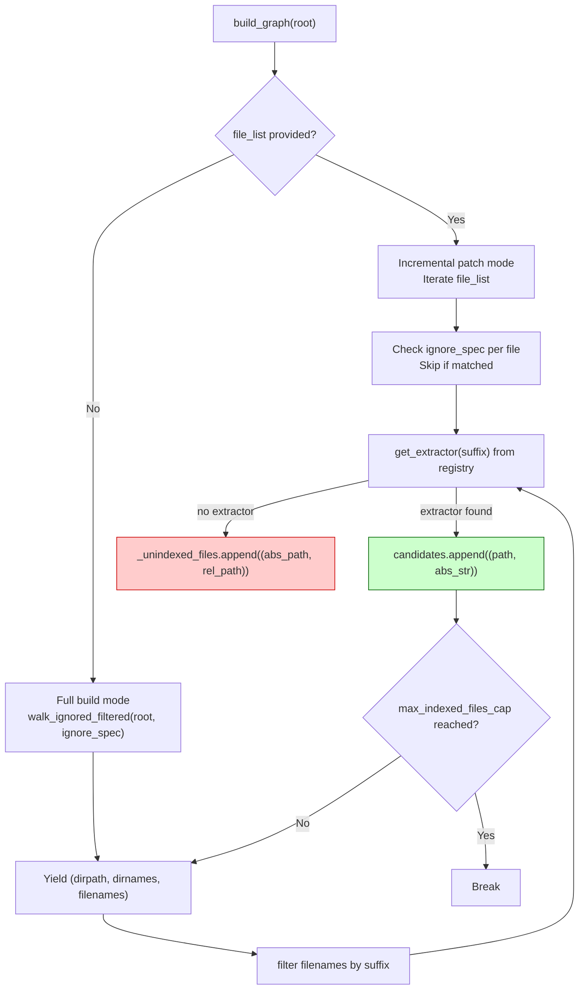
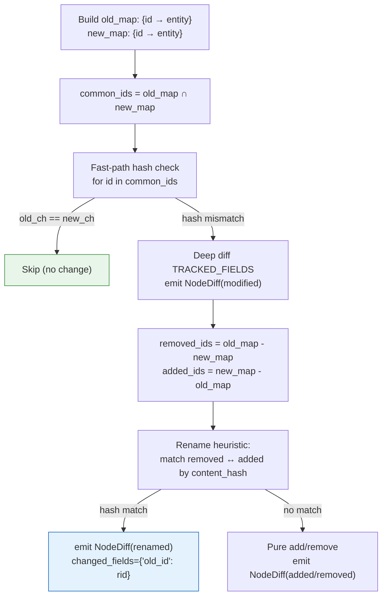
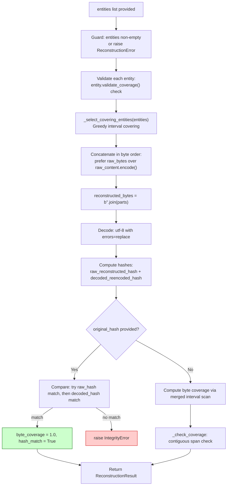
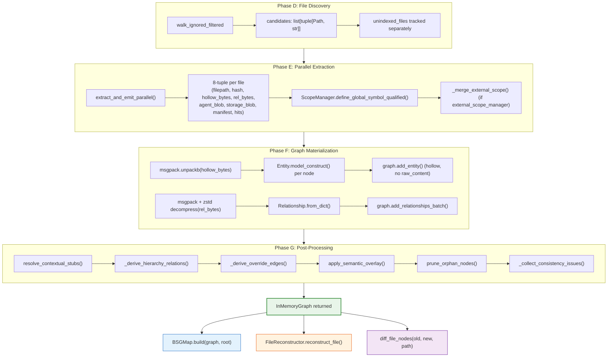

# Batho Graph Module Specification

This document describes the Batho Graph Module: how extracted AST entities and relationships are assembled into an in-memory code graph, incrementally updated, diffed across indexing runs, and reconstructed back into source files.

---

## 1. Overview

The graph module sits between the extraction pipeline and the compression/BSGMap layer. It has four independent subsystems:

- **`InMemoryGraph`** — Thread-safe, adjacency-indexed in-memory storage for all entities and relationships.
- **`CodeGraphIndexer`** — Orchestrates full and incremental builds: file discovery, parallel extraction, ScopeManager merge, and a post-processing pass chain.
- **`IncrementalGraphUpdater`** — Handles transactional file-level entity replacement and graph consistency validation.
- **`NodeDiff` / `diff_file_nodes`** — Computes per-file entity diffs across two indexing runs to produce changelogs.
- **`FileReconstructor`** — Reassembles original source files from `Entity.raw_content` / `Entity.raw_bytes` fields with optional SHA-256 integrity verification.

**Pipeline position:**
```
Phase D: Extraction (pipeline.py workers)
    └── extract_and_emit_parallel()   → 8-tuple results per file
Phase E: Graph Build (builder/codegraph.py)
    └── CodeGraphIndexer.build_graph()
        ├── File discovery (walk_ignored_filtered / file_list)
        ├── extract_and_emit_parallel()
        ├── ScopeManager population + external merge
        ├── Graph materialization (hollow topology deserialization)
        └── Post-processing pass chain ─────────────────────────────┐
            ├── resolve_contextual_stubs()                           │
            ├── _derive_hierarchy_relations()                        │
            ├── _derive_override_edges()                             │
            ├── apply_semantic_overlay()                             │
            ├── prune_orphan_nodes()                                 │
            └── _collect_consistency_issues()                        │
Phase F: BSGMap (compression/bsg_map/)  ◄──────────────────────────┘
    └── BSGMap.build(graph, root)
Phase G: Reconstruction (reconstructor/reconstructor.py)
    └── FileReconstructor.reconstruct_file()
```

---

### 1.1 Module Layout

| File / Directory | Purpose |
|---|---|
| `builder/codegraph.py` | `InMemoryGraph`, `IncrementalGraphUpdater`, `CodeGraphIndexer` — the core of the graph module (~2115 lines) |
| `incremental.py` | Git-aware helpers: `is_git_repo()`, `get_head_commit()`, `get_current_branch()` |
| `diff_engine/node_diff.py` | `NodeDiff` dataclass and `diff_file_nodes()` — per-file entity changelog |
| `reconstructor/reconstructor.py` | `FileReconstructor` — lossless file reconstruction from BSG entities |
| `__init__.py` | Public re-exports of all major symbols |

---

## 2. InMemoryGraph

**File:** `builder/codegraph.py` (lines 76–383)

```python
class InMemoryGraph:
    entities: dict[str, Entity]
    relationships: list[Relationship]
```

The central data store for an indexed codebase. Uses lazy adjacency index building and O(k) secondary indexes to support efficient lookups without linear scans.

### 2.1 Data Structure

| Field | Type | Description |
|---|---|---|
| `entities` | `dict[str, Entity]` | All indexed entities, keyed by stable entity ID |
| `relationships` | `list[Relationship]` | All relationships between entities |
| `_rel_ids` | `set[str]` | Deduplication set for relationship IDs |
| `_adj_out` | `dict[str, list[str]] \| None` | Outbound adjacency index; `None` until first `neighbors()` call |
| `_adj_in` | `dict[str, list[str]] \| None` | Inbound adjacency index; `None` until first `neighbors()` call |
| `_by_file` | `dict[str, set[str]]` | Secondary index: file path → set of entity IDs |
| `_by_type` | `dict[EntityType, set[str]]` | Secondary index: entity type → set of entity IDs |
| `_rels_by_endpoint` | `dict[str, list[Relationship]]` | Secondary index: entity ID → relationships touching it |
| `_stale_relations_count` | `int` | Staleness counter for batch relationship index rebuild |

### 2.2 Key Methods

| Method | Returns | Description |
|---|---|---|
| `add_entity(entity)` | `None` | Thread-safe single entity addition; updates `_by_file` and `_by_type` indexes |
| `add_entities_batch(entities)` | `None` | Batch entity addition under a single lock acquisition |
| `add_relationship(relationship)` | `None` | Thread-safe single relationship addition; deduplicates by ID; incrementally updates adjacency cache |
| `add_relationships_batch(relationships)` | `None` | Batch relationship addition with incremental adjacency update |
| `get_entity(entity_id)` | `Entity \| None` | O(1) dict lookup |
| `get_all_nodes()` | `list[str]` | Returns all entity IDs |
| `neighbors(entity_id, direction="out")` | `list[str]` | O(k) adjacency lookup; builds index lazily on first call. `direction` ∈ `"out"`, `"in"`, `"both"` |
| `has_incoming_edges(entity_id)` | `bool` | Uses adjacency index; builds lazily |
| `has_outgoing_edges(entity_id)` | `bool` | Uses adjacency index; builds lazily |
| `entities_by_file(file_path)` | `list[Entity]` | O(k) using `_by_file` secondary index |
| `entities_by_type(entity_type)` | `list[Entity]` | O(k) using `_by_type` secondary index |
| `remove_node(entity_id)` | `bool` | Removes entity + all touching relationships; rebuilds `_rels_by_endpoint` if stale threshold exceeded |
| `evict_file_graph(file_path)` | `None` | Transactionally removes all entities and relationships for a file; invalidates adjacency caches |
| `root_entities()` | `list[Entity]` | Entities where `parent_id is None` |
| `stats()` | `dict[str, Any]` | Entity/relationship counts by type, file count, index validity |
| `to_dict(view="storage")` | `dict[str, Any]` | Serialize to dict for storage or agent views |
| `from_dict(data)` | `InMemoryGraph` | Deserialize from dict; reconstructs all entities and relationships |
| `enrich_from_storage_view(data)` | `None` | Attach `raw_content` / `raw_bytes` from a storage view blob into existing entity objects |

### 2.3 Thread-Safety Characteristics

All mutation methods that modify `entities`, `relationships`, or secondary indexes acquire `self._lock` (a `threading.Lock`). The adjacency cache (`_adj_out`, `_adj_in`) is updated **incrementally** on each `add_relationship` call rather than being fully invalidated, avoiding full O(E) rebuilds on every edge add.

The `IncrementalGraphUpdater.remove_entities_for_file()` method explicitly **does not** acquire `graph._lock`. This is intentional: patch operations (remove + re-add per file) run sequentially on the main thread inside a single-threaded orchestrator, so no concurrent mutations occur. Full rollback snapshots are taken before mutation begins (see §4.2).

**Stale relationship index rebuild:** When `_stale_relations_count` exceeds `max(1000, len(graph.relationships) // 5)`, the `_rels_by_endpoint` dict is fully rebuilt from `graph.relationships` in O(E). This amortizes the cost of incremental endpoint removal.

---

## 3. CodeGraphIndexer

**File:** `builder/codegraph.py` (lines 688–2115)

Production code graph indexer. Coordinates file discovery, parallel extraction, scope merging, graph materialization, and the post-processing pass chain.

### 3.1 Constructor

```python
CodeGraphIndexer(
    cache_path: str | None = None,   # Passed to BathoCache; defaults to config db_path
    root: str | None = None,         # Repository root (pre-resolved to Path)
    ast_cache_dir: str | None = None # Override AST cache directory
)
```

Internally creates a `BathoCache` instance for AST + file-snapshot persistence.

### 3.2 Context Manager Protocol

`CodeGraphIndexer` implements the context manager protocol to guarantee `BathoCache.close()` is called even on exceptions:

```python
with CodeGraphIndexer(cache_path="/path/to/cache") as indexer:
    graph = indexer.build_graph(root="/path/to/repo")
# cache is closed here regardless of exceptions
```

- `__enter__` — returns `self`
- `__exit__` — calls `self.close()` (which calls `self._cache.close()`); always returns `False` (does not suppress exceptions)

### 3.3 `build_graph()` Full Signature

```python
def build_graph(
    self,
    root: str,                                          # Repository root directory (required)
    extractor: ASTExtractor | None = None,              # Explicit extractor; None = registry lookup per extension
    extensions: list[str] | None = None,                # Filter to specific extensions; None = all supported
    max_workers: int = 0,                               # 0 = auto-scale; >0 = explicit count
    max_file_size_kb: int | None = None,                # Skip files larger than this; None = config default (500KB)
    verbose: bool = False,                              # Extra progress logging
    metrics_callback: Callable[[str, Dict], None] | None = None,  # Receives "batho.index" + build_stats
    index_id: str | None = None,                        # Stamp on entities (run identifier)
    ast_cache_enabled: bool | None = None,              # Override bsg.cache.enabled for this run
    include_gaps: bool | None = None,                   # Override bsg.bidirectional.include_gaps for this run
    file_list: list[str] | None = None,                 # Specific files only; skips directory walk
    write_callback: Callable[[str, dict], None] | None = None,  # Called per-file with blob data
    external_scope_manager: ScopeManager | None = None, # Dependency symbols merged into project scope
) -> InMemoryGraph
```

**Raises:**
- `ValueError` — invalid parameters (empty `root`, negative `max_workers`, non-list `extensions`)
- `OSError` — `root` does not exist or is not a directory

**Returns:** Fully populated `InMemoryGraph` after all post-processing passes.

**Side effects:** Populates `self.build_stats` with telemetry (files parsed, entities, errors, worker count, cycle counts, etc.).

### 3.4 File Discovery Phase



**`walk_ignored_filtered(root_path, spec=ignore_spec)`** — wraps `os.walk` with pathspec-based `.gitignore` filtering. `ignore_spec` is loaded once via `load_ignore_spec(root_path, extra_patterns, ignore_files, default_patterns_file)`.

**Extension → Extractor Mapping:** The parser registry (`batho.modules.extraction.submodules.parser_factory.registry`) maps lowercase file suffixes to `ASTExtractor` subclasses. Files with no registered extractor are added to `_unindexed_files` and later written as opaque `FileSnapshot` entries in the cache (if `bsg.cache.enabled: true`).

### 3.5 Worker Auto-Scaling

When `max_workers=0` (auto-scale), the worker count is determined by file count:

| File Count | Workers (capped at `min(32, cpu_count × 2)`) |
|---|---|
| ≤ 50 | `min(4, cap)` |
| 51 – 200 | `min(8, cap)` |
| 201 – 1000 | `min(16, cap)` |
| > 1000 | `cap` = `min(32, cpu_count × 2)` |

Additionally, `actual_workers = min(actual_workers, max(1, file_count))` — workers never exceed file count.

When `max_workers > 0`, that value is used directly without scaling.

### 3.6 `_merge_external_scope()`

```python
def _merge_external_scope(target: ScopeManager, source: ScopeManager) -> None:
    """Bulk-merge all global symbols from source into target (write-once, no lock per symbol)."""
    snapshot = source.get_global_symbols()
    target.load_global_symbols(snapshot)
```

After extraction workers populate the project `ScopeManager` from `GlobalSymbolManifest` entries, the caller can pass an `external_scope_manager` pre-populated with dependency symbols (e.g., from an indexed `node_modules` or a shared library index). The merge makes external symbols visible to `resolve_contextual_stubs()` without re-indexing dependencies.

**CDEU ScopeManager integration:** The CDEU (Cross-Dependency Entity Unification) system indexes project dependencies separately, then passes the resulting `ScopeManager` as `external_scope_manager`. The merge is a bulk snapshot load, not a per-symbol acquire-lock operation, to minimize contention.

### 3.7 Post-Processing Pass Chain

After graph materialization from hollow topology blobs, six passes run sequentially on the main thread:

```mermaid
flowchart LR
    A["Graph materialized\n(hollow entities)"] --> B["resolve_contextual_stubs()"]
    B --> C["_derive_hierarchy_relations()"]
    C --> D["_derive_override_edges()"]
    D --> E["apply_semantic_overlay()"]
    E --> F["prune_orphan_nodes()"]
    F --> G["_collect_consistency_issues()"]
    G --> H["InMemoryGraph returned"]

    style B fill:#e8f4fd,stroke:#2196F3
    style C fill:#e8f4fd,stroke:#2196F3
    style D fill:#e8f4fd,stroke:#2196F3
    style E fill:#fff3e0,stroke:#FF9800
    style F fill:#fce4ec,stroke:#E91E63
    style G fill:#f3e5f5,stroke:#9C27B0
```



#### 3.7.1 `resolve_contextual_stubs(graph, scope_manager)`

**Purpose:** Resolve dotted-reference stubs — placeholder entities emitted by extractors when a call target cannot be resolved at parse time (e.g., `json.dumps`, `module.ClassName`).

**Stubs:** Entities where `entity.is_contextual_stub == True`. These have `metadata["caller_scope"]` and `metadata["target_name"]` set.

**Resolution algorithm:**
1. Collect all stubs from `graph.entities`.
2. For each stub, try `scope_manager.resolve_symbol_dotpath(target_name)`.
3. If unresolved, check incoming relationships — if a parent stub is found, construct `parent_name.target_name` and retry.
4. If still unresolved, parse `caller_scope` for a base file path, attempt `scope_manager.resolve_symbol_strict(qualified_try)` with path-qualified lookup.
5. For resolved stubs: record `stub_id → real_entity_id` in `stub_to_target`.

**Relationship rewriting:** All `relationship.target_id` values that match a stub ID are rewritten to the resolved entity ID. The adjacency cache (`_adj_out`, `_adj_in`) is fully invalidated and `_rels_by_endpoint` is rebuilt after rewriting.

**Stub metadata update:** Resolved stubs get `metadata["stub_resolution_state"] = "resolved"` and `metadata["resolved_target_id"]` set.

#### 3.7.2 `_derive_hierarchy_relations(graph) → int`

**Purpose:** Synthesize `INHERITS` and `IMPLEMENTS` edges from entity metadata that was not already emitted as explicit relationships during extraction.

**Eligible entity types:** `CLASS`, `INTERFACE`, `TRAIT`, `STRUCT`.

**Metadata fields inspected:**
| Metadata Key | Relationship Emitted |
|---|---|
| `bases` | `INHERITS` |
| `extends` | `INHERITS` |
| `implements` | `IMPLEMENTS` |

**Reference resolution:** Uses `_lookup_candidates(ref)` + `_normalize_ref_token()` to handle qualified names (e.g., `module.ClassName`, `fully::qualified::Name`) and build a `name_to_id` index from entity names. Skips self-references and already-existing edges. Returns the count of edges added.

#### 3.7.3 `_derive_override_edges(graph) → int`

**Purpose:** Synthesize `OVERRIDES` edges between methods in subclasses and same-named methods in ancestor classes.

**Algorithm (DFS ancestor traversal):**
1. Build `class_methods: dict[class_id, dict[method_name, list[method_id]]]` from all `CONTAINS` edges where source is `CLASS` and target is `METHOD`.
2. Build `parent_map: dict[class_id, set[parent_class_ids]]` from all `INHERITS` edges between `CLASS` entities.
3. For each class, DFS-traverse ancestor chain via `parent_map` (iterative, not recursive, to avoid stack overflow on deep hierarchies).
4. For each ancestor, find matching method names → emit `OVERRIDES` edge from child method to parent method.

Returns the count of `OVERRIDES` edges added.

#### 3.7.4 `apply_semantic_overlay(graph, root_path, logger)`

**Purpose:** Python-coded semantic tagging pass that runs on the main thread after all worker-based YAML rule processing. Unlike YAML rule plugins, this pass operates on the fully merged graph and can modify entity types.

**Loaded from:** `batho.modules.compression.apply_semantic_overlay`

**Two sub-passes:**
1. `_apply_semantic_usn_tags(graph, root_path)` — Tokenizes entity names against hint-token sets (API, Auth, ORM, DB, Env, Infra, Loop, Resource, Exception) and adds USN tags. Also promotes entity types (e.g., `EnvironmentVariable` tag → type becomes `ENVIRONMENT_VARIABLE`).
2. `_derive_semantic_relations(graph)` — Derives additional `Relationship` edges from semantic tag patterns (e.g., resource allocation + cleanup pairing).

**Returns:** `{"semantic_tags_added": int, "semantic_edges_added": int}` — reported in `build_stats`.

#### 3.7.5 `prune_orphan_nodes(graph, *, keep_exports=None, keep_entry_points=None) → int`

**Purpose:** Remove entities with zero incoming and zero outgoing edges — entities that are completely disconnected from the graph.

**Algorithm:**
1. **O(E) pass:** Collect all entity IDs referenced by any relationship into `active_node_ids`.
2. **O(V) pass:** `orphan_ids = all_entity_ids - active_node_ids` (C-optimized set subtraction).
3. **Exemptions:** Skip if `node_id in self._keep_nodes`, if `entity.type == ENTRY_POINT` (when `keep_entry_points=True`), or if entity is exported (when `keep_exports=True`).
4. Remove orphan entities from `graph.entities` and all secondary indexes under `graph._lock`.

Controlled by `graph.orphan_pruning.enabled` config (default: `True`). Returns count of pruned nodes.

**`mark_keep_node(node_id)`:** Add a node ID to `self._keep_nodes` to exempt it from pruning regardless of connectivity. Used by callers that generate synthetic "virtual" nodes.

#### 3.7.6 `_collect_consistency_issues(graph) → tuple[list[str], dict[str, int], bool, bool]`

**Purpose:** Final validation pass. Returns `(issues, cycle_counts, broken_relationships, cycle_fatal)`.

**Broken relationship check:** Delegates to `IncrementalGraphUpdater().validate_graph_consistency(graph)` — verifies all `rel.source_id` and `rel.target_id` resolve to known entities (with exceptions for UNRESOLVED/EXTERNAL_SYMBOL types and special-prefixed IDs).

**Cycle detection:** Runs `find_cycles(graph, RelationshipType.IMPORTS)` and `find_cycles(graph, RelationshipType.INHERITS)`. Controlled by `graph.cycle_detection.enabled` (default: `True`). Cycles are logged as `warning` unless `graph.cycle_detection.fatal: true`, in which case they are `error` level.

**Strictness escalation:** If `indexer.strict: true` or `indexer.fail_on_warning: true` in config, broken relationships or detected cycles raise `RuntimeError` to abort the build.

### 3.8 `get_unindexed_files()` and `clear_unindexed_files()`

After `build_graph()` completes, `self._unindexed_files` holds all files that had no registered extractor:

```python
indexer.get_unindexed_files() -> list[tuple[str, str]]
# Returns: [(absolute_path, relative_path), ...]

indexer.clear_unindexed_files() -> None
# Resets the list to []
```

Unindexed files are still written to the cache as opaque `FileSnapshot` entries (content hash only, no entities) if `bsg.cache.enabled: true`. This enables `BSGMap` to include them in the storage view without re-scanning them.

### 3.9 `find_cycles(graph, relationship_type) → list[list[str]]`

Iterative DFS cycle detection. Avoids Python recursion limits on deep graphs.

**Algorithm:**
- Build adjacency from edges of the given `RelationshipType`.
- Iterative DFS using an explicit `stack = [(node, edge_idx)]`. Each stack frame tracks which neighbor to visit next, enabling backtracking without recursion.
- Tracks `path_index: dict[str, int]` and `path_list: list[str]` for cycle extraction.
- Deduplicates cycles using canonical rotation (`_cycle_key()` — minimum rotation of the node list).

Checked relationship types in `_collect_consistency_issues()`: `IMPORTS` and `INHERITS`.

### 3.10 Key Configuration Knobs

| Config Path | Default | Description |
|---|---|---|
| `indexer.max_file_size_kb` | `500` | Skip files larger than this (KB); overridden by `max_file_size_kb` argument |
| `indexer.max_workers` | `0` | Worker count; 0 = auto-scale |
| `indexer.max_indexed_files` | `None` | Hard cap on candidates; `None` = unlimited |
| `indexer.ignore_patterns` | `[]` | Extra ignore patterns beyond `.gitignore` |
| `indexer.ignore_files` | `[".gitignore", ".bathignore"]` | Files to load ignore patterns from |
| `indexer.fail_on_warning` | `false` | If true, consistency issues abort the build |
| `indexer.strict` | `false` | Same as `fail_on_warning` but stricter |
| `bsg.cache.enabled` | `true` | Enable/disable AST cache and file snapshot cache |
| `bsg.cache.ttl_days` | `30` | AST cache entry TTL |
| `bsg.bidirectional.include_gaps` | `false` | Emit `SYNTAX_GLUE` entities for full byte coverage |
| `bsg.symbol_resolution.enabled` | `true` | Enable cross-file symbol resolution |
| `bsg.symbol_resolution.prune_unresolved` | `true` | Remove UNRESOLVED entities after resolution pass |
| `graph.cycle_detection.enabled` | `true` | Enable IMPORTS and INHERITS cycle detection |
| `graph.cycle_detection.fatal` | `false` | If true, log cycles at error level |
| `graph.orphan_pruning.enabled` | `true` | Enable zero-edge entity removal |
| `graph.orphan_pruning.keep_entry_points` | `true` | Preserve `ENTRY_POINT` entities from pruning |
| `graph.orphan_pruning.keep_exports` | `true` | Preserve exported entities from pruning |

---

## 4. IncrementalGraphUpdater

**File:** `builder/codegraph.py` (lines 391–675)

Handles transactional file-level entity replacement and graph consistency validation. Also defines `find_cycles()` (used by `CodeGraphIndexer._collect_consistency_issues()`).

### 4.1 `validate_graph_consistency(graph) → bool`

Verifies that all relationship endpoints resolve to known entities.

**Valid source IDs:**
- Entity ID present in `graph.entities`, or
- Any string containing `/` or `\` (legacy file-path-as-source behavior)

**Valid target IDs:**
- Entity ID present in `graph.entities`, or
- Target is `UNRESOLVED` or `EXTERNAL_SYMBOL` type entity, or
- Target starts with a special prefix: `"external:"`, `"file:"`, `"anchor:"`, `"import:"`, `"resource:"`, `"variable:"`, `"image:"`, `"batho "`

Returns `True` if all relationships pass, `False` otherwise. Logs `graph_inconsistency_detected` at WARNING level with counts.

### 4.2 `remove_entities_for_file(graph, file_path) → None`

Removes all entities belonging to `file_path` and all relationships touching those entities.

**Complexity:** O(removed_entities × degree) using secondary `_by_file` and `_rels_by_endpoint` indexes, compared to O(N × E) for a naive linear scan.

**Transactional rollback pattern (BUG-03 fix):** Before any mutation, a full snapshot is taken:
```python
original_entities = {eid: graph.entities[eid] for eid in entities_to_remove ...}
original_relationships = list(graph.relationships)
original_rel_ids = set(graph._rel_ids)
original_rels_by_endpoint = {k: list(v) for k, v in graph._rels_by_endpoint.items()}
# ... all secondary indexes snapshotted
```

If any exception occurs during mutation, all fields are restored from the snapshot, and a `GraphConsistencyError` is raised.

**Adjacency cache handling:** If `graph._adj_out` and `graph._adj_in` are not `None`, they are updated incrementally (removing entries for evicted entity IDs and cleaning references). This avoids full `O(E)` rebuilds on each incremental patch.

**Stale relationship index rebuild:** After removal, `_stale_relations_count` is incremented by the count of removed relationships. If it exceeds `max(1000, len(graph.relationships) // 5)`, `_rels_by_endpoint` is fully rebuilt.

### 4.3 `add_entities_for_file(graph, file_path, extractor) → None`

Parses `file_path` and adds all new entities and relationships to `graph`.

**Steps:**
1. Check file exists; return silently if not.
2. `read_file_bytes(file_path, max_size_kb, detect_binary=True)` — returns `None` for binary/oversized files.
3. Detect extractor: use provided `extractor`, or fall back to `default_detector.get_extractor()`, then `_registry_get_extractor(suffix)`.
4. `file_extractor.parse_file(file_path, content)` → `(entities, relationships)`.
5. `graph.add_entity()` + `graph.add_relationship()` per result.

Parse exceptions are logged at WARNING and silently skipped (per-file isolation).

### 4.4 `update_entities_for_file(graph, file_path, extractor) → None`

Convenience wrapper: calls `remove_entities_for_file()` then `add_entities_for_file()`. Used by the orchestrator patch path.

---

## 5. Node Diff Engine

**File:** `diff_engine/node_diff.py`

Computes per-file entity changelogs between two indexing runs. Consumed by `orchestrator/patch.py` to populate `file_changelog.ipc`.

### 5.1 `NodeDiff` Dataclass

```python
@dataclass
class NodeDiff:
    entity_id: str          # Stable entity ID (type:name:file hash)
    entity_name: str        # Entity display name
    entity_type: str        # EntityType string value
    file_path: str          # Source file path
    change_kind: str        # "added" | "removed" | "modified" | "renamed"
    changed_fields: dict    # {field_name: [old_value, new_value]}
    old_hash: str | None    # 8-char content_hash prefix (before change)
    new_hash: str | None    # 8-char content_hash prefix (after change)
```

| Field | Description |
|---|---|
| `entity_id` | Stable identifier generated by `generate_hierarchical_id()` — survives renames when content is unchanged |
| `change_kind` | One of `"added"`, `"removed"`, `"modified"`, `"renamed"` |
| `changed_fields` | For `"modified"`: dict of tracked fields that changed, each mapped to `[old_val, new_val]`. For `"renamed"`: `{"old_id": old_entity_id}` |
| `old_hash` / `new_hash` | 8-char prefix of the full `content_hash`; `None` for additions/removals respectively |

**`to_dict()`** — Serializes to dict for storage in `file_changelog.ipc` blob (used by the orchestrator to track per-file changes across patch runs).

### 5.2 `diff_file_nodes(old_entities, new_entities, file_path) → list[NodeDiff]`

```python
def diff_file_nodes(
    old_entities: list[Any],    # Entities from previous indexing run (dicts or Entity objects)
    new_entities: list[Any],    # Entities from current indexing run (dicts or Entity objects)
    file_path: str,
) -> list[NodeDiff]
```

Accepts either `dict` (from serialized storage) or `Entity` objects (both paths supported via `_get_val(e, key)` accessor).

**Algorithm (5-step):**



**`TRACKED_FIELDS`:** `("signature", "start_line", "end_line", "entity_type")` — only these fields are compared for `modified` detection. Content hash changes that don't affect tracked fields are silently skipped.

**Rename heuristic:** Groups removed entities by `content_hash`. For each added entity, if its `content_hash` matches a removed entity's hash, it is classified as `"renamed"` rather than separate add + remove. The first match per hash is consumed (FIFO).

### 5.3 Integration with Orchestrator

`diff_file_nodes()` is called from `orchestrator/patch.py` after each incremental patch:
1. Old entities: loaded from `file_changelog.ipc` (previous run's storage blob).
2. New entities: freshly extracted from the modified file.
3. The resulting `list[NodeDiff]` is serialized and written back to `file_changelog.ipc`.

The changelog feeds into LLM context generation — changed functions/classes are highlighted in the agent view for review.

---

## 6. Graph Reconstructor

**File:** `reconstructor/reconstructor.py`

Provides lossless file reconstruction from BSG entities. Complements the gap-extraction pipeline (Phase 2): once every byte of a source file has been captured in `Entity.raw_content` / `Entity.raw_bytes` fields (including `SYNTAX_GLUE` gap entities), `FileReconstructor` can reassemble the original file by concatenating raw content in byte order.

**Design principles:**
- Pure in-memory operations — never touches disk.
- Deterministic: same entities always produce the same output.
- Hash verification is opt-in (controlled by `original_hash` parameter or `bsg.bidirectional.verify_integrity` config).

### 6.1 `reconstruct_file()` Main Method

```python
def reconstruct_file(
    self,
    file_path: str,                     # File path for error reporting / result metadata
    entities: list[Entity],             # All entities covering the file, including SYNTAX_GLUE
    original_hash: str | None = None,   # Optional SHA-256 hex digest for integrity check
    original_content: str | None = None # Optional original content; hash derived automatically if needed
) -> ReconstructionResult
```

**Step-by-step reconstruction:**



**Byte coverage calculation:** If the hash does not match (or no hash was provided), coverage is computed by merging overlapping entity byte intervals (sorted by `start_byte`) and dividing by total file size. `byte_coverage = min(1.0, covered_bytes / total_bytes)`. If `original_content` is provided, `total_bytes = len(original_content.encode("utf-8"))`; otherwise `total_bytes = max(e.end_byte for e in selected)`.

**Hash comparison:** Two hashes are compared: the raw reconstructed bytes hash (`raw_reconstructed_hash`) and the re-encoded hash (`decoded_reencoded_hash` — after UTF-8 decode and re-encode). Either match is acceptable to handle byte-for-byte identical files that went through a decode/re-encode cycle.

### 6.2 `reconstruct_from_snapshot(snapshot, entity_lookup) → ReconstructionResult`

Reconstruct from a `FileSnapshot` object:
1. Resolves `snapshot.entity_ids` to `Entity` objects via `entity_lookup` (callable or dict).
2. Logs and skips missing entity IDs.
3. Delegates to `reconstruct_file()` with `original_hash = snapshot.file_hash`.

### 6.3 Error Types

| Error Class | Raised When | Key Fields |
|---|---|---|
| `ReconstructionError` | Entity list empty; entity missing `raw_content` / `raw_bytes`; no covering entities after overlap resolution | `message`, `file_path`, `entity_count` |
| `IntegrityError` | `original_hash` provided and reconstructed hash does not match | `message`, `file_path`, `expected_hash`, `actual_hash` |

Both are defined in `batho.core.schemas`.

### 6.4 `_select_covering_entities(entities) → list[Entity]`

Greedy interval covering algorithm:

1. Sort entities by `(start_byte ASC, -end_byte DESC)` — parent entities come before their children.
2. Walk sorted list; maintain `cursor = first_entity.start_byte`.
3. Include entity if `entity.start_byte <= cursor and entity.end_byte > cursor` and `entity.raw_content is not None`.
4. Advance `cursor = entity.end_byte` after inclusion.

This ensures non-overlapping coverage where each entity advances the reconstruction cursor forward. Parent entities (wider byte spans) take precedence over children when starting at the same byte.

### 6.5 `_check_coverage(entities, file_size) → bool`

Returns `True` if entity byte ranges span the entire file without gaps:

```python
cursor = 0
for ent in sorted(entities, key=lambda e: (e.start_byte, e.end_byte)):
    if ent.start_byte > cursor:
        return False  # Gap detected
    cursor = max(cursor, ent.end_byte)
return cursor >= file_size
```

### 6.6 SHA-256 Verification

When `original_hash` is provided to `reconstruct_file()` (typically from `FileSnapshot.file_hash`), the reconstructed content is compared against the expected hash. On mismatch, `IntegrityError` is raised before `ReconstructionResult` is returned.

The `bsg.bidirectional.verify_integrity: true` config flag (inspected by the `bsg_bidirectional_foundation` rule plugin) causes rule plugins to set `metadata["bsg.bidirectional.verify_integrity"] = True` on eligible entities. The orchestrator checks this flag to decide whether to pass `original_hash` to `reconstruct_file()`.

### 6.7 `ReconstructionResult`

| Field | Type | Description |
|---|---|---|
| `success` | `bool` | Always `True` when returned (errors raise instead) |
| `file_path` | `str` | Source file path |
| `reconstructed_content` | `str` | Reconstructed file content (UTF-8 decoded) |
| `original_hash` | `str` | Expected hash (empty string if not provided) |
| `reconstructed_hash` | `str` | Actual hash of reconstructed content |
| `hash_match` | `bool` | Whether hashes matched |
| `entity_count` | `int` | Total entities passed in |
| `gap_count` | `int` | Count of `SYNTAX_GLUE` entities in selected set |
| `byte_coverage` | `float` | Fraction of file bytes covered (0.0–1.0, rounded to 4 decimals) |
| `reconstruction_time_ms` | `int` | Wall-clock time in milliseconds |
| `errors` | `list[str]` | Always empty (errors raise instead of accumulating) |
| `warnings` | `list[str]` | Non-fatal warnings (coverage gaps, partial coverage) |

---

## 7. Public API

```python
from batho.modules.graph import (
    # Core graph data structure
    InMemoryGraph,              # In-memory entity + relationship store

    # Indexing
    CodeGraphIndexer,           # Full and incremental graph builds
    IncrementalGraphUpdater,    # File-level transactional entity replacement + validation

    # Reconstruction
    FileReconstructor,          # Reassemble source files from Entity.raw_content

    # Diff engine
    NodeDiff,                   # Per-entity change record (added/removed/modified/renamed)
    diff_file_nodes,            # Compute NodeDiff list between two entity snapshots

    # Git helpers
    is_git_repo,                # Check if a path is inside a git working tree
    get_head_commit,            # Get current HEAD commit SHA
    get_current_branch,         # Get current branch name
)
```

**Canonical import examples:**

```python
# Full index build
from batho.modules.graph import CodeGraphIndexer

with CodeGraphIndexer(cache_path=cfg["paths"]["db_path"]) as indexer:
    graph = indexer.build_graph(
        root="/path/to/repo",
        max_workers=0,       # auto-scale
        include_gaps=True,   # emit SYNTAX_GLUE for reconstruction
    )

print(graph.stats())
# {'entity_count': 1842, 'relationship_count': 5231, 'file_count': 87, ...}

# Incremental patch
from batho.modules.graph import IncrementalGraphUpdater
from batho.modules.extraction import ASTExtractor

updater = IncrementalGraphUpdater()
updater.update_entities_for_file(graph, "/path/to/changed.py", extractor)

# Consistency check
is_consistent = updater.validate_graph_consistency(graph)

# Entity diff
from batho.modules.graph import diff_file_nodes, NodeDiff

diffs: list[NodeDiff] = diff_file_nodes(old_entities, new_entities, "/path/to/file.py")
for d in diffs:
    print(f"{d.change_kind}: {d.entity_name} ({d.entity_type})")

# File reconstruction
from batho.modules.graph import FileReconstructor

reconstructor = FileReconstructor()
result = reconstructor.reconstruct_file(
    file_path="/path/to/file.py",
    entities=graph.entities_by_file("/path/to/file.py"),
    original_hash="sha256hexdigest...",
)
print(result.reconstructed_content)
print(f"Coverage: {result.byte_coverage:.2%}, hash_match={result.hash_match}")

# Git helpers
from batho.modules.graph import is_git_repo, get_head_commit, get_current_branch
from pathlib import Path

root = Path("/path/to/repo")
if is_git_repo(root):
    commit = get_head_commit(root)   # "abc123..."
    branch = get_current_branch(root) # "main"
```

---

## 8. Configuration Knobs Reference

Full table of all config keys that affect the graph module:

| Config Key | Type | Default | Scope | Description |
|---|---|---|---|---|
| `indexer.max_file_size_kb` | `int` | `500` | Build | Skip files larger than this |
| `indexer.max_workers` | `int` | `0` | Build | Worker count; 0 = auto-scale |
| `indexer.max_indexed_files` | `int \| None` | `None` | Build | Hard candidate cap |
| `indexer.ignore_patterns` | `list[str]` | `[]` | Build | Extra gitignore-style ignore patterns |
| `indexer.ignore_files` | `list[str]` | `[".gitignore", ".bathignore"]` | Build | Files to load ignore patterns from |
| `indexer.default_patterns_file` | `str \| None` | `None` | Build | Path to a default ignore patterns file |
| `indexer.fail_on_warning` | `bool` | `false` | Build | Abort if consistency issues found |
| `indexer.strict` | `bool` | `false` | Build | Same as `fail_on_warning`; stricter mode |
| `bsg.cache.enabled` | `bool` | `true` | Cache | Enable AST + file snapshot cache |
| `bsg.cache.ttl_days` | `int` | `30` | Cache | Days before cache entries expire |
| `bsg.bidirectional.include_gaps` | `bool` | `false` | Extraction | Emit `SYNTAX_GLUE` entities for full byte coverage |
| `bsg.bidirectional.verify_integrity` | `bool` | `false` | Reconstruction | Enable SHA-256 integrity check in `FileReconstructor` |
| `bsg.symbol_resolution.enabled` | `bool` | `true` | Post-processing | Enable contextual stub resolution |
| `bsg.symbol_resolution.max_unresolved_attempts` | `int` | `10` | Post-processing | Max resolution attempts per stub |
| `bsg.symbol_resolution.prune_unresolved` | `bool` | `true` | Post-processing | Remove UNRESOLVED entities after resolution |
| `bsg.parsing` | `dict` | `{}` | Extraction | Parsing config forwarded to all extractors |
| `graph.cycle_detection.enabled` | `bool` | `true` | Validation | Enable IMPORTS and INHERITS cycle detection |
| `graph.cycle_detection.fatal` | `bool` | `false` | Validation | Log cycles at error (vs warning) level |
| `graph.orphan_pruning.enabled` | `bool` | `true` | Post-processing | Enable zero-edge entity removal |
| `graph.orphan_pruning.keep_entry_points` | `bool` | `true` | Post-processing | Preserve `ENTRY_POINT` entities |
| `graph.orphan_pruning.keep_exports` | `bool` | `true` | Post-processing | Preserve exported entities |

---

## 9. `incremental.py` — Git Helpers

**File:** `incremental.py`

Git-aware helpers for identifying the current repository state, used by the orchestrator to detect which files changed between runs.

All three functions use an internal `_run_git(repo_root, args)` helper that:
- Constructs a hardened `PATH` (restricting to known safe git binary locations) to prevent path injection.
- On Windows, checks standard `ProgramFiles` git install paths.
- On Unix, restricts to `/usr/bin:/usr/local/bin:/usr/sbin:/sbin:/bin`.
- Returns `None` on `FileNotFoundError` or `subprocess.CalledProcessError`.

### `is_git_repo(repo_root: Path) → bool`

Runs `git rev-parse --is-inside-work-tree`. Returns `True` only if output is exactly `"true"` (case-normalized).

### `get_head_commit(repo_root: Path) → str | None`

Runs `git rev-parse HEAD`. Returns the full commit SHA (lowercase) or `None` if not a git repo or HEAD is unborn.

### `get_current_branch(repo_root: Path) → str | None`

Runs `git rev-parse --abbrev-ref HEAD`. Returns branch name (e.g., `"main"`) or `None` on failure. Returns `"HEAD"` in detached HEAD state.

---

## 10. Error Handling

All components use structured logging via `batho.utils.logging.get_logger(__name__, operation=...)`.

| Component | Event | Level | Structured Fields |
|---|---|---|---|
| `CodeGraphIndexer.build_graph()` | File parse failed | WARNING | `filepath`, `error`, `error_type` |
| `CodeGraphIndexer.build_graph()` | Graph materialize failed | ERROR | `filepath`, `error` |
| `CodeGraphIndexer.build_graph()` | Cycle detected | WARNING or ERROR | `cycle` (formatted path) |
| `CodeGraphIndexer.build_graph()` | Build complete | INFO | All `build_stats` fields |
| `CodeGraphIndexer.resolve_contextual_stubs()` | Stub resolved | DEBUG | `stub_id`, `target_id` |
| `CodeGraphIndexer.prune_orphan_nodes()` | Orphans pruned | INFO | `pruned` (count) |
| `IncrementalGraphUpdater.remove_entities_for_file()` | Entities removed | DEBUG | `file_path`, `entity_count`, `relationship_count` |
| `IncrementalGraphUpdater.remove_entities_for_file()` | Rollback triggered | ERROR | `file_path`, `error`, `entities_targeted`, `relationships_targeted` |
| `IncrementalGraphUpdater.validate_graph_consistency()` | Inconsistency detected | WARNING | `broken_relationship_count`, `total_relationships` |
| `FileReconstructor.reconstruct_file()` | Coverage gap | WARNING | `file_path`, `total_bytes`, `entity_bytes` |
| `FileReconstructor.reconstruct_file()` | Entity coverage mismatch | WARNING | `entity_id`, `start_byte`, `end_byte`, `raw_len` |

---

## 11. Data Flow Diagram



---

## 12. Performance Characteristics

| Operation | Complexity | Notes |
|---|---|---|
| `graph.add_entity()` | O(1) | Dict insert + 2 set inserts |
| `graph.add_relationship()` | O(1) amortized | Dedup check + incremental adjacency update |
| `graph.add_relationships_batch(n)` | O(n) | Single lock acquisition for batch |
| `graph.get_entity()` | O(1) | Dict lookup |
| `graph.entities_by_file()` | O(k) | Secondary index `_by_file` |
| `graph.neighbors()` | O(k) | Adjacency index (built lazily on first call: O(E)) |
| `remove_entities_for_file(k entities)` | O(k × degree) | Uses secondary indexes; O(N×E) without indexes |
| `prune_orphan_nodes()` | O(V + E) | O(E) edge scan + O(V) set subtraction |
| `find_cycles()` | O(V + E) | Iterative DFS; no recursion limit |
| `diff_file_nodes(n, m)` | O(n + m) | Hash-keyed dict operations |
| `reconstruct_file(k entities)` | O(k log k) | Sort by byte offset |
| `_select_covering_entities(k)` | O(k log k) | Sort + single linear scan |

---

*Generated for Batho v1.1.0*
