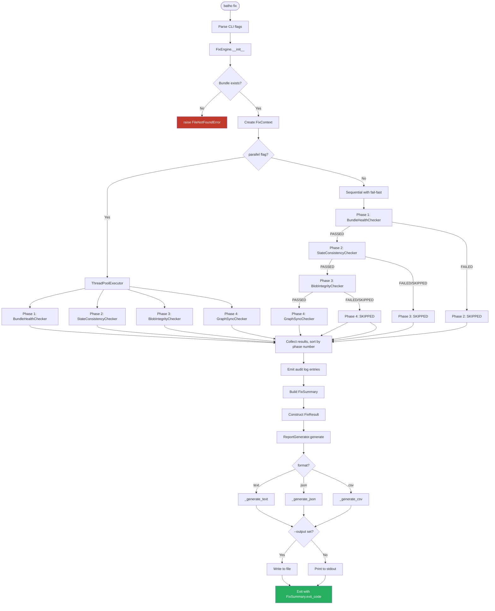
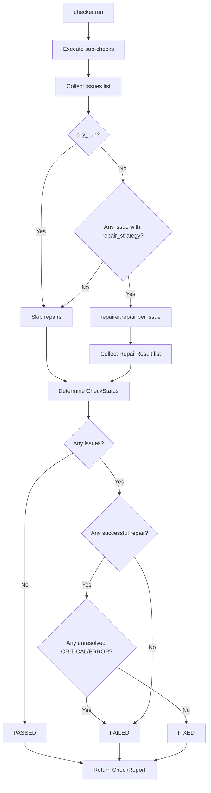

# Batho Integrity Module Specification

This document describes the Batho Integrity Module: how `batho fix` orchestrates a four-phase
verification and repair pipeline over the Arrow IPC artifact bundle, what each checker validates,
what each repairer mutates, and how results are surfaced through the report system.

---

## 1. Overview

The integrity module implements the `batho fix` command. Its purpose is to detect and
automatically repair structural inconsistencies in the Batho artifact store — from low-level
Arrow IPC file corruption all the way up to hypergraph entity desynchronisation.

**Pipeline position:**
```
batho fix
  └── FixEngine.run()
        ├── Phase 1 — BundleHealthChecker   (IPC file structure, schema version, orphan GC)
        ├── Phase 2 — StateConsistencyChecker (stuck runs, file tracking staleness)
        ├── Phase 3 — BlobIntegrityChecker  (zstd magic header, JSON validity, run status)
        └── Phase 4 — GraphSyncChecker      (dangling refs, Arrow ↔ bundle entity sync)
```

Phases 1–4 run **sequentially by default** with strict fail-fast semantics: a critical failure
in Phase 1 skips Phases 2–4; a failure in Phase 2 skips Phases 3–4. Pass `--parallel` to run
all scheduled phases concurrently (disables fail-fast ordering).

### 1.1 Module Layout

| File / Directory | Purpose |
|---|---|
| `engine.py` | `FixEngine` — top-level orchestrator; `FixContext`, `FixSummary`, `FixResult` dataclasses |
| `cli.py` | `register_fix_parser()` — argparse registration for `batho fix` subcommand |
| `models.py` | Core data model: `Severity`, `CheckStatus`, `Issue`, `RepairResult`, `CheckReport` |
| `report.py` | `ReportGenerator` — renders `FixResult` to `text`, `json`, or `csv` |
| `checks/__init__.py` | Framework-level protocol: `IntegrityCheck`, `Finding`, `CheckResult` |
| `checkers/bundle_checker.py` | Phase 1: Arrow bundle structural validation |
| `checkers/state_checker.py` | Phase 2: Run state consistency and file tracking staleness |
| `checkers/blob_checker.py` | Phase 3: zstd blob integrity and run artifact validity |
| `checkers/graph_checker.py` | Phase 4: Hypergraph sync and dangling reference detection |
| `repairers/blob_repairer.py` | Repairs corrupt file artifacts, run artifact JSON columns, changelog rows |
| `repairers/graph_repairer.py` | Resolves dangling references; deletes invalid relationship rows |
| `repairers/state_repairer.py` | Marks stuck runs as `failed`; resets desynced file tracking |

### 1.2 Verification Phases Summary

| Phase | Name | Checker | Guard | What It Checks |
|---|---|---|---|---|
| 1 | Bundle Health | `BundleHealthChecker` | Always runs | IPC files exist, valid Arrow format, schema version, orphaned files |
| 2 | State Consistency | `StateConsistencyChecker` | Requires Phase 1 pass | Stuck runs (>24h in_progress), stale file tracking refs |
| 3 | Blob Integrity | `BlobIntegrityChecker` | Requires Phase 1+2 pass | Run artifact status validity, changelog row completeness; zstd headers (quick) or full decompression (deep) |
| 4 | Graph Sync | `GraphSyncChecker` | Requires Phase 1+2+3 pass (or Phase 3 not scheduled) | Dangling refs in Arrow store, entity count mismatch between bundle and BSG scratch store |

---

## 2. Engine (`engine.py`)

### 2.1 `FixContext`

Internal context object passed through the fix pipeline. Created once per `FixEngine.run()` call.

| Field | Type | Description |
|---|---|---|
| `root` | `Path` | Resolved absolute path to the repository root |
| `db` | `BathoDatabase` | Arrow bundle handle (lazy-opened via `get_bundle()`) |
| `deep_mode` | `bool` | When `True`, blob checker decompresses and JSON-parses all payloads |
| `dry_run` | `bool` | When `True`, repairs are skipped; issues are reported only |
| `audit_log` | `list[dict]` | Append-only log of actions taken during the fix run |
| `run_id` | `str` | UUID generated per fix invocation (used in audit entries) |
| `_index_runs` | `list[dict] \| None` | Lazy cache: all index runs fetched from the bundle |
| `_latest_run` | `dict \| None` | Lazy cache: most recently completed run |

**Key methods:**

| Method | Signature | Description |
|---|---|---|
| `get_index_runs()` | `() -> list[dict]` | Lazy-loads and caches `db._reader.get_all_runs()` |
| `get_latest_run()` | `() -> dict \| None` | Filters runs by `status == "completed"`, caches first hit |
| `log_audit()` | `(action: str, details: dict) -> None` | Appends a timestamped audit entry to `audit_log` |
| `persist_audit_log()` | `() -> None` | Flushes audit entries to structured log (Arrow bundle has no writable audit table) |

### 2.2 `FixEngine`

The primary orchestrator class. Instantiated by the `fix` CLI handler.

```python
class FixEngine:
    def __init__(
        self,
        root: Path,
        deep_mode: bool = False,
        dry_run: bool = False,
        target: str = "all",      # "db" | "state" | "blobs" | "graph" | "all"
        phase: int | None = None, # 1 | 2 | 3 | 4
        parallel: bool = False,
        verbose: bool = False,
    ): ...
```

| Parameter | Default | Description |
|---|---|---|
| `root` | — | Repository root directory; resolved to absolute path on init |
| `deep_mode` | `False` | Enables full zstd decompression + JSON parse in Phase 3 and deep entity sync in Phase 4 |
| `dry_run` | `False` | Diagnosis-only mode; no repairs executed |
| `target` | `"all"` | Restricts execution to named checker (`"db"`, `"state"`, `"blobs"`, `"graph"`) |
| `phase` | `None` | Restricts execution to a single numeric phase (1–4); takes precedence over `target` |
| `parallel` | `False` | Uses `ThreadPoolExecutor` to run all scheduled phases concurrently |
| `verbose` | `False` | Reserved for future verbose logging; currently unused |

**`db` property:** Lazy-loads the `BathoDatabase` handle via `get_database(self.root)` on first access.

### 2.3 `FixEngine.run()` — Main Execution Method

```python
def run(self) -> FixResult:
```

**Execution steps:**

1. Records `started_at` timestamp (UTC ISO-8601).
2. Resolves `bundle_dir` via `resolve_bundle_dir(self.root)`; raises `FileNotFoundError` if `meta.json` is absent.
3. Constructs a `FixContext` with the engine's settings.
4. Instantiates all four checkers (lazy import to avoid circular deps).
5. Builds `scheduled: dict[int, (name, checker)]` — phases filtered by `self.phase` or `self.target`.
6. Runs scheduled phases (sequential or parallel, see §2.4).
7. Emits audit log entries for every check and repair via `ctx.log_audit()`.
8. Aggregates `FixSummary` from all `CheckReport` objects.
9. Returns `FixResult`.

### 2.4 Phase Dispatch Logic

**Phase selection rules (sequential mode):**

```
phase flag set?  → run only that phase number
target == "all"  → run phases 1, 2, 3, 4
target == "db"   → run phase 1 only
target == "state"→ run phase 2 only
target == "blobs"→ run phase 3 only
target == "graph"→ run phase 4 only
```

**Fail-fast ordering (sequential, default):**

```
Phase 1 runs always (if scheduled).
  └─ FAILED → Phase 2 emits SKIPPED; Phase 3 emits SKIPPED; Phase 4 emits SKIPPED.
Phase 2 runs only if Phase 1 PASSED.
  └─ FAILED → Phase 3 emits SKIPPED; Phase 4 emits SKIPPED.
Phase 3 runs only if Phase 1 AND Phase 2 PASSED.
  └─ FAILED → Phase 4 emits SKIPPED.
Phase 4 runs if:
  - Phase 3 was scheduled AND passed, OR
  - Phase 3 was NOT scheduled AND Phases 1+2 passed.
```

**Parallel mode (`--parallel`):**

All scheduled phases are submitted to a `ThreadPoolExecutor`. Phases complete in arbitrary order.
Results are collected via `as_completed()` and sorted by phase number before being appended to
`check_reports`. Exceptions inside a phase are caught and surfaced as `runner_error` issues with
`Severity.ERROR`. **Fail-fast ordering is not enforced in parallel mode** — use sequential mode
when running on a potentially corrupt bundle.

### 2.5 `FixSummary` Fields

| Field | Type | Description |
|---|---|---|
| `checks_passed` | `int` | Phases that completed with `CheckStatus.PASSED` |
| `checks_failed` | `int` | Phases that completed with `CheckStatus.FAILED` |
| `checks_fixed` | `int` | Phases that completed with `CheckStatus.FIXED` (had issues, all repaired) |
| `checks_skipped` | `int` | Phases that were skipped due to upstream failures |
| `findings_critical` | `int` | Total `Severity.CRITICAL` issues across all phases |
| `findings_error` | `int` | Total `Severity.ERROR` issues across all phases |
| `findings_warning` | `int` | Total `Severity.WARNING` issues across all phases |
| `findings_info` | `int` | Total `Severity.INFO` issues across all phases |
| `repairs_attempted` | `int` | Total `RepairResult` objects returned (one per attempted repair) |
| `repairs_successful` | `int` | Repairs where `RepairResult.success == True` |
| `duration_ms` | `int` | Wall-clock milliseconds from `run()` start to `FixResult` construction |

**Computed properties:**

| Property | Formula | Description |
|---|---|---|
| `total_checks` | `passed + failed + fixed + skipped` | Sum of all phase outcomes |
| `total_findings` | `critical + error + warning + info` | Sum of all severity counts |
| `exit_code` | See below | Process exit code returned to the shell |

**Exit code logic:**

| Code | Condition |
|---|---|
| `0` | No critical findings; all errors were repaired, or no errors |
| `1` | Errors present and `repairs_successful < repairs_attempted` (unfixable errors remain) |
| `2` | One or more `CRITICAL` findings detected |

### 2.6 `FixResult` Fields

Returned by `FixEngine.run()` and passed directly to `ReportGenerator.generate()`.

| Field | Type | Description |
|---|---|---|
| `started_at` | `str` | UTC ISO-8601 timestamp when `run()` was called |
| `completed_at` | `str` | UTC ISO-8601 timestamp when `FixResult` was constructed |
| `root` | `str` | Absolute path to the repository root (stringified) |
| `bundle_dir` | `str` | Absolute path to the resolved Arrow bundle directory |
| `mode` | `str` | `"deep"` if `deep_mode=True`; otherwise `"quick"` |
| `summary` | `FixSummary` | Aggregated check and repair counters |
| `check_results` | `list[CheckReport]` | One `CheckReport` per phase that was scheduled (including skipped) |
| `repairs` | `list[RepairResult]` | Flat list of all `RepairResult` objects across all phases |

---

## 3. Data Models (`models.py`)

### 3.1 `Severity` Enum

| Value | String | Meaning |
|---|---|---|
| `CRITICAL` | `"critical"` | Data loss risk; manual intervention typically required |
| `ERROR` | `"error"` | Corruption detected; auto-repair is attempted |
| `WARNING` | `"warning"` | Anomaly detected; may be transient or self-correcting |
| `INFO` | `"info"` | Informational; no action needed |

### 3.2 `CheckStatus` Enum

| Value | String | Meaning |
|---|---|---|
| `PASSED` | `"passed"` | Phase ran and detected no issues |
| `FAILED` | `"failed"` | Phase detected unresolved critical/error issues |
| `FIXED` | `"fixed"` | Phase detected issues but all were successfully repaired |
| `SKIPPED` | `"skipped"` | Phase was not executed (upstream failure or not scheduled) |

### 3.3 `Issue`

Represents a single integrity problem detected by a checker.

| Field | Type | Description |
|---|---|---|
| `type` | `str` | Machine-readable issue code (e.g. `"corrupt_zstd_blob"`, `"stuck_run"`) |
| `severity` | `Severity` | Severity classification |
| `table` | `str` | Logical table or IPC file the issue was found in (e.g. `"runs"`, `"file_changelog"`) |
| `identifier` | `dict[str, Any]` | Primary key values identifying the affected row/file (e.g. `{"run_uuid": "..."}`) |
| `description` | `str` | Human-readable description of the issue |
| `repair_strategy` | `str \| None` | If set, the repairer `repair()` method will be dispatched with this strategy key |

### 3.4 `RepairResult`

Returned by every repairer `repair()` call.

| Field | Type | Description |
|---|---|---|
| `issue` | `Issue` | The issue this repair was attempted against |
| `success` | `bool` | `True` if the repair completed without error |
| `error` | `str \| None` | Exception message if `success=False` |
| `rows_affected` | `int` | Number of rows/files mutated (0 if nothing changed) |

### 3.5 `CheckReport`

Returned by every checker's `run()` method.

| Field | Type | Description |
|---|---|---|
| `phase` | `str` | Phase name: `"bundle"`, `"state"`, `"blobs"`, or `"graph"` |
| `status` | `CheckStatus` | Outcome of the phase |
| `issues` | `list[Issue]` | All issues detected (all severities) |
| `repairs` | `list[RepairResult]` | All repair results attempted for this phase |
| `duration_ms` | `int` | Wall-clock milliseconds for this phase's `run()` call |
| `metrics` | `dict[str, Any]` | Phase-specific counters (e.g. `{"issues_count": 3, "repairs_count": 2}`) |

### 3.6 `checks/__init__.py` — Framework Protocol

The `checks/` subpackage defines the abstract check framework used by concrete check implementations
registered at `__init__.py` import time.

| Symbol | Kind | Description |
|---|---|---|
| `Severity` | `Enum` | Same four-value severity enum (duplicated here for isolation) |
| `CheckStatus` | `Enum` | Same four-value status enum |
| `Finding` | `dataclass` | Fine-grained per-check finding (used by lower-level checks) |
| `CheckResult` | `dataclass` | Single check's result with `check_name`, `status`, `duration_ms`, `findings`, `metrics` |
| `IntegrityCheck` | `Protocol` | Interface: `name: str`, `description: str`, `run(ctx) -> CheckResult`, `supports_quick_mode() -> bool` |
| `DatabaseIntegrityCheck` | class | Concrete: low-level Arrow IPC database checks |
| `IndexIntegrityCheck` | class | Concrete: index table completeness checks |
| `BSGIntegrityCheck` | class | Concrete: BSG entity/relationship store checks |
| `ViewIntegrityCheck` | class | Concrete: agent view artifact checks |

---

## 4. Checkers

All checkers share the same `run() -> CheckReport` interface. Internally, each checker:

1. Runs its domain-specific sub-checks, collecting `Issue` objects.
2. If `dry_run=False`, iterates issues and dispatches each `issue.repair_strategy` to the paired repairer.
3. Determines final `CheckStatus`:
   - `PASSED` — no issues detected.
   - `FIXED` — issues were detected and at least one repair succeeded.
   - `FAILED` — unresolved `CRITICAL` or `ERROR` issues remain after repair attempts.

### 4.1 `BundleHealthChecker` (Phase 1)

**File:** `checkers/bundle_checker.py`

Validates the physical structure of the Arrow IPC bundle directory before any data-level checks
are attempted. This is the gating phase — a failure here blocks all subsequent phases.

```python
class BundleHealthChecker:
    def __init__(self, bundle: BathoDatabase, dry_run: bool = False): ...
    def run(self) -> CheckReport: ...
```

**Sub-checks (in order):**

| Sub-check | Issue Type | Severity | Description |
|---|---|---|---|
| `meta.json` has `active_files` | `missing_active_files` | `CRITICAL` | Bundle manifest has no active IPC file entries; bundle is empty or corrupt |
| All active IPC files exist on disk | `missing_ipc_file` | `CRITICAL` | A file listed in `meta.json["active_files"]` is absent from the artifact directory |
| Schema version matches `BUNDLE_SCHEMA_VERSION` | `schema_version_mismatch` | `ERROR` | Bundle was written by a different schema version; rebuild with `batho build --full` |
| Each active IPC file passes `pyarrow.ipc.open_file()` | `corrupt_ipc_file` | `CRITICAL` | An IPC file exists but cannot be opened as a valid Arrow IPC file |
| No orphaned `.ipc` files in artifact directory | `orphaned_ipc_files` | `WARNING` | Files exist on disk but are not referenced in `meta.json` |

**Orphan GC behavior:**

- If `dry_run=False`: calls `manager.garbage_collect()` and records a `RepairResult` (not an `Issue`).
- If `dry_run=True`: records an `Issue` with the suggestion to run `batho gc vacuum`.

**`--deep` flag:** Not applicable to this phase. `BundleHealthChecker` always performs the same checks regardless of `deep_mode`.

**Status determination:** Phase 1 sets `FAILED` if any `CRITICAL`-severity issue exists in the issues list; otherwise `PASSED` (even if warnings are present).

### 4.2 `StateConsistencyChecker` (Phase 2)

**File:** `checkers/state_checker.py`

Validates the logical consistency of run lifecycle state and file tracking entries inside the Arrow
bundle. Runs only if Phase 1 passed.

```python
class StateConsistencyChecker:
    def __init__(self, db: BathoDatabase, dry_run: bool = False): ...
    def check_stuck_runs(self) -> list[Issue]: ...
    def check_file_tracking_consistency(self) -> list[Issue]: ...
    def run(self) -> CheckReport: ...
```

#### `check_stuck_runs()`

Iterates all runs from `db._reader.get_all_runs()` and identifies runs with `status == "running"`
whose `started_at` timestamp is more than **24 hours** before the current UTC time.

| Issue Type | Severity | Repair Strategy | Description |
|---|---|---|---|
| `stuck_run` | `WARNING` | `fail_stuck_run` | Run has been `"running"` for >24 hours; likely orphaned by a crash |

**Timestamp parsing:** Handles ISO-8601 with `Z` suffix by converting to `+00:00`; falls back to
treating the run as stuck if parsing fails.

#### `check_file_tracking_consistency()`

Fetches the latest completed run ID via `db.get_latest_run_id()`. Iterates all `file_tracking`
entries; flags any entry where `is_indexed=True` but `last_run_id` differs from the latest run.

| Issue Type | Severity | Repair Strategy | Description |
|---|---|---|---|
| `tracking_stale_run_ref` | `INFO` | None | File was indexed in a previous run; reference is stale but not harmful |

**`--deep` flag:** Not applicable to this phase.

### 4.3 `BlobIntegrityChecker` (Phase 3)

**File:** `checkers/blob_checker.py`

Validates the integrity of zstd-compressed payloads stored in the bundle's IPC tables, and the
structural completeness of run artifact rows. Runs only if Phases 1 and 2 both passed.

```python
class BlobIntegrityChecker:
    def __init__(self, db: BathoDatabase, dry_run: bool = False, deep: bool = False): ...
    def _check_blob(self, blob: bytes | None) -> tuple[bool, str | None]: ...
    def check_run_artifacts(self) -> list[Issue]: ...
    def check_file_changelog(self) -> list[Issue]: ...
    def run(self) -> CheckReport: ...
```

#### `_check_blob()` — zstd Validation

The internal blob validation helper has two modes:

**Quick mode (default, `--deep` not set):**

1. Checks blob is not `None` (skipped if `None`).
2. Checks `len(blob) >= 4`.
3. Checks first 4 bytes equal the zstd magic number: `0x28 0xB5 0x2F 0xFD`.

**Deep mode (`--deep` set):**

All quick checks, plus:

4. Decompresses the blob with `ZstdDecompressor.decompress()`.
5. Parses decompressed bytes with `orjson.loads()`.

Returns `(True, None)` on success; `(False, error_message)` on failure.

#### `check_run_artifacts()`

Fetches all runs via `db._reader.get_all_runs()`. Validates each run's `status` field.

| Issue Type | Severity | Repair Strategy | Description |
|---|---|---|---|
| `invalid_run_status` | `WARNING` | None | Run has a `status` value other than `"completed"`, `"failed"`, or `"running"` |
| `run_artifacts_check_error` | `ERROR` | None | Exception occurred while reading the runs table |

#### `check_file_changelog()`

Fetches raw changelog rows via `db._reader.get_file_changelog_raw()`. Validates presence of
`entity_id` and `change_kind` fields.

| Issue Type | Severity | Repair Strategy | Description |
|---|---|---|---|
| `corrupt_changelog` | `WARNING` | None | Changelog row is missing `entity_id` or `change_kind` |
| `changelog_check_error` | `ERROR` | None | Exception occurred while reading the file_changelog table |

**`--deep` flag behavior summary:**

| Mode | What happens |
|---|---|
| Quick (default) | Only zstd magic header bytes are inspected |
| Deep (`--deep`) | Full `zstd` decompression + `orjson.loads()` parse per blob; significantly slower |

### 4.4 `GraphSyncChecker` (Phase 4)

**File:** `checkers/graph_checker.py`

Validates synchronisation between the Arrow BSG scratch store (`current/`) and the bundle's
`agent_views.ipc` artifact data. Runs only after Phases 1–3 pass (or if Phase 3 was not
scheduled but Phases 1–2 passed).

```python
class GraphSyncChecker:
    def __init__(self, db: BathoDatabase, dry_run: bool = False, deep: bool = False): ...
    def _check_arrow_entity_sync(self, store, read_ipc) -> list[Issue]: ...
    def run(self) -> CheckReport: ...
```

**Store location:** `<repo_root>/.batho/bsg/current/`

If the `current/` directory does not exist, Phase 4 completes with `PASSED` and no issues.

#### Dangling Reference Check (always runs)

Reads `store.dangling_path` (typically `dangling.ipc`). If the table has any rows:

| Issue Type | Severity | Repair Strategy | Description |
|---|---|---|---|
| `resolvable_dangling_reference` | `WARNING` | `resolve_dangling` | One or more entity references in the Arrow store could not be resolved to bundle entities during the last build |

#### Entity Sync Check (`--deep` only)

Called as `_check_arrow_entity_sync(store, read_ipc)` when `self.deep=True`.

**Algorithm:**

1. Reads `store.entities_path` (Arrow IPC table with `file_path` and `entity_key` columns).
2. Builds `arrow_by_file: dict[str, set[str]]` — maps file path to set of entity values from the BSG store.
3. Fetches the latest run's internal ID via `db.get_latest_run_id()` + `db.get_run_internal_id()`.
4. Fetches file artifacts for that run via `db.get_file_artifacts(run_internal_id, include_storage=False)`.
5. For each artifact: compares `agent_view_data["entities"]` IDs against `arrow_by_file[fp]`.

| Issue Type | Severity | Repair Strategy | Description |
|---|---|---|---|
| `graph_index_desync` | `ERROR` | None | Entity count mismatch between `agent_views.ipc` bundle data and BSG Arrow store |
| `graph_check_error` | `ERROR` | None | Exception during graph sync checks |

**No repair strategy is assigned to `graph_index_desync`** — this indicates the bundle and BSG
store have diverged and the correct fix is a full rebuild (`batho build --full`).

---

## 5. Repairers

All repairers share the same `repair(issue: Issue) -> RepairResult` interface. Each repairer
dispatches on `issue.repair_strategy`.

### 5.1 `BlobRepairer`

**File:** `repairers/blob_repairer.py`

| Dispatch Key | Method | What It Does |
|---|---|---|
| `delete_corrupt_file_artifact` | `repair_file_artifact()` | Sets `is_indexed=False` and clears `last_run_uuid` in `file_tracking`, forcing re-processing on next patch |
| `clear_corrupt_run_artifact` | `repair_run_artifact()` | Nulls a specific JSON column in `run_artifacts.ipc` for the identified `run_uuid` |
| `delete_corrupt_changelog` | `repair_changelog()` | Filters out all `file_changelog.ipc` rows matching the given `run_uuid` |
| _(unknown)_ | — | Returns `RepairResult(success=False, error="Unknown or unhandled repair strategy: ...")` |

**Allowed `run_artifacts` columns** (allowlist prevents arbitrary column nulling):

```python
_ALLOWED_RUN_ARTIFACT_COLUMNS = {
    "context_overview_json",
    "telemetry_json",
    "structural_json",
    "security_audit_json",
    "artifact_payload_json",
    "delta_stats_json",
}
```

**IPC write pattern (for `repair_run_artifact` and `repair_changelog`):**

1. Read the current IPC table via `read_ipc_table(db._active_or_empty(table_name))`.
2. Apply the mutation (null column / filter rows) in memory as `list[dict]`.
3. Write to a `.tmp.ipc` file in `_artifact_dir`.
4. Commit via `db._manager.commit_patch({table_name: tmp_path}, run_uuid)`.
5. Invalidate the reader cache via `db._reader.invalidate(table_name)`.

**`--dry-run` behavior:** The engine's `dry_run` flag is checked before calling any repairer.
When `dry_run=True`, the checker's `run()` method skips the repair loop entirely — `BlobRepairer`
is never instantiated or called.

### 5.2 `GraphRepairer`

**File:** `repairers/graph_repairer.py`

| Dispatch Key | Method | What It Does |
|---|---|---|
| `resolve_dangling` | `repair_dangling()` | Calls `store.resolve_dangling(db)` on the BSG scratch store |
| `delete_invalid_relationship` | `repair_invalid_relationship()` | Deletes rows from `query_relationships` matching `(source_key, target_key, relation_type, run_id)` |

#### `repair_dangling()` Detail

1. Resolves `current_dir = db._repo_root / ".batho" / "bsg" / "current"`.
2. If `current_dir` does not exist: returns `RepairResult(success=True, rows_affected=0)`.
3. Opens `BsgScratchStore.from_run_dir(current_dir, run_internal_id=0)`.
4. Calls `store.resolve_dangling(db)` — the store resolves all pending dangling reference entries
   against the live bundle, writing resolved entries to the store's relationship IPC tables.
5. Returns `rows_affected = resolved_count`.

**Integration with `BsgScratchStore`:** `resolve_dangling()` is the store's own method for
reconciling entities that were discovered during an incremental build but whose target nodes
had not yet been emitted. The integrity module treats this as a side-effect-safe repair operation.

#### `repair_invalid_relationship()` Detail

1. Resolves `src_id` and `tgt_id` entity IDs to internal integer keys via
   `db.bulk_get_or_create_entity_ids()`.
2. Issues `DELETE FROM query_relationships WHERE source_key = ? AND target_key = ? AND relation_type = ? AND run_id = ?`.
3. Returns `rows_affected = cursor.rowcount`.

> **Note:** This method opens a raw SQLite connection via `db.connection()`. It is a legacy path
> used when the Arrow store still has SQLite-backed relationship tables. It may be removed in a
> future version.

### 5.3 `StateRepairer`

**File:** `repairers/state_repairer.py`

| Dispatch Key | Method | What It Does |
|---|---|---|
| `fail_stuck_run` | `repair_stuck_run()` | Calls `db.fail_run(run_uuid, error_message="Aborted by batho fix")` |
| `delete_orphaned_string` | — | No-op; returns `RepairResult(success=True, rows_affected=0)` |
| `reset_file_tracking` | `repair_tracking_desync()` | Sets `is_indexed=False` and clears `last_run_uuid` in file tracking |

#### `repair_stuck_run()` Detail

Delegates entirely to `db.fail_run(run_uuid, error_message)`. The `BathoDatabase.fail_run()`
method is responsible for writing the status update to the Arrow bundle's `runs.ipc` table
(committing a patch and invalidating the reader cache).

#### `repair_tracking_desync()` Detail

Fetches the tracking row via `db.get_file_tracking(file_path)`, sets `is_indexed=False` and
`last_run_uuid=None`, then persists via `db.upsert_file_tracking([tracking])`. The file will
be re-processed on the next `batho patch` invocation.

---

## 6. Report Generation (`report.py`)

### 6.1 `FixReport`

Internal report aggregation object constructed by `ReportGenerator.generate()`.

| Field | Type | Description |
|---|---|---|
| `started_at` | `str` | From `FixResult.started_at` |
| `completed_at` | `str` | From `FixResult.completed_at` |
| `root` | `str` | Repository root path |
| `bundle_dir` | `str` | Bundle directory path |
| `mode` | `str` | `"deep"` or `"quick"` |
| `summary` | `FixSummary` | Aggregated counters |
| `check_results` | `list[CheckReport]` | Per-phase results |
| `repairs` | `list[RepairResult]` | Flat list of all repairs |
| `findings_by_severity` | `dict[str, int]` | Auto-computed in `__post_init__`: `{"critical": N, "error": N, "warning": N, "info": N}` |

### 6.2 `ReportGenerator`

```python
class ReportGenerator:
    def __init__(self, format: str = "text"): ...
    def generate(self, result: FixResult) -> str: ...
```

The `generate()` method wraps `FixResult` in a `FixReport` and dispatches to the appropriate
private renderer based on `self.format`.

### 6.3 Report Formats

#### Text Format (`--format text`, default)

Human-readable terminal output. Structure:

```
🔍 Batho Fix Report
━━━━━━━━━━━━━━━━━━━━━━━━━━━━━━━━━━━━━━━━━━━━━━━━━━
Database:    /path/to/.batho/artifacts
Mode:        quick (use --deep for full scan)
Duration:    1.2s

✅ Checks Passed:   3/4
🔧 Auto-Fixed:      1 phases
⚠️  Findings:        2

📊 Findings by Severity
──────────────────────────────────────────────────
  Critical: 0
  Error:    1
  Warning:  1
  Info:     0

🔧 Repairs Made
──────────────────────────────────────────────────
  ✅ [state] Fixed stuck_run: Run abc-123 has been 'running' since 2026-06-01T00:00:00+00:00.

✨ All checks passed or issues were fixed!
```

**Duration formatting:**
- `< 1000ms` → `Nms`
- `1000ms – 60000ms` → `N.Ns`
- `>= 60000ms` → `Nm Ns`

**Unresolved issues section:** Shows up to 10 unresolved `CRITICAL` or `ERROR` issues. Critical
issues use 🔴; error-level use 🟠. If more than 10 exist, a `"... and N more"` trailer is appended.

**Footer messages by exit code:**

| Exit Code | Footer |
|---|---|
| `0` | `✨ All checks passed or issues were fixed!` |
| `1` | `⚠️  Some issues could not be automatically fixed. Manual intervention may be required.` |
| `2` | `🚨 Critical issues found! Database integrity is compromised.` |

#### JSON Format (`--format json`)

Structured JSON suitable for machine consumption or integration into CI pipelines.

```json
{
  "started_at": "2026-06-06T12:00:00+00:00",
  "completed_at": "2026-06-06T12:00:01+00:00",
  "root": "/path/to/repo",
  "bundle_dir": "/path/to/repo/.batho/artifacts",
  "mode": "quick",
  "summary": {
    "checks_passed": 3,
    "checks_failed": 0,
    "checks_fixed": 1,
    "checks_skipped": 0,
    "findings": {
      "critical": 0,
      "error": 0,
      "warning": 1,
      "info": 0
    },
    "repairs_attempted": 1,
    "repairs_successful": 1,
    "duration_ms": 1200,
    "exit_code": 0
  },
  "phases": [
    {
      "phase": "bundle",
      "status": "passed",
      "duration_ms": 42,
      "metrics": {"issues_count": 0, "repairs_count": 0},
      "issues": [],
      "repairs": []
    },
    ...
  ]
}
```

Each phase entry includes full `issues` and `repairs` arrays. Issue objects include `type`,
`severity`, `table`, `identifier`, `description`, and `repair_strategy`. Repair objects include
`type` (from `issue.type`), `success`, `error`, and `rows_affected`.

#### CSV Format (`--format csv`)

One row per non-INFO finding. Suitable for spreadsheet import or audit log ingestion.

**Columns:**

| Column | Source |
|---|---|
| `timestamp` | `report.completed_at` |
| `check_name` | `issue.type` |
| `severity` | `issue.severity.value` |
| `message` | `issue.description` |
| `auto_fixed` | `"yes"` if a successful `RepairResult` exists for this issue; `"no"` otherwise |
| `details` | JSON: `{"table": ..., "identifier": ..., "repair_strategy": ..., "error": ...}` |

**Note:** `INFO`-severity issues are **excluded** from CSV output.

### 6.4 Severity Categorisation in Reports

Issues are rolled up into `findings_by_severity` for the report header. This mapping is computed
in `FixReport.__post_init__()` from the `FixSummary` counters — it does not re-scan individual
`Issue` objects.

The text renderer uses severity to determine which issues to display in the "Unresolved Issues"
section: only `CRITICAL` and `ERROR` issues that have no corresponding successful `RepairResult`
are listed.

---

## 7. CLI Interface (`cli.py`)

The `batho fix` subcommand is registered via `register_fix_parser(subparsers)`.

```
batho fix [OPTIONS]
```

### 7.1 Flags Reference

| Flag | Type | Default | Description |
|---|---|---|---|
| `--dry-run` | `store_true` | `False` | Check only; do not perform any repairs. Issues are detected and reported but no IPC files are written. |
| `--deep` | `store_true` | `False` | Decompress and JSON-parse every zstd blob (Phase 3) and run full entity sync (Phase 4). Significantly slower than the default quick scan. |
| `--target` | `str` | `"all"` | Restrict to one checker: `db`, `state`, `blobs`, `graph`, or `all`. Mutually exclusive with `--phase` in intent (both can be set; `--phase` takes precedence). |
| `--phase` | `int` | `None` | Run a single numeric phase: `1`, `2`, `3`, or `4`. Overrides `--target` phase selection. |
| `--parallel` | `store_true` | `False` | Run all scheduled phases concurrently via `ThreadPoolExecutor`. Disables fail-fast sequential ordering. |
| `--format` | `str` | `"text"` | Report output format: `text`, `json`, or `csv`. |
| `--output` | `Path` | `None` | Write report to a file path instead of stdout. |

**Inherited flags** (from `create_base_parser()`): `--root` (repository root directory), `--verbose`.

### 7.2 Exit Codes

| Code | Condition |
|---|---|
| `0` | All checks passed, or all detected issues were successfully repaired |
| `1` | Some `ERROR`-severity issues could not be repaired automatically |
| `2` | One or more `CRITICAL`-severity issues were detected |

Exit code is derived from `FixSummary.exit_code` (see §2.5).

### 7.3 Usage Examples

```bash
# Quick health check of the local bundle (no repairs)
batho fix --dry-run

# Full deep scan with JSON output for CI
batho fix --deep --format json --output fix-report.json

# Check only the bundle structure (Phase 1)
batho fix --phase 1

# Check only state consistency (Phase 2)
batho fix --target state

# Run all phases in parallel (use with caution on potentially corrupt bundles)
batho fix --parallel

# Repair stuck runs only, verbose
batho fix --target state --verbose

# Deep graph sync with CSV audit output
batho fix --deep --target graph --format csv --output graph-audit.csv
```

---

## 8. Execution Flow Diagram



### 8.1 Checker Internal Flow (per phase)



---

## 9. Known Behaviors & Edge Cases

### 9.1 When to Use `--dry-run` vs Live Repair

| Scenario | Recommendation |
|---|---|
| CI health gate (read-only pipeline) | `--dry-run` always |
| Pre-deployment integrity check | `--dry-run --format json` for machine-readable results |
| After a crash or interrupted `batho build` | Live repair (no `--dry-run`) to clean up stuck runs |
| Suspected IPC file corruption | `--dry-run` first to assess severity; live repair only if confident |
| Routine weekly maintenance | Live repair with `--format csv --output` for audit trail |
| Unknown state in production | `--dry-run --deep` for a comprehensive diagnostic |

### 9.2 Safe vs Destructive Repairs

| Repair | Destructs Data? | Reversible? | Notes |
|---|---|---|---|
| Mark stuck run as `failed` | No | No (status change) | Safe; run artifacts preserved |
| Reset `is_indexed=False` | No | Auto-reverses on next `batho patch` | Re-triggers re-extraction for that file |
| Null a `run_artifacts` JSON column | **Yes** | No | Column data is permanently lost; original payload not archived |
| Delete changelog rows | **Yes** | No | Rows filtered out and IPC rewritten without them |
| Garbage collect orphan IPC files | **Yes** | No | Orphaned files deleted; recovery requires `batho build --full` |
| Resolve dangling references | No | Auto-reverses if source data changes | Store-level reconciliation; non-destructive |

### 9.3 Order Dependency Between Phases

The four-phase sequential ordering is **intentional and load-bearing**:

- **Phase 1 must run first** because the Arrow bundle reader (`db._reader`) is used by all
  subsequent phases. If the IPC files are corrupt or missing, reader calls in Phases 2–4 will
  crash or return invalid data.

- **Phase 2 before Phase 3** because stuck run detection (Phase 2) can affect which run IDs
  are valid. Phase 3 validates rows against run UUIDs; stale runs should be resolved first to
  avoid false-positive blob check errors on orphaned run data.

- **Phase 3 before Phase 4** because the graph sync check (Phase 4) reads `agent_view_data`
  from file artifacts. If Phase 3 detects that the `runs` table is inconsistent, the graph
  entity comparison in Phase 4 would compare against potentially invalid baseline data.

- **`--parallel` bypasses these guards.** Only use `--parallel` when you are confident the
  bundle is structurally intact (e.g. as a speed optimisation for routine monitoring on a
  healthy store) or when you specifically need independent parallel diagnostics and understand
  that Phase 4 may produce spurious errors if Phase 1 would have failed.

### 9.4 `--phase` vs `--target` Interaction

Both flags restrict which phases run, but they interact:

- If `--phase N` is set, **only** phase N is scheduled (ignores `--target`).
- If only `--target <name>` is set, the corresponding phase is scheduled **without** the
  fail-fast guard from upstream phases (i.e. Phase 3 can run alone even if Phase 1 is not
  scheduled). This is intentional for targeted manual diagnosis.

### 9.5 Parallel Mode Thread Safety

The `FixContext` object is not shared across threads in parallel mode — each checker holds its
own reference to `db` (passed at construction time). However, `BathoDatabase` itself is a shared
resource. If multiple phases perform writes concurrently (e.g. repair operations), write ordering
is not guaranteed. **Parallel mode is safest with `--dry-run`.**

### 9.6 Audit Log Persistence

The audit log (`ctx.audit_log`) is an in-memory list of dicts. `ctx.persist_audit_log()` emits
each entry as a structured log line via `LOGGER.info("audit_log_entry", ...)`. **The Arrow bundle
does not have a writable audit table** — audit data is only available via the logging backend
(e.g. stdout structured JSON, file-based logger, or an external log aggregator).

### 9.7 `graph_index_desync` Has No Auto-Repair

When Phase 4 (`--deep`) detects that the bundle's `agent_view_data` entity count differs from
the BSG Arrow store's entity count for a given file, no automated repair is offered. This
mismatch means the two data stores have genuinely diverged and the canonical fix is:

```bash
batho build --full
```

The integrity module surfaces this as an `ERROR` to alert operators; it does not attempt to
reconcile the mismatch because either store could be the "correct" source of truth.

---

*Generated for Batho v1.1.0*
