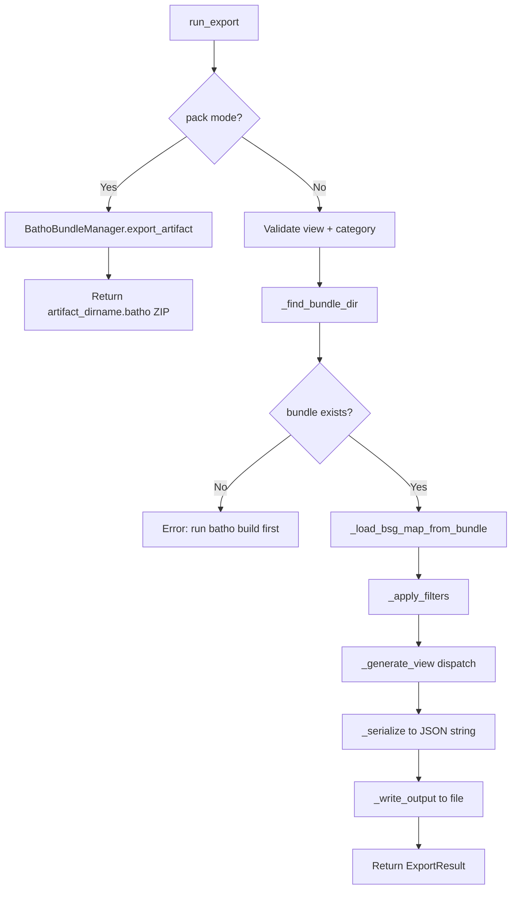

# Batho Export Orchestrator Specification

This document describes the `batho export` command — multi-view JSON export of BSG artifacts, and the `--pack` mode for producing transport ZIP artifacts.

---

## 1. Overview

`batho export` reads the latest indexed BSG data from the Arrow bundle (`.batho/artifact/`) and serializes it into one of several structured JSON views. It is the primary interface for consuming Batho's code intelligence output.

**File:** `batho/orchestrator/export.py`  
**CLI entry:** `batho/cli/export.py` → `run_export(options)`

```
.batho/artifact/          ← BathoBundle (Arrow IPC files)
    │
    └── run_export()
            │
            ├── _load_bsg_map_from_bundle()   ← reconstruct BSGMap
            │
            ├── _apply_filters()              ← glob + category filter
            │
            └── _generate_view()             ← dispatch to view generator
                        │
                        ├── storage → render_storage_view()
                        ├── agent   → render_agent_view()
                        ├── overview → render_overview_json()
                        ├── files   → render_files_json()
                        ├── symbols → _generate_symbols_view()
                        ├── dependencies → _generate_dependencies_view()
                        ├── delta   → _generate_delta_view()
                        └── rel     → _generate_relationships_view()
```

---

## 2. Data Types

### `ExportOptions`

| Field | Type | Default | Description |
|-------|------|---------|-------------|
| `root` | `Path` | — | Repository root directory |
| `view` | `str` | `"storage"` | View type to export |
| `output` | `Path \| None` | `None` | Output file path (default: `<root>/batho_export.json`) |
| `format` | `"json" \| "pretty"` | `"json"` | JSON formatting (compact vs indented) |
| `filter_pattern` | `str \| None` | `None` | Glob pattern to filter files |
| `category` | `str` | `"all"` | Category filter |
| `index_id` | `str \| None` | `None` | Specific run UUID to export (default: latest) |
| `token_budget` | `int \| None` | `None` | Max token budget for agent view |
| `baseline_path` | `Path \| None` | `None` | Baseline export file (required for delta view) |
| `include_relationships` | `bool` | `False` | Inject relationships blob (`--rel` flag) |
| `pack` | `bool` | `False` | Produce transport ZIP artifact instead of JSON |

### `ExportResult`

| Field | Type | Description |
|-------|------|-------------|
| `success` | `bool` | Whether the export completed |
| `entity_count` | `int` | Total entities exported |
| `file_count` | `int` | Total files exported |
| `output_path` | `Path \| None` | Path to the written output file |
| `stream_generator` | `Iterator \| None` | Streaming generator (future use) |
| `errors` | `list[str]` | Error messages |

---

## 3. Valid Views

| View | CLI Flag | Description |
|------|----------|-------------|
| `storage` | `--view storage` | Full-fidelity JSON with all entity metadata |
| `agent` | `--view agent` | Token-budget-capped LLM-optimized view |
| `overview` | `--view overview` | High-level summary: language dist, file categories, entity types |
| `files` | `--view files` | Per-file listing with entity counts and metadata |
| `symbols` | `--view symbols` | Flat symbol index: id, name, type, file, line, signature |
| `dependencies` | `--view dependencies` | Cross-file dependency graph + reverse dependencies |
| `delta` | `--view delta` | Changed files/entities since a baseline export |
| `rel` | `--view rel` | Relationship graph with dependency listing |

### Valid Categories

`source` | `test` | `doc` | `config` | `infra` | `all`

---

## 4. Execution Flow: Batch Mode



---

## 5. BSGMap Reconstruction

When loading from the Arrow bundle, `_load_bsg_map_from_bundle()` reconstructs a `BSGMap` in memory from the persisted file artifacts:

1. `db.get_file_artifacts(run_internal_id, include_storage=True)` — reads all blobs from Arrow IPC
2. For each artifact: deserializes `Entity` objects from `graph.entities` and `Relationship` objects from `graph.relationships`
3. Groups entities by file path into `by_file: dict[str, list[Entity]]`
4. Builds `dependencies: dict[str, list[str]]` from `IMPORTS`/`CALLS`/`USES` relationships
5. Loads `opaque_snapshots` for unindexed files via `db.get_unindexed_files_with_details()`
6. Returns a fully populated `BSGMap` instance

> **Note**: Entity `file` fields are set to absolute paths during reconstruction to ensure `entity.id` is computed correctly. The resulting `BSGMap._by_file` uses relative paths as keys.

---

## 6. Filter Pipeline

Applied after BSGMap reconstruction, before view generation:

```python
bsg_map = _apply_filters(bsg_map, options.filter_pattern, category)
```

### Glob Pattern Filter (`--filter`)
- Applied via `fnmatch.fnmatch(file_path, pattern)`
- Examples: `src/**/*.py`, `**/views.py`, `tests/**`
- Files not matching the pattern are excluded

### Category Filter (`--category`)

Category resolution order:
1. Check entity `metadata["bsg.category"]` (set by BSG rule plugins)
2. Fall back to path heuristics:

| Pattern | Category |
|---------|----------|
| `"test"` in path | `TEST` |
| `.yaml/.yml/.toml/.json/.ini/.cfg/.env` | `CONFIG` |
| `"doc"` in path or `.md/.rst/.txt` | `DOC` |
| `.dockerfile/.tf/.hcl/.sh/.bash` | `INFRA` |
| All others | `SOURCE` |

---

## 7. View Generators

### `storage` view

Calls `bsg_map.render_storage_view()` → `BSGMap.render_json()` from `bsg_map/render_storage.py`.

Output schema:
```json
{
  "schema_version": "bsg.v2",
  "generated_at": "2026-06-05T...",
  "root": "/repo/root",
  "files": [
    {
      "name": "api/users.py",
      "path": "api/users.py",
      "category": "SOURCE",
      "language": "Python",
      "scope_tier": "PUBLIC",
      "service_tag": "UserService",
      "entity_summary": {"function": 4, "class": 1},
      "entities": [...]
    }
  ],
  "summary": {
    "total_files": 42,
    "total_entities": 312,
    "languages": {"Python": 30, "TypeScript": 12},
    "categories": {"SOURCE": 35, "TEST": 5, "CONFIG": 2}
  }
}
```

### `agent` view

Calls `bsg_map.render_agent_view(token_budget=options.token_budget)` → `bsg_map/render_agent.py`.

- Token counting: `max(1, len(text) >> 2)` (4-chars-per-token heuristic)
- Truncates at file boundary (not mid-file) when budget exceeded
- Appends `[...N more entries truncated]` on overflow
- Returns `(view_dict, stats)` where `stats = {"tokens_used": int, "budget": int, "truncated_files": int}`

### `overview` view

Calls `bsg_map.render_overview_json()`.

Returns: language distribution, file category distribution, entity type distribution, total counts.

### `files` view

Calls `bsg_map.render_files_json()`.

Returns: per-file listing with entity counts, language, category, scope tier, service tag.

### `symbols` view

`_generate_symbols_view(bsg_map)` — flat index of all symbols:

```json
{
  "view_type": "symbols",
  "generated_at": "...",
  "symbol_count": 1234,
  "symbols": [
    {"id": "ent|...", "name": "create_user", "type": "FUNCTION", "file": "api/users.py", "line": 5, "signature": "def create_user(name: str) -> User"}
  ]
}
```

### `dependencies` view

`_generate_dependencies_view(bsg_map)` — cross-file dependency graph:

```json
{
  "view_type": "dependencies",
  "dependency_edge_count": 87,
  "dependencies": [
    {"file": "api/users.py", "depends_on": ["db/models.py", "auth/tokens.py"], "dependency_count": 2}
  ],
  "reverse_dependencies": [
    {"file": "db/models.py", "required_by": ["api/users.py", "api/posts.py"]}
  ]
}
```

### `delta` view

`_generate_delta_view(bsg_map, baseline_path)` — requires `--baseline <path>`.

Steps:
1. Validates baseline file size ≤ 50 MB (raises `ValueError` if exceeded)
2. Loads baseline JSON from `baseline_path`
3. Reconstructs `BSGMap.from_dict(baseline_data)` from the baseline
4. Calls `bsg_map.render_delta(previous=baseline_map)` for the diff
5. Serializes added entity lists (agent view) and sorted modified/removed/unchanged lists

```json
{
  "view_type": "delta",
  "delta_type": "incremental",
  "added": {"api/new_endpoint.py": [...]},
  "modified": ["api/users.py"],
  "removed": ["api/deprecated.py"],
  "unchanged": ["auth/tokens.py"],
  "stats": {...}
}
```

> **50 MB limit**: Prevents memory exhaustion from very large baseline exports. The limit is checked via `baseline_path.stat().st_size` before loading.

### `rel` view

`_generate_relationships_view(bsg_map)` — complete relationship listing with dependency map:

```json
{
  "view_type": "rel",
  "relationship_count": 2341,
  "relationships": [...],
  "dependencies": [...],
  "reverse_dependencies": [...]
}
```

---

## 8. `--rel` Flag

When `options.include_relationships=True` (CLI: `--rel`), the full relationship list is injected into any view (except `rel` view itself):

```python
data["relationships"] = [rel.to_dict() for rel in bsg_map._relationships]
data["relationship_count"] = len(relationships)
```

---

## 9. Pack Mode (`--pack`)

`--pack` bypasses the normal JSON view pipeline entirely and produces a transport ZIP artifact:

```python
if options.pack:
    manager = BathoBundleManager(bundle_dir)
    bsg_current_dir = root / ".batho" / "bsg" / "current"
    manager.export_artifact(zip_path, bsg_current_dir=bsg_current_dir)
```

**ZIP format:** `artifact_<sanitized-dir-name>.batho`

```
artifact_myrepo.batho  (ZIP)
  manifest.json          — {"schema_version": "batho-bundle.v1", "tables": [...]}
  bsg/runs.ipc.zst       — zstd-compressed Arrow IPC stream
  bsg/file_tracking.ipc.zst
  bsg/file_changelog.ipc.zst
  bsg/run_artifacts.ipc.zst
  bsg/agents/<file_id>.ipc.zst
  bsg/rels/<file_id>.ipc.zst
```

This artifact is consumed by `batho load <path>` on the receiving end (CI/CD artifact handoff).

**Default output path**: `<root>/artifact_<sanitized-dir-name>.batho`  
Override with `--output <path>`.

---

## 10. Output Formats

| Format | CLI Flag | JSON Style |
|--------|----------|------------|
| `json` (default) | `--format json` | Compact, sorted keys, ASCII-safe |
| `pretty` | `--format pretty` | Indented (2 spaces), sorted keys, ASCII-safe |

Serialized via `json.dumps(data, sort_keys=True, ensure_ascii=True)`.

---

## 11. Error Handling

| Condition | Return |
|-----------|--------|
| Root doesn't exist | `ExportResult(success=False, errors=[...])` |
| Unknown view name | `ExportResult(success=False, errors=[...])` |
| Unknown category | `ExportResult(success=False, errors=[...])` |
| No bundle found | `ExportResult(success=False, errors=[...])` |
| Failed to load BSG data | `ExportResult(success=False, errors=[...])` |
| Baseline too large (delta) | `ExportResult(success=False, errors=[...])` |
| Render/serialize error | `ExportResult(success=False, errors=[...])` |
| Write error | `ExportResult(success=False, errors=[...])` |

---

## 12. Exit Codes

| Code | Meaning |
|------|---------|
| `0` | Export completed successfully |
| `1` | Any failure (validation, load, render, write) |

---

## 13. Structured Logging Events

| Event | When |
|-------|------|
| `export_started` | Export begins |
| `export_load_failed` | BSGMap reconstruction failed |
| `export_filter_failed` | Filter application failed |
| `export_render_failed` | View generation failed |
| `export_complete` | Successful completion (includes view, files, entities, duration_ms, output path) |
| `export_pack_complete` | Pack mode completed |
| `export_opaque_snapshots_skipped` | Unindexed file loading failed (non-fatal) |

---

*Generated for Batho v1.1.0*
