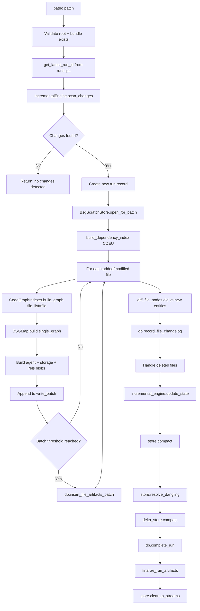

# Batho Patch Orchestrator Specification

This document describes the `batho patch` command — the incremental index update pipeline that re-parses only changed files and applies copy-on-write updates to the existing BSG artifact.

---

## 1. Overview

`batho patch` is the fast-path alternative to `batho build --full`. Rather than re-indexing the entire repository, it:

1. Detects which files changed (via native hash comparison against `file_tracking.ipc`)
2. Re-parses only the changed files
3. Applies copy-on-write updates to the BSG Arrow store
4. Records node-level diffs into `file_changelog.ipc`
5. Finalizes the new run with telemetry and delta stats

**Pipeline position:**
```
batho build  →  .batho/artifact/ + .batho/bsg/current/
                          │
batho patch  →  Reads file_tracking.ipc, compares hashes
                          │
              Re-parse changed files only
                          │
              Copy-on-write BSG store update
                          │
              New run record in runs.ipc
```

**File:** `batho/orchestrator/patch.py`  
**CLI entry:** `batho/cli/patch.py` → `run_patch(options)`

---

## 2. Data Types

### `PatchOptions`

| Field | Type | Default | Description |
|-------|------|---------|-------------|
| `root` | `Path` | — | Repository root directory |
| `verbose` | `bool` | `False` | Verbose logging |
| `max_file_size_kb` | `int \| None` | `None` | Override for max file size (falls back to config) |

### `PatchResult`

| Field | Type | Description |
|-------|------|-------------|
| `success` | `bool` | Whether the patch completed successfully |
| `run_id` | `str` | New run UUID (format: `patch_<timestamp>_<8hex>`) |
| `base_snapshot_id` | `str` | UUID of the run this patch is based on |
| `new_snapshot_id` | `str` | Always `""` (reserved for future snapshot tagging) |
| `changes_applied` | `int` | Total files changed (added + modified + deleted) |
| `added` | `int` | Files added since last run |
| `modified` | `int` | Files modified since last run |
| `deleted` | `int` | Files deleted since last run |
| `entity_count` | `int` | Entities extracted from changed files |
| `relationship_count` | `int` | Relationships extracted from changed files |
| `duration_ms` | `int` | Total wall-clock duration |
| `nodes_added` | `int` | Node-level additions (from diff) |
| `nodes_removed` | `int` | Node-level removals (from diff) |
| `nodes_modified` | `int` | Node-level modifications (from diff) |
| `nodes_renamed` | `int` | Node-level renames (from diff) |
| `warnings` | `list[str]` | Non-fatal warning messages |

### `FileChange`

| Field | Type | Description |
|-------|------|-------------|
| `path` | `str` | Relative file path (relative to root — must not be absolute) |
| `change_type` | `str` | `"added"`, `"modified"`, or `"deleted"` |
| `old_hash` | `str \| None` | Previous content hash (SHA256) |
| `new_hash` | `str \| None` | New content hash |

---

## 3. Patch Execution Flow



---

## 4. Change Detection: `IncrementalEngine`

**File:** `batho/modules/storage/arrow_bundle/incremental.py`

Change detection compares the current filesystem state against `file_tracking.ipc` from the previous run.

```python
incremental_engine = IncrementalEngine(db, base_run_uuid)
changes = incremental_engine.scan_changes(
    root=root,
    max_file_size_kb=max_file_size_kb,
    strict_hashing=True,  # config: indexer.strict_hashing
)
```

### Detection Modes

| Mode | Config | Algorithm | Speed | Accuracy |
|------|--------|-----------|-------|----------|
| **Strict** (default) | `indexer.strict_hashing: true` | SHA256 content hash comparison | Slower | Exact — catches content changes regardless of mtime |
| **Fast** | `indexer.strict_hashing: false` | `mtime_ns + inode + size` comparison | Faster | Near-exact — can miss edits that restore the same mtime |

### `scan_changes()` Returns

A `list[FileChange]` with one entry per changed file. Files with no changes are not included.

**Key invariant**: All `FileChange.path` values must be **relative paths** (relative to `root`). Absolute paths raise `ValueError`.

### Post-scan: State Update

After re-parsing, the engine records new file fingerprints:

```python
incremental_engine.update_state(fingerprints)
incremental_engine.handle_deleted_files(deleted_paths)
```

`fingerprints` is a list of dicts with: `file_path`, `content_hash`, `mtime`, `mtime_ns`, `inode`, `size`, `is_indexed`, `last_run_id`, `encoding`.

---

## 5. Copy-on-Write BSG Store

**File:** `batho/modules/storage/arrow_store/store.py`

For patch runs, the BSG scratch store is opened in copy-on-write mode:

```python
store, delta_store = BsgScratchStore.open_for_patch(
    batho_dir=batho_dir,
    new_run_uuid=run_uuid,
    new_run_internal_id=run_internal_id,
    changed_paths=changed_file_paths,  # set[str]
    db=None,
)
```

This creates **two stores**:
- `store` — the main BSG store (inherits unchanged entities from previous run, drops entities for changed files)
- `delta_store` — a sidecar delta store that records only the newly extracted entities/relationships from this patch (written to `bsg/<patch_uuid>/`)

---

## 6. Per-File Re-parsing

Changed files are re-parsed one at a time using `CodeGraphIndexer.build_graph(file_list=[...])`:

```python
with CodeGraphIndexer(
    cache_path=str(root),
    root=str(root),
    ast_cache_dir=ast_cache_dir,
) as indexer:
    # Invalidate AST cache for changed files
    for change in changes:
        indexer._cache.delete_ast_by_path(change.path)

    for change in added_or_modified:
        single_graph = indexer.build_graph(
            root=str(root),
            file_list=[str(full_path)],
            max_workers=1,       # No benefit from parallelism for single files
            index_id=run_uuid,
            external_scope_manager=dep_scope_manager,
        )
```

`max_workers=1` is always used for per-file builds — no benefit from multiprocessing for a single file. The `file_list` parameter restricts discovery to only the specified file path.

### AST Cache Invalidation

Before re-parsing, the unified AST cache is invalidated for all changed and deleted files. This ensures stale cached AST results are not reused.

---

## 7. Blob Construction

After each file's graph is built, three blobs are constructed:

| Blob | Content | View |
|------|---------|------|
| `agent_view_data` | `{entities: [{id, name, type, start_line, end_line, signature, content_hash}]}` | LLM-optimized, compact |
| `storage_delta_data` | `{entities: [{id, raw_content, syntax_glue, raw_bytes, start_byte, end_byte, parent_id, ast_node_type, children_order, metadata, content_hash}]}` | Full-fidelity, reconstruction-ready |
| `relationships_data` | `[{id, source_id, target_id, type, roles, ...}]` | Raw relationship list |

These are appended to `write_batch` and flushed when the batch threshold is reached.

### Batch Flush Thresholds

```python
batch_size = cfg.get("persistence", {}).get("batch_size", 500)
batch_bytes_threshold = cfg.get("persistence", {}).get("batch_bytes_threshold", 15_728_640)  # 15 MB

if len(write_batch) >= batch_size or current_batch_bytes >= batch_bytes_threshold:
    db.insert_file_artifacts_batch(run_internal_id, write_batch, store=store, delta_store=delta_store)
    write_batch = []
    current_batch_bytes = 0
```

---

## 8. Node-Level Diff (`diff_file_nodes`)

For each re-parsed file, the new entities are compared against the previous run's entities:

```python
from batho.modules.graph.diff_engine.node_diff import diff_file_nodes

old_entities = db.get_agent_entities_for_file(base_run_internal_id, file_rel)
node_diffs = diff_file_nodes(old_entities, agent_entities, file_rel)

if node_diffs:
    db.record_file_changelog(run_internal_id, base_run_internal_id, node_diffs)
```

**Change kinds recorded:**

| Kind | Meaning |
|------|---------|
| `added` | Entity present in new run, absent in old |
| `removed` | Entity present in old run, absent in new |
| `modified` | Entity present in both but content/signature changed |
| `renamed` | Entity moved (detected by content hash match but different name) |

These diffs are written to `file_changelog.ipc` and are queryable via `batho diff --file <path>`.

**Deleted files**: For deleted files, all old entities are recorded as `removed` diffs.

---

## 9. Finalization

After all files are re-parsed:

1. **`store.compact()`** — merges `_stream/` buffers into `bsg/current/*.ipc`
2. **`store.resolve_dangling(None)`** — resolves cross-file forward references
3. **`delta_store.compact()`** — compacts the delta sidecar into `bsg/<patch_uuid>/`
4. **`store.finalize()`** — final cleanup
5. **`db.complete_run()`** — stamps `status='completed'` with final counts
6. **`finalize_run_artifacts()`** — writes context overview, telemetry, structural metrics, security audit, delta stats to `run_artifacts.ipc`
7. **`store.cleanup_streams()`** — removes temporary `_stream/` files

### Delta Stats Payload

Written to `run_artifacts.ipc`:

```python
{
    "nodes_added": int,
    "nodes_removed": int,
    "nodes_modified": int,
    "nodes_renamed": int,
    "files_changed": int,
    "files_added": int,
    "files_deleted": int,
    "churn_pct": float,       # (files_changed / total_files) * 100
    "base_run_uuid": str,
}
```

---

## 10. Dependency Re-indexing

CDEU is re-run on every patch, even for unchanged files:

```python
build_dependency_index(
    root=root,
    scope_manager=dep_scope_manager,
    cfg=dep_cfg,
    cache_dir=cache_dir,
)
```

**Why re-run every time?** stdlib indexing is cheap; third-party dependency symbols are cached by `ResolutionCache` (TTL: 90 days) so cache hits are fast. This ensures newly added manifest dependencies are always picked up.

---

## 11. Git Metadata Capture

Git metadata is captured for the run record (non-blocking):

```python
from batho.modules.graph.incremental import get_head_commit, is_git_repo, get_current_branch

git_commit = get_head_commit(root) if is_git_repo(root) else None
git_branch = get_current_branch(root) if is_git_repo(root) else None
```

Git is used **only for metadata** — change detection is entirely hash-based, not git-based.

---

## 12. Error Handling

All exceptions in `run_patch()` are caught at the top level:

```python
except Exception as e:
    LOGGER.error("patch_unhandled_exception", error=str(e))
    if run_uuid and db is not None:
        db.fail_run(run_uuid, error_message=str(e))  # Best effort
    return PatchResult(success=False, ...)
```

Per-file parse failures are non-fatal (logged as `patch_file_parse_failed`, file skipped).

---

## 13. Key Configuration

| Config Key | Default | Controls |
|-----------|---------|----------|
| `indexer.strict_hashing` | `true` | SHA256 vs mtime-based change detection |
| `indexer.max_file_size_kb` | `500` | Skip files larger than this |
| `indexer.file_changelog_max_runs` | `100` | How many runs of changelog to retain |
| `dependency.enabled` | `true` | Re-run CDEU on each patch |
| `extraction.cache.enabled` | `true` | AST disk cache (invalidated for changed files) |
| `persistence.batch_size` | `500` | Blob write batch threshold |
| `persistence.batch_bytes_threshold` | `15728640` | 15 MB byte threshold for batch flush |

---

## 14. Exit Codes

| Code | Meaning |
|------|---------|
| `0` | Patch completed successfully |
| `0` + warning | No changes detected since last build/patch |
| `1` | Failure (no bundle, no completed run, unhandled exception) |

---

*Generated for Batho v1.1.0*
