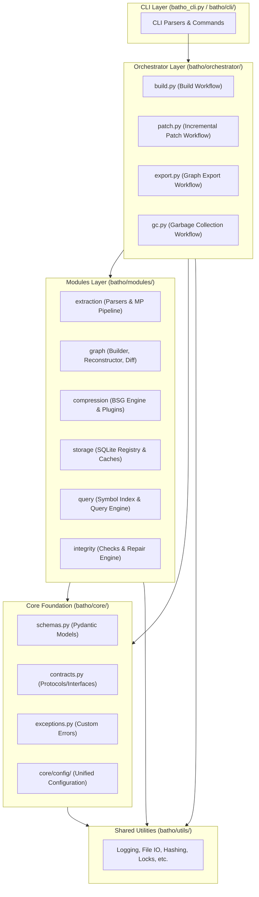

# Batho Modular Architecture — Master Overview

Welcome to the architectural documentation for Batho. This directory contains detailed specifications of the domain-driven, hierarchical package structure of Batho.

---

## High-Level Architecture Diagram

The diagram below represents the relationships and flow of execution between the different architectural layers of Batho:

---

## Module Directory

Batho is organized into logical layers, each with specific responsibilities:

| Layer / Module | Documentation File | Description |
|:---|:---|:---|
| **Core Layer** | [core.md](file:///Users/rishirajsharma/Sageoz/batho-v1.1.0/docs/architecture/core.md) | Centralized schemas, Protocol definitions, package exceptions, and configuration loading. |
| **Extraction Module** | [extraction.md](file:///Users/rishirajsharma/Sageoz/batho-v1.1.0/docs/architecture/extraction.md) | Multiprocessing pipeline, language factory, detector, and 34 language extractors. |
| **Graph Module** | [graph.md](file:///Users/rishirajsharma/Sageoz/batho-v1.1.0/docs/architecture/graph.md) | Code graph indexing, relationship construction, incremental diffing, and file reconstruction. |
| **Compression Module** | [compression.md](file:///Users/rishirajsharma/Sageoz/batho-v1.1.0/docs/architecture/compression.md) | BSG compression rules, plugins, mapping, and translation engines. |
| **Query Module** | [query.md](file:///Users/rishirajsharma/Sageoz/batho-v1.1.0/docs/architecture/query.md) | fast graph query service and symbol index lookup. |
| **Storage Module** | [storage.md](file:///Users/rishirajsharma/Sageoz/batho-v1.1.0/docs/architecture/storage.md) | SQLite registry persistence and caches. |
| **Integrity Module** | [integrity.md](file:///Users/rishirajsharma/Sageoz/batho-v1.1.0/docs/architecture/integrity.md) | Multistage verification (sqlite, state, blobs, graph) and auto-repair pipelines. |
| **Orchestrator Layer** | [orchestrator.md](file:///Users/rishirajsharma/Sageoz/batho-v1.1.0/docs/architecture/orchestrator.md) | High-level workflows orchestrating indexing, patching, export, and garbage collection. |
| **CLI Layer** | [cli.md](file:///Users/rishirajsharma/Sageoz/batho-v1.1.0/docs/architecture/cli.md) | CLI argument parsers, formatting, and adapters. |
| **Utilities Layer** | [utils.md](file:///Users/rishirajsharma/Sageoz/batho-v1.1.0/docs/architecture/utils.md) | Thread-safe logging, file locks, ignore rules, and hashing. |
| **Configuration** | [config.md](file:///Users/rishirajsharma/Sageoz/batho-v1.1.0/docs/architecture/config.md) | YAML settings model, file paths, and parsing configurations. |

---

## CLI Command Invocation Workflow

The following table maps CLI commands to their orchestrator entry points and the underlying modules they engage:

| CLI Command | Orchestrator Workflow | Primary Modules Utilized |
|:---|:---|:---|
| `batho build` | `orchestrator.build.run_build()` | Core, extraction, graph, compression, storage, utils |
| `batho patch` | `orchestrator.patch.run_patch()` | Core, extraction, graph, compression, storage, integrity, utils |
| `batho export` | `orchestrator.export.run_export()` | Core, storage, query, compression, utils |
| `batho fix` | `cli.fix` / `integrity.engine` | Core, integrity, storage, utils |
| `batho diff` | `cli.diff` | Core, graph.diff_engine, storage, utils |
| `batho gc` | `orchestrator.gc.run_gc()` | Core, storage, utils |
