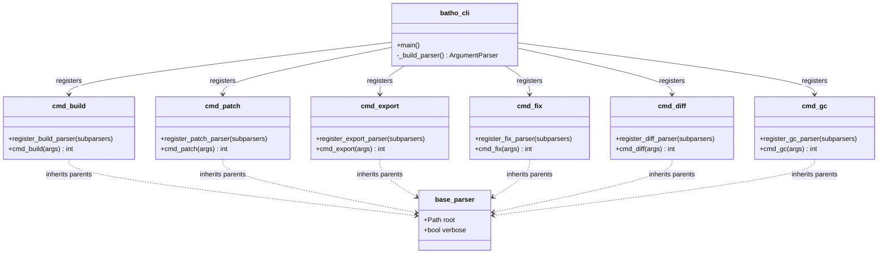
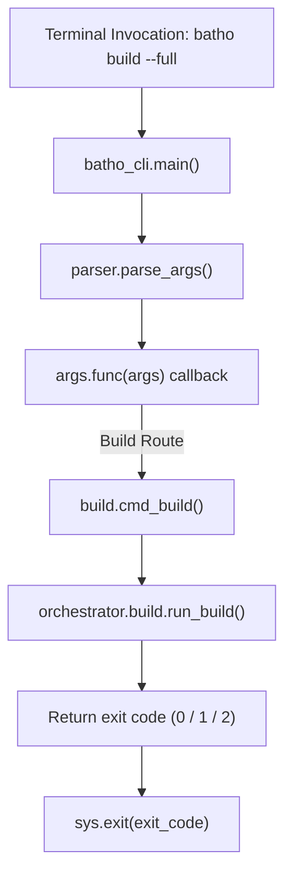

# CLI Layer

The CLI layer (`batho/cli/` and the root `batho_cli.py` file) serves as the primary command-line parser and invocation router for Batho.

---

## File Reference Table

| Path | Purpose |
|:---|:---|
| `batho_cli.py` | Package entrypoint, defining top-level parsers and executing command dispatchers. |
| `batho/cli/_utils.py` | Argparse convenience utilities (e.g. `--root` and `--verbose` base parser configuration). |
| `batho/cli/build.py` | Wrapper exposing `batho build` for full workspace index builds. |
| `batho/cli/patch.py` | Wrapper exposing `batho patch` for incremental code change updates. |
| `batho/cli/export.py` | Wrapper exposing `batho export` for rendering custom code graph outputs. |
| `batho/cli/fix.py` | Wrapper exposing `batho fix` for database diagnostics, auto-repairs, and state rollbacks. |
| `batho/cli/diff.py` | Wrapper exposing `batho diff` for querying node-level entity changelogs. |
| `batho/cli/gc.py` | Wrapper exposing `batho gc` for cleaning database runs. |

---

## Design Patterns

### 1. Thin Wrappers
To keep boundaries clean, each CLI module acts as a parser mapper:
- Defines command parameters and binds validation.
- Collects inputs into an `*Options` dataclass.
- Dynamically imports and delegates execution to the corresponding Orchestrator.
- Prints execution stats and returns shell status codes.

### 2. Base Parent Parser
`_utils.create_base_parser()` defines shared parameters inherited by all subcommands:
- `--root`: Filesystem location of the codebase (defaults to `.`).
- `--verbose`: Activates debug-level tracing.

### 3. Dynamic Handler Dispatch
`batho_cli.py` defines the main loop:
- Sets `func=cmd_<action>` default callbacks on sub-parsers.
- Calls `args.func(args)` without needing explicit dispatch switches.

---

## Subcommand Parameters Reference

### `batho build`
- `--full`: Force full rebuild (drops any existing SQLite file first).
- `--max-workers`: Parse worker process counts.
- `--max-file-size-kb`: Limits files processed by size.

### `batho patch`
- `--max-file-size-kb`: Limits files processed by size.

### `batho export`
- `--view`: Output type (`storage`, `agent`, `overview`, `files`, `symbols`, `dependencies`, `delta`, `rel`).
- `--output`: Output filepath.
- `--index-id`: Target run UUID to export.
- `--filter`: Glob filter to narrow targets.
- `--format`: Pretty-print or raw JSON outputs.
- `--category`: BSG categorizations (`source`, `test`, `doc`, `config`, `infra`, `all`).
- `--token-budget`: Maximum token size limit for the `agent` view.
- `--baseline`: Previous export JSON for delta view comparison.
- `--rel`: Flag to include the full relationships list.

### `batho fix`
- `--deep`: Runs deep multi-stage diagnostics (decompresses and validates every zstd JSON BLOB).
- `--dry-run`: Runs diagnostics without committing repairs.
- `--target`: Target specific checker (`db`, `state`, `blobs`, `graph`, `all`).
- `--phase`: Run specific phase number (`1`, `2`, `3`, `4`).
- `--parallel`: Runs independent checks in parallel threads.
- `--format`: Report output format (`text`, `json`, `csv`).
- `--output`: Filepath to write the verification report.

### `batho diff`
*Requires exactly one of the following mutually-exclusive options:*
- `--run`: Diff output of a single patch run.
- `--entity`: Deep history trace of a specific entity.
- `--file`: Deep history trace of all entity updates in a specific file.
- `--since`: Lower boundary timestamp when querying `--entity` histories.
- `--json`: Flag to output machine-readable JSON.

### `batho gc`
- `run <run_uuid>`: Removes specific run and its artifacts.
- `runs --older-than N`: Removes runs older than N days.
- `status`: Displays current database statistics.
- `vacuum`: Compares SQLite page allocations and triggers vacuuming.

---

## Mermaid Class Diagram

---

## Mermaid Call-Flow Flowchart

