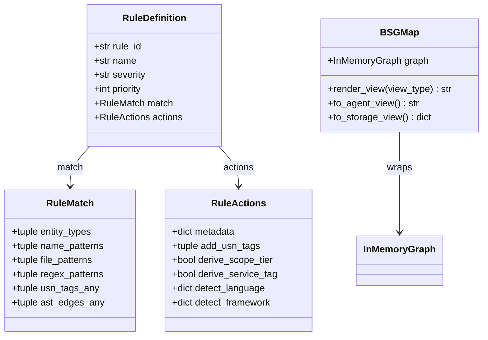
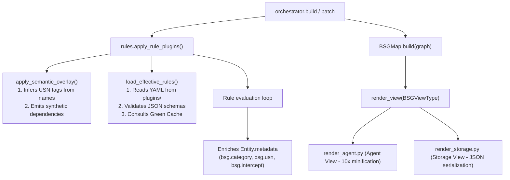

# Compression Module

The Compression module (`batho/modules/compression/`) implements the **Batho Structured Graph (BSG)** rule-plugin runtime and mapping system. It compresses and enriches code graphs with semantic tags (USN), categories, optimizations, and security/reliability annotations.

---

## File Reference Table

| Path | Purpose |
|:---|:---|
| `bsg.py` | Compatibility shim for exporting `BSGMap` as `RepoMap`. |
| `rules.py` | Dataclass rule model, YAML/schema validator, Green Cache management, and semantic overlay execution. |
| `plugins_cli.py` | Developer/CI CLI command handlers (`plugins test/validate-strict/trace/verify-bidirectional`). |
| `testing.py` | Fixture runner and mock graph builder for validation testing. |
| `bsg_map/__init__.py` | Top-level representation of `BSGMap` for generating compressed views (`storage`, `agent`, `human`). |
| `bsg_map/constants.py` | Common string constants for category and USN assignments. |
| `bsg_map/relativizer.py` | Best-effort path sanitizing and POSIX relative conversions. |
| `bsg_map/render_agent.py` | Renderer for the `AGENT` (LLM-optimized) serialization view. |
| `bsg_map/render_bsg.py` | Master renderer orchestrating output generations. |
| `bsg_map/render_storage.py` | Renderer for the `STORAGE` (full-fidelity JSON/hex payload) database view. |
| `plugins/foundation/` | 28 foundation plugins (file/framework categorizations and token budgeting). |
| `plugins/interceptors/` | 10 security/reliability interceptor plugins. |

---

## Core Components

### 1. BSG Rule Engine (`rules.py`)
- **`RuleDefinition`**: Structured dataclass matching entities based on type, name patterns, regex, or AST edges.
- **`apply_semantic_overlay()`**: Semantic inference pass executing *prior* to rules. Infers USN tags (e.g. `ApiBoundary`, `AuthMiddleware`) from names and generates synthetic relationships (`DEPENDS_ON_API`, `WRAPPED_BY`, `CLEANED_BY`).
- **`apply_rule_plugins()`**: Annotates entities, runs interceptor checks, and profiles rule matching performance.

### 2. Compression & Serialization Views (`bsg_map/`)
`BSGMap` translates loaded graphs into highly compressed text or JSON representations:
- **`AGENT` View**: Highly minified representation aimed at LLM token optimization. docstrings are truncated, array/JSON lists are rolled up, and whitespace is stripped to save up to 10x token consumption.
- **`STORAGE` View**: Complete JSON serialization with binary hex encoding of `raw_bytes` for full-fidelity lossless reconstruction.

---

## Mermaid Class Diagram

---

## Mermaid Call-Flow Flowchart

---

## Packaged Plugins Summary

### Foundation Plugins (28 YAMLs)
Categorize workspace assets (`SOURCE`, `TEST`, `DOC`, `CONFIG`, `INFRA`), perform multi-strategy framework detection (e.g. Django, Spring, React, Vue, Angular), and optimize tokens (e.g. docstring truncations).

### Interceptor Plugins (10 YAMLs)
Audit workspace safety, structural health, and performance:
- `bsg_hardcoded_secret_catcher`: Variable/constant pattern checks for credentials.
- `bsg_nplus1_query_catcher`: Checks for database interactions inside loops.
- `bsg_silent_failure_catcher`: Checks for catch blocks that drop exceptions without handling.
- `bsg_resource_leak_preventer`: Verifies resource allocation scopes have cleanup edges.
