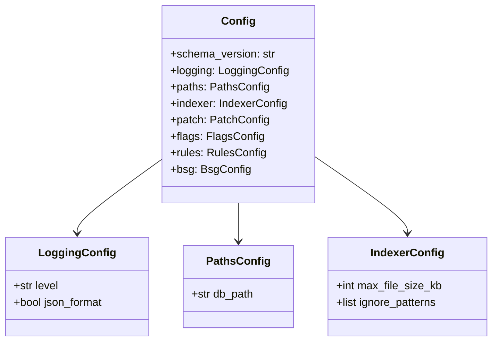
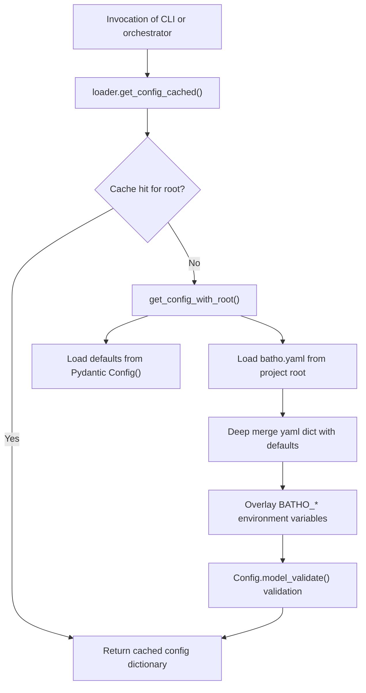

# Configuration System

The configuration system (`batho/core/config/`) provides unified settings management for Batho. It loads settings from the `batho.yaml` file, applies environment variable overrides, and validates inputs using Pydantic models.

---

## File Reference Table

| Path | Purpose |
|:---|:---|
| `loader.py` | Configuration loading logic, environment mapping, context-aware roots (`_active_root`), and LRU cache. |
| `models.py` | Pydantic validation schemas defining settings layout for logs, databases, parsers, and rules. |
| `default-ignore-patterns.yaml` | YAML file specifying default file exclusion rules during workspace scans. |

---

## Loading Mechanism (`loader.py`)

- **Root Management**: Maintains a thread-safe context variable (`_active_root`) representing the current project directory. When `set_active_root()` is called, it clears the configuration cache.
- **Cache Eviction**: `get_config_cached()` fetches the configuration using an LRU cache mapping to the active root. Calls to `reload_config()` clear this cache.
- **Environment Overrides**: Overrides loaded YAML settings using environment variables prefixed with `BATHO_` (e.g. `BATHO_LOGGING_LEVEL` overrides logging settings).

---

## Configuration Models (`models.py`)

The structure of the `Config` Pydantic model consists of:
- `logging`: level, format, output file.
- `paths`: SQLite db path (`db_path`).
- `indexer`: maximum file sizes, worker counts, ignore specs.
- `patch`: timeout durations, change counts, retention.
- `flags`: strict mode, audit logs.
- `rules`: BSG custom plugins settings.
- `artifact_blobs`: run and file serialization targets.
- `bsg`: parallel workers, incremental logic, symbol caching, and storage scopes.

---

## Database Path Resolution Behavior

The storage registry database path is resolved using the following logic:
- **`{root}` (Default)**: Resolves to `artifact_<repo_name>.batho` in the repository root.
- **Relative Paths (e.g. `.batho`, `data/db.batho`)**: Resolves relative to the repository root.
- **Omitted/Empty**: Falls back to the `{root}` behavior.

---

## Mermaid Class Diagram

---

## Mermaid Call-Flow Flowchart

