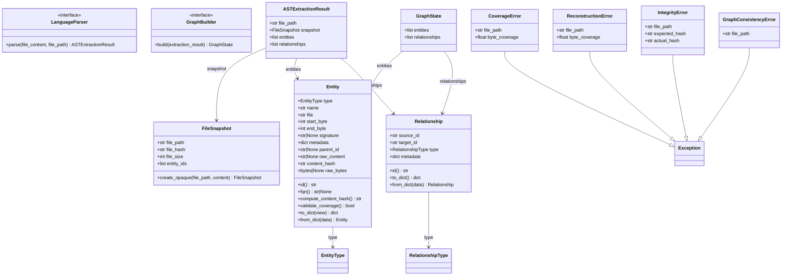

# Core Foundation Layer

The Core layer (`batho/core/`) houses the fundamental, centralized components of Batho, including protocol definitions (contracts) that decouple systems, shared Pydantic models (schemas), and custom exception classes.

---

## Files Covered

| Filename | Purpose |
|:---|:---|
| `exceptions.py` | Centralized exception definitions (e.g. `CoverageError`, `ReconstructionError`, `IntegrityError`, etc.). |
| `schemas.py` | Pydantic models defining data structures for AST extraction results, graph state, snapshots, and reconstruction results. |
| `contracts.py` | Protocol definitions defining interfaces for language parsers and graph builders. |

---

## Centralized Exceptions (`exceptions.py`)

All custom exception classes are centralized here:

| Exception Class | Purpose | Key Attributes |
|:---|:---|:---|
| `CoverageError` | Raised when byte coverage validation fails during AST extraction. | `file_path`, `byte_coverage`, `overlapping_ranges`, `gap_ranges` |
| `ReconstructionError` | Raised when file reconstruction fails. | `file_path`, `entity_count`, `byte_coverage` |
| `IntegrityError` | Raised when the reconstructed file's hash does not match the original. | `file_path`, `expected_hash`, `actual_hash` |
| `GraphConsistencyError` | Raised when graph consistency verification fails. | `file_path` |

---

## Unified Schemas (`schemas.py`)

Unified models represent the semantic entities, relationships, file snapshots, and state definitions.

| Model / Class | Type | Purpose |
|:---|:---|:---|
| `EntityType` | Enum | All extractable code-entity types (e.g. `FUNCTION`, `METHOD`, `CLASS`, `STRUCT`, `INTERFACE`, `FIELD`, `SYNTAX_GLUE`, etc.). |
| `RelationshipType` | Enum | Directed relationship kinds (e.g. `CALLS`, `IMPORTS`, `INHERITS`, `IMPLEMENTS`, `CONTAINS`, etc.). |
| `BSGViewType` | Enum | Control view serialization formats: `STORAGE` (full details) or `AGENT` (LLM context optimized). |
| `Entity` | Frozen Pydantic Model | Represents an AST entity with properties like `id` (hash-derived), `fqn` (fully qualified name), validation, and serialization. |
| `Relationship` | Frozen Pydantic Model | Directed edge between source and target entities. |
| `FileSnapshot` | Frozen Pydantic Model | Metadata needed for file tracking and reconstruction. |
| `ReconstructionResult` | Frozen Pydantic Model | Output summary of a file reconstruction attempt. |
| `ASTExtractionResult` | Pydantic Model | Combined output of AST parsing containing file path, snapshot, entities, and relationships list. |
| `GraphState` | Pydantic Model | The complete in-memory graph state containing loaded entities and relationships. |

---

## Decoupling Contracts (`contracts.py`)

Protocol definitions decouple the modules from each other by declaring structural interface contracts:

| Protocol Class | Key Method | Purpose |
|:---|:---|:---|
| `LanguageParser` | `parse(file_content, file_path) -> ASTExtractionResult` | Interface for language-specific AST extraction parsers. |
| `GraphBuilder` | `build(extraction_result) -> GraphState` | Interface for building/updating the relationship graph. |

---

## Mermaid Class Diagram

The following class diagram shows the primary schemas and exceptions in the Core layer:

