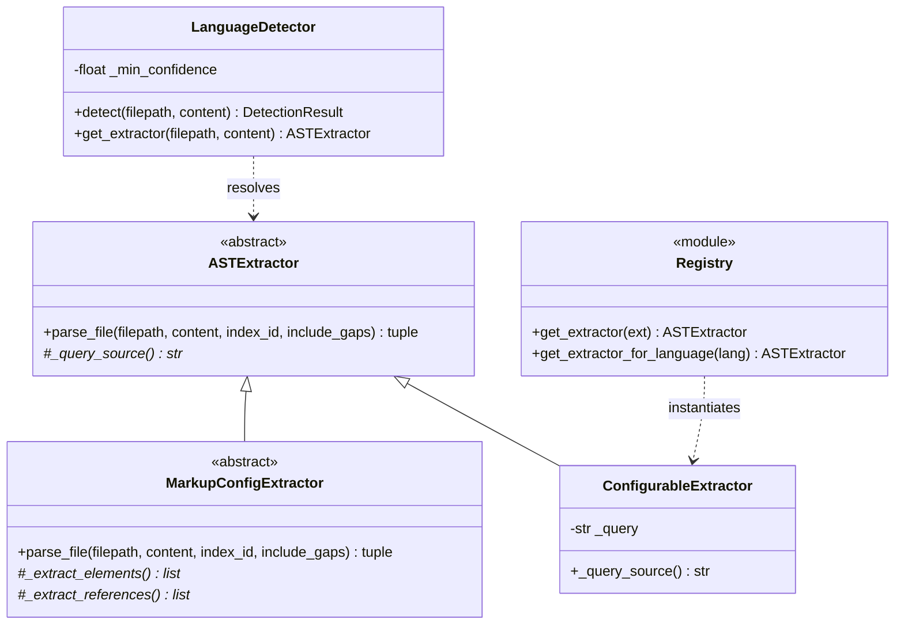
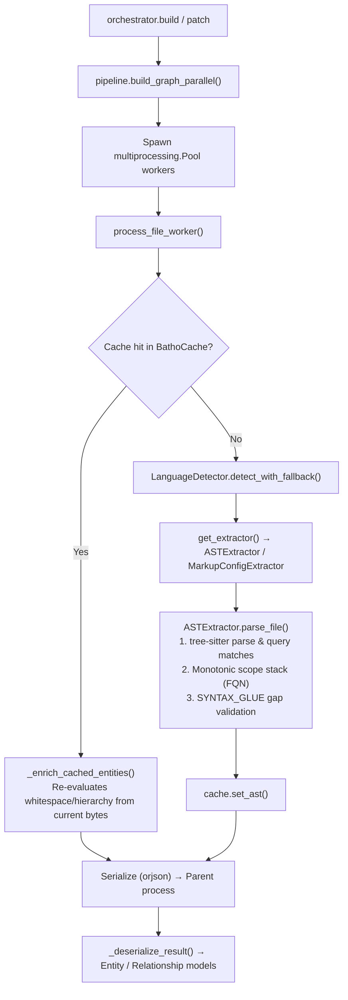

# Extraction Module

The Extraction module (`batho/modules/extraction/`) is the language-intelligence and parsing layer of Batho. It translates raw source-code bytes into structured semantic structures (`Entity` and `Relationship` Pydantic models).

---

## File Reference Table

| Path | Purpose |
|:---|:---|
| `extractor.py` | Core abstract base classes (`ASTExtractor` and `MarkupConfigExtractor`) handling scope stacks, gap calculation, and bidirectional enrichment. |
| `pipeline.py` | Multiprocessing engine executing parallel file parsing, bypassing the GIL via process spawning and utilizing `BathoCache`. |
| `submodules/parser_factory/__init__.py` | Package bootstrap for factory registry. |
| `submodules/parser_factory/registry.py` | Extension-to-language mapping and cached extractor singletons management. |
| `submodules/parser_factory/factory.py` | `ConfigurableExtractor` class to instantiate parsers dynamically from query strings. |
| `submodules/parser_factory/detector.py` | Ordered multi-strategy language detector (extension → special filename → shebang → magic bytes → content heuristics). |
| `submodules/parser_factory/_common.py` | Shared query fragments (e.g. HTTP listener / React render entry-points). |
| `submodules/parser_factory/_queries.py` | Single source-of-truth containing SCM tree-sitter query strings for all 21 programming languages. |
| `submodules/languages/` | 34 language-specific extractor modules (e.g., Python, Rust, Go, TypeScript, JSON, YAML, etc.). |

---

## Core Components

### 1. Abstract Base Extractors (`extractor.py`)
- **`ASTExtractor`**: Abstract class for tree-sitter based programming languages. Runs SCM query matching on parse trees, manages a monotonic scope stack to resolve fully qualified names (FQN), collects auxiliary metadata (visibility, docstrings), and calculates gaps (`SYNTAX_GLUE`) to ensure 100% byte coverage.
- **`MarkupConfigExtractor`**: Base class for config/markup formats (HTML, CSS, JSON, YAML, TOML, Markdown, HCL). Bypasses tree-sitter query matching in favor of regex or native standard library parsers, producing structural elements (sections, settings) and links.

### 2. Multi-Process Pipeline (`pipeline.py`)
- Uses `multiprocessing.Pool` (with spawn start context) to run parsers concurrently.
- Checks local worker-level `BathoCache` to bypass parser runs for unmodified files.
- Falls back to `build_graph_sequential` if multiprocessing is blocked.

### 3. Parser Factory and Registry
- **`get_extractor(extension)`**: Main entrypoint mapping extensions (e.g., `.py`, `.ts`) to language extractors.
- **`LanguageDetector`**: Probes file attributes and content heuristics to dynamically identify the programming/markup language of a file.

---

## Mermaid Class Diagram

---

## Mermaid Call-Flow Flowchart

---

## Integration Points

- **Graph Module**: Receives lists of parsed `Entity` and `Relationship` models from the pipeline to construct the workspace dependency graph.
- **Storage Module**: Queries `BathoCache` to determine if file content hashes have changed and caches fresh AST results.
- **Core Module**: Relies on `batho/core/schemas.py` and structural interfaces (`LanguageParser`).
