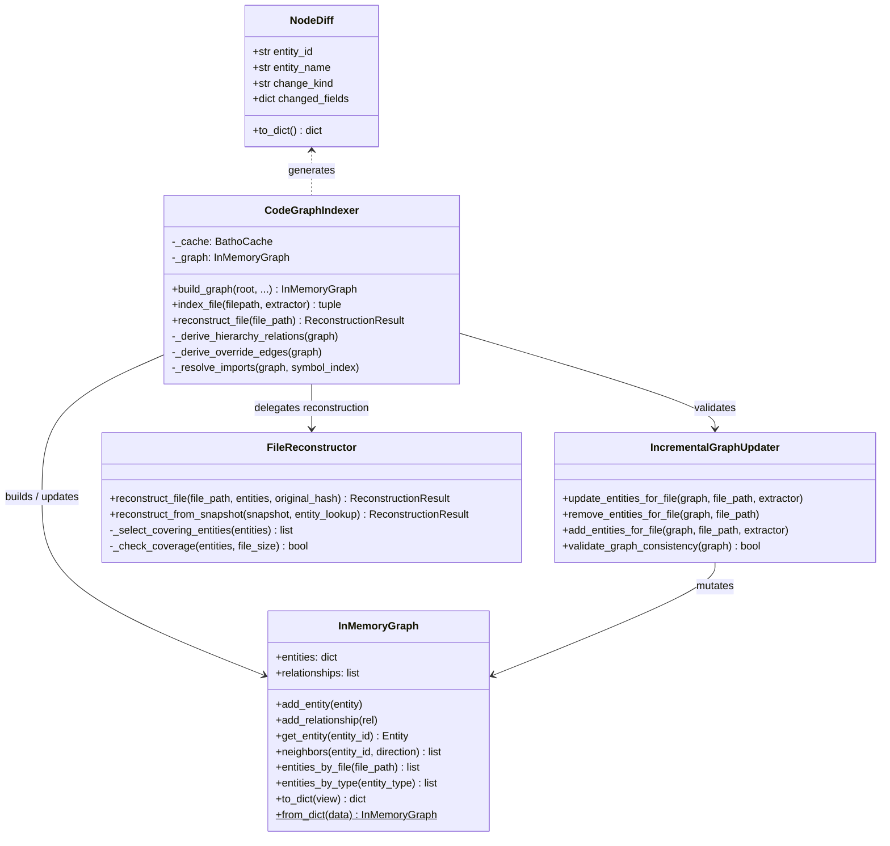
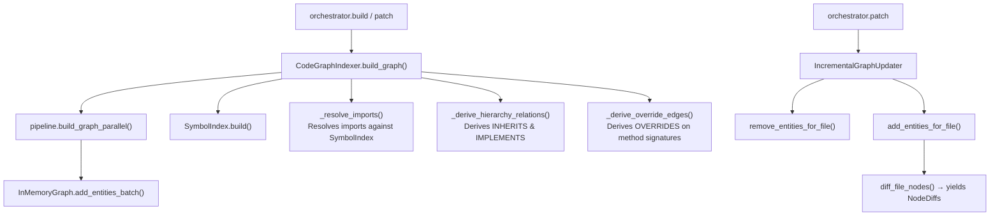

# Graph Module

The Graph module (`batho/modules/graph/`) builds, updates, diffs, and reconstructs the semantic relationship graph of the codebase.

---

## File Reference Table

| Path | Purpose |
|:---|:---|
| `incremental.py` | Git-aware helpers (repository status, HEAD commits, and current branch tracking). |
| `builder/codegraph.py` | Implementation of `InMemoryGraph`, `IncrementalGraphUpdater`, and `CodeGraphIndexer`. Handles relationships, type resolution, and semantic overrides. |
| `reconstructor/reconstructor.py` | Pure in-memory reconstruction engine that reassembles source files losslessly from entity content hashes and byte ranges. |
| `diff_engine/node_diff.py` | Diffing engine comparing entities between indexing runs to generate `NodeDiff` records. |

---

## Core Components

### 1. Code Graph Indexer (`builder/codegraph.py`)
- **`InMemoryGraph`**: In-memory representation of code entities and relationships. Maintains lazy adjacency and secondary lookup indexes for O(1)/O(k) operations.
- **`CodeGraphIndexer`**: Orchestrator that triggers parallel AST parsing, resolves cross-file import statements, derives `INHERITS`/`IMPLEMENTS` and `OVERRIDES` edges, and invokes overlays/plugins.
- **`IncrementalGraphUpdater`**: Executes transactional mutations (adds/removes) on a graph structure for single files in patch mode.

### 2. File Reconstructor (`reconstructor/reconstructor.py`)
- **`FileReconstructor`**: Concatenates `raw_content`/`raw_bytes` of non-overlapping entities covering the byte ranges `[0, file_size)`. Validates reconstruction success against original SHA-256 hashes.

### 3. Entity Diffing Engine (`diff_engine/node_diff.py`)
- **`diff_file_nodes()`**: Computes added, modified, removed, and renamed entities for a modified file by utilizing fast-path hash matches, field comparisons, and name-similarity matching. Produces `NodeDiff` dataclass objects.

### 4. Git-Aware Tracking (`incremental.py`)
- Interacts with Git subprocesses to stamp commit IDs (`HEAD`) and branch names into file snapshots.

---

## Mermaid Class Diagram

---

## Mermaid Workflow Diagram

---

## Integration Points

- **Extraction Module**: Supplies the initial lists of parsed `Entity` and `Relationship` objects.
- **Storage Module**: Provides persistence via the database registry and cache.
- **Query Module**: Queries the graph via `SymbolIndex` for importing and override resolution.
