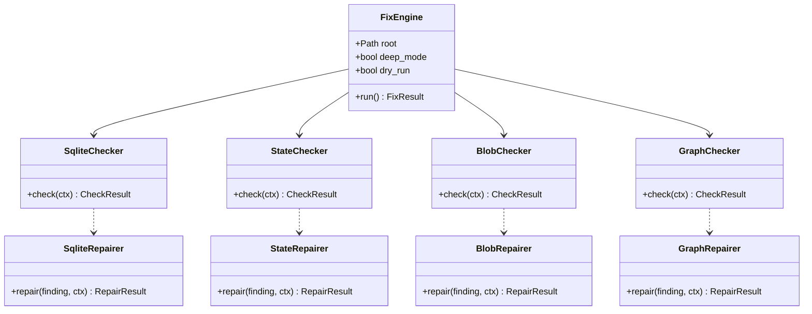
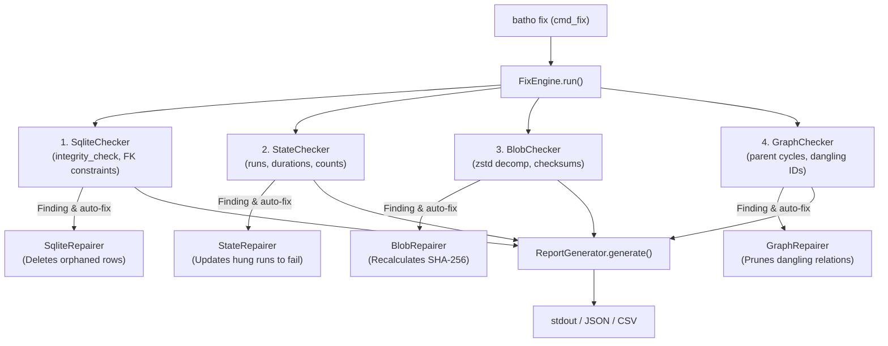

# Integrity Module

The Integrity module (`batho/modules/integrity/`) coordinates the database diagnostics, verification, and repair pipelines.

---

## File Reference Table

| Path | Purpose |
|:---|:---|
| `__init__.py` | Module imports and exports. |
| `engine.py` | Implementation of `FixEngine`, driving the multistage verification and repair process. |
| `models.py` | Models representing `VerificationState`, `VerificationResult`, `RepairState`, and `RepairResult`. |
| `cli.py` | Argument setup and commands routing. |
| `report.py` | Formatter generating stdout logs, JSON dumps, or CSV files from diagnostics. |
| `checkers/sqlite_checker.py` | SQLite file diagnostics (FK constraints, indexes, pages, and corruption). |
| `checkers/state_checker.py` | State consistency diagnostics (runs, durations, counts). |
| `checkers/blob_checker.py` | Blob tracking diagnostics (zstd compression validity and checksum mismatches). |
| `checkers/graph_checker.py` | Graph structure diagnostics (dangling imports, parent-child circular references, and unresolved nodes). |
| `repairers/sqlite_repairer.py` | SQLite structure auto-repairers. |
| `repairers/state_repairer.py` | State run status auto-repairers. |
| `repairers/blob_repairer.py` | Checksum recalculations and corrupt entry deletions. |
| `repairers/graph_repairer.py` | Dangling reference pruning and circular hierarchy updates. |

---

## Core Components

### 1. Fix Engine (`engine.py`)
- **`FixEngine`**: Orchestrates diagnostic runs by sequentially invoking checkers and repairers.
- Processes checks across 4 stages: `SQLITE` → `STATE` → `BLOBS` → `GRAPH`.

### 2. Multi-Stage Checkers (`checkers/`)
- **`SqliteChecker`**: Checks SQLite database integrity using `PRAGMA integrity_check`, verifying schema and foreign key violations.
- **`StateChecker`**: Detects runs stuck in a pending/running state or having inconsistent counts.
- **`BlobChecker`**: Re-computes SHA-256 content hashes of stored BSG artifacts and snapshots to detect corruption.
- **`GraphChecker`**: Inspects parent-child trees to catch cycles and dangling relationship keys.

### 3. Auto-Repairers (`repairers/`)
- Operates on findings to apply transactional repairs (e.g. deleting dangling rows, nullifying circular parents, and recalculating mismatches) if not in dry-run mode.

---

## Mermaid Class Diagram

---

## Mermaid Call-Flow Flowchart

---

## Integration Points

- **Storage Module**: Opens read-write transaction connections to inspect the database schema and query the artifact/run table rows.
- **Orchestrator Module**: `patch.py` calls the integrity checks after applying code increments to verify graph health.
