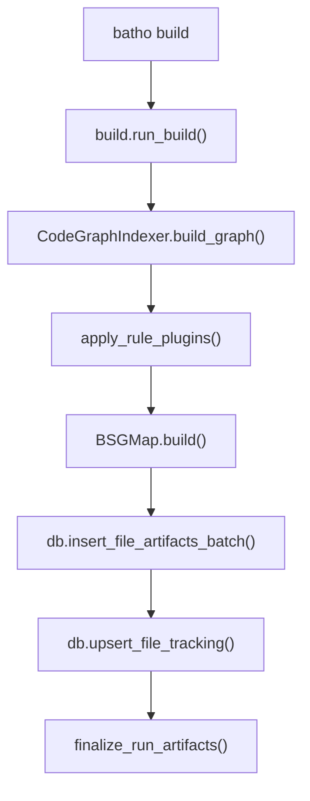
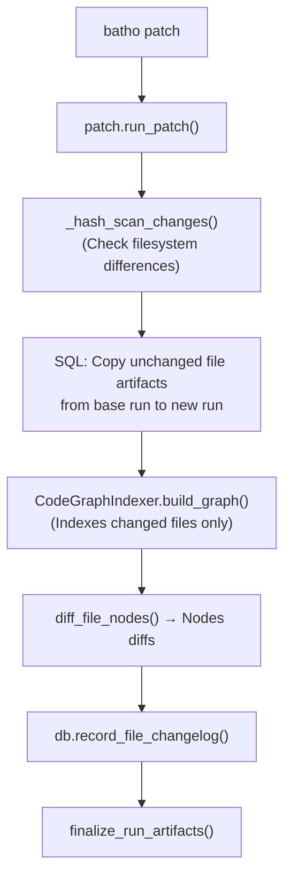

# Orchestrator Layer

The Orchestrator layer (`batho/orchestrator/`) is the central workflow dispatch layer of Batho. It coordinates business logic, indexes, patches, exports, and garbage collection.

---

## File Reference Table

| Path | Purpose |
|:---|:---|
| `__init__.py` | Package API exports (`run_patch`, `run_export`, options, and results). |
| `build.py` | Full index build orchestrator (`batho build`). Coordinates parses, rule overlays, artifact generation, database flushes, and run finalizing. |
| `patch.py` | Incremental patch orchestrator (`batho patch`). Executes filesystem change scans, copy-on-write propagation, single-file patches, and node-level changelogs. |
| `export.py` | Export view renderer (`batho export`). Renders symbol trees, delta differences, and dependency maps into multiple outputs. |
| `gc.py` | Storage database garbage collector (`batho gc`). Prunes index runs, sweeps dangling records, and vacuums SQLite pages. |

---

## Core Workflows

### 1. Full Build Workflow (`build.py`)
- Unlinks any existing artifact database if a full build is forced.
- Calls `CodeGraphIndexer.build_graph()` to index the codebase in parallel.
- Applies semantic overlays and BSG rules, then batches file writes (in chunks of **50 files**) to write compressed payloads into the `file_artifacts` table.
- Stores git commit hashes/branch names and finalizes run statistics.

### 2. Incremental Patch Workflow (`patch.py`)
- Executes a filesystem scan (`_hash_scan_changes()`) using file mtimes and sizes as quick filters before computing SHA-256 hashes.
- **Copy-on-Write (COW) optimization**: Duplicates unchanged `file_artifacts` and `query_entities` from the base run to the new run using rapid SQLite `INSERT INTO ... SELECT` statements.
- Re-indexes only added or modified files, computes entity-level diffs (`NodeDiff` entries), and writes updates to the database.

### 3. Exporter Workflow (`export.py`)
- Loads compressed graph data from the database, normalizes paths, and filters files based on category or glob patterns.
- Formats graph outputs into a target view (`storage`, `agent`, `overview`, `files`, `symbols`, `dependencies`, `delta`, `rel`).

### 4. Garbage Collector Workflow (`gc.py`)
- Reclaims storage space by pruning run records and deleting cascaded artifacts.
- Triggers SQLite database page vacuuming to decrease registry file size.

---

## Mermaid Call-Flow: build.py

---

## Mermaid Call-Flow: patch.py

---

## Integration Points

- **CLI Layer**: CLI command modules call the orchestrators, passing `*Options` and receiving `*Result` objects.
- **Modules Layer**: Coordinates parsing, graph indexing, rule engines, persistence registries, and query systems.
