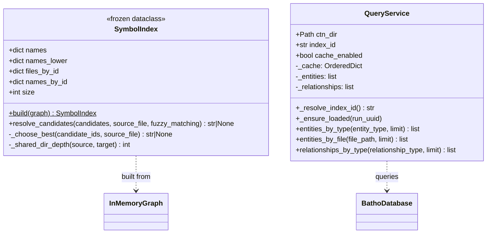
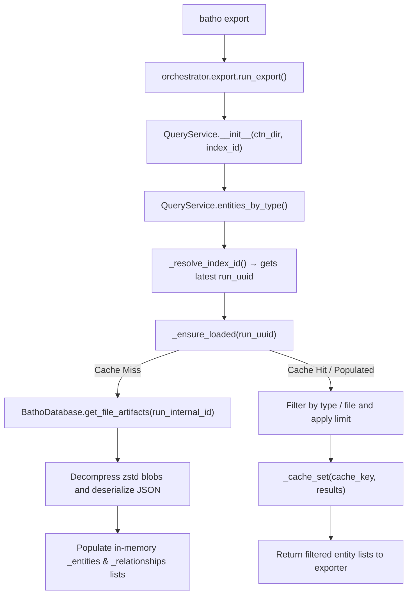

# Query Module

The Query module (`batho/modules/query/`) handles lookups, references, and semantic queries over the workspace code graph.

---

## File Reference Table

| Path | Purpose |
|:---|:---|
| `symbol_index.py` | Maps symbol names and aliases to tuples of entity IDs, enabling fast cross-file import resolution. |
| `engine/query.py` | Implements `QueryService`, a cached query interface over decompressed database artifacts. |

---

## Core Components

### 1. Symbol Index (`symbol_index.py`)
- **`SymbolIndex`**: A frozen lookup table mapping exact and lowercase names to tuples of sorted entity IDs.
- **Proximity Resolution**: Resolves target symbols using `_choose_best()`, scoring candidates based on:
  - Same-file residency (`+1000`)
  - Shared leading directory segments depth (`×10`)
  - Tiebreak preference for shorter fully-qualified names

### 2. Query Service (`engine/query.py`)
- **`QueryService`**: Primary interface utilized by `batho export` commands.
- Loads SQLite graph artifacts lazily on-demand, decompressing file blobs and caching results via an LRU-evicting cache (`OrderedDict`).
- Provides filtering methods: `entities_by_type()`, `entities_by_file()`, and `relationships_by_type()`.

---

## Mermaid Class Diagram

---

## Mermaid Call-Flow Flowchart

---

## Integration Points

- **Graph Module**: Uses `SymbolIndex` internally during `CodeGraphIndexer.build_graph()` to resolve outbound imports and bind override relationships.
- **Storage Module**: `QueryService` queries the SQLite registry (`BathoDatabase`) to read file artifact blobs.
