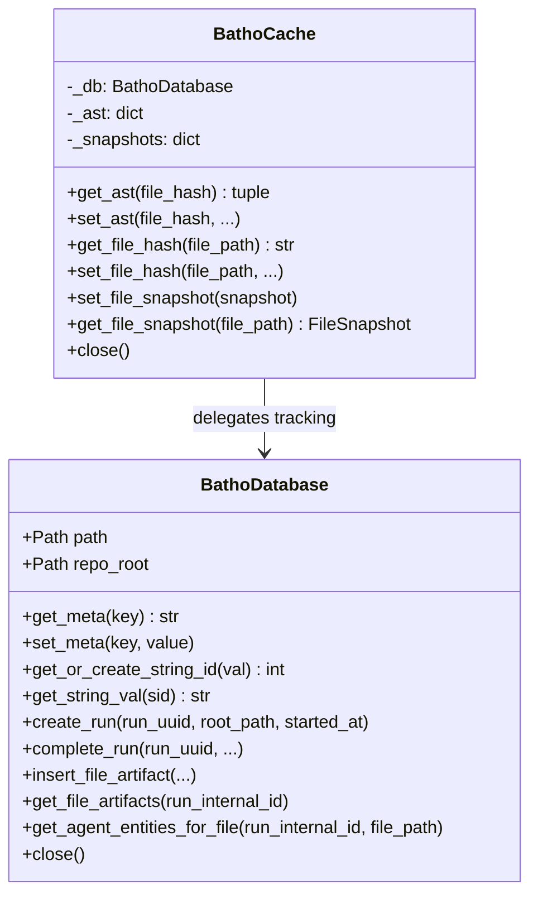
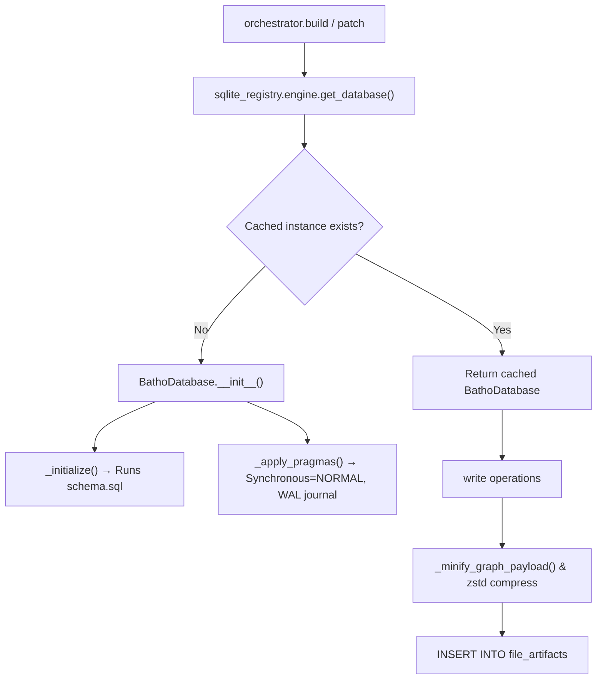

# Storage Module

The Storage module (`batho/modules/storage/`) manages persistence and caching layers for code entities, relationships, file snapshots, and index runs using a unified SQLite registry database.

---

## File Reference Table

| Path | Purpose |
|:---|:---|
| `cache/unified_cache.py` | Implementation of `BathoCache`, providing pure in-memory AST and snapshot caches, delegating file-hashing tracking to SQLite. |
| `cache/graph_cache.py` | Utilities to load merged code graph payloads from compressed SQLite database blobs. |
| `sqlite_registry/engine.py` | Core persistence engine driving SQLite connection pools, PRAGMA tuning, transaction contexts, and minification. |
| `sqlite_registry/schema.sql` | SQLite database schema defining tables (meta, string dictionary, runs, file artifacts, snapshots, etc.), triggers, and indices. |
| `sqlite_registry/storage.py` | Simple wrapper resolving the active database path relative to repository roots. |

---

## Core Components

### 1. Persistence Engine (`sqlite_registry/engine.py`)
- **`BathoDatabase`**: ACID-compliant SQLite coordinator applying custom pragmas for optimal speed:
  - Page size = 8192 bytes
  - Synchronous = NORMAL
  - Journal mode = WAL (Write-Ahead Logging)
  - Busy timeout = 5000ms
- **String Interning**: Uses a string dictionary (`string_dict` table) to deduplicate repetitive names (e.g. file paths, entity types) into integer IDs.
- **Minification**: Compresses entity and relationship keys (e.g. `start_line` → `sl`, `raw_content` → `rc`) before serialization and applies `zstd` compression prior to blob storage.

### 2. Caches (`cache/`)
- **`BathoCache`**: In-memory singleton caching parsed ASTs and `FileSnapshot` structures to eliminate repeated parsing overhead in multi-process workers. Delegates persistent tracking of file hashes to the SQLite `file_tracking` table.
- **Graph Cache (`graph_cache.py`)**: Utility functions (`load_graph_payload()`) to pull, decompress, and merge entities/relationships for an indexing run.

---

## Database Schema Highlights

The SQLite schema consists of the following key tables:
- `db_meta`: Stores key-value schema and indexing versions.
- `string_dict`: Interned strings mapping to auto-incrementing integer keys.
- `index_runs`: Metadata tracking build/patch execution outcomes.
- `file_artifacts`: Compressed zstd blobs storing files in different rendered view states (storage, agent, relationship).
- `run_artifacts`: Run-level JSON telemetry, context overviews, structural metrics, and security audits.
- `file_tracking`: Tracks workspace paths, mtime, size, and hashes to support change detection.
- `query_entities`, `query_relationships`: Relational indexes for fast search.
- `dangling_references`: Temporary edge storage during parsing.
- `file_changelog`, `file_changelog_fts`: Granular node diff history.

---

## Mermaid Class Diagram

---

## Mermaid Call-Flow Flowchart

---

## Integration Points

- **Extraction Module**: `process_file_worker` reads and writes the local `BathoCache` to skip parsing unchanged files.
- **Orchestrator Module**: `build.py` and `patch.py` open database transactions to store build runs and files snapshots, and `gc.py` executes delete commands to clean up old runs.
- **Query Module**: `QueryService` reads file artifacts out of the database to perform fast semantic queries.
