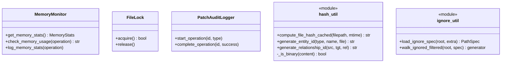

# Utilities Layer

The Utilities layer (`batho/utils/`) provides shared operations used across all layers of Batho, including logging, hashing, manifest parsing, memory monitoring, file locks, and path sanitization.

---

## File Reference Table

| Path | Purpose |
|:---|:---|
| `cli_output.py` | Quiet/JSON-aware stdout and stderr logging wrappers. |
| `dependencies.py` | Manifest dependency parsing (e.g. `requirements.txt`, `pyproject.toml`, `package.json`, `Cargo.toml`). |
| `encoding.py` | Multi-encoding fallbacks (`utf-8`, `ascii`, `latin-1`, `cp1252`). |
| `file_io.py` | Size-bounded file reading, binary file checks, and atomic file writes. |
| `file_lock.py` | Cross-platform thread-safe file locks using PID files. |
| `hash.py` | SHA-256 computations, Shannon entropy analysis, and deterministic entity/relationship ID generators. |
| `ignore.py` | Glob-matching path exclusion filters utilizing `.gitignore` and default patterns. |
| `logging.py` | Process-wide `structlog` configurations. |
| `memory_monitor.py` | Real-time memory (RSS/VMS) profiling and force garbage collection helpers. |
| `patch_errors.py` | Patch-specific exceptions and operation audit logging. |
| `path_sanitizer.py` | Path traversal preventers and safety validation filters. |

---

## Core Utilities

### 1. Hash & Binary Analyzers (`hash.py`)
- **`_is_binary`**: Multi-layered binary check examining magic byte headers, null-byte ratios (>1%), and Shannon entropy (>7.30 bits/byte).
- **`compute_file_hash_cached`**: LRU-cached SHA-256 calculator based on file paths and modification times (`mtime`).
- **Deterministic ID Generation**: `generate_entity_id()` and `generate_relationship_id()` calculate 16-char hashes based on content features.

### 2. Path Matching Filters (`ignore.py`)
- Loads `default-ignore-patterns.yaml` and `.gitignore` to compile standard matching specs (`PathSpec`).
- Excludes folders early during directory traversals (`walk_ignored_filtered`).

### 3. Memory Profile & GC (`memory_monitor.py`)
- Context manager (`memory_monitor`) to trace operations and force garbage collection if memory footprint expands by over 100MB.

### 4. Patch Exception & Auditing (`patch_errors.py`)
- Logs structural diagnostics during incremental patches via `PatchAuditLogger`.
- Exception types: `PatchValidationError`, `PatchConsistencyError`, `PatchSnapshotError`, `PatchFileError`, `PatchTimeoutError`.

---

## Mermaid Class Diagram

