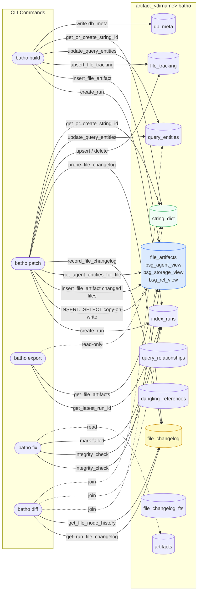

# Batho Artifact — `artifact_<dirname>.batho`

## What Is It?

Every Batho project has exactly **one artifact database** — a single SQLite file named:

```
artifact_<sanitized-dirname>.batho
```

For example, a project at `/path/to/my-project` produces `artifact_my-project.batho` in the project root.

This file is the **sole persistent output** of Batho. It replaces the old `.ctn/` directory of JSON files entirely. Every command reads from and writes to this single file.

---

## Location & Naming

| Rule | Detail |
|------|--------|
| **Location** | Always at `<repo-root>/artifact_<dirname>.batho` |
| **Naming** | Directory name lowercased, non-alphanumeric chars replaced with `-` |
| **One per project** | There is exactly one artifact per repo root |
| **Not committed** | Add `artifact_*.batho` to `.gitignore` |

The filename is computed by `artifact_filename(root)` in `batho/storage/engine.py`.

---

## Schema Version: `batho-db.v6`

The current schema is `batho-db.v6` (`SCHEMA_VERSION` constant in `batho/storage/engine.py`). It supersedes all earlier schemas. **No backward compatibility** — databases with a mismatched schema version are rejected at startup with a prompt to run `batho build`.

Key evolution:
- **v2** — introduced compressed blob storage replacing flat entity tables
- **v5** — adds `file_changelog` for granular file-level node evolution tracking, fixes `entity_id` to be FQN-deterministic (no line number in hash)
- **v6** — current; integrates query_relationships and dangling_references tables, supports FTS5 indexing on file_changelog

---

## Database Structure

The artifact is a WAL-mode SQLite database with **11 tables**:

```
artifact_<dirname>.batho
│
├── db_meta             — Schema version + runtime metadata
├── string_dict         — Global string deduplication table
├── index_runs          — Index run lifecycle log
├── file_artifacts      — Compressed graph + BSG blobs (one row per file per run)
├── file_tracking       — File change detection (hash + mtime + size)
├── artifacts           — Cloud sync registry
├── query_entities      — SQLite-index-first entity query cache (exact/prefix name search)
├── query_relationships — Relational edges between entities
├── dangling_references — Temporary storage for unresolved edges during parsing
├── file_changelog      — Node-level diff history across patch runs (grouped by file)
└── file_changelog_fts  — FTS5 virtual table for searching file_changelog
```

### SQLite Pragmas

```sql
PRAGMA journal_mode = WAL;        -- Concurrent read + write
PRAGMA synchronous = NORMAL;      -- Durability without fsync overhead
PRAGMA foreign_keys = ON;         -- Referential integrity enforced
PRAGMA auto_vacuum = INCREMENTAL; -- Reclaims space incrementally
PRAGMA page_size = 4096;          -- 4 KiB pages
PRAGMA busy_timeout = 5000;       -- 5 s wait on lock contention
```

---

## Table Reference

### `db_meta`
Stores key-value pairs for database-level metadata.

| Column | Type | Description |
|--------|------|-------------|
| `key` | TEXT PK | Metadata key (e.g. `schema_version`, `created_at`, `repo_root`) |
| `value` | TEXT | Metadata value |
| `updated_at` | TEXT | ISO-8601 timestamp |

Key entries written by `batho build`:

| Key | Example Value |
|-----|---------------|
| `schema_version` | `batho-db.v6` |
| `created_at` | `2026-05-24T01:02:00Z` |
| `repo_root` | `/Users/alice/project` |

---

### `string_dict`
Global dictionary encoding. All strings that repeat across rows (file paths, entity types, run UUIDs used as FK targets) are stored here once and referenced by integer ID. Reduces blob sizes and speeds up joins.

| Column | Type | Description |
|--------|------|-------------|
| `id` | INTEGER PK AUTOINCREMENT | Numeric ID |
| `val` | TEXT UNIQUE | The deduplicated string value |

Used for: file paths in `file_artifacts`, `file_tracking`, and `file_changelog`; root path in `index_runs`.

---

### `index_runs`
One row per `batho build` or `batho patch` invocation.

| Column | Type | Description |
|--------|------|-------------|
| `id` | INTEGER PK | Internal integer ID (used as FK in `file_artifacts`) |
| `run_uuid` | TEXT UNIQUE | Human-readable ID, e.g. `build_1779564746_934a68b7` |
| `schema_version` | TEXT | Always `batho-db.v6` |
| `status` | TEXT | `running` → `completed` or `failed` |
| `started_at` | TEXT | ISO-8601 |
| `completed_at` | TEXT | ISO-8601 (null until finished) |
| `git_commit` | TEXT | HEAD SHA at run time |
| `git_branch` | TEXT | Branch name at run time |
| `root_path_id` | INTEGER FK | → `string_dict.id` for repo root path |
| `entity_count` | INTEGER | Total entities in this run |
| `rel_count` | INTEGER | Total relationships in this run |
| `file_count` | INTEGER | Files with artifacts in this run |
| `duration_ms` | INTEGER | Wall-clock milliseconds |
| `error_message` | TEXT | Populated on `failed` runs |

---

### `file_artifacts`
**The core payload table.** One row per (run, file) pair. Each row holds **three** zstd-compressed blobs.

| Column | Type | Description |
|--------|------|-------------|
| `run_id` | INTEGER FK | → `index_runs.id` (CASCADE DELETE) |
| `file_id` | INTEGER FK | → `string_dict.id` for relative file path |
| `bsg_agent_view` | BLOB | zstd-compressed JSON: lightweight structural entity list for LLM agents |
| `bsg_storage_view` | BLOB | zstd-compressed JSON: delta payload with `raw_content`, `syntax_glue`, `raw_bytes`, byte offsets, parent/child hierarchy |
| `bsg_rel_view` | BLOB | zstd-compressed JSON: relationships array for this file |
| `content_hash` | TEXT | SHA-256 of file contents at index time |
| PK | `(run_id, file_id)` WITHOUT ROWID | One row per file per run |

#### Three-blob design

| Blob | Consumer | Contains |
|------|----------|----------|
| `bsg_agent_view` | `batho export --view agent`, diff engine | Entity `id`, `name`, `type`, `start_line`, `end_line`, `signature`, `content_hash` |
| `bsg_storage_view` | `batho export --view storage`, deep inspection | `raw_content`, `syntax_glue`, byte ranges, AST node types, metadata |
| `bsg_rel_view` | `batho export --view dependencies`, bridge queries | Relationships array with `source_id`, `target_id`, `type` |

#### Key design decisions

**JSON key minification** — before compression, the storage blob keys are compacted:

| Full key | Minified key |
|----------|-------------|
| `entity_type` | `ty` |
| `name` | `n` |
| `file` | `f` |
| `start_line` | `sl` |
| `end_line` | `el` |
| `entities` | `e` |
| `relationships` | `r` |
| `source_id` | `si` |
| `target_id` | `ti` |

**Blob-level copy-on-write** — `batho patch` copies all unchanged file rows from the previous run to the new run with a single `INSERT ... SELECT` query. Only changed file rows are re-parsed and re-inserted.

**`content_hash` in agent view** — `bsg_agent_view` entities include the per-entity `content_hash` field. The node diff engine (`batho diff`) uses this for O(1) fast-path comparison: if `content_hash` matches between runs, the entity is skipped without any field-level comparison.

---

### `file_tracking`
Lightweight change-detection table. One row per tracked file (cross-run, not per-run).

| Column | Type | Description |
|--------|------|-------------|
| `file_id` | INTEGER PK FK | → `string_dict.id` |
| `content_hash` | TEXT | SHA-256 of last-indexed content |
| `mtime` | REAL | `stat().st_mtime` at last index |
| `size` | INTEGER | File size in bytes |
| `is_indexed` | INTEGER | `1` = has graph entities; `0` = tracked but not parseable |
| `last_run_id` | TEXT | `run_uuid` of last indexing run |
| `updated_at` | TEXT | ISO-8601 |
| `encoding` | TEXT | Default encoding used to parse the file (e.g. `utf-8`) |

Used by `batho patch` native change detection to identify added, modified, and deleted files.

---

### `artifacts`
Cloud sync registry. Tracks all registered artifacts (context JSON files, BSG exports, etc.) for optional cloud sync.

| Column | Type | Description |
|--------|------|-------------|
| `artifact_id` | TEXT PK | SHA-256 of `type:path:checksum:schema` |
| `artifact_type` | TEXT | e.g. `context_json`, `graph_json` |
| `logical_path` | TEXT | Filename (e.g. `context_overview.json`) |
| `sync_status` | TEXT | `local_only`, `pending`, `synced`, `failed`, `conflict` |
| `checksum` | TEXT | SHA-256 of artifact content |
| `producer` | TEXT | Module that created this record |
| `run_id` | TEXT | Associated `run_uuid` |
| `deleted` | INTEGER | Soft-delete flag (`0`/`1`) |

---

### `query_entities`
Stores a flat query index for exact and prefix name matches to facilitate SQLite-index-first search and avoid complete in-memory graph traversals.

| Column | Type | Description |
|--------|------|-------------|
| `entity_id` | TEXT | FQN-deterministic 16-char hash of `entity_type:name:file` — **no line number** |
| `run_id` | INTEGER FK | → `index_runs.id` (CASCADE DELETE) |
| `entity_name` | TEXT | Exact symbol/identifier name |
| `entity_type` | TEXT | Type of the entity (e.g. `FUNCTION`, `CLASS`) |
| `fqn` | TEXT | Fully qualified name segment (computed during indexing) |
| `file_path` | TEXT | Source file path |
| `line_number` | INTEGER | 1-based start line number (for display only — not part of ID) |
| `signature` | TEXT | Optional signature string |
| `is_exported` | INTEGER | `1` = exported (public symbol, name not starting with `_`); `0` = private |
| PK | `(entity_id, run_id)` WITHOUT ROWID | Scoped per run snapshot |

> **Entity ID stability** — `entity_id` is computed as `SHA256(entity_type:name:file)[:16]` by `generate_entity_id()` in `batho/utils/hash.py`. It is **position-independent**: moving a function to a different line does not change its ID, preventing false-positive `removed+added` churn in `file_changelog`.

---

### `query_relationships`
Stores relational edges between entities for the current index run snapshot to facilitate relationship queries.

| Column | Type | Description |
|--------|------|-------------|
| `source_id` | TEXT | Source entity ID |
| `target_id` | TEXT | Target entity ID |
| `relation_type` | TEXT | Relationship category (e.g. `CALLS`, `INHERITS`) |
| `run_id` | INTEGER FK | → `index_runs.id` (CASCADE DELETE) |
| `metadata_json` | TEXT | JSON metadata payload (e.g. call line, parameters) |
| PK | `(source_id, target_id, relation_type, run_id)` WITHOUT ROWID | Scoped per run snapshot |

---

### `dangling_references`
Temporary storage for unresolved edges during parsing (resolved dynamically at the end of runs).

| Column | Type | Description |
|--------|------|-------------|
| `source_id` | TEXT | Source entity ID |
| `unresolved_target_name` | TEXT | Name of target symbol to resolve |
| `relation_type` | TEXT | Relationship type |
| `run_id` | INTEGER FK | → `index_runs.id` (CASCADE DELETE) |

---

### `file_changelog`
Granular node-level diff history grouped by file. One row per (run, file) pair that changed in that patch run. Populated by `batho patch`; queried by `batho diff`.

| Column | Type | Description |
|--------|------|-------------|
| `id` | INTEGER PK | Auto-incrementing primary key |
| `run_id` | INTEGER FK | → `index_runs.id` (CASCADE DELETE) — the patch run that produced this diff |
| `base_run_id` | INTEGER FK | → `index_runs.id` (CASCADE DELETE) — the prior run this was diffed against |
| `file_id` | INTEGER FK | → `string_dict.id` — normalized relative file path |
| `entity_index` | TEXT | Space-separated list of changed entity IDs for FTS5 indexing |
| `node_changes` | BLOB | zstd-compressed JSON array of NodeDiff objects |

#### Storage design

- **File-level Grouping** — Unlike the old node-by-node table, changes are grouped by file and compressed together in `node_changes`, which significantly reduces database rows and improves compression ratios.
- **FTS5 Indexing** — The `entity_index` column lists all changed entity IDs as a plain text string. The companion virtual table `file_changelog_fts` queries this column to enable O(1) searches for an entity's complete history.
- **Retention** — after each `batho patch`, `prune_file_changelog(max_runs=N)` deletes entries older than the N most recent completed runs (default: 100). Configurable via `indexer.file_changelog_max_runs` in `batho.yaml`.

---

### `file_changelog_fts`
FTS5 external content table. Provides inverted index search over `file_changelog.entity_index` without duplicating the actual text on disk. Sync triggers keep the FTS index in sync automatically.

| Column | Type | Description |
|--------|------|-------------|
| `entity_index` | TEXT | Tokenized list of entity IDs associated with each changelog entry |

---

## Command Interactions



---

### `batho build`

**Creates the artifact from scratch.**

```
batho build --root .
```

1. Detects schema mismatch → rejects with prompt to rebuild if version differs
2. If DB exists without `--full`: exits early with suggestion to use `batho patch`
3. If `--full`: deletes existing DB
4. Creates `BathoDatabase` → applies schema from `schema.sql` → writes `db_meta`
5. Calls `create_run()` → `index_runs` row with `status=running`
6. Parses all source files → code graph built in memory (parallel AST workers)
7. Groups entities/relationships by file → calls `insert_file_artifact()` per file:
   - Builds `bsg_agent_view`, `bsg_storage_view`, `bsg_rel_view` dicts
   - zstd-compresses each blob (level 3)
   - Inserts one row into `file_artifacts` per file
8. Calls `update_query_entities()` → populates `query_entities` for fast name search
9. Calls `upsert_file_tracking()` for all indexed files
10. Calls `complete_run()` → sets `status=completed`, entity/rel/file counts, duration

**Writes to:** `index_runs`, `file_artifacts`, `file_tracking`, `query_entities`, `string_dict`, `db_meta`, `artifacts`

---

### `batho patch`

**Incrementally updates the artifact for changed files only.**

```
batho patch --root .
```

1. Verifies DB exists and schema version matches
2. Calls `get_latest_run_id()` → finds the last completed run (`base_run`)
3. Detects changed files natively using content hashing against the `file_tracking` table
4. If no changes: exits `0` immediately
5. Calls `create_run()` → new `index_runs` row
6. **Blob copy-on-write:** copies all `file_artifacts` rows from `base_run` to new run excluding changed file IDs — single SQL `INSERT ... SELECT`
7. For each added/modified file:
   a. Re-parses → builds `bsg_agent_view`, `bsg_storage_view`, `bsg_rel_view`
   b. Calls `get_agent_entities_for_file(base_run_id, file)` → fetches old entities from `bsg_agent_view` blob
   c. Calls `diff_file_nodes(old_entities, new_entities, file)` → produces `list[NodeDiff]`
   d. Calls `record_file_changelog(run_id, base_run_id, diffs)` → writes to `file_changelog`
   e. Calls `insert_file_artifact()` → writes new compressed blobs
8. For each deleted file: emits `removed` diffs for all its base-run entities
9. Updates `file_tracking`: deletes removed files, upserts added/modified
10. Calls `complete_run()`
11. Calls `prune_file_changelog(max_runs=N)` → trims old changelog entries

**Writes to:** `index_runs`, `file_artifacts` (copy + new rows), `file_tracking`, `query_entities`, `string_dict`, `file_changelog`

**Never touches:** unchanged files' blobs — referenced by copy-on-write

**Output:**
```
Patched /path/to/repo: 3 changes (1 added, 2 modified, 0 deleted) in 412ms
  Nodes: 5 added, 2 removed, 8 modified, 1 renamed
```

---

### `batho fix`

**Repairs integrity issues in the artifact.**

```
batho fix [--root .] [--dry-run] [--deep]
```

Runs a suite of integrity checks against the live database:

| Check | What It Verifies |
|-------|------------------|
| `DatabaseIntegrityCheck` | SQLite `PRAGMA integrity_check` result |
| `RegistryIntegrityCheck` | `artifacts` table — no orphaned/duplicate `artifact_id` |
| `IndexIntegrityCheck` | `index_runs` consistency — no stuck `running` runs |
| `BSGIntegrityCheck` | BSG blob checksums (if present) |
| `ViewIntegrityCheck` | View configuration consistency |

**Reads from:** all tables  
**Writes to:** `index_runs` (marks stuck runs as `failed`), `artifacts` (deduplication)

---

### `batho export`

**Exports BSG data from the artifact as JSON.**

```
batho export [--root .] [--view agent|storage|overview|files|symbols|dependencies|delta]
```

1. Locates `artifact_<dirname>.batho`
2. Calls `get_latest_run_id()`
3. Loads `file_artifacts` rows for that run → decompresses the relevant blob per file
4. Applies view filters, glob patterns, category filters
5. Serializes to JSON (streaming for large repos)

| View | Blob Used |
|------|-----------|
| `agent` | `bsg_agent_view` |
| `storage` | `bsg_storage_view` |
| `dependencies` | `bsg_rel_view` |
| `overview`, `files`, `symbols` | `bsg_agent_view` |
| `delta` | `bsg_agent_view` (current + baseline) |

**Reads from:** `index_runs`, `file_artifacts`, `string_dict`  
**Writes to:** nothing (read-only operation)

---

### `batho diff`

**Queries node-level change history from `file_changelog`.**

```
batho diff --run <run_id>
batho diff --entity <entity_id>
batho diff --file <rel_path>
```

1. Opens the artifact database (read-only)
2. Issues a JOIN query across `file_changelog`, `string_dict`, `index_runs`, and `query_entities`
3. Decompresses `node_changes` blobs in Python
4. Prints formatted diff or JSON

**Reads from:** `file_changelog`, `string_dict`, `index_runs`, `query_entities`  
**Writes to:** nothing (read-only operation)

---

## Sizing

With zstd compression + three-blob split + string_dict normalization, typical sizes are:

| Repo Size | Uncompressed JSON | Artifact Size | Reduction |
|-----------|-----------------|---------------|----------|
| Small (50 files) | ~8 MB | ~150 KB | ~98% |
| Medium (250 files) | ~40 MB | ~1 MB | ~97% |
| Large (1000 files) | ~160 MB | ~5 MB | ~97% |

`file_changelog` adds negligible overhead for typical patch runs (< 1% of total artifact size with the default 100-run retention window).

---

## Schema Version Guard

On every `BathoDatabase.__init__`, the engine reads `db_meta.schema_version` and compares it to `SCHEMA_VERSION` (`batho-db.v6`). On mismatch the database is **rejected immediately** with a human-readable error:

```
Schema version mismatch: database is 'batho-db.v5', engine expects 'batho-db.v6'.
Please run: batho build --root . --full
```

No auto-migration is performed. This is intentional: entity IDs are computed differently across versions (v5 removes line number from the hash), so a silent migration would produce corrupt `file_changelog` entries.

---

## Indexes

| Index | Table | Purpose |
|-------|-------|---------|
| `idx_runs_latest` | `index_runs` | Fast `get_latest_run_id()` — filters `status=completed` |
| `idx_file_artifacts_run` | `file_artifacts` | Fast load of all blobs for a run |
| `idx_file_tracking_hash` | `file_tracking` | Hash lookup during change detection |
| `idx_file_tracking_unindexed` | `file_tracking` | Fast enumeration of non-parseable files |
| `idx_artifacts_sync_pending` | `artifacts` | Cloud sync queue scan |
| `idx_entities_name` | `query_entities` | Fast exact-match lookup of entity names |
| `idx_entities_name_prefix` | `query_entities` | Fast case-insensitive prefix search (COLLATE NOCASE) |
| `idx_entities_type` | `query_entities` | Filter by entity types (FUNCTION, CLASS, etc.) |
| `idx_entities_fqn` | `query_entities` | Fast search on FQN patterns |
| `idx_entities_run` | `query_entities` | Fast scoping of entities to specific snapshots/runs |
| `idx_relationships_source` | `query_relationships` | Fast lookup of outgoing relations |
| `idx_relationships_target` | `query_relationships` | Fast lookup of incoming relations |
| `idx_dangling_run_name` | `dangling_references` | Fast target resolution lookup |
| `idx_file_changelog_file` | `file_changelog` | Fast file-scoped changelog queries (`batho diff --file`) |

---

## API Quick Reference

```python
from batho.storage.engine import get_database, artifact_filename
from pathlib import Path

root = Path("/path/to/project")
db = get_database(root)

# Run lifecycle
run_internal_id = db.create_run("build_001", root_path=str(root))
db.complete_run("build_001", entity_count=500, rel_count=300, file_count=40, duration_ms=1200)

# Store a file's three compressed blobs
db.insert_file_artifact(
    run_internal_id, "src/main.py", "sha256...",
    agent_view_dict,    # bsg_agent_view
    storage_delta_dict, # bsg_storage_view
    relationships_list, # bsg_rel_view
)

# Load all blobs for a run (decompresses all three)
artifacts = db.get_file_artifacts(run_internal_id)
# → [{"file_path": "src/main.py", "content_hash": "...",
#     "agent": {...}, "storage": {...}, "relationships": [...]}, ...]

# Fetch only bsg_agent_view for one file (fast, used by diff engine)
entities = db.get_agent_entities_for_file(run_internal_id, "src/main.py")
# → [{"id": "abc123", "name": "my_func", "type": "FUNCTION",
#     "start_line": 10, "content_hash": "deadbeef", ...}, ...]

# Node changelog
from batho.context.node_diff import diff_file_nodes
diffs = diff_file_nodes(old_entities, new_entities, "src/main.py")
db.record_file_changelog(run_internal_id, base_run_internal_id, diffs)

# Query node history for an entity
history = db.get_file_node_history("abc123", limit=50)
# → [{"run_uuid": "patch_...", "change_kind": "modified",
#     "changed_fields": {"signature": ["(a)", "(a, b)"]}, ...}, ...]

# Query all node changes in a run
changelog = db.get_run_file_changelog("patch_1748000001_abc")

# File tracking
db.upsert_file_tracking([{"file_path": "src/main.py", "content_hash": "...", ...}])
hashes = db.get_all_file_hashes()  # → {"src/main.py": "sha256..."}

# String dictionary
sid = db.get_or_create_string_id("src/main.py")
val = db.get_string_val(sid)

# Retention
db.prune_file_changelog(max_runs=100)
```
