# `batho build` — Full Index Build

## Overview

`batho build` performs a **complete, from-scratch index** of a repository. It creates an `artifact_<dirname>.batho` SQLite database containing the full code graph, BSG map, context outputs, baseline snapshot, and file tracking records.

Run this once on a new repository. For subsequent updates, use [`batho patch`](./cmd-patch.md).

---

## Synopsis

```
batho build [--root PATH] [--full] [--verbose]
            [--max-workers N] [--max-file-size-kb N]
```

---

## Flags & Options

| Flag | Type | Default | Description |
|------|------|---------|-------------|
| `--root` | `Path` | `.` (cwd) | Repository root directory to index |
| `--full` | flag | `false` | Force full rebuild — deletes the existing database before rebuilding |
| `--verbose` | flag | `false` | Enable verbose debug logging throughout the pipeline |
| `--max-workers` | `int` | CPU count | Maximum parallel workers for the AST parsing phase |
| `--max-file-size-kb` | `int` | `500` (from config) | Skip files exceeding this size in kilobytes |

> **Note:** Without `--full`, if a database already exists at `<root>/artifact_<dirname>.batho`, the command exits immediately and suggests using `batho patch` or `batho build --full`.

---

## Execution Flow

```mermaid
flowchart TD
    START([batho build invoked]):::success

    subgraph VALIDATION["Phase 1: Guard & Setup"]
        CHECK_DB{artifact_*.batho\nexists?}
        FORCE_FULL{--full flag\nset?}
        EXIT_ALREADY["Exit 0: Already built.\nUse batho patch or --full"]:::success
        DELETE_DB[Delete existing database]
        LOAD_CFG[Load batho.yaml config\nindexer + bsg sections]
        INIT_DB[Initialize BathoDatabase\nCreate run_id: build_<ts>_<uuid>]
    end

    subgraph INDEXING["Phase 2: Code Graph Indexing"]
        BUILD_GRAPH[CodeGraphIndexer.build_graph\nAST parse all files in parallel]
        CHECK_ENTITIES{entity_count == 0?}
        EXIT_NO_ENTITIES["Exit 1: No indexable files found"]:::error
        PERSIST_GRAPH[Insert entities + relationships\ninto graph_entities / graph_relationships]
    end

    subgraph BSG["Phase 3: BSG Map"]
        APPLY_RULES[Apply BSG plugin rules\nbatho.yaml rules section]
        LOAD_OPAQUE[Load opaque snapshots\nfor unindexed files]
        BUILD_BSG[BSGMap.build from graph\n+ opaque snapshots]
        PERSIST_BSG[Insert bsg_entries per file\nview_type = agent]
    end

    subgraph CONTEXT["Phase 4: Context Outputs"]
        BUILD_OVERVIEW[Build overview JSON\nentity types + file distribution]
        BUILD_FILES[Build files JSON\nby extension + category]
        PERSIST_CONTEXT[set_context_output\noverview + files]
    end

    subgraph SNAPSHOT["Phase 5: Baseline Snapshot"]
        CREATE_SNAP[create_snapshot\nlabel = baseline]
    end

    subgraph TRACKING["Phase 6: File Tracking"]
        BUILD_TRACKING[Build file_tracking records\ncontent_hash + mtime + size]
        PERSIST_TRACKING[upsert_file_tracking]
    end

    COMPLETE[complete_run\nentity_count + rel_count + file_count + duration_ms]
    SUCCESS(["Exit 0: Built root\nN entities, R relationships\nF files in Tms"]):::success

    START --> CHECK_DB
    CHECK_DB -->|Yes| FORCE_FULL
    CHECK_DB -->|No| LOAD_CFG
    FORCE_FULL -->|No| EXIT_ALREADY
    FORCE_FULL -->|Yes| DELETE_DB
    DELETE_DB --> LOAD_CFG
    LOAD_CFG --> INIT_DB
    INIT_DB --> BUILD_GRAPH
    BUILD_GRAPH --> CHECK_ENTITIES
    CHECK_ENTITIES -->|Yes| EXIT_NO_ENTITIES
    CHECK_ENTITIES -->|No| PERSIST_GRAPH
    PERSIST_GRAPH --> APPLY_RULES
    APPLY_RULES --> LOAD_OPAQUE
    LOAD_OPAQUE --> BUILD_BSG
    BUILD_BSG --> PERSIST_BSG
    PERSIST_BSG --> BUILD_OVERVIEW
    BUILD_OVERVIEW --> BUILD_FILES
    BUILD_FILES --> PERSIST_CONTEXT
    PERSIST_CONTEXT --> CREATE_SNAP
    CREATE_SNAP --> BUILD_TRACKING
    BUILD_TRACKING --> PERSIST_TRACKING
    PERSIST_TRACKING --> COMPLETE
    COMPLETE --> SUCCESS

    classDef error fill:#fca5a5,stroke:#dc2626,color:#7f1d1d
    classDef success fill:#bbf7d0,stroke:#16a34a,color:#14532d
```



---

## Output

### Success

```
Built /path/to/repo: 1423 entities, 892 relationships, 87 files in 3241ms
```

### Already Built (no `--full`)

```
Database already exists at /path/to/repo/artifact_repo.batho.
To update incrementally, run: batho patch --root /path/to/repo
To force a full rebuild, run: batho build --root /path/to/repo --full
```

### Exit Codes

| Code | Meaning |
|------|---------|
| `0` | Success (including "already built" early-exit) |
| `1` | Build failed (no indexable files, or fatal error) |

---

## Error Cases

| Error | Cause | Resolution |
|-------|-------|-----------|
| `No indexable files found` | Root has no parseable source files | Verify `--root` path; check `.batho-ignore` / `default-ignore-patterns.yaml` |
| `Database already exists` | DB present without `--full` | Use `batho patch` or add `--full` |
| Config load warnings | `batho.yaml` missing or malformed | Run from repo root or verify config format |

---

## Examples

```bash
# Initial build of the current directory
batho build

# Build a specific repository
batho build --root /path/to/project

# Force full rebuild (deletes + recreates the database)
batho build --root /path/to/project --full

# Limit parallelism and skip large generated files
batho build --max-workers 4 --max-file-size-kb 200

# Verbose debug output
batho build --verbose
```
