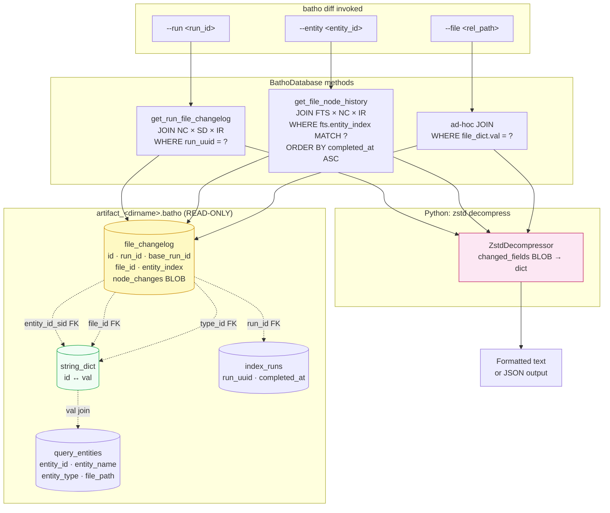
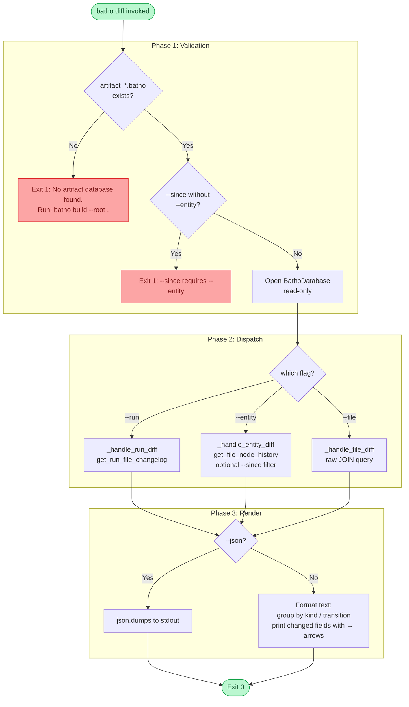

# `batho diff` — Node Evolution Query

## Overview

`batho diff` queries the **`file_changelog` table** in the artifact database to inspect how individual BSG nodes (functions, classes, variables) have changed across `batho patch` runs.

Every `batho patch` automatically records node-level diffs — what fields changed, which nodes were added/removed/renamed, and the content hash snapshots before and after. `batho diff` makes that history queryable from the CLI.

---

## Synopsis

```
batho diff --run <run_id> [--json] [--root PATH]
batho diff --entity <entity_id> [--since <run_id>] [--json] [--root PATH]
batho diff --file <relative_path> [--json] [--root PATH]
```

---

## Flags & Options

| Flag | Type | Default | Description |
|------|------|---------|-------------|
| `--run` | `str` | — | Show all node changes recorded in a specific patch run ID |
| `--entity` | `str` | — | Show full evolution history of one entity (by entity ID or name) |
| `--file` | `str` | — | Show all node changes in a file across all patch runs |
| `--since` | `str` | — | Bound history start to a specific run ID (only with `--entity`) |
| `--json` | flag | `false` | Machine-readable JSON output instead of human-readable text |
| `--root` | `Path` | `.` (cwd) | Repository root containing the `.batho` database |

> `--run`, `--entity`, and `--file` are mutually exclusive.

---

## How It Works: Blob Interaction

`batho diff` is a **read-only** command. It issues JOIN queries across `file_changelog`, `string_dict`, `index_runs`, and `query_entities`, then decompresses the `changed_fields` blobs in Python.



### Key JOIN pattern

All three queries resolve the integer `string_dict` IDs back to human-readable strings before joining `query_entities` (which stores the text entity ID). This is critical because `entity_id_sid` is an `INTEGER` FK while `query_entities.entity_id` is `TEXT`:

```sql
-- Correct: resolve string_dict first, then join query_entities
LEFT JOIN query_entities qe ON entity_dict.val = qe.entity_id
                             AND nc.run_id = qe.run_id

-- Wrong (type mismatch — never used in Batho):
-- LEFT JOIN query_entities qe ON nc.entity_id_sid = qe.entity_id
```

---

## Execution Flow



---

## Output

### `--run <run_id>` (text)

```
Run: patch_1748000001_abc  (base: build_1747900000_xyz)

Added nodes:
  - [FUNCTION] new_handler in batho/cli/diff.py (ID: a1b2c3d4e5f6a7b8)

Modified nodes:
  - [FUNCTION] run_patch in batho/orchestrator/patch.py (ID: 9f8e7d6c5b4a3f2e)
    signature     (self, opts: PatchOptions) → (self, opts: PatchOptions, *, db: BathoDatabase | None)
    end_line      412 → 418

Renamed nodes:
  - [FUNCTION] handle_diff in batho/cli/diff.py (ID: ff00aa11bb22cc33, old ID: 112233445566aabb)
```

### `--entity <entity_id>` (text)

```
Entity: run_patch  [FUNCTION]  batho/orchestrator/patch.py

  patch_1747900001_aaa  →  patch_1748000001_abc
    signature     (self, opts) → (self, opts: PatchOptions)
    end_line      380 → 412

  patch_1748000001_abc  →  patch_1748086401_def
    start_line    380 → 385
    end_line      412 → 417
```

### `--file <rel_path>` (text)

```
File: batho/orchestrator/patch.py

  build_1747900000_xyz  →  patch_1748000001_abc
    [modified] run_patch [FUNCTION] (ID: 9f8e7d6c5b4a3f2e)
      signature  (self, opts) → (self, opts: PatchOptions)
    [added] _detect_changes [FUNCTION] (ID: aabbccdd11223344)

  patch_1748000001_abc  →  patch_1748086401_def
    [modified] run_patch [FUNCTION] (ID: 9f8e7d6c5b4a3f2e)
      start_line 380 → 385
```

### `--json` output

All three modes support `--json` for machine-readable output. Structure:

```json
[
  {
    "run_uuid": "patch_1748000001_abc",
    "base_run_uuid": "build_1747900000_xyz",
    "entity_id": "9f8e7d6c5b4a3f2e",
    "entity_name": "run_patch",
    "entity_type": "FUNCTION",
    "file_path": "batho/orchestrator/patch.py",
    "change_kind": "modified",
    "changed_fields": {
      "signature": ["(self, opts)", "(self, opts: PatchOptions)"],
      "end_line": [380, 412]
    },
    "old_hash": "deadbeef",
    "new_hash": "cafecafe"
  }
]
```

### Exit Codes

| Code | Meaning |
|------|---------|
| `0` | Query succeeded (even if no results found) |
| `1` | No database found, or invalid argument combination |

---

## Change Kinds

| `change_kind` | Integer stored | Meaning |
|---------------|----------------|---------|
| `added` | `1` | Entity exists in new run, not in base run |
| `removed` | `2` | Entity exists in base run, not in new run |
| `modified` | `3` | Entity exists in both; one or more tracked fields differ |
| `renamed` | `4` | Entity body is identical (same `content_hash`) but ID changed (e.g. moved to different file or name changed) |

### Tracked fields

Only these fields are compared during diffing (see `TRACKED_FIELDS` in `batho/context/node_diff.py`):

| Field | Description |
|-------|-------------|
| `signature` | Function/class signature string |
| `start_line` | First line of the entity body |
| `end_line` | Last line of the entity body |
| `entity_type` | Entity kind (e.g. `FUNCTION` → `CLASS`) |

> `content_hash` is used as the **fast-path skip**: if both old and new entities have the same `content_hash`, the deep field comparison is skipped entirely (O(1) per unchanged node).

---

## Entity ID Stability

Entity IDs are computed as `SHA256(entity_type:name:file)[:16]` — **no line number is included**. This means:

- Shifting a function to a different line does **not** change its ID
- Only renaming a function, moving it to a different file, or changing its entity type produces a new ID
- Adding a blank line above a class does **not** create a false `removed+added` pair

This is enforced by `generate_entity_id()` in `batho/utils/hash.py`.

---

## Error Cases

| Error | Cause | Resolution |
|-------|-------|-----------|
| `No artifact database found` | `batho build` not yet run | Run `batho build --root <path>` first |
| `Run '<id>' not found` | Run UUID doesn't exist in `index_runs` | Use `batho diff --run` with a valid run UUID from `batho export` |
| `No history found for entity <id>` | Entity has never been modified in a patch run | The entity may only exist in the build run (no changes recorded yet) |
| `No node changes found for file <path>` | File exists but no patch has changed any nodes in it | Expected for stable files |
| `--since requires --entity` | `--since` used without `--entity` | Combine with `--entity` |

---

## Examples

```bash
# Show all node changes in the latest patch run
batho diff --run patch_1748000001_abc

# Machine-readable JSON for CI integration
batho diff --run patch_1748000001_abc --json

# Full evolution history of one function
batho diff --entity 9f8e7d6c5b4a3f2e

# Evolution history since a specific run
batho diff --entity 9f8e7d6c5b4a3f2e --since patch_1748000001_abc

# All node changes in a file across all runs
batho diff --file batho/orchestrator/patch.py

# Check what changed in a specific module, JSON output
batho diff --file batho/storage/engine.py --json

# Point at a non-default root
batho diff --run patch_abc --root /path/to/project
```

---

## See Also

- [`batho patch`](./cmd-patch.md) — the command that writes to `file_changelog`
- [`artifact.md`](./artifact.md) — full `file_changelog` table schema and storage design
