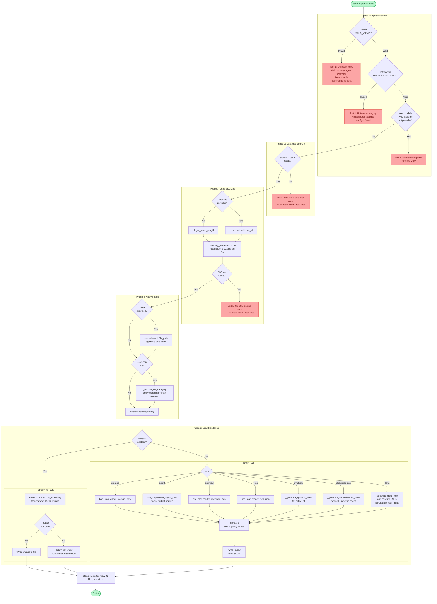

# `batho export` — BSG Artifact Export

## Overview

`batho export` reads the latest BSG artifact from the `artifact_<dirname>.batho` database and serializes it into one of **seven JSON views**. Views range from full-fidelity storage format to LLM-optimized agent payloads, flat symbol indexes, dependency graphs, and incremental deltas.

Supports optional glob and category filtering, compact or pretty-printed output, a streaming mode for large repositories, and a token budget for the `agent` view.

---

## Synopsis

```
batho export [--root PATH] [--view VIEW] [--output PATH]
             [--index-id ID] [--filter GLOB] [--format json|pretty]
             [--category source|test|doc|config|infra|all]
             [--stream] [--token-budget N] [--baseline PATH]
```

---

## Flags & Options

| Flag | Type | Default | Description |
|------|------|---------|-------------|
| `--root` | `Path` | `.` (cwd) | Repository root containing the `.batho` database |
| `--view` | `enum` | `storage` | JSON view to export (see View Reference below) |
| `--output` | `Path` | stdout | Write JSON output to file instead of stdout |
| `--index-id` | `str` | latest | Specific run ID to export; defaults to the latest completed run |
| `--filter` | `GLOB` | none | Glob pattern to include only matching file paths (e.g. `src/**/*.py`) |
| `--format` | `json\|pretty` | `json` | Compact JSON or indented pretty-print |
| `--category` | `enum` | `all` | Filter by file category (see Category Reference below) |
| `--stream` | flag | `false` | Streaming mode — memory-efficient for large repositories |
| `--token-budget` | `int` | no limit | Maximum token budget for `agent` view output |
| `--baseline` | `Path` | — | Path to a previous export JSON; **required** for `--view delta` |

### View Reference

| View | Description |
|------|-------------|
| `storage` | Full-fidelity serialization of all BSG entities with all fields |
| `agent` | LLM-optimized payload; respects `--token-budget`; trims low-signal entities |
| `overview` | High-level statistics: entity counts, type distribution, file distribution |
| `files` | File-centric map grouped by extension and category |
| `symbols` | Flat symbol index: name, type, file, line, signature for every entity |
| `dependencies` | Dependency graph with forward + reverse edges per file |
| `delta` | Diff vs a `--baseline` export JSON: added, modified, removed, unchanged |

### Category Reference

| Category | Heuristic |
|----------|-----------|
| `source` | Default for files not matching other categories |
| `test` | Path contains `test` |
| `doc` | Path contains `doc` or ends in `.md`, `.rst`, `.txt` |
| `config` | Ends in `.yaml`, `.yml`, `.toml`, `.json`, `.ini`, `.cfg`, `.env` |
| `infra` | Ends in `.dockerfile`, `.tf`, `.hcl`, `.sh`, `.bash` |
| `all` | No category filtering applied (default) |

---

## Execution Flow



---

## Output

### Success (stderr summary — does not pollute stdout JSON)

```
Exported [agent]: 87 files, 1423 entities → output.json
```

### stdout (compact JSON, no `--output`)

```json
{"view_type":"agent","generated_at":"2024-05-23T17:00:00Z","files":[...]}
```

### Exit Codes

| Code | Meaning |
|------|---------|
| `0` | Export succeeded |
| `1` | Validation failure, no DB, no BSG data, or write error |

---

## Error Cases

| Error | Cause | Resolution |
|-------|-------|-----------|
| `Unknown view` | Invalid `--view` value | Use one of: `storage agent overview files symbols dependencies delta` |
| `Unknown category` | Invalid `--category` value | Use one of: `source test doc config infra all` |
| `--baseline is required for the delta view` | `delta` view without `--baseline` | Provide path to a previous export JSON |
| `No artifact database found` | `batho build` not yet run | Run `batho build --root <path>` |
| `No BSG entries found` | DB exists but has no BSG data | Run `batho build --root <path> --full` |
| `Cannot load baseline from <path>` | Baseline file missing or invalid JSON | Provide a valid export JSON from a previous `batho export` run |
| `Streaming error` | `BSGExporter` failed to initialize | Check DB integrity with `batho fix` |

---

## Examples

```bash
# Export full storage view to stdout
batho export

# Export LLM-optimized agent view to file
batho export --view agent --output context.json

# Export with token budget for agent view (e.g. 32k tokens)
batho export --view agent --token-budget 32000 --output context.json

# Pretty-printed overview stats
batho export --view overview --format pretty

# Flat symbol index for all Python source files
batho export --view symbols --filter "**/*.py" --category source

# Dependency graph for the entire repo
batho export --view dependencies --output deps.json

# Delta diff against a previous export
batho export --view delta --baseline previous-export.json --output delta.json

# Stream a large repo agent view (memory-efficient)
batho export --view agent --stream --output context.json

# Export a specific historical run
batho export --view storage --index-id build_1716499100_abc12345

# Export only test files as a JSON report
batho export --view files --category test --format pretty
```
