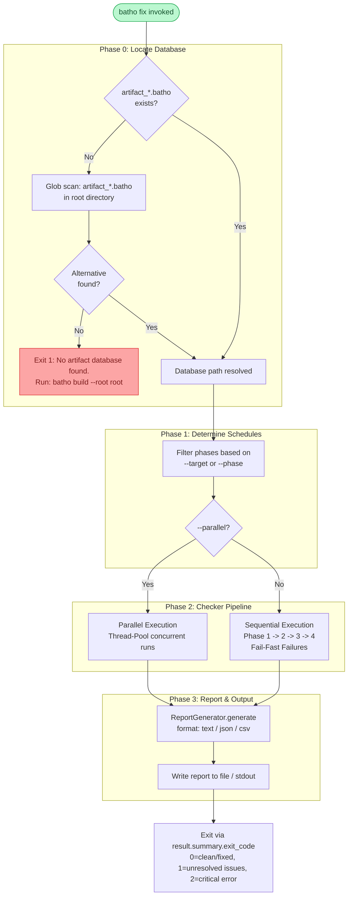

# `batho fix` — Integrity Verification & Repair

## Overview

`batho fix` performs **comprehensive, multi-stage integrity checking and automatic repair** of the Batho artifact database (schema v2.0). The command replaces legacy side-file validation with direct database blob verification on zstd-compressed payloads.

Checks are partitioned into four distinct phases:
1. **SQLite Health Checker** (Phase 1 / `db`): PRAGMA health checks and schema version validation.
2. **State Consistency Checker** (Phase 2 / `state`): Relational and status validation (stuck runs, orphaned dictionary entries).
3. **Blob Integrity Checker** (Phase 3 / `blobs`): Decompressing and validating zstd/orjson payloads.
4. **Graph Sync Checker** (Phase 4 / `graph`): Validating relational entities, dangling reference resolution, and relationship sync.

---

## Synopsis

```bash
batho fix [--root PATH] [--deep] [--dry-run] [--target db|state|blobs|graph|all]
          [--phase 1|2|3|4] [--parallel] [--format text|json|csv] [--output PATH]
```

---

## Flags & Options

| Flag | Type | Default | Description |
|------|------|---------|-------------|
| `--root` | `Path` | `.` (cwd) | Repository root containing the `.batho` database |
| `--deep` | flag | `false` | Full data verification (slower, decompresses and validates all zstd JSON blobs) |
| `--dry-run` | flag | `false` | Check only — report issues without performing any repairs |
| `--target` | `db\|state\|blobs\|graph\|all` | `all` | Target specific check/repair components |
| `--phase` | `1\|2\|3\|4` | — | Run a specific phase (1-4) |
| `--parallel` | flag | `false` | Run independent checks in parallel (concurrent thread execution) |
| `--format` | `text\|json\|csv` | `text` | Report output format |
| `--output` | `Path` | stdout | Write report to file instead of stdout |

---

## Phases & Repair Strategies

### Phase 1: SQLite Health (`db`)
- **What it checks**: SQLite integrity via `PRAGMA integrity_check`, referential integrity via `PRAGMA foreign_key_check`, correct PRAGMA configurations (e.g. foreign keys enabled), and schema version matching (`batho-db.v7`).
- **Repair Strategy**:
  - Block-level corruption: Recovery via dump and restore to a new database file.
  - Schema mismatch: Recommendations to perform a full build (`batho build --full`).

### Phase 2: State Consistency (`state`)
- **What it checks**: Relational anomalies such as stuck runs (status is `running` but timestamp > 24 hours), orphaned globally-encoded string dictionary records, and tracking file desyncs.
- **Repair Strategy**:
  - Stuck runs: Mark run status as `failed` with abort message.
  - Orphans: Reclaim space via deletion and incremental database vacuuming.
  - Tracking desync: Update status to not indexed to force re-indexing in subsequent builds.

### Phase 3: Blob Integrity (`blobs`)
- **What it checks**: Checks zstd and JSON integrity of all compressed payload views (`file_artifacts`, `run_artifacts`, `file_changelog`). Quick mode checks the zstd headers while deep mode (`--deep`) decompresses and parses the JSON payloads.
- **Repair Strategy**:
  - Corrupt file artifacts: Deleted from `file_artifacts` and update tracking to trigger re-indexing.
  - Corrupt run artifacts: Sets the corrupted column to `NULL`.
  - Corrupt changelog: Deletes the corrupted row; FTS5 triggers handle cleanup.

### Phase 4: Graph Sync (`graph`)
- **What it checks**: Relational sync of index query entities compared to expanded `bsg_agent_view` blobs, dangling reference resolution, and query relationships referential integrity.
- **Repair Strategy**:
  - Desync query entities: Deletes query entities and reconstructs them from decompressed agent view blobs.
  - Dangling: Executes the fast native JOIN resolution script.
  - Invalid relationships: Deletes relationship rows referencing non-existent entities.

---

## Execution Flow



---

## Examples

```bash
# Verify all phases sequentially with auto-repair (default quick mode)
batho fix

# Deep validation (decompresses and validates every zstd-compressed payload)
batho fix --deep

# Safe CI verification - reports issues without making database modifications
batho fix --dry-run

# Run only SQLite and State checks concurrently
batho fix --target db --parallel

# Run specifically Phase 3 (Blob Integrity Check)
batho fix --phase 3

# Export report in JSON format to a file
batho fix --format json --output logs/fix-report.json
```
