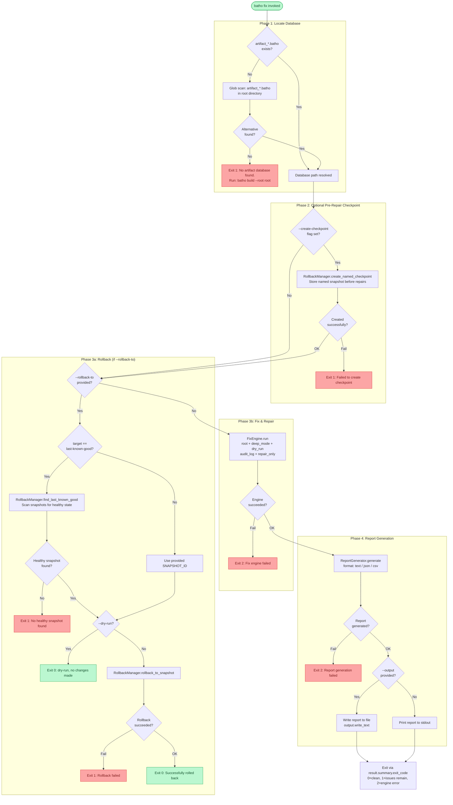

# `batho fix` — Integrity Verification & Repair

## Overview

`batho fix` performs **comprehensive integrity checking and automatic repair** of the Batho artifact database. It detects corruption, validates data structures across all subsystems, and repairs issues where possible.

Quick mode (default) runs fast surface-level checks. Use `--deep` for a full data scan. Use `--rollback-to` to restore the database to a prior known-good state without running checks.

---

## Synopsis

```
batho fix [--root PATH] [--deep] [--dry-run] [--format text|json|csv]
          [--output PATH] [--rollback-to SNAPSHOT_ID|last-known-good]
          [--repair-only database|registry|index|bsg|snapshots|cache|views]
          [--create-checkpoint NAME] [--no-audit]
```

---

## Flags & Options

| Flag | Type | Default | Description |
|------|------|---------|-------------|
| `--root` | `Path` | `.` (cwd) | Repository root containing the `.batho` database |
| `--deep` | flag | `false` | Full data verification (slower, checks all rows and checksums) |
| `--dry-run` | flag | `false` | Check only — report issues without performing any repairs |
| `--format` | `text\|json\|csv` | `text` | Report output format |
| `--output` | `Path` | stdout | Write report to file instead of stdout |
| `--rollback-to` | `SNAPSHOT_ID` or `last-known-good` | — | Restore DB to a specific snapshot; skips all checks |
| `--repair-only` | one or more of repair targets | all | Scope repairs to specific subsystems only |
| `--create-checkpoint` | `NAME` | — | Create a named checkpoint **before** any repairs are applied |
| `--no-audit` | flag | `false` | Disable detailed audit logging of repair actions |

### `--repair-only` Targets

| Target | What It Checks / Repairs |
|--------|--------------------------|
| `database` | SQLite integrity, schema version, WAL state |
| `registry` | Run registry consistency, orphaned run records |
| `index` | Graph entities and relationships referential integrity |
| `bsg` | BSG entry checksums and entity counts |
| `snapshots` | Snapshot record completeness and hash validity |
| `cache` | AST cache entries against current file hashes |
| `views` | Context output JSON validity |

---

## Execution Flow



---

## Output

### Success (text format)

```
✅ Fix complete: 0 issues found, 0 repairs applied
   database  [OK]
   registry  [OK]
   index     [OK]
   bsg       [OK]
   snapshots [OK]
   cache     [OK]
   views     [OK]
```

### Issues Found & Repaired

```
⚠️  Fix complete: 2 issues found, 2 repairs applied
   database  [OK]
   bsg       [REPAIRED] 3 entries had stale checksums — recomputed
   cache     [REPAIRED] 12 entries invalidated
```

### Checkpoint Created

```
✅ Created checkpoint: chk_1716499200_mycheckpoint
```

### Rollback Success

```
Found last known good snapshot: snap_build_1716499100_abc12345
Rolling back to snapshot: snap_build_1716499100_abc12345
✅ Successfully rolled back to snap_build_1716499100_abc12345
```

### Exit Codes

| Code | Meaning |
|------|---------|
| `0` | Clean or fully repaired |
| `1` | Issues found that could not be automatically repaired |
| `2` | Engine or report generation failed (internal error) |

---

## Error Cases

| Error | Cause | Resolution |
|-------|-------|-----------|
| `No artifact database found` | `batho build` not run yet | Run `batho build --root <path>` |
| `Failed to create checkpoint` | Storage write error | Check disk space and file permissions |
| `No healthy snapshot found for rollback` | All snapshots are marked unhealthy | Run `batho fix --deep` to attempt repair, or rebuild |
| `Fix engine failed` | Unexpected internal error | Check logs; run with `--verbose` if supported |
| `Report generation failed` | Serialization or write error | Try `--format json` or specify `--output` path |

---

## Examples

```bash
# Quick integrity check + auto-repair (default)
batho fix

# Deep verification (all rows, all checksums)
batho fix --deep

# Check only — no repairs (safe for CI)
batho fix --dry-run

# Export a JSON report to file
batho fix --format json --output reports/fix-report.json

# Only check BSG and snapshot subsystems
batho fix --repair-only bsg snapshots

# Create a checkpoint before risky repairs
batho fix --create-checkpoint pre-migration

# Rollback to last known-good snapshot
batho fix --rollback-to last-known-good

# Rollback to a specific snapshot ID
batho fix --rollback-to snap_build_1716499100_abc12345

# Dry-run rollback (preview only)
batho fix --rollback-to last-known-good --dry-run
```
