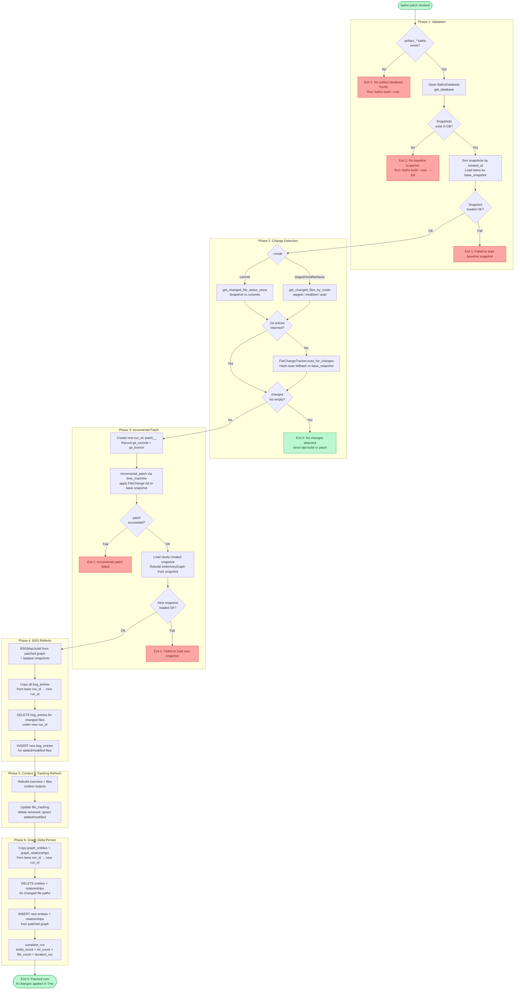

# `batho patch` — Incremental Index Update

## Overview

`batho patch` applies an **incremental update** to an existing `artifact_<dirname>.batho` database. It detects only the files that changed since the last build or patch, re-parses those files, and surgically updates the code graph, BSG map, context outputs, snapshot, and file tracking — without touching unchanged files.

Run this on every subsequent change after the initial [`batho build`](./cmd-build.md).

---

## Synopsis

```
batho patch [--root PATH] [--verbose] [--max-file-size-kb N]
            [--mode commit|staged|modified|auto]
```

---

## Flags & Options

| Flag | Type | Default | Description |
|------|------|---------|-------------|
| `--root` | `Path` | `.` (cwd) | Repository root directory containing the `.batho` database |
| `--verbose` | flag | `false` | Enable verbose debug logging |
| `--max-file-size-kb` | `int` | `500` (from config) | Skip files exceeding this size during hash scan fallback |
| `--mode` | `enum` | `auto` | Change detection strategy (see table below) |

### `--mode` Values

| Mode | Strategy | When to Use |
|------|----------|-------------|
| `auto` | `staged` + `modified` (working tree) | Default — catches all uncommitted local changes |
| `staged` | Git index (`git diff --cached`) | Only changes staged for commit |
| `modified` | Working directory (`git diff`) | Only unstaged working-tree changes |
| `commit` | Snapshot vs HEAD commits | Changes in committed history since last snapshot |

> **Fallback:** If git is unavailable or returns no output for any mode, the engine falls back to a full hash-scan comparing current file hashes against the baseline snapshot.

---

## Execution Flow



---

## Output

### Success

```
Patched /path/to/repo: 3 changes (1 added, 2 modified, 0 deleted) in 412ms
```

### No Changes

```
No changes detected since last build/patch
```

### Exit Codes

| Code | Meaning |
|------|---------|
| `0` | Success (including "no changes" early-exit) |
| `1` | Patch failed (no DB, no snapshot, engine error) |

---

## Error Cases

| Error | Cause | Resolution |
|-------|-------|-----------|
| `No artifact database found` | `batho build` has not been run | Run `batho build --root <path>` first |
| `No baseline snapshot found` | DB exists but snapshot table is empty | Run `batho build --root <path> --full` |
| `Failed to load baseline snapshot` | Snapshot record corrupted/missing from storage | Run `batho fix` then retry, or rebuild with `--full` |
| Incremental patch failed | Graph consistency error | Logged as warning (non-fatal); run `batho fix --deep` if issues persist |

---

## Examples

```bash
# Patch the current directory (default auto mode)
batho patch

# Patch a specific repository
batho patch --root /path/to/project

# Only pick up staged changes (pre-commit use case)
batho patch --mode staged

# Only pick up committed changes since last snapshot
batho patch --mode commit

# Patch with hash-scan fallback explicitly (non-git repo)
batho patch --mode modified

# Verbose output for debugging
batho patch --verbose
```
