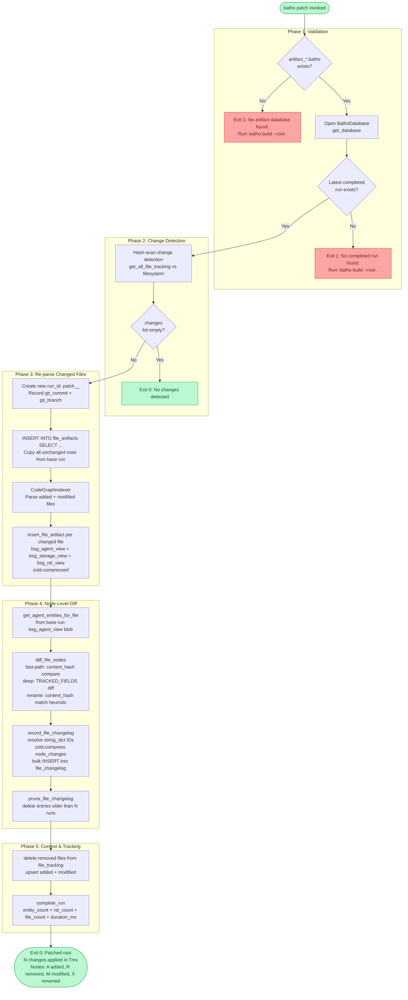

# `batho patch` — Incremental Index Update

## Overview

`batho patch` applies an **incremental update** to an existing `artifact_<dirname>.batho` database. It detects only the files that changed since the last build or patch, re-parses those files, and uses **blob-level copy-on-write** to produce a new run — copying unchanged file blobs directly in SQL and re-inserting only changed ones. No unchanged data is re-parsed or re-compressed.

Run this on every subsequent change after the initial [`batho build`](./cmd-build.md).

---

## Synopsis

```
batho patch [--root PATH] [--verbose] [--max-file-size-kb N]
```

---

## Flags & Options

| Flag | Type | Default | Description |
|------|------|---------|-------------|
| `--root` | `Path` | `.` (cwd) | Repository root directory containing the `.batho` database |
| `--verbose` | flag | `false` | Enable verbose debug logging |
| `--max-file-size-kb` | `int` | `500` (from config) | Skip files exceeding this size during hash scan |

---

## Execution Flow



---

## Output

### Success

```
Patched /path/to/repo: 3 changes (1 added, 2 modified, 0 deleted) in 412ms
  Nodes: 5 added, 2 removed, 8 modified, 1 renamed
```

The node summary line only appears when at least one node change was recorded. All node diffs are queryable afterward via `batho diff`.

### No Changes

```
No changes detected since last build/patch
```

### Exit Codes

| Code | Meaning |
|------|---------|
| `0` | Success (including "no changes" early-exit) |
| `1` | Patch failed (no DB, no snapshot, engine error) |

---

## File Changelog Configuration

The `file_changelog` table is pruned after each patch run. The default retention window is 100 runs. To customize, add to `batho.yaml`:

```yaml
indexer:
  file_changelog_max_runs: 50  # keep last 50 patch runs of node history
```

Query node history at any time with:

```bash
batho diff --entity <entity_id>       # evolution of one node
batho diff --run <run_id>             # all changes in one patch run
batho diff --file src/module.py       # all node changes in a file
```

---

## Error Cases

| Error | Cause | Resolution |
|-------|-------|-----------|
| `No artifact database found` | `batho build` has not been run | Run `batho build --root <path>` first |
| `No completed run found` | DB exists but no successful build has completed | Run `batho build --root <path>` first |
| Schema version mismatch | Database built with older Batho version | Run `batho build --root <path> --full` to rebuild |
| Patch exits with 0 changes | All detected changes map to unindexable files | Expected — `batho export` will still reflect the prior run |

---

## Examples

```bash
# Patch the current directory
batho patch

# Patch a specific repository
batho patch --root /path/to/project

# Verbose output for debugging
batho patch --verbose
```
