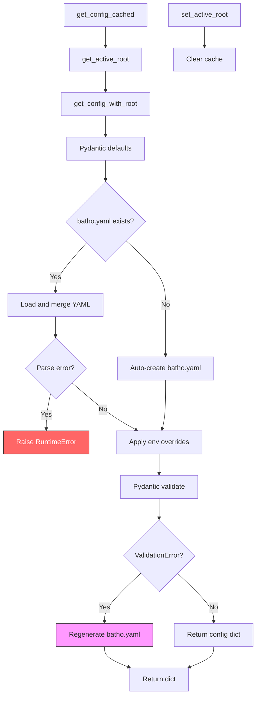

# Batho Configuration System Reference

This document describes the Batho configuration system: how config is loaded, validated, cached, and what every field does.

## File Structure

| File | Purpose |
|------|---------|
| `models.py` | Pydantic models defining all config sections, defaults, and validation rules |
| `loader.py` | Config load/merge/validate/cache logic + environment variable overrides |
| `__init__.py` | Public API exports |
| `default-ignore-patterns.yaml` | Built-in gitignore-style patterns for indexing exclusion |

## Config Load Flow



### Key Behaviors

- **No backward compatibility**: if `batho.yaml` fails validation, it is overwritten with current defaults.
- **Auto-creation**: if `batho.yaml` is missing, it is created automatically with defaults.
- **LRU-cached per root**: `_get_config_cached_for_root` caches config per repo root. Call `reload_config()` or `set_active_root()` to bust the cache.
- **Context-aware**: `_active_root` context variable tracks the current repo root. Defaults to `Path.cwd()`.

---

## Complete Default Config

This is the exact output of `Config().model_dump()` — what you get when no `batho.yaml` exists and no env vars are set.

```yaml
schema_version: batho-config.v1
logging:
  level: ERROR
  json_format: null
  quiet: false
  file: null
  format: "%(message)s"
paths:
  artifact_dir: .batho/artifact
  cache_dir: .batho/cache
  bsg_dir: .batho/bsg
indexer:
  max_file_size_kb: 500
  max_indexed_files: 200000
  max_workers: 0
  ignore_patterns: []
  ignore_files: null
  default_patterns_file: null
  fail_on_warning: false
  strict: false
graph:
  cycle_detection:
    enabled: true
    fatal: false
  orphan_pruning:
    enabled: true
    keep_entry_points: true
    keep_exports: true
flags:
  fail_on_warning: false
  strict: false
  audit_log_enabled: true
rules:
  enabled: true
  auto_load_all_plugins: true
  builtin_plugins:
    - bsg_core
    - bsg_silent_failure_catcher
    - bsg_dependency_blast_radius
    - bsg_resource_leak_preventer
    - bsg_nplus1_query_catcher
    - bsg_iac_drift_sentinel
    - bsg_schema_migration_enforcer
    - bsg_api_contract_guardian
    - bsg_hardcoded_secret_catcher
    - bsg_auth_boundary_shield
  disabled_rules: []
  custom_rules_path: null
  custom_rules_inline: []
  strict_validation: false
  cache_ttl: 3600
  fail_on_rule_error: false
plugins:
  overrides: {}
artifact_blobs:
  file_artifacts:
    bsg_agent_view: true
    bsg_storage_view: true
    bsg_rel_view: true
  run_artifacts:
    context_overview: true
    telemetry_metrics: true
    structural_metrics: true
    security_audit: false
    artifact_payload: true
    delta_stats: true
persistence:
  batch_size: 500
  batch_bytes_threshold: 15728640
bsg:
  parallel:
    enabled: true
    max_workers: 16
    chunk_size: 50
  cache:
    enabled: true
    max_size_mb: 1024
    ttl_days: 30
  symbol_resolution:
    enabled: true
    fuzzy_matching: false
    cache_symbols: true
    prune_unresolved: true
    max_unresolved_attempts: 10
    unresolved_tracking: true
  parsing:
    error_recovery: true
    skip_comments: false
  bidirectional:
    enabled: true
    include_gaps: true
    verify_integrity: false
    storage_view: false
dependency:
  enabled: true
  introspection:
    enabled: true
    mode: shallow
    venv_auto_detect: true
    timeout_seconds: 5
    full_scan: false
    popular_packages_db_path: null
  stdlib:
    enabled: true
    languages:
      - python
      - javascript
      - go
      - rust
  cache:
    enabled: true
    ttl_days: 90
  max_deps_per_manifest: 500
extraction:
  cache:
    enabled: true
    ttl_days: 30
    max_entries: 5000
```

---

## Per-Section Documentation

### `schema_version`
- **Type**: `string`
- **Default**: `batho-config.v1`
- **Purpose**: Version identifier for config schema. No env override.

---

### `logging`

Controls structured logging output.

| Field | Type | Default | Env Var | Description |
|-------|------|---------|---------|-------------|
| `level` | `str` | `ERROR` | `BATHO_LOG_LEVEL` | Log level: DEBUG, INFO, WARNING, ERROR, CRITICAL |
| `json_format` | `bool \| null` | `null` | `BATHO_LOG_JSON` | `true` = JSON logs, `false` = console, `null` = auto |
| `quiet` | `bool` | `false` | `BATHO_LOG_QUIET` | Suppress all non-error output |
| `file` | `str \| null` | `null` | `BATHO_LOG_FILE` | Optional log file path |
| `format` | `str` | `"%(message)s"` | — | Python logging format string |

**Notes**: `level` is normalized to uppercase by validator. The returned dict converts it to an `int` (e.g., `logging.ERROR = 40`). `effective_level` = `ERROR` when `quiet=true`, else `std_level`.

---

### `paths`

Filesystem paths used by Batho.

| Field | Type | Default | Env Var | Description |
|-------|------|---------|---------|-------------|
| `artifact_dir` | `str` | `.batho/artifact` | `BATHO_ARTIFACT_DIR` | Working directory for Arrow IPC artifact files (`runs.ipc`, `file_tracking.ipc`, etc.) |
| `cache_dir` | `str` | `.batho/cache` | — | Shared cache directory for rules, deps, and AST cache |
| `bsg_dir` | `str` | `.batho/bsg` | — | BSG graph store root; `current/` subdirectory holds persistent Arrow IPC files |

**Notes**: All paths are resolved relative to the repo root when not absolute. `artifact_dir` is read by `resolve_bundle_dir()` in `arrow_bundle/bundle.py`; override with `BATHO_ARTIFACT_DIR` to redirect the artifact store to a different location.

---

### `indexer`

Controls file indexing behavior.

| Field | Type | Default | Env Var | Description |
|-------|------|---------|---------|-------------|
| `max_file_size_kb` | `int` | `500` | `BATHO_MAX_FILE_SIZE_KB` | Skip files larger than this |
| `max_indexed_files` | `int` | `200_000` | `BATHO_MAX_INDEXED_FILES` | Hard cap on total files |
| `max_workers` | `int` | `0` | `BATHO_INDEX_WORKERS` | Parallel workers. `0` = auto (CPU count) |
| `ignore_patterns` | `list[str]` | `[]` | `BATHO_IGNORE_PATTERNS` | Extra gitignore-style patterns (comma-separated env) |
| `ignore_files` | `list[str] \| null` | `null` | `BATHO_IGNORE_FILES` | Custom ignore file paths |
| `default_patterns_file` | `str \| null` | `null` | `BATHO_DEFAULT_PATTERNS_FILE` | Path to custom default patterns YAML |
| `fail_on_warning` | `bool` | `false` | `BATHO_FAIL_ON_WARNING` | Treat parse warnings as errors |
| `strict` | `bool` | `false` | `BATHO_STRICT` | Strict parse mode |

**Consumers**: `CodeGraphIndexer.build_graph()` (`max_file_size_kb`, `ignore_patterns`), extraction pipeline.

---

### `graph`

Graph post-processing controls.

#### `cycle_detection`

| Field | Type | Default | Env Var | Description |
|-------|------|---------|---------|-------------|
| `enabled` | `bool` | `true` | `BATHO_GRAPH_CYCLE_DETECTION_ENABLED` | Detect import/inheritance cycles |
| `fatal` | `bool` | `false` | `BATHO_GRAPH_CYCLE_DETECTION_FATAL` | Fail build if cycles found |

#### `orphan_pruning`

| Field | Type | Default | Env Var | Description |
|-------|------|---------|---------|-------------|
| `enabled` | `bool` | `true` | `BATHO_GRAPH_ORPHAN_PRUNING_ENABLED` | Remove nodes with no edges |
| `keep_entry_points` | `bool` | `true` | `BATHO_GRAPH_ORPHAN_PRUNING_KEEP_ENTRY_POINTS` | Preserve ENTRY_POINT entities |
| `keep_exports` | `bool` | `true` | `BATHO_GRAPH_ORPHAN_PRUNING_KEEP_EXPORTS` | Preserve exported symbols |

**Consumers**: `CodeGraphIndexer` after graph construction.

---

### `flags`

Global behavioral flags.

| Field | Type | Default | Env Var | Description |
|-------|------|---------|---------|-------------|
| `fail_on_warning` | `bool` | `false` | `BATHO_FAIL_ON_WARNING` | Also sets `indexer.fail_on_warning` |
| `strict` | `bool` | `false` | `BATHO_STRICT` | Also sets `indexer.strict` |
| `audit_log_enabled` | `bool` | `true` | `BATHO_AUDIT_LOG_ENABLED` | Enable patch audit trail in run_artifacts |

---

### `rules`

BSG rule plugin configuration.

| Field | Type | Default | Env Var | Description |
|-------|------|---------|---------|-------------|
| `enabled` | `bool` | `true` | `BATHO_RULES_ENABLED` | Enable BSG rules during indexing |
| `auto_load_all_plugins` | `bool` | `true` | — | Auto-discover all plugins |
| `builtin_plugins` | `list[str]` | See below | `BATHO_RULES_BUILTIN_PLUGINS` | Built-in plugins to load (comma-separated) |
| `disabled_rules` | `list[str]` | `[]` | `BATHO_RULES_DISABLED_RULES` | Rule IDs to disable (comma-separated) |
| `custom_rules_path` | `str \| null` | `null` | `BATHO_RULES_CUSTOM_RULES_PATH` | Path to custom rules YAML |
| `custom_rules_inline` | `list[dict]` | `[]` | — | Inline custom rule definitions |
| `strict_validation` | `bool` | `false` | `BATHO_RULES_STRICT_VALIDATION` | Fail on invalid plugin/custom rules |
| `cache_ttl` | `int` | `3600` | `BATHO_RULES_CACHE_TTL` | Rule cache TTL in seconds |
| `fail_on_rule_error` | `bool` | `false` | `BATHO_RULES_FAIL_ON_RULE_ERROR` | Fail build on rule runtime error |

**Default builtin plugins**:
- `bsg_core`
- `bsg_silent_failure_catcher`
- `bsg_dependency_blast_radius`
- `bsg_resource_leak_preventer`
- `bsg_nplus1_query_catcher`
- `bsg_iac_drift_sentinel`
- `bsg_schema_migration_enforcer`
- `bsg_api_contract_guardian`
- `bsg_hardcoded_secret_catcher`
- `bsg_auth_boundary_shield`

**Consumers**: `load_effective_rules()` in `modules/compression/rules.py`, `CodeGraphIndexer`.

---

### `plugins`

Plugin-specific overrides.

| Field | Type | Default | Description |
|-------|------|---------|-------------|
| `overrides` | `dict[str, dict]` | `{}` | Nested map of `plugin_name` → `rule_name` → `{severity, ...}` overrides |

---

### `artifact_blobs`

Fine-grained control over which blobs are written to the Arrow IPC artifact. Disabling unused blobs reduces artifact size.

#### `file_artifacts`

| Field | Type | Default | Env Var | Description |
|-------|------|---------|---------|-------------|
| `bsg_agent_view` | `bool` | `true` | `BATHO_ARTIFACT_BLOBS_BSG_AGENT_VIEW` | LLM-optimized structural nodes (lightweight) |
| `bsg_storage_view` | `bool` | `true` | `BATHO_ARTIFACT_BLOBS_BSG_STORAGE_VIEW` | Full-fidelity delta blobs |
| `bsg_rel_view` | `bool` | `true` | `BATHO_ARTIFACT_BLOBS_BSG_REL_VIEW` | Relationships array |

#### `run_artifacts`

| Field | Type | Default | Env Var | Description |
|-------|------|---------|---------|-------------|
| `context_overview` | `bool` | `true` | `BATHO_ARTIFACT_BLOBS_CONTEXT_OVERVIEW` | Language/file category/entity distribution |
| `telemetry_metrics` | `bool` | `true` | `BATHO_ARTIFACT_BLOBS_TELEMETRY_METRICS` | Duration phases, cache stats, counts |
| `structural_metrics` | `bool` | `true` | `BATHO_ARTIFACT_BLOBS_STRUCTURAL_METRICS` | Entity type dist, fan-in/fan-out, LOC |
| `security_audit` | `bool` | `false` | `BATHO_ARTIFACT_BLOBS_SECURITY_AUDIT` | BSG interceptor hits (opt-in) |
| `artifact_payload` | `bool` | `true` | `BATHO_ARTIFACT_BLOBS_ARTIFACT_PAYLOAD` | Pre-minified entity+rel summary for LLMs |
| `delta_stats` | `bool` | `true` | `BATHO_ARTIFACT_BLOBS_DELTA_STATS` | Churn/node diffs |

**Consumers**: `orchestrator/build.py` and `orchestrator/patch.py` when writing to the Arrow IPC bundle via `BathoBundle.insert_file_artifacts_batch()`.

---

### `persistence`

Arrow IPC write batching controls.

| Field | Type | Default | Description |
|-------|------|---------|-------------|
| `batch_size` | `int` | `500` | Max entities/relationships per batch write |
| `batch_bytes_threshold` | `int` | `15_728_640` (15 MB) | Max bytes per batch |

**Consumers**: `build.py`, `patch.py` during `BathoBundle` batch persistence.

---

### `bsg`

Bidirectional Source Graph engine configuration.

#### `parallel`

| Field | Type | Default | Env Var | Constraints | Description |
|-------|------|---------|---------|-------------|-------------|
| `enabled` | `bool` | `true` | `BATHO_BSG_PARALLEL_ENABLED` | — | Enable parallel extraction |
| `max_workers` | `int` | `16` | `BATHO_BSG_MAX_WORKERS` | `1-32` | Parallel worker processes |
| `chunk_size` | `int` | `50` | `BATHO_BSG_CHUNK_SIZE` | `>=1` | Files per chunk |

#### `cache`

| Field | Type | Default | Env Var | Constraints | Description |
|-------|------|---------|---------|-------------|-------------|
| `enabled` | `bool` | `true` | `BATHO_BSG_CACHE_ENABLED` | — | Enable in-process AST cache |
| `max_size_mb` | `int` | `1024` | `BATHO_BSG_CACHE_MAX_SIZE_MB` | `>=1` | In-process cache size limit |
| `ttl_days` | `int` | `30` | `BATHO_BSG_CACHE_TTL_DAYS` | `>=1` | Cache entry TTL |

#### `symbol_resolution`

| Field | Type | Default | Env Var | Description |
|-------|------|---------|---------|-------------|
| `enabled` | `bool` | `true` | `BATHO_BSG_SYMBOL_RESOLUTION_ENABLED` | Resolve symbol references |
| `fuzzy_matching` | `bool` | `false` | `BATHO_BSG_SYMBOL_RESOLUTION_FUZZY` | Fuzzy name matching |
| `cache_symbols` | `bool` | `true` | `BATHO_BSG_SYMBOL_RESOLUTION_CACHE_SYMBOLS` | Cache resolved symbols |
| `prune_unresolved` | `bool` | `true` | — | Remove unresolved references |
| `max_unresolved_attempts` | `int` | `10` | — | Max retry attempts |
| `unresolved_tracking` | `bool` | `true` | — | Track unresolved symbols |

#### `parsing`

| Field | Type | Default | Env Var | Description |
|-------|------|---------|---------|-------------|
| `error_recovery` | `bool` | `true` | `BATHO_BSG_PARSING_ERROR_RECOVERY` | Continue past parse errors |
| `skip_comments` | `bool` | `false` | `BATHO_BSG_PARSING_SKIP_COMMENTS` | Exclude comments from AST |

#### `bidirectional`

| Field | Type | Default | Env Var | Description |
|-------|------|---------|---------|-------------|
| `enabled` | `bool` | `true` | `BATHO_BSG_BIDIRECTIONAL_ENABLED` | Enable lossless reconstruction |
| `include_gaps` | `bool` | `true` | `BATHO_BSG_BIDIRECTIONAL_INCLUDE_GAPS` | Emit SYNTAX_GLUE for 100% byte coverage |
| `verify_integrity` | `bool` | `false` | `BATHO_BSG_BIDIRECTIONAL_VERIFY_INTEGRITY` | Hash verification during reconstruction |
| `storage_view` | `bool` | `false` | `BATHO_BSG_BIDIRECTIONAL_STORAGE_VIEW` | Persist raw_content (larger artifact) |

**Consumers**: `modules/extraction/pipeline.py`, `modules/graph/builder/codegraph.py`.

---

### `dependency` (CDEU)

Consolidated Dependency Extraction Utility.

#### `introspection`

| Field | Type | Default | Env Var | Description |
|-------|------|---------|---------|-------------|
| `enabled` | `bool` | `true` | — | Introspect installed packages |
| `mode` | `str` | `shallow` | — | `shallow` (exports only) or `deep` (recursive) |
| `venv_auto_detect` | `bool` | `true` | — | Look for `.venv` in root |
| `timeout_seconds` | `int` | `5` | — | Subprocess timeout per package |
| `full_scan` | `bool` | `false` | — | `true` = all declared deps; `false` = popular packages only |
| `popular_packages_db_path` | `str \| null` | `null` | — | Override bundled popular packages DB |

#### `stdlib`

| Field | Type | Default | Description |
|-------|------|---------|-------------|
| `enabled` | `bool` | `true` | Index built-in standard libraries |
| `languages` | `list[str]` | `[python, javascript, go, rust]` | Languages to index |

#### `cache`

| Field | Type | Default | Description |
|-------|------|---------|-------------|
| `enabled` | `bool` | `true` | Persist indexed symbols across runs |
| `ttl_days` | `int` | `90` | Cache entry TTL |

#### `max_deps_per_manifest`

| Field | Type | Default | Description |
|-------|------|---------|-------------|
| `max_deps_per_manifest` | `int` | `500` | Max dependencies to index per manifest file |

**Consumers**: `modules/dependency/indexer.py`, `orchestrator/build.py`, `orchestrator/patch.py`.

---

### `extraction`

AST extraction and caching configuration.

#### `cache`

| Field | Type | Default | Description |
|-------|------|---------|-------------|
| `enabled` | `bool` | `true` | Persist parsed AST to disk for cross-session reuse |
| `ttl_days` | `int` | `30` | Days before cached AST entries expire |
| `max_entries` | `int` | `5000` | Maximum cached files (oldest evicted first) |

**How it works**: When enabled, parsed AST results (`entities` + `relationships`) are serialized to msgpack and stored in `<cache_dir>/ast/` as flat files. The cache key is `SHA256(filepath + content_hash + variant)[:16]`. A manifest index (`ast_manifests.idx`) tracks staleness. This replaces the previous in-memory LRU cache and persists across sessions.

**Consumers**: `modules/extraction/ast_cache.py`, `modules/storage/cache/unified_cache.py`, `orchestrator/build.py`, `orchestrator/patch.py`.

---

## Environment Variable Index

| Env Var | Config Path | Type | Default |
|-----------|-------------|------|---------|
| `BATHO_LOG_LEVEL` | `logging.level` | `str` | `ERROR` |
| `BATHO_LOG_QUIET` | `logging.quiet` | `bool` | `false` |
| `BATHO_LOG_JSON` | `logging.json_format` | `bool` | `null` |
| `BATHO_LOG_FILE` | `logging.file` | `str` | `null` |
| `BATHO_ARTIFACT_DIR` | `paths.artifact_dir` | `str` | `.batho/artifact` |
| `BATHO_MAX_FILE_SIZE_KB` | `indexer.max_file_size_kb` | `int` | `500` |
| `BATHO_MAX_INDEXED_FILES` | `indexer.max_indexed_files` | `int` | `200_000` |
| `BATHO_INDEX_WORKERS` | `indexer.max_workers` | `int` | `0` |
| `BATHO_IGNORE_PATTERNS` | `indexer.ignore_patterns` | `list` | `[]` |
| `BATHO_IGNORE_FILES` | `indexer.ignore_files` | `list` | `null` |
| `BATHO_DEFAULT_PATTERNS_FILE` | `indexer.default_patterns_file` | `str` | `null` |
| `BATHO_GRAPH_CYCLE_DETECTION_ENABLED` | `graph.cycle_detection.enabled` | `bool` | `true` |
| `BATHO_GRAPH_CYCLE_DETECTION_FATAL` | `graph.cycle_detection.fatal` | `bool` | `false` |
| `BATHO_GRAPH_ORPHAN_PRUNING_ENABLED` | `graph.orphan_pruning.enabled` | `bool` | `true` |
| `BATHO_GRAPH_ORPHAN_PRUNING_KEEP_ENTRY_POINTS` | `graph.orphan_pruning.keep_entry_points` | `bool` | `true` |
| `BATHO_GRAPH_ORPHAN_PRUNING_KEEP_EXPORTS` | `graph.orphan_pruning.keep_exports` | `bool` | `true` |
| `BATHO_FAIL_ON_WARNING` | `flags.fail_on_warning` + `indexer.fail_on_warning` | `bool` | `false` |
| `BATHO_STRICT` | `flags.strict` + `indexer.strict` | `bool` | `false` |
| `BATHO_AUDIT_LOG_ENABLED` | `flags.audit_log_enabled` | `bool` | `true` |
| `BATHO_RULES_ENABLED` | `rules.enabled` | `bool` | `true` |
| `BATHO_RULES_BUILTIN_PLUGINS` | `rules.builtin_plugins` | `list` | See defaults |
| `BATHO_RULES_DISABLED_RULES` | `rules.disabled_rules` | `list` | `[]` |
| `BATHO_RULES_CUSTOM_RULES_PATH` | `rules.custom_rules_path` | `str` | `null` |
| `BATHO_RULES_STRICT_VALIDATION` | `rules.strict_validation` | `bool` | `false` |
| `BATHO_RULES_FAIL_ON_RULE_ERROR` | `rules.fail_on_rule_error` | `bool` | `false` |
| `BATHO_RULES_CACHE_TTL` | `rules.cache_ttl` | `int` | `3600` |
| `BATHO_ARTIFACT_BLOBS_BSG_AGENT_VIEW` | `artifact_blobs.file_artifacts.bsg_agent_view` | `bool` | `true` |
| `BATHO_ARTIFACT_BLOBS_BSG_STORAGE_VIEW` | `artifact_blobs.file_artifacts.bsg_storage_view` | `bool` | `true` |
| `BATHO_ARTIFACT_BLOBS_BSG_REL_VIEW` | `artifact_blobs.file_artifacts.bsg_rel_view` | `bool` | `true` |
| `BATHO_ARTIFACT_BLOBS_CONTEXT_OVERVIEW` | `artifact_blobs.run_artifacts.context_overview` | `bool` | `true` |
| `BATHO_ARTIFACT_BLOBS_TELEMETRY_METRICS` | `artifact_blobs.run_artifacts.telemetry_metrics` | `bool` | `true` |
| `BATHO_ARTIFACT_BLOBS_STRUCTURAL_METRICS` | `artifact_blobs.run_artifacts.structural_metrics` | `bool` | `true` |
| `BATHO_ARTIFACT_BLOBS_SECURITY_AUDIT` | `artifact_blobs.run_artifacts.security_audit` | `bool` | `false` |
| `BATHO_ARTIFACT_BLOBS_ARTIFACT_PAYLOAD` | `artifact_blobs.run_artifacts.artifact_payload` | `bool` | `true` |
| `BATHO_ARTIFACT_BLOBS_DELTA_STATS` | `artifact_blobs.run_artifacts.delta_stats` | `bool` | `true` |
| `BATHO_BSG_PARALLEL_ENABLED` | `bsg.parallel.enabled` | `bool` | `true` |
| `BATHO_BSG_MAX_WORKERS` | `bsg.parallel.max_workers` | `int` | `16` |
| `BATHO_BSG_CHUNK_SIZE` | `bsg.parallel.chunk_size` | `int` | `50` |
| `BATHO_BSG_CACHE_ENABLED` | `bsg.cache.enabled` | `bool` | `true` |
| `BATHO_BSG_CACHE_MAX_SIZE_MB` | `bsg.cache.max_size_mb` | `int` | `1024` |
| `BATHO_BSG_CACHE_TTL_DAYS` | `bsg.cache.ttl_days` | `int` | `30` |
| `BATHO_BSG_SYMBOL_RESOLUTION_ENABLED` | `bsg.symbol_resolution.enabled` | `bool` | `true` |
| `BATHO_BSG_SYMBOL_RESOLUTION_FUZZY` | `bsg.symbol_resolution.fuzzy_matching` | `bool` | `false` |
| `BATHO_BSG_SYMBOL_RESOLUTION_CACHE_SYMBOLS` | `bsg.symbol_resolution.cache_symbols` | `bool` | `true` |
| `BATHO_BSG_PARSING_ERROR_RECOVERY` | `bsg.parsing.error_recovery` | `bool` | `true` |
| `BATHO_BSG_PARSING_SKIP_COMMENTS` | `bsg.parsing.skip_comments` | `bool` | `false` |
| `BATHO_BSG_BIDIRECTIONAL_ENABLED` | `bsg.bidirectional.enabled` | `bool` | `true` |
| `BATHO_BSG_BIDIRECTIONAL_INCLUDE_GAPS` | `bsg.bidirectional.include_gaps` | `bool` | `true` |
| `BATHO_BSG_BIDIRECTIONAL_VERIFY_INTEGRITY` | `bsg.bidirectional.verify_integrity` | `bool` | `false` |
| `BATHO_BSG_BIDIRECTIONAL_STORAGE_VIEW` | `bsg.bidirectional.storage_view` | `bool` | `false` |

---

## Schema Versions

| Schema | Version String | File | Used By |
|--------|---------------|------|---------|
| Config | `batho-config.v1` | `models.py` | `Config.schema_version` field |
| BSG | `bsg.v1` | `models.py` | `bsg_map/__init__.py`, `bsg_map/render_storage.py` |

---

## Default Ignore Patterns

Built-in patterns from `default-ignore-patterns.yaml` that are applied in addition to `.gitignore`:

- Git: `.git/`
- Virtual envs: `.venv/`, `venv/`, `env/`, `.env/`, `virtualenv/`
- Node: `node_modules/`, `bower_components/`
- Python cache: `__pycache__/`, `*.pyc`, `*.pyo`, `*.pyd`, `.pytest_cache/`, `.mypy_cache/`, `.tox/`
- Build artifacts: `build/`, `dist/`, `*.egg-info/`, `.eggs/`, `target/`, `out/`
- IDE: `.idea/`, `.vscode/`, `.vs/`, `*.swp`, `*.swo`, `*~`
- OS files: `.DS_Store`, `Thumbs.db`
- Lock files: `uv.lock`, `package-lock.json`, `yarn.lock`, `poetry.lock`, `Cargo.lock`, `Gemfile.lock`
- Batho own: `batho.yaml`, `.batho/`, `artifact_*.batho*`, `.aider/`, `.roo/`, `.cline/`, `.kilo/`
- Framework: `.next/`, `.nuxt/`, `.output/`
- Coverage: `coverage/`, `htmlcov/`

---

## Public API

```python
from batho.core.config import (
    get_config_cached,      # dict — cached config for active root
    get_config_with_root,   # dict — load config for specific root
    reload_config,          # dict — bust cache and reload
    set_active_root,        # None — switch context root
    get_active_root,        # Path — current context root
    Config,                 # Pydantic model
    SCHEMA_VERSIONS,        # dict of version strings
)

# Internal — import directly from loader if needed (not in public __all__):
from batho.core.config.loader import _active_root, _get_config_cached_for_root
```

## Config Regeneration Behavior

If an existing `batho.yaml` contains fields that no longer exist in the current schema (e.g., after an upgrade), Batho will:

1. Log `config_validation_failed_regenerating`
2. Overwrite `batho.yaml` with `Config().model_dump()` (current defaults)
3. Log `config_regenerated`
4. Continue with the new defaults

There is **no backward compatibility** — old config fields are discarded. This ensures the config file always matches the running code.
