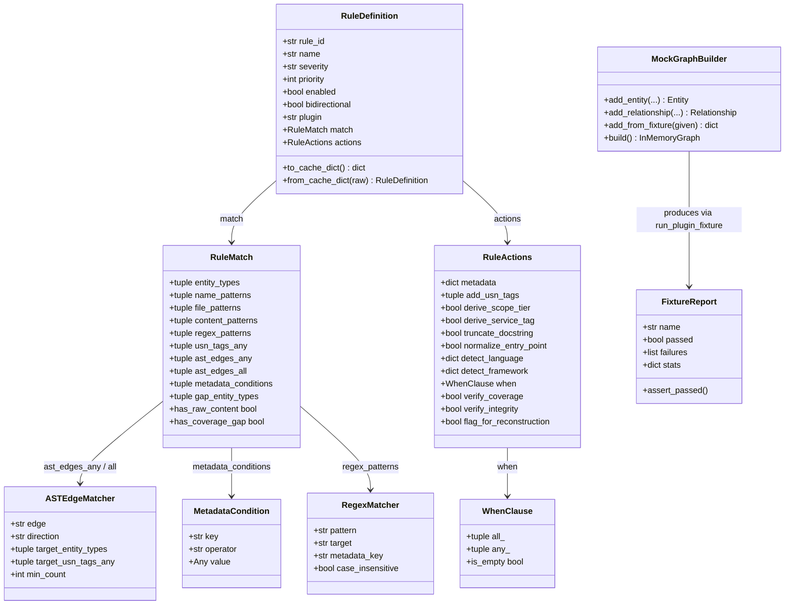
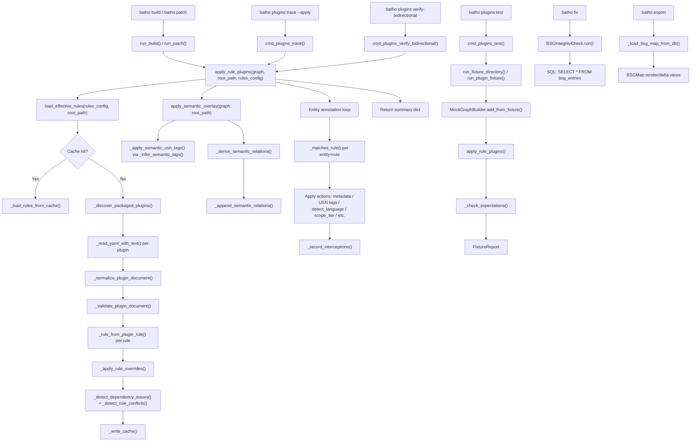

# Module: `batho.bsg`

## Overview

The `batho.bsg` package implements the **Batho Structured Graph (BSG) rule-plugin runtime** — a deterministic, YAML-driven annotation engine that enriches an `InMemoryGraph` with semantic metadata, Unique Semantic Name (USN) tags, category assignments, language/framework detections, and security/reliability interceptions. The engine is composed of four layers: (1) a typed dataclass model for rules and matchers (`rules.py`), (2) a plugin loader with JSON Schema validation, SHA-256 fingerprinting, and a Green Cache for performance (`rules.py`), (3) a semantic overlay that infers USN tags and derives synthetic AST edges directly from entity names/paths without requiring plugin YAML (`rules.py`), and (4) a plugin CLI sub-system (`plugins_cli.py`) and a fixture-based testing framework (`testing.py`). BSG data is consumed downstream by `BSGMap` (for rendering), exported via `batho export`, checked via `batho fix` (`BSGIntegrityCheck`), and re-evaluated on changed files during `batho patch`. The `batho diff` command does **not** use BSG directly.

---

## Files Covered

| Filename | Size (bytes) | Purpose |
|---|---|---|
| `batho/bsg/__init__.py` | 612 | Public re-export façade: surfaces the 5 functions and 6 dataclasses that form the stable API |
| `batho/bsg/rules.py` | 124,746 | Core engine: dataclass model, YAML/schema normalisation, cache, semantic overlay, rule application loop |
| `batho/bsg/plugins_cli.py` | 10,214 | CLI sub-command handlers for `batho plugins test/validate-strict/trace/verify-bidirectional` |
| `batho/bsg/testing.py` | 17,835 | Fixture-based testing framework: `MockGraphBuilder`, `FixtureReport`, fixture runner |
| `batho/bsg/plugins/foundation/` (28 YAMLs) | — | Packaged foundation plugins (detection, categorisation, optimisation, bidirectional) |
| `batho/bsg/plugins/interceptors/` (10 YAMLs) | — | Packaged interceptor plugins (security, reliability, performance, data, infra checks) |

---

## Classes & Functions

### `rules.py`

| Symbol | Type | Purpose | CLI Commands | Used? |
|---|---|---|---|---|
| `ASTEdgeMatcher` | dataclass | Frozen config for matching AST edges during rule evaluation; pre-computes lower-case sets in `__post_init__` for O(1) lookups | build, patch | ✅ Used |
| `MetadataCondition` | dataclass | Single metadata predicate (key + operator + value); operators: `exists`, `eq`, `neq`, `in`, `not_in`, `regex_match`, `length_gt`, `length_lt`, `contains_any`, `contains_all` | build, patch | ✅ Used |
| `RegexMatcher` | dataclass | Compiled regex applied to entity `name`, `file_path`, `signature`, or a `metadata` field | build, patch | ✅ Used |
| `WhenClause` | dataclass | Conditional action gate (`all_` / `any_` `MetadataCondition` lists); suppresses actions when not satisfied | build, patch | ✅ Used |
| `RuleMatch` | dataclass | All matcher criteria for a rule (entity_types, name/file/content patterns, regex_patterns, usn_tags_any, ast_edges, bidirectional v2 fields); pre-computes lower-case caches in `__post_init__` | build, patch | ✅ Used |
| `RuleActions` | dataclass | All action side-effects for a rule: metadata assignment, USN tag addition, scope/service derivation, detect_language/framework/pkg_mgr/infra, token budget, bidirectional v2 actions, conditional `when` gate | build, patch | ✅ Used |
| `RuleDefinition` | dataclass | Complete compiled rule with id, name, description, severity, priority, plugin reference, `match`, `actions`, bidirectional flag | build, patch | ✅ Used |
| `  RuleDefinition.to_cache_dict` | method | Serialises rule to JSON-compatible dict for Green Cache storage | build, patch | ✅ Used |
| `  RuleDefinition.from_cache_dict` | method | Deserialises a cached rule dict back to `RuleDefinition` | build, patch | ✅ Used |
| `list_builtin_plugins` | function | Discovers all packaged plugin IDs from `plugins/` directory tree + alias map | build, patch | ✅ Used |
| `load_effective_rules` | function | **Primary loader**: discovers plugins, validates against JSON Schema, applies rule overrides, checks dependency graph, manages Green Cache (SHA-256 fingerprint), returns `(list[RuleDefinition], stats_dict)` | build, patch | ✅ Used |
| `apply_semantic_overlay` | function | **Semantic enrichment pass** (called before rule loop): infers USN tags from entity names/paths using hint-token sets, then derives synthetic `DEPENDS_ON_API`, `WRAPPED_BY`, `CONTAINED_WITHIN`, `CLEANED_BY`, `REFERENCED_IN` edges from existing relationships | build, patch | ✅ Used |
| `apply_rule_plugins` | function | **Main entry point**: calls `load_effective_rules` → `apply_semantic_overlay` → entity annotation loop → interception stats recording → optional perf profiling and trace log | build, patch | ✅ Used |
| `validate_plugin_file` | function | Validates a YAML plugin file against the BSG schema; detects duplicate rule_ids, empty matchers, regex errors, and intra-plugin conflicts; used by `batho plugins validate-strict` | — (dedicated plugins CLI) | ✅ Used |
| `_schema_path` | function | Returns path to `schemas/bsg-plugin-schema-v2.json` | — | ✅ Used (internal) |
| `_schema_v1_path` | function | Returns path to `schemas/bsg-plugin-schema-v1.json` for v1 plugin compatibility | — | ✅ Used (internal) |
| `_plugins_root` | function | Returns `batho/bsg/plugins/` directory | — | ✅ Used (internal) |
| `_get_plugin_validator` | function | Returns a cached `Draft202012Validator` for v1/v2 schemas; raises if `jsonschema` not installed | — | ✅ Used (internal) |
| `_detect_plugin_schema_version` | function | Best-effort schema-version detection from raw YAML payload | — | ✅ Used (internal) |
| `_hash_bytes` | function | SHA-256 hex digest of bytes | — | ✅ Used (internal) |
| `_hash_file` | function | SHA-256 hash of a file's bytes; returns `"__missing__"` on `OSError` | — | ✅ Used (internal) |
| `_rules_cache_path` | function | Returns `.batho-config/cache/rules_cache.bin` path (creates dir) | — | ✅ Used (internal) |
| `_interception_stats_path` | function | Returns `.batho-config/metrics/interception_stats.json` path (creates dir) | — | ✅ Used (internal) |
| `_perf_stats_path` | function | Returns `.batho-config/metrics/bsg_perf.json` path (creates dir) | — | ✅ Used (internal) |
| `_write_perf_stats` | function | Atomic write of perf payload via tmp-rename pattern | — | ✅ Used (internal) |
| `_read_cache` | function | Reads and validates schema version of JSON cache; returns `None` on any failure | — | ✅ Used (internal) |
| `_write_cache` | function | Atomic write of rules cache via tmp-rename pattern | — | ✅ Used (internal) |
| `_plugin_display_name` | function | Converts `bsg_xyz_abc` → `"Xyz Abc"` for human-readable stats output | — | ✅ Used (internal) |
| `_load_interception_stats` | function | Reads cumulative interception stats JSON; returns empty shell on missing/malformed file | — | ✅ Used (internal) |
| `_write_interception_stats` | function | Atomic write of interception stats JSON | — | ✅ Used (internal) |
| `_record_interceptions` | function | Accumulates per-plugin hit counts into persistent interception stats JSON | — | ✅ Used (internal) |
| `_discover_packaged_plugins` | function | Walks `plugins/` tree, returning `{stem: Path}` for all `*.yaml`/`*.yml` files | — | ✅ Used (internal) |
| `_as_str_list` | function | Coerces YAML field to `list[str]` with type checking | — | ✅ Used (internal) |
| `_as_dict` | function | Coerces YAML field to `dict[str, Any]` with type checking | — | ✅ Used (internal) |
| `_normalize_edge_name` | function | Applies `_EDGE_ALIASES` (e.g. `INHERITS_FROM` → `INHERITS`); upper-cases raw value | — | ✅ Used (internal) |
| `_normalize_edge_matcher` | function | Normalises a raw AST edge matcher dict/string | — | ✅ Used (internal) |
| `_normalize_ast_edges` | function | Normalises `ast_edges` block (list or `{any, all}` dict) | — | ✅ Used (internal) |
| `_normalize_regex_matchers` | function | Normalises and validates `regex_patterns` list entries | — | ✅ Used (internal) |
| `_normalize_matchers` | function | Normalises the `matchers` block of a raw rule dict | — | ✅ Used (internal) |
| `_normalize_when_clause` | function | Normalises `actions.when` block | — | ✅ Used (internal) |
| `_normalize_actions` | function | Normalises the `actions` block of a raw rule dict, including v2 bidirectional fields | — | ✅ Used (internal) |
| `_normalize_rule_dict` | function | Top-level rule normaliser: promotes flat fields into `matchers`/`actions`, validates required fields | — | ✅ Used (internal) |
| `_normalize_plugin_document` | function | Normalises a full plugin YAML document (list or dict form) | — | ✅ Used (internal) |
| `_validate_plugin_document` | function | Runs JSON Schema validation; formats error with line hint | — | ✅ Used (internal) |
| `_metadata_conditions_from_list` | function | Converts raw list to `tuple[MetadataCondition, ...]` | — | ✅ Used (internal) |
| `_regex_matcher_from_dict` | function | Constructs `RegexMatcher` from a normalised dict | — | ✅ Used (internal) |
| `_regex_matcher_to_dict` | function | Serialises `RegexMatcher` to dict | — | ✅ Used (internal) |
| `_when_clause_from_dict` | function | Constructs `WhenClause` from a normalised dict | — | ✅ Used (internal) |
| `_when_clause_to_dict` | function | Serialises `WhenClause` to dict | — | ✅ Used (internal) |
| `_rule_from_plugin_rule` | function | Constructs `RuleDefinition` from a fully-normalised rule dict + plugin metadata | — | ✅ Used (internal) |
| `_edge_matcher_from_dict` | function | Constructs `ASTEdgeMatcher` from a normalised dict | — | ✅ Used (internal) |
| `_edge_matcher_to_dict` | function | Serialises `ASTEdgeMatcher` to dict | — | ✅ Used (internal) |
| `_rule_to_document` | function | Serialises `RuleDefinition` to a YAML-compatible dict (used by override patching) | — | ✅ Used (internal) |
| `_merge_dict` | function | Deep-merges two dicts (override wins on scalar, recursion on nested dicts) | — | ✅ Used (internal) |
| `_read_yaml_with_text` | function | Reads YAML file returning `(parsed, raw_text)` tuple | — | ✅ Used (internal) |
| `_resolve_custom_rules_path` | function | Resolves relative/absolute custom rule file path against `root_path` | — | ✅ Used (internal) |
| `_compute_source_hashes` | function | Builds per-file SHA-256 hash map for cache fingerprinting | — | ✅ Used (internal) |
| `_rules_config_fingerprint` | function | SHA-256 of canonicalised rules config + source file hashes | — | ✅ Used (internal) |
| `_detect_dependency_issues` | function | Identifies plugins referenced via `depends_on` that were not loaded | — | ✅ Used (internal) |
| `_rule_match_overlap` | function | Heuristic pairwise check for overlapping rule scopes with conflicting metadata assignments | — | ✅ Used (internal) |
| `_detect_rule_conflicts` | function | O(n²) scan of all rules pairs for overlap conflicts | — | ✅ Used (internal) |
| `_load_rules_from_cache` | function | Deserialises rules from cached JSON payload | — | ✅ Used (internal) |
| `_register_rule` | function | Inserts a compiled rule into `rules_by_name`; records shadowing in stats | — | ✅ Used (internal) |
| `_plugin_matches` | function | Checks plugin identity with alias resolution (supports `"*"` wildcard) | — | ✅ Used (internal) |
| `_apply_rule_overrides` | function | Applies `plugins_overrides` from batho.yaml to mutate rule properties (deep merge + re-validate) | — | ✅ Used (internal) |
| `_to_relative_posix` | function | Best-effort conversion of absolute entity file path to root-relative POSIX string | — | ✅ Used (internal) |
| `_pattern_matches_lower` | function | Glob matching with `**` expansion (tries 3 variants); case-insensitive | — | ✅ Used (internal) |
| `_pattern_matches` | function | Wrapper over `_pattern_matches_lower` with on-the-fly lower-casing | — | ✅ Used (internal) |
| `_matches_content_patterns` | function | Reads file content (with cache) and checks for substring patterns | — | ✅ Used (internal) |
| `_entity_usn_tags` | function | Extracts `bsg.usn` tag set from entity metadata; lower-cases tags | — | ✅ Used (internal) |
| `_tokenize_identifier` | function | Splits camelCase/snake_case/path identifiers into a token set | — | ✅ Used (internal) |
| `_path_token_set` | function | Returns token set for all path components of a file path | — | ✅ Used (internal) |
| `_path_has_hint_tokens` | function | Returns True if path token set intersects a given hint-token set | — | ✅ Used (internal) |
| `_semantic_tokens_for_entity` | function | Union of entity name, signature, and file path tokens | — | ✅ Used (internal) |
| `_semantic_key_tokens` | function | Filters tokens to non-stopword tokens with `len > 2` for env↔infra matching | — | ✅ Used (internal) |
| `_infer_semantic_tags` | function | Token-based inference of USN tags: `ApiBoundary`, `AuthMiddleware`, `Orm_Model`, `DatabaseSchema`, `EnvironmentVariable`, `InfrastructureConfig`, `DatabaseExecution`, `LoopStatement`, `ResourceAllocation`, `ExceptionHandler`, `CatchClause` | build, patch | ✅ Used |
| `_apply_semantic_usn_tags` | function | Iterates all entities and applies `_infer_semantic_tags` in-place | build, patch | ✅ Used |
| `_relationship_type_name` | function | Normalises a relationship's type attribute to a canonical uppercase edge name | — | ✅ Used (internal) |
| `_looks_like_cleanup_target` | function | Returns True if entity name/signature contains cleanup hint tokens | — | ✅ Used (internal) |
| `_derive_semantic_relations` | function | Generates synthetic relationships: `DEPENDS_ON_API`, `WRAPPED_BY`, `CONTAINED_WITHIN`, `CLEANED_BY`, `REFERENCED_IN`; uses scored token overlap for env↔infra matching | build, patch | ✅ Used |
| `_append_semantic_relations` | function | Appends non-duplicate semantic relationships to graph | build, patch | ✅ Used |
| `_target_matches_filters` | function | Checks whether a relationship's target entity satisfies an `ASTEdgeMatcher`'s target filters | — | ✅ Used (internal) |
| `_count_edge_matches` | function | Counts edges matching a given `ASTEdgeMatcher` from outbound/inbound adjacency maps | — | ✅ Used (internal) |
| `_matches_ast_edges` | function | Evaluates `ast_edges_all` (AND) and `ast_edges_any` (OR) matchers for an entity | — | ✅ Used (internal) |
| `_evaluate_metadata_condition` | function | Evaluates a single `MetadataCondition` against entity metadata | — | ✅ Used (internal) |
| `_matches_metadata_conditions` | function | Evaluates all metadata conditions (AND logic) | — | ✅ Used (internal) |
| `_matches_when_clause` | function | Evaluates `WhenClause.all_` and `WhenClause.any_` against entity metadata | — | ✅ Used (internal) |
| `_matches_regex_patterns` | function | Applies all `RegexMatcher` instances (AND logic) using a compiled regex cache | — | ✅ Used (internal) |
| `_matches_rule` | function | Central matching function: checks entity type, USN tags, name/file/content patterns, regex, AST edges, metadata conditions, and v2 bidirectional matchers in priority order | — | ✅ Used (internal) |
| `_derive_scope_tier` | function | Maps entity type to `GLOBAL/MODULE/CLASS/LOCAL` scope tier string | — | ✅ Used (internal) |
| `_derive_service_tag` | function | Extracts service name from `services/*/`, `apps/*/`, `backend/*/`, `frontend/*/` path patterns | — | ✅ Used (internal) |

#### Module-Level Constants (rules.py)

| Symbol | Type | Purpose |
|---|---|---|
| `_SCHEMA_VERSION` | constant | `"bsg-plugin.v2"` — current plugin schema version |
| `_CACHE_SCHEMA_VERSION` | constant | `"bsg-rules-cache.v2"` — rules cache schema version |
| `_CACHE_FILENAME` | constant | `"rules_cache.bin"` — Green Cache filename |
| `_INTERCEPTION_SCHEMA_VERSION` | constant | `"interception-stats.v1"` — interception stats file schema |
| `_INTERCEPTION_FILENAME` | constant | `"interception_stats.json"` — cumulative intercept stats filename |
| `_PERF_FILENAME` | constant | `"bsg_perf.json"` — per-rule profiling output filename |
| `_PLUGIN_ALIASES` | constant | `{"bsg_core": "bsg_graph_foundation"}` — legacy alias map |
| `_ENTITY_TYPE_ALIASES` | constant | Maps legacy entity type names (SYNTAX_GLUE, GLOBAL_STATEMENT, etc.) |
| `_EDGE_ALIASES` | constant | `{"INHERITS_FROM": "INHERITS"}` — edge name alias map |
| `_API_HINT_TOKENS` | constant | Token set for `ApiBoundary` inference (`api`, `route`, `controller`, …) |
| `_AUTH_HINT_TOKENS` | constant | Token set for `AuthMiddleware` inference (`auth`, `oauth`, `jwt`, …) |
| `_ORM_HINT_TOKENS` | constant | Token set for `Orm_Model` / `DatabaseSchema` inference |
| `_DB_HINT_TOKENS` | constant | Token set for `DatabaseExecution` inference |
| `_ENV_HINT_TOKENS` | constant | Token set for `EnvironmentVariable` inference |
| `_INFRA_PATH_HINT_TOKENS` | constant | Token set for `InfrastructureConfig` inference via path |
| `_INFRA_FILE_SUFFIXES` | constant | `{".tf", ".tfvars", ".hcl"}` — infra file extensions |
| `_LOOP_HINT_TOKENS` | constant | Token set for `LoopStatement` inference |
| `_RESOURCE_HINT_TOKENS` | constant | Token set for `ResourceAllocation` inference |
| `_CLEANUP_HINT_TOKENS` | constant | Token set for cleanup-target detection (`close`, `disconnect`, …) |
| `_EXCEPTION_HINT_TOKENS` | constant | Token set for `ExceptionHandler`/`CatchClause` inference |
| `_KEY_TOKEN_STOPWORDS` | constant | Generic tokens excluded from env↔infra key matching |
| `_REFERENCED_IN_GENERIC_TOKENS` | constant | Weak tokens excluded from non-trivial `REFERENCED_IN` score |
| `_PLUGIN_SCHEMA_CACHE` | constant | Module-level dict caching parsed JSON Schema documents |
| `_PLUGIN_VALIDATORS` | constant | Module-level dict caching `Draft202012Validator` instances |

---

### `plugins_cli.py`

| Symbol | Type | Purpose | CLI Commands | Used? |
|---|---|---|---|---|
| `_resolve_root` | function | Helper: resolves `args.root` to an absolute `Path` | — | ✅ Used (internal) |
| `cmd_plugins_test` | function | Runs YAML fixture files via `run_plugin_fixture` / `run_fixture_directory`; prints pass/fail summary; exits 1 on failures | `batho plugins test` | ✅ Used |
| `cmd_plugins_validate_strict` | function | Calls `validate_plugin_file` with strict mode; prints JSON result; exits 1 on errors | `batho plugins validate-strict` | ✅ Used |
| `cmd_plugins_trace` | function | Loads rules (and optionally applies them against cached graph with `--apply`); outputs JSON trace; supports `--profile` flag | `batho plugins trace` | ✅ Used |
| `cmd_plugins_verify_bidirectional` | function | Calls `apply_rule_plugins` with `bidirectional_only=True` to run only bidirectional flow plugins against cached graph | `batho plugins verify-bidirectional` | ✅ Used |
| `register_cli_subcommands` | function | Attaches `test`, `validate-strict`, `trace`, `verify-bidirectional` subparsers to a `plugins` `_SubParsersAction`; called from main CLI builder | `batho plugins *` | ✅ Used |

---

### `testing.py`

> All symbols in `testing.py` are used in the production `batho plugins test` CLI path via `plugins_cli.cmd_plugins_test`, which imports them directly. They are **not** test-only.

| Symbol | Type | Purpose | CLI Commands | Used? |
|---|---|---|---|---|
| `FixtureError` | class | `ValueError` subclass raised for authoring mistakes in fixture YAML | `batho plugins test` | ✅ Used |
| `FixtureReport` | dataclass | Outcome of a single fixture run: `name`, `fixture_path`, `passed`, `failures`, `stats` | `batho plugins test` | ✅ Used |
| `  FixtureReport.assert_passed` | method | Raises `AssertionError` with formatted failure list; useful in test suites | — | ✅ Used (test harness) |
| `MockGraphBuilder` | class | Fluent builder constructing `InMemoryGraph` from synthetic entity/relationship specs | `batho plugins test` | ✅ Used |
| `  MockGraphBuilder.__init__` | method | Initialises `InMemoryGraph`; sets `root` attribute when `root` arg provided | `batho plugins test` | ✅ Used |
| `  MockGraphBuilder.add_entity` | method | Creates and adds an `Entity` from keyword args; coerces `type` to `EntityType` | `batho plugins test` | ✅ Used |
| `  MockGraphBuilder.add_relationship` | method | Creates and adds a `Relationship` from keyword args; coerces `type` to `RelationshipType` | `batho plugins test` | ✅ Used |
| `  MockGraphBuilder.add_from_fixture` | method | Populates graph from a `given` block dict; returns `{name: Entity}` lookup | `batho plugins test` | ✅ Used |
| `  MockGraphBuilder.build` | method | Returns the completed `InMemoryGraph` | `batho plugins test` | ✅ Used |
| `run_plugin_fixture` | function | Runs a single fixture (path, dict, or YAML): builds mock graph, applies rules, checks expectations; returns `FixtureReport` | `batho plugins test` | ✅ Used |
| `run_fixture_directory` | function | Finds all `*.yaml`/`*.yml` files under a directory and runs each as a fixture | `batho plugins test` | ✅ Used |
| `summarize_reports` | function | Aggregates `list[FixtureReport]` into a summary dict with total/passed/failed counts | `batho plugins test` | ✅ Used |
| `_coerce_entity_type` | function | Converts string to `EntityType` enum; raises `FixtureError` on unknown | — | ✅ Used (internal) |
| `_coerce_relationship_type` | function | Converts string to `RelationshipType` enum; raises `FixtureError` on unknown | — | ✅ Used (internal) |
| `_build_rules_config` | function | Converts fixture `plugin` spec to a `rules_config` dict usable by `apply_rule_plugins` | — | ✅ Used (internal) |
| `_find_entity_by_name` | function | Linear scan of graph entities by name | — | ✅ Used (internal) |
| `_check_entity_expectation` | function | Asserts metadata, metadata_absent, usn_tags_include/absent, and rules_include expectations against a single entity | — | ✅ Used (internal) |
| `_check_expectations` | function | Orchestrates all `expect` block assertions (entity, rules_applied_includes/excludes, min_rules_applied) | — | ✅ Used (internal) |

---

#### Class Diagram



#### Call-Flow Flowchart



---

## BSG Plugin Tables

### Foundation Plugins (28 files in `batho/bsg/plugins/foundation/`)

| Plugin File | Category | Key Rules / Checks | CLI Commands That Trigger It |
|---|---|---|---|
| `bsg_graph_foundation.yaml` | Core graph tagging | Tag TEST/DOC/CONFIG/INFRA categories by file pattern; derive `bsg.service_tag` from multi-service layouts; derive `bsg.scope_tier` (GLOBAL/MODULE/CLASS/LOCAL) from entity type | build, patch |
| `bsg_file_categorization.yaml` | File categorisation | Granular TEST (path, prefix, suffix patterns across 30+ languages), DOC (path + extension + special files), CONFIG (path + exact names + suffixes), SOURCE (40+ language extensions) using `assign_category` action | build, patch |
| `bsg_detection_foundation.yaml` | Language/infra/pkg detection | Detect Python/Node.js/Rust/Go/Java via file patterns; detect Docker/Kubernetes infra; detect npm/poetry/cargo/pip/yarn/pnpm/go modules/composer/bundler/gradle/maven package managers | build, patch |
| `bsg_detection_cicd.yaml` | CI/CD detection | Detect GitHub Actions, GitLab CI, CircleCI, Jenkins, Travis CI, Azure Pipelines, Buildkite from path/file patterns | build, patch |
| `bsg_detection_cloud_providers.yaml` | Cloud detection | Detect AWS (CDK, SAM, CloudFormation), GCP (Cloud Functions, GKE), Azure, Vercel, Netlify, Heroku from file/path patterns | build, patch |
| `bsg_detection_cpp.yaml` | Language detection | Detect C and C++ from `.c`, `.cpp`, `.cc`, `.h`, `.hpp`, `CMakeLists.txt`, `Makefile`; detect CMake/Make package managers | build, patch |
| `bsg_detection_csharp.yaml` | Language detection | Detect C# from `.cs`, `.csproj`, `.sln`; detect NuGet; detect ASP.NET, Blazor, MAUI frameworks | build, patch |
| `bsg_detection_dart.yaml` | Language detection | Detect Dart/Flutter from `.dart`, `pubspec.yaml`; detect pub package manager | build, patch |
| `bsg_detection_elixir.yaml` | Language detection | Detect Elixir/Erlang from `.ex`, `.exs`, `.erl`, `mix.exs`; detect Mix package manager; detect Phoenix framework | build, patch |
| `bsg_detection_kotlin.yaml` | Language detection | Detect Kotlin from `.kt`, `.kts`, `build.gradle.kts`; detect Gradle | build, patch |
| `bsg_detection_php.yaml` | Language detection | Detect PHP from `.php`, `composer.json`; detect Composer; detect Laravel, Symfony, WordPress, Slim frameworks | build, patch |
| `bsg_detection_ruby.yaml` | Language detection | Detect Ruby from `.rb`, `Gemfile`; detect Bundler; detect Rails, Sinatra, Hanami frameworks | build, patch |
| `bsg_detection_scala.yaml` | Language detection | Detect Scala from `.scala`, `build.sbt`; detect sbt/Maven; detect Akka, Spark, Play frameworks | build, patch |
| `bsg_detection_swift.yaml` | Language detection | Detect Swift from `.swift`, `Package.swift`; detect Swift Package Manager; detect SwiftUI, UIKit, AppKit frameworks | build, patch |
| `bsg_detection_test_frameworks.yaml` | Test framework detection | Detect pytest, unittest, Jest, Mocha, JUnit, RSpec, PHPUnit, Go test, Rust test, Karma, Jasmine by file/content patterns | build, patch |
| `bsg_framework_angular.yaml` | Framework detection | Detect Angular from `angular.json`, `@angular/core` imports, `.component.ts`, `.service.ts` patterns | build, patch |
| `bsg_framework_django.yaml` | Framework detection | Detect Django from `django` in `requirements.txt`/`pyproject.toml`, `settings.py`, `urls.py`, `views.py`, `manage.py` | build, patch |
| `bsg_framework_flask.yaml` | Framework detection | Detect Flask from `flask` in requirements, `app.py`, `application.py`, `__init__.py` with Flask imports | build, patch |
| `bsg_framework_nodejs.yaml` | Framework detection | Detect Express, Fastify, NestJS, Koa, Hapi, Sails, Adonis, Meteor, Loopback, Feathers, Hono frameworks from package.json content patterns | build, patch |
| `bsg_framework_other.yaml` | Framework detection | Detect Spring Boot, Micronaut, Quarkus (Java/Kotlin), Gin, Echo, Fiber, Chi (Go), Actix-web, Axum, Rocket (Rust), FastAPI, Starlette (Python) | build, patch |
| `bsg_framework_python.yaml` | Framework detection | Detect FastAPI, Tornado, Pyramid, aiohttp, Sanic, Bottle, Falcon, Litestar Python web frameworks; detect Celery, SQLAlchemy, Alembic | build, patch |
| `bsg_framework_react.yaml` | Framework detection | Detect React/Next.js/Remix from package.json content patterns and `.jsx`/`.tsx` file patterns | build, patch |
| `bsg_framework_vue.yaml` | Framework detection | Detect Vue.js/Nuxt from package.json content and `.vue` file patterns | build, patch |
| `bsg_token_optimization.yaml` | Token optimisation | Truncate docstrings >150 chars; replace test-fixture docstrings with placeholder; normalise entry-point names to `__main__`; mark JSON/YAML array rollup sections, Markdown content rollup, HTML attribute rollup; track optimisation stats on DOCUMENTs | build, patch |
| `bsg_bidirectional_foundation.yaml` | Bidirectional v2 | Validate gap entity (SYNTAX_GLUE, COMMENT_BLOCK, IMPORT_BLOCK) coverage; verify FUNCTION/CLASS/MODULE content-hash integrity; flag entities with coverage gaps for reconstruction; add reconstruction metadata to FUNCTION/CLASS/METHOD entities | build, patch |
| `test_bidirectional_gap_coverage.yaml` | Test fixture | Fixture verifying gap coverage validation rule fires on SYNTAX_GLUE entities with raw content | `batho plugins test` |
| `test_bidirectional_integrity.yaml` | Test fixture | Fixture verifying file-integrity rule fires on FUNCTION entities with content hash | `batho plugins test` |
| `test_bidirectional_reconstruction.yaml` | Test fixture | Fixture verifying reconstruction-flagging fires on entities with coverage gaps | `batho plugins test` |

---

### Interceptor Plugins (10 files in `batho/bsg/plugins/interceptors/`)

| Plugin File | Category | Key Rules / Checks | CLI Commands That Trigger It |
|---|---|---|---|
| `bsg_hardcoded_secret_catcher.yaml` | SECURITY | Flag `variable`/`constant`/`field` with names matching `*secret*`, `*token*`, `*apikey*`, `*api_key*`, `*password*`; sets `bsg.intercept.category: SECURITY`; adds `SecretCandidate` USN tag | build, patch |
| `bsg_auth_boundary_shield.yaml` | SECURITY | Flag API boundary entities (USN tag `ApiBoundary`) that have an outbound `WRAPPED_BY` edge to an `AuthMiddleware` entity; sets `bsg.intercept.category: SECURITY`; adds `SecurityCritical` | build, patch |
| `bsg_api_contract_guardian.yaml` | CONTRACT | Flag API boundary entities with ≥1 inbound `DEPENDS_ON_API` edge (downstream consumers); sets `bsg.intercept.category: CONTRACT`; adds `ContractSensitive` | build, patch |
| `bsg_schema_migration_enforcer.yaml` | DATA | Flag ORM model / database schema entities (`Orm_Model`, `DatabaseSchema` USN tags); sets `bsg.intercept.category: DATA`; adds `MigrationSensitive` | build, patch |
| `bsg_iac_drift_sentinel.yaml` | INFRA | Flag environment variable entities (`EnvironmentVariable` tag) with ≥1 `REFERENCED_IN` edge to an `InfrastructureConfig` target; sets `bsg.intercept.category: INFRA`; adds `DriftSensitive` | build, patch |
| `bsg_dependency_blast_radius.yaml` | STABILITY | Flag entities with ≥10 inbound `CALLS` or `IMPORTS` edges (high fan-in); sets `bsg.intercept.category: STABILITY`; adds `BlastRadiusHigh` | build, patch |
| `bsg_nplus1_query_catcher.yaml` | PERFORMANCE | Flag `DatabaseExecution` entities contained within `LoopStatement` entities (via `CONTAINED_WITHIN` outbound edge); sets `bsg.intercept.category: PERFORMANCE`; adds `PerformanceSensitive` | build, patch |
| `bsg_resource_leak_preventer.yaml` | RELIABILITY | Flag `ResourceAllocation` entities that have an outbound `CLEANED_BY` edge (verifies cleanup path exists); sets `bsg.intercept.category: RELIABILITY`; adds `CleanupCritical` | build, patch |
| `bsg_silent_failure_catcher.yaml` | RELIABILITY | Flag `CatchClause`/`ExceptionHandler` USN-tagged entities; sets `bsg.intercept.category: RELIABILITY`; adds `SilentFailureRisk` | build, patch |
| `bsg_reconstruction_interceptors.yaml` | RECONSTRUCTION | Intercept SYNTAX_GLUE entities with coverage gaps; verify integrity of reconstructed FUNCTION/CLASS entities; detect reconstruction drift via `content_hash_pattern`; bidirectional plugin (only runs on `verify-bidirectional` when `bidirectional_only=True`) | build, patch, `batho plugins verify-bidirectional` |

---

## CLI Integration Detail

### `batho build` → `run_build()`

In `batho/orchestrator/build.py` (line 190), after the `InMemoryGraph` is assembled from parsers:

```python
from batho.bsg.rules import apply_rule_plugins
apply_rule_plugins(
    graph=graph,
    root_path=root,
    rules_config=bsg_cfg.get("rules", {}),
)
```

The `bsg_cfg` is the `bsg:` block from `batho.yaml`. After rule application, `BSGMap.build(graph, root)` is called to produce file-level views stored in the SQLite `bsg_entries` table.

### `batho patch` → `run_patch()`

In `batho/orchestrator/patch.py`, BSG is not called directly via `apply_rule_plugins` — instead, per-file re-indexing re-builds a single-file `InMemoryGraph` and calls `BSGMap.build(single_graph, root)`. The `codegraph.py` integration (lines 921–947) calls both `apply_semantic_overlay` and `apply_rule_plugins` during single-file graph construction.

### `batho export` → `run_export()`

`export.py` loads pre-computed `BSGMap` data from `bsg_entries` (SQLite) via `_load_bsg_map_from_db()`. It does **not** re-run BSG rule evaluation. It reads `bsg.category` metadata to filter files and renders symbol/dependency/relationship views from the stored data.

### `batho fix` → `BSGIntegrityCheck.run()`

`batho/integrity/checks/bsg.py` → `BSGIntegrityCheck`:
- Queries `SELECT * FROM bsg_entries` from the SQLite database
- Verifies `bsg_json` field checksums (SHA-256)
- Validates JSON parseability of stored BSG data
- In deep mode, validates node-level structure
- Can repair corrupted entries (`corrupted_bsg` repair strategy in `repair.py`)
- Does **not** call `apply_rule_plugins` — operates purely on stored DB data

### `batho diff`

Does **not** use the BSG module. Operates directly on git diffs.

### `batho plugins *` (dedicated BSG CLI)

Registered via `register_cli_subcommands()` from `plugins_cli.py`:

| Sub-command | Handler | Description |
|---|---|---|
| `batho plugins test` | `cmd_plugins_test` | Run YAML fixture files; emits pass/fail summary |
| `batho plugins validate-strict` | `cmd_plugins_validate_strict` | Validate a plugin YAML (strict mode promotes warnings to errors) |
| `batho plugins trace` | `cmd_plugins_trace` | Inspect rule resolution; optionally apply against cached graph with `--apply --profile` |
| `batho plugins verify-bidirectional` | `cmd_plugins_verify_bidirectional` | Run only bidirectional plugins against cached graph |

---

## Plugin YAML Schema Structure

Every plugin file conforms to `bsg-plugin.v2` schema. The general YAML structure is:

```yaml
schema_version: bsg-plugin.v2
plugin_id: bsg_example_plugin
name: Example Plugin
version: 1.0.0
enabled: true
bidirectional: false        # optional; marks plugin as bidirectional-only
depends_on:                 # optional; plugin dependency list
  - bsg_graph_foundation
description: "..."
rules:
  - rule_id: my-rule
    name: my-rule
    description: "..."
    severity: info | warning | block
    priority: 100           # higher = applied first
    enabled: true
    matchers:
      entity_types: [FUNCTION, CLASS, ...]
      name_patterns: ['*secret*', ...]
      file_patterns: ['**/*.py', ...]
      content_patterns: ['apiVersion:', ...]
      regex_patterns:
        - pattern: "^[A-Z_]+$"
          target: name | file_path | signature | metadata
          case_insensitive: true
      usn_tags_any: [apiboundary, authmiddleware]
      ast_edges:
        any:
          - edge: CALLS
            direction: inbound | outbound | either
            min_count: 1
            target_entity_types: [function]
            target_usn_tags_any: [databaseexecution]
        all:
          - edge: CONTAINED_WITHIN
            direction: outbound
            min_count: 1
      metadata_conditions:
        - key: docstring
          operator: length_gt
          value: 150
      # Bidirectional v2 only:
      gap_entity_types: [SYNTAX_GLUE]
      has_raw_content: true
      has_coverage_gap: false
      byte_range_start: 0
      content_hash_pattern: "^[a-f0-9]{6,}$"
    actions:
      metadata:
        bsg.intercept.category: SECURITY
        bsg.intercept.message: "..."
      add_usn_tags:
        - SecretCandidate
      derive_scope_tier: false
      derive_service_tag: false
      truncate_docstring: false
      max_docstring_length: 150
      normalize_entry_point: false
      detect_language:
        language: Python
      detect_framework:
        framework: Django
        language: Python
      detect_package_manager:
        package_manager: pip
      detect_infra:
        infra_type: docker
      assign_category:
        category: TEST | DOC | CONFIG | SOURCE | INFRA
      when:
        all:
          - key: bsg.category
            operator: eq
            value: SOURCE
      # Bidirectional v2 only:
      verify_coverage: true
      verify_integrity: true
      flag_for_reconstruction: true
      apply_token_budget: 500
      add_reconstruction_metadata:
        reconstruction_version: "1.0"
```

---

## Metadata Keys Written by BSG

| Metadata Key | Set By | Meaning |
|---|---|---|
| `bsg.category` | `bsg_graph_foundation`, `bsg_file_categorization` | File category: `TEST`, `DOC`, `CONFIG`, `SOURCE`, `INFRA` |
| `bsg.usn` | All plugins via `add_usn_tags` | List of USN semantic tags (e.g. `ApiBoundary`, `SecretCandidate`) |
| `bsg.rules` | Engine (annotation loop) | List of rule names that fired on this entity |
| `bsg.scope_tier` | `bsg_graph_foundation` / `derive_scope_tier` action | `GLOBAL`, `MODULE`, `CLASS`, or `LOCAL` |
| `bsg.service_tag` | `bsg_graph_foundation` / `derive_service_tag` action | Service name from multi-service path layout |
| `bsg.language` | Detection plugins | Primary language (e.g. `Python`, `Node.js`) |
| `bsg.frameworks` | Detection plugins | List of detected frameworks |
| `bsg.package_manager` | Detection plugins | Detected package manager |
| `bsg.infra` | Detection plugins | List of infra types (e.g. `docker`, `kubernetes`) |
| `bsg.intercept.category` | Interceptor plugins | Intercept class: `SECURITY`, `CONTRACT`, `DATA`, `INFRA`, `STABILITY`, `PERFORMANCE`, `RELIABILITY`, `RECONSTRUCTION` |
| `bsg.intercept.message` | Interceptor plugins | Human-readable intercept reason |
| `bsg.optimization` | `bsg_token_optimization` | Optimisation type applied: `array_rollup`, `content_rollup`, `attribute_rollup` |
| `bsg.verify_coverage` | Bidirectional plugins | `True` when coverage verified |
| `bsg.verify_integrity` | Bidirectional plugins | `True` when integrity verified |
| `bsg.flag_for_reconstruction` | Bidirectional plugins | `True` when entity flagged for reconstruction |
| `bsg.token_budget` | Bidirectional plugins | Token budget integer |
| `bsg.reconstruction.*` | Bidirectional plugins | Prefixed reconstruction metadata keys |
| `bsg.normalized_name` | `bsg_token_optimization` | Normalised entry-point name (`__main__`) |
| `bsg.bidirectional.coverage_validated` | `bsg_bidirectional_foundation` | `True` when gap entity coverage validated |
| `bsg.bidirectional.integrity_verified` | `bsg_bidirectional_foundation` | `True` when content-hash integrity verified |
| `bsg.bidirectional.reconstruction_flagged` | `bsg_bidirectional_foundation` | `True` when entity flagged for reconstruction |
| `docstring` | `bsg_token_optimization` | Truncated/replaced docstring value |

---

## Unused Symbols Summary

All public symbols exported by `__init__.py` are reachable from at least one CLI command. All private helpers in `rules.py` are called within the same module. All `testing.py` symbols are used by `plugins_cli.cmd_plugins_test` (which is a production CLI path).

The following symbols have **no reachable call site from the 5 main CLI commands** but are accessible via the dedicated `batho plugins *` sub-commands:

- `validate_plugin_file` — called only by `cmd_plugins_validate_strict` (`batho plugins validate-strict`), which is a developer/CI utility, not a core build/patch/export/fix/diff path.
- `cmd_plugins_verify_bidirectional` — callable only via `batho plugins verify-bidirectional`; not triggered during `batho build/patch`.
- `FixtureReport.assert_passed` — test-harness utility method; not called from any CLI handler, only useful in Python test code.
