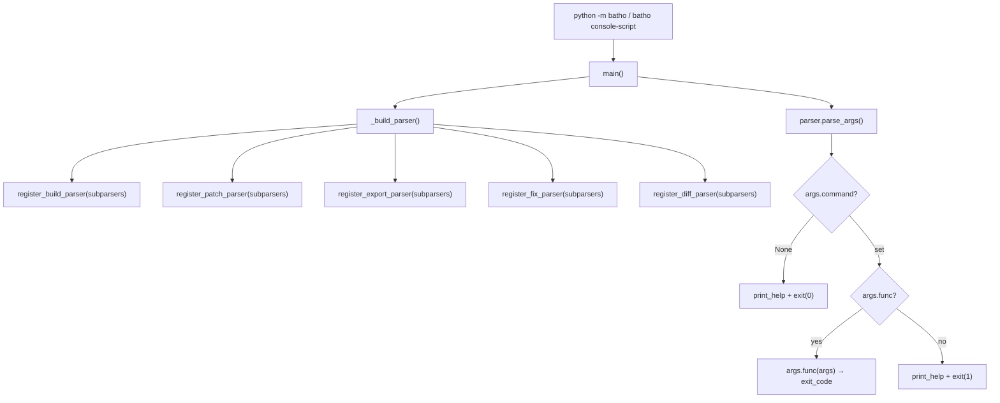
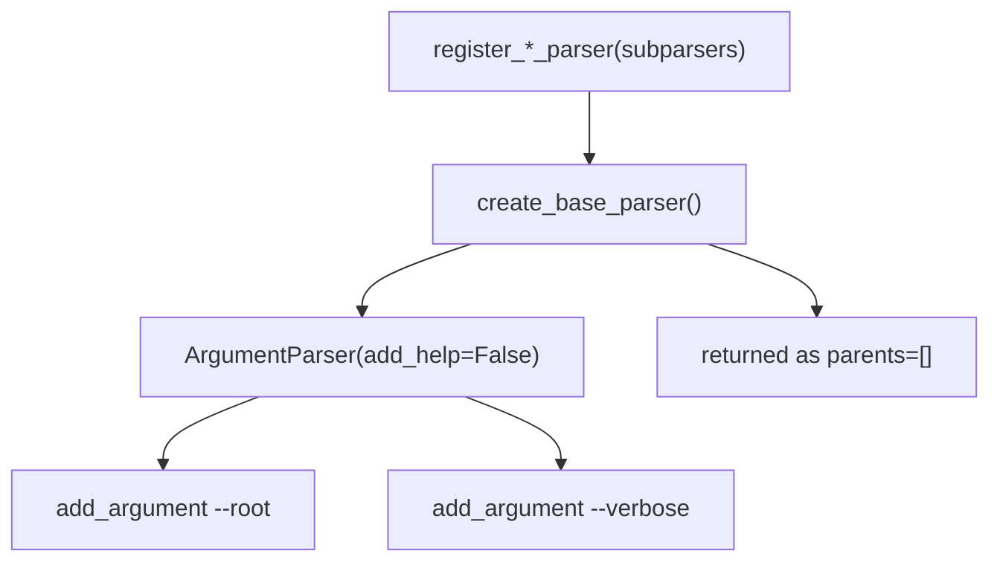
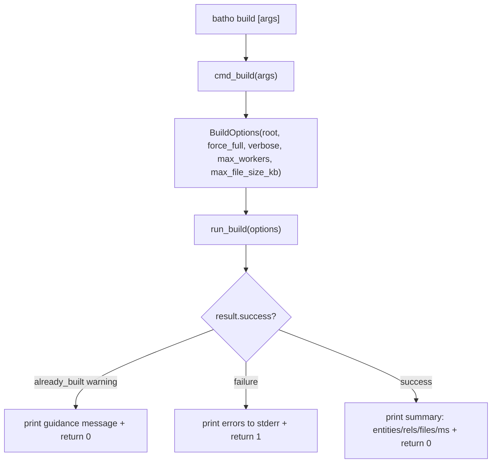
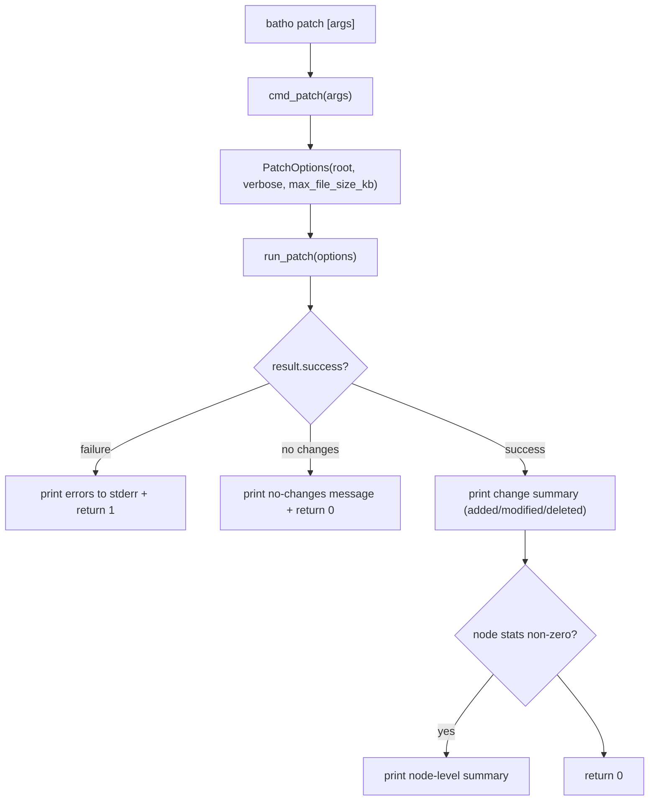
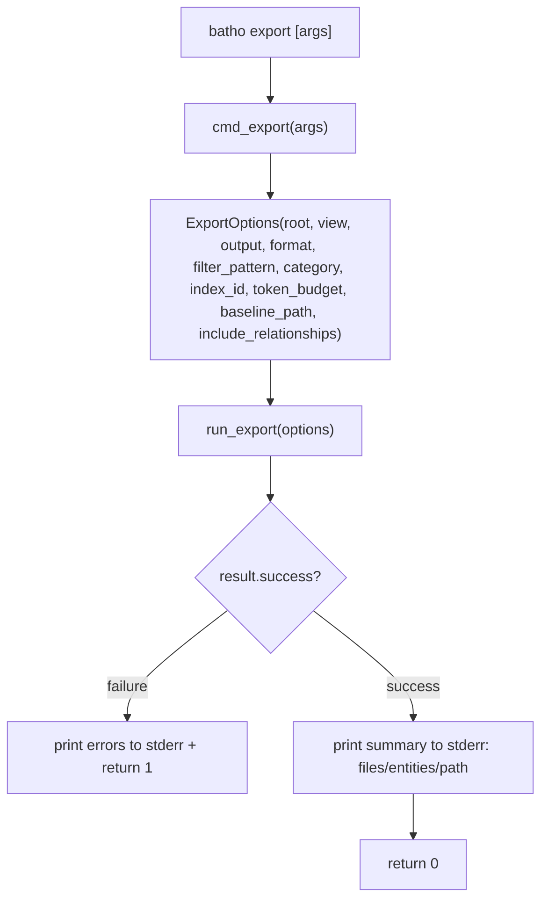
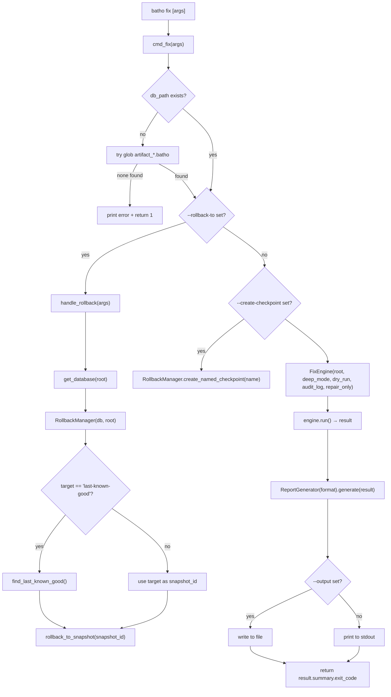
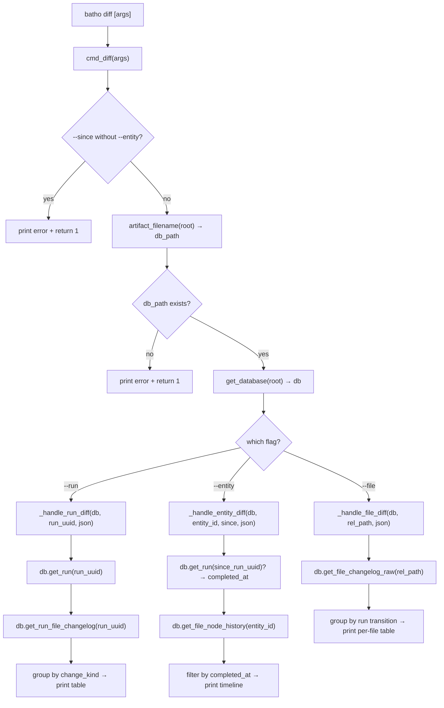
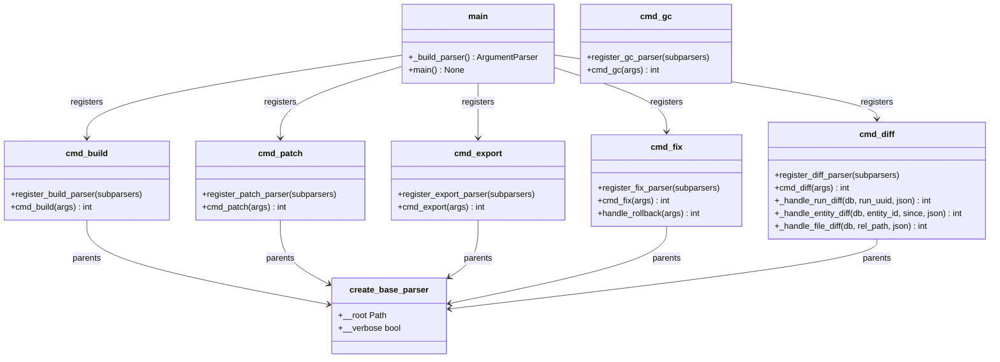

# Module: `batho.cli` (+ `batho_cli.py`)

## Overview

The CLI layer is the outermost entry point of Batho. `batho_cli.py` is the package entry-point that constructs the top-level `argparse` parser and dispatches to one of the five subcommands: `build`, `patch`, `export`, `fix`, and `diff`. Each subcommand lives in its own file under `batho/cli/` and follows the same thin-wrapper pattern: register argparse arguments, collect them into an Options dataclass, delegate all real work to the corresponding orchestrator or engine, and print a human-readable summary. The shared utilities module `_utils.py` provides a base parser (with `--root` and `--verbose`) that every subcommand inherits as a parent.

## Files Covered

| Filename | Size (bytes) | Purpose |
|---|---|---|
| `batho_cli.py` | 1 296 | Package entry point — builds top-level parser, dispatches `args.func(args)` |
| `batho/cli/_utils.py` | 800 | Shared argparse helpers (`create_base_parser`) |
| `batho/cli/build.py` | 2 440 | `batho build` — full index build wrapper |
| `batho/cli/patch.py` | 2 429 | `batho patch` — incremental patch wrapper |
| `batho/cli/export.py` | 4 239 | `batho export` — BSG artifact export wrapper |
| `batho/cli/fix.py` | 5 781 | `batho fix` — integrity check / repair / rollback wrapper |
| `batho/cli/gc.py` | 2 084 | `batho gc` — garbage collection and storage optimization |
| `batho/cli/diff.py` | 10 089 | `batho diff` — node-level changelog query | |

---

## Classes & Functions

### `batho_cli.py`

| Symbol | Type | Purpose | CLI Commands | Used? |
|---|---|---|---|---|
| `_build_parser` | function | Constructs top-level `argparse.ArgumentParser` and registers all 5 subcommand parsers via lazy imports | build, patch, export, fix, diff | ✅ Used |
| `main` | function | CLI entry point — parses args, validates `args.command`, calls `args.func(args)`, exits | build, patch, export, fix, diff | ✅ Used |

#### Call-Flow Flowchart

---

### `batho/cli/_utils.py`

| Symbol | Type | Purpose | CLI Commands | Used? |
|---|---|---|---|---|
| `create_base_parser` | function | Creates an `ArgumentParser(add_help=False)` with `--root` (Path, default `.`) and `--verbose` (bool). Used as `parents=[create_base_parser()]` in every subcommand parser | build, patch, export, fix, diff, gc | ✅ Used |

#### Call-Flow Flowchart

---

### `batho/cli/build.py`

| Symbol | Type | Purpose | CLI Commands | Used? |
|---|---|---|---|---|
| `register_build_parser` | function | Registers `build` subcommand with args: `--full`, `--max-workers`, `--max-file-size-kb`; sets `func=cmd_build` | build | ✅ Used |
| `cmd_build` | function | Entry point for `batho build`. Constructs `BuildOptions`, calls `run_build()`, interprets result: warns if already built, prints error on failure, prints success summary | build | ✅ Used |

#### Argument Reference

| Argument | Type | Default | Purpose |
|---|---|---|---|
| `--root` | `Path` | `.` | Repository root (inherited from base parser) |
| `--verbose` | flag | `False` | Enable debug logging (inherited) |
| `--full` | flag | `False` | Force full rebuild — deletes existing DB first |
| `--max-workers` | `int` | `None` (→ CPU count) | Parallel workers for parsing |
| `--max-file-size-kb` | `int` | `None` (→ config) | Skip files larger than N KB |

#### Call-Flow Flowchart

---

### `batho/cli/patch.py`

| Symbol | Type | Purpose | CLI Commands | Used? |
|---|---|---|---|---|
| `register_patch_parser` | function | Registers `patch` subcommand with `--max-file-size-kb`; sets `func=cmd_patch` | patch | ✅ Used |
| `cmd_patch` | function | Entry point for `batho patch`. Constructs `PatchOptions`, calls `run_patch()`, handles "no database", "no baseline", "no changes" warnings, prints change summary on success | patch | ✅ Used |

#### Argument Reference

| Argument | Type | Default | Purpose |
|---|---|---|---|
| `--root` | `Path` | `.` | Repository root (inherited) |
| `--verbose` | flag | `False` | Debug logging (inherited) |
| `--max-file-size-kb` | `int` | `None` (→ config) | Skip large files during hash scan |

#### Call-Flow Flowchart

---

### `batho/cli/export.py`

| Symbol | Type | Purpose | CLI Commands | Used? |
|---|---|---|---|---|
| `register_export_parser` | function | Registers `export` subcommand with `--view`, `--output`, `--index-id`, `--filter`, `--format`, `--category`, `--token-budget`, `--baseline`, `--rel`; sets `func=cmd_export` | export | ✅ Used |
| `cmd_export` | function | Entry point for `batho export`. Constructs `ExportOptions`, calls `run_export()`, prints error on failure, prints summary (file/entity count, output path) to stderr | export | ✅ Used |

#### Argument Reference

| Argument | Dest | Type | Default | Purpose |
|---|---|---|---|---|
| `--root` | `root` | `Path` | `.` | Repository root (inherited) |
| `--verbose` | `verbose` | flag | `False` | Debug logging (inherited) |
| `--view` | `view` | `str` | `storage` | JSON view type: `storage`, `agent`, `overview`, `files`, `symbols`, `dependencies`, `delta`, `rel` |
| `--output` | `output` | `Path` | `None` (→ `batho_export.json`) | Output file path |
| `--index-id` | `index_id` | `str` | `None` (→ latest) | Specific run ID to export |
| `--filter` | `filter_pattern` | `str` (glob) | `None` | Glob filter on file paths |
| `--format` | `output_format` | `str` | `json` | `json` or `pretty` |
| `--category` | `category` | `str` | `all` | BSG category filter: `source`, `test`, `doc`, `config`, `infra`, `all` |
| `--token-budget` | `token_budget` | `int` | `None` | Token limit for agent view |
| `--baseline` | `baseline_path` | `Path` | `None` | Previous export JSON for delta view |
| `--rel` | `include_relationships` | flag | `False` | Include relationship blob in output |

#### Call-Flow Flowchart

---

### `batho/cli/fix.py`

| Symbol | Type | Purpose | CLI Commands | Used? |
|---|---|---|---|---|
| `register_fix_parser` | function | Registers `fix` subcommand with `--deep`, `--dry-run`, `--format`, `--output`, `--rollback-to`, `--repair-only`, `--create-checkpoint`, `--no-audit`; sets `func=cmd_fix` | fix | ✅ Used |
| `cmd_fix` | function | Entry point for `batho fix`. Validates DB exists, dispatches to `handle_rollback()` if `--rollback-to`, optionally creates a checkpoint, runs `FixEngine`, generates and outputs report | fix | ✅ Used |
| `handle_rollback` | function | Handles the `--rollback-to` path: opens DB, creates `RollbackManager`, resolves `"last-known-good"` snapshot ID, calls `rollback_to_snapshot()` | fix | ✅ Used |

> **`__all__`**: Only `register_fix_parser` and `cmd_fix` are exported. `handle_rollback` is a module-level function called internally from `cmd_fix` but not exported.

#### Argument Reference

| Argument | Type | Default | Purpose |
|---|---|---|---|
| `--root` | `Path` | `.` | Repository root (inherited) |
| `--verbose` | flag | `False` | Debug logging (inherited) |
| `--deep` | flag | `False` | Comprehensive verification of all data |
| `--dry-run` | flag | `False` | Check only, no writes |
| `--format` | `str` | `text` | Report format: `text`, `json`, `csv` |
| `--output` | `Path` | `None` (stdout) | Write report to file |
| `--rollback-to` | `str` | `None` | Snapshot ID or `last-known-good` |
| `--repair-only` | `list[str]` | `None` (all checks) | Limit checks to: `database`, `registry`, `index`, `bsg`, `snapshots`, `cache`, `views` |
| `--create-checkpoint` | `str` | `None` | Create a named checkpoint before repairs |
| `--no-audit` | flag | `False` | Disable audit logging |

#### Call-Flow Flowchart

---

### `batho/cli/diff.py`

| Symbol | Type | Purpose | CLI Commands | Used? |
|---|---|---|---|---|
| `register_diff_parser` | function | Registers `diff` subcommand with mutually exclusive `--run`, `--entity`, `--file` and optional `--since`, `--json`; sets `func=cmd_diff` | diff | ✅ Used |
| `cmd_diff` | function | Entry point for `batho diff`. Validates `--since` only used with `--entity`, opens DB directly, dispatches to one of the three `_handle_*` functions | diff | ✅ Used |
| `_handle_run_diff` | function | Fetches all node changes in a single patch run via `db.get_run()` + `db.get_run_file_changelog()`, formats them grouped by change kind (`added`, `removed`, `modified`, `renamed`) | diff | ✅ Used |
| `_handle_entity_diff` | function | Fetches full evolution history of a single entity via `db.get_file_node_history()`, optionally filtered by `--since` run's `completed_at` timestamp | diff | ✅ Used |
| `_handle_file_diff` | function | Directly queries `file_changelog` table using raw SQL + `orjson` blob decompression to show all node changes across runs for a given relative file path | diff | ✅ Used |

#### Argument Reference

| Argument | Type | Default | Purpose |
|---|---|---|---|
| `--root` | `Path` | `.` | Repository root (inherited) |
| `--verbose` | flag | `False` | Debug logging (inherited) |
| `--run` | `str` | — | Show all node changes in a specific run UUID |
| `--entity` | `str` | — | Show full history of one entity ID |
| `--file` | `str` | — | Show all node changes in a file across runs |
| `--since` | `str` | `None` | Bound `--entity` history to runs after this run ID |
| `--json` | flag | `False` | Machine-readable JSON output |

> `--run`, `--entity`, `--file` are mutually exclusive and one is **required**.

#### Implementation Detail — `_handle_file_diff`

`_handle_file_diff` uses the public `db.get_file_changelog_raw(rel_path)` method which provides optimized raw SQL access to the `file_changelog` table while maintaining proper abstraction boundaries.

#### Call-Flow Flowchart

---

## Unused Symbols Summary

*(All symbols in this module are reachable from CLI commands)*

---

## Cross-File Architecture Notes

- **Pattern**: Every CLI file is a pure thin wrapper. All business logic lives in `batho/orchestrator/` (build, patch, export) or `batho/integrity/` (fix). `diff` is the exception — it directly queries the storage engine to avoid round-trips through an orchestrator.
- **`args.func` dispatch**: Each `register_*_parser()` calls `parser.set_defaults(func=cmd_*)`. `main()` then calls `args.func(args)` generically with no knowledge of specific commands.
- **Lazy imports**: All orchestrator imports (`from batho.orchestrator.build import ...`) happen inside the `cmd_*` functions, not at module level. This keeps CLI startup fast and avoids circular imports.
- **Exit codes**: All `cmd_*` functions return an integer exit code (`0` = success, `1` = user error, `2` = internal/engine error for `fix`). `main()` passes this to `sys.exit()`.
- **`diff` raw SQL**: `_handle_file_diff` uses the public `get_file_changelog_raw()` method which provides optimized access without breaking encapsulation.

