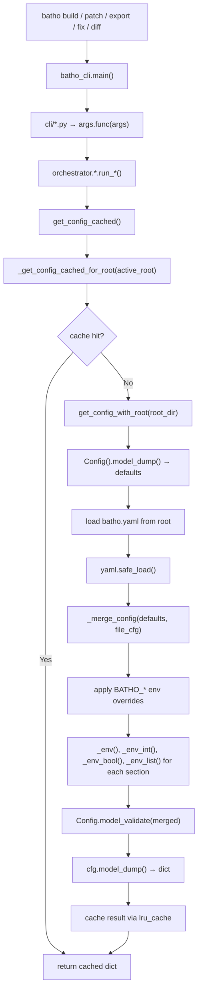

# Module: `batho.config`

## Overview

`batho.config` provides Batho's unified configuration system. It loads `batho.yaml` from the project root, merges with environment variables (all prefixed with `BATHO_`), applies Pydantic validation via `Config` model, and caches the result per root directory. The module is used by virtually every CLI command and orchestrator — it's the first thing imported after `batho_cli.py` parses arguments.

## Files Covered

| Filename | Size (bytes) | Purpose |
|---|---|---|
| `__init__.py` | 567 | Re-exports public API: config loading, root management, default content |
| `loader.py` | 17 462 | Core loading logic: YAML merge, env overrides, caching, default content |
| `models.py` | 9 458 | Pydantic models for all config sections (logging, indexer, patch, bsg, etc.) |
| `default-ignore-patterns.yaml` | 1 184 | Default ignore patterns for file scanning |

## Classes & Functions

### `models.py`

| Symbol | Type | Purpose | CLI Commands | Used? |
|---|---|---|---|---|
| `SCHEMA_VERSIONS` | constant | Dict mapping config keys to version strings (config, graph, bsg, snapshot, etc.) | build, patch, export, fix, diff | ✅ Used |
| `DEFAULT_LOG_LEVEL` | constant | Default: "INFO" | build, patch | ✅ Used |
| `DEFAULT_DB_PATH` | constant | Default: "{root}" | build, patch | ✅ Used |
| `DEFAULT_MAX_FILE_SIZE_KB` | constant | Default: 500 KB | build, patch | ✅ Used |
| `DEFAULT_MAX_INDEXED_FILES` | constant | Default: 200,000 | build, patch | ✅ Used |
| `DEFAULT_INDEX_WORKERS` | constant | Default: 0 (auto) | build, patch | ✅ Used |
| `DEFAULT_RULES_BUILTIN_PLUGINS` | constant | Tuple of 10 default BSG plugin names | build, patch | ✅ Used |
| `LoggingConfig` | class | Pydantic model: level, json_format, quiet, file, format | build, patch, export, fix, diff | ✅ Used |
| `PathsConfig` | class | Pydantic model: db_path | build, patch | ✅ Used |
| `IndexerConfig` | class | Pydantic model: max_file_size_kb, max_indexed_files, max_workers, ignore_patterns, etc. | build, patch | ✅ Used |
| `PatchConfig` | class | Pydantic model: timeout_seconds, max_changes, history_days, max_count, cleanup_on_startup | patch | ✅ Used |
| `FlagsConfig` | class | Pydantic model: fail_on_warning, strict, audit_log_enabled | build, patch | ✅ Used |
| `RulesConfig` | class | Pydantic model: enabled, auto_load_all_plugins, builtin_plugins, disabled_rules, etc. | build, patch | ✅ Used |
| `PluginsConfig` | class | Pydantic model: overrides (nested dict for plugin config) | build, patch | ✅ Used |
| `FileArtifactBlobsConfig` | class | Pydantic model: bsg_agent_view, bsg_storage_view, bsg_rel_view | export | ✅ Used |
| `RunArtifactBlobsConfig` | class | Pydantic model: context_overview, telemetry_metrics, structural_metrics, etc. | export | ✅ Used |
| `ArtifactBlobsConfig` | class | Pydantic model: wraps file_artifacts + run_artifacts | export | ✅ Used |
| `BsgParallelConfig` | class | Pydantic model: enabled, max_workers, chunk_size | build, patch | ✅ Used |
| `BsgIgnoreConfig` | class | Pydantic model: enabled | build, patch | ✅ Used |
| `BsgCacheConfig` | class | Pydantic model: enabled, max_size_mb, ttl_days | build, patch | ✅ Used |
| `BsgIncrementalConfig` | class | Pydantic model: enabled, auto_detect_git | patch | ✅ Used |
| `BsgSymbolResolutionConfig` | class | Pydantic model: enabled, fuzzy_matching, cache_symbols, etc. | build, patch | ✅ Used |
| `BsgSerializationConfig` | class | Pydantic model: method, compression, batch_size | build, patch | ✅ Used |
| `BsgParsingConfig` | class | Pydantic model: error_recovery, partial_parsing, max_file_size_mb, skip_comments | build, patch | ✅ Used |
| `BsgQueryConfig` | class | Pydantic model: enabled, index_on_write, cache_enabled, cache_size, etc. | build, patch | ✅ Used |
| `BsgStorageRetentionConfig` | class | Pydantic model: snapshot_ttl_days, patch_ttl_days, metrics_ttl_days, etc. | build, patch | ✅ Used |
| `BsgStorageConfig` | class | Pydantic model: enabled, content_scope, track_content_ids, busy_timeout_ms, etc. | build, patch | ✅ Used |
| `BsgBidirectionalConfig` | class | Pydantic model: enabled, include_gaps, verify_integrity, storage_view | build, patch | ✅ Used |
| `BsgConfig` | class | Pydantic model: aggregates all BSG sub-configs | build, patch | ✅ Used |
| `Config` | class | Root Pydantic model: schema_version + all section models | build, patch, export, fix, diff | ✅ Used |

---

#### Class Diagram

```mermaid
classDiagram
    class Config {
        +schema_version: str
        +logging: LoggingConfig
        +paths: PathsConfig
        +indexer: IndexerConfig
        +patch: PatchConfig
        +flags: FlagsConfig
        +rules: RulesConfig
        +plugins: PluginsConfig
        +artifact_blobs: ArtifactBlobsConfig
        +bsg: BsgConfig
    }
    class LoggingConfig { +level, +json_format, +quiet, +file, +format, +std_level, +effective_level }
    class PathsConfig { +db_path }
    class IndexerConfig { +max_file_size_kb, +max_indexed_files, +max_workers, +ignore_patterns, ... }
    class PatchConfig { +timeout_seconds, +max_changes, +history_days, +max_count, ... }
    class FlagsConfig { +fail_on_warning, +strict, +audit_log_enabled }
    class RulesConfig { +enabled, +builtin_plugins, +disabled_rules, +custom_rules_path, ... }
    class PluginsConfig { +overrides }
    class ArtifactBlobsConfig { +file_artifacts, +run_artifacts }
    class BsgConfig { +parallel, +ignore, +cache, +incremental, +symbol_resolution, ... }
    Config --> LoggingConfig
    Config --> PathsConfig
    Config --> IndexerConfig
    Config --> PatchConfig
    Config --> FlagsConfig
    Config --> RulesConfig
    Config --> PluginsConfig
    Config --> ArtifactBlobsConfig
    Config --> BsgConfig
```

---

### `loader.py`

| Symbol | Type | Purpose | CLI Commands | Used? |
|---|---|---|---|---|
| `_active_root` | contextvar | Thread-safe context variable storing the current project root Path | build, patch, export, fix, diff | ✅ Used |
| `set_active_root(root)` | function | Sets `_active_root` to resolved root, clears config cache | build, patch | ✅ Used |
| `get_active_root()` | function | Returns `_active_root` or cwd() if not set | build, patch, export, fix, diff | ✅ Used |
| `_env(name, default)` | function | Reads env var, returns default if None/empty | build, patch, export, fix, diff | ✅ Used |
| `_env_int(name, default)` | function | Reads env var as int, returns default on error | build, patch, export, fix, diff | ✅ Used |
| `_env_bool(name, default)` | function | Reads env var, returns bool (1/true/yes/on → True) | build, patch, export, fix, diff | ✅ Used |
| `_env_list(name)` | function | Reads comma-separated env var into list | build, patch, export, fix, diff | ✅ Used |
| `_merge_config(base, override)` | function | Deep-merges two dicts (override wins) | build, patch, export, fix, diff | ✅ Used |
| `get_config_with_root(root_dir)` | function | Loads batho.yaml, merges with defaults + env vars, returns validated dict | build, patch, export, fix, diff | ✅ Used |
| `_get_config_cached_for_root(root_dir)` | function | LRU-cached wrapper around get_config_with_root | build, patch, export, fix, diff | ✅ Used |
| `get_config_cached()` | function | Returns cached config for active root | build, patch, export, fix, diff | ✅ Used |
| `reload_config()` | function | Clears cache and returns fresh config | build, patch | ✅ Used |
| `get_default_batho_yaml_content()` | function | Returns default batho.yaml template as string | — | ❌ [UNUSED] |

---

#### Call-Flow Flowchart

## Database Path Resolution Behavior

The storage engine resolves the SQLite database path based on the `paths.db_path` configuration value:
- **`{root}` (Default)**: Resolves to `artifact_<repo_name>.batho` in the repository root.
- **Any other path (e.g. `.batho`, `data/batho.db`)**: Resolves relative to the repository root.
- **Empty / omitted**: Falls back to the `{root}` behavior.

---

## Unused Symbols Summary

*(All symbols in this module are reachable from CLI commands)*

