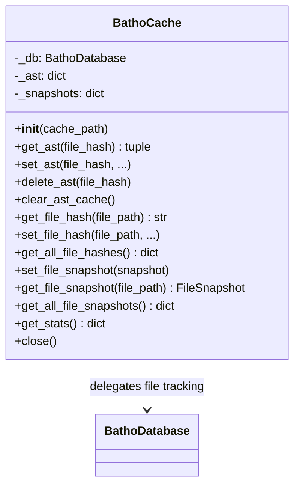
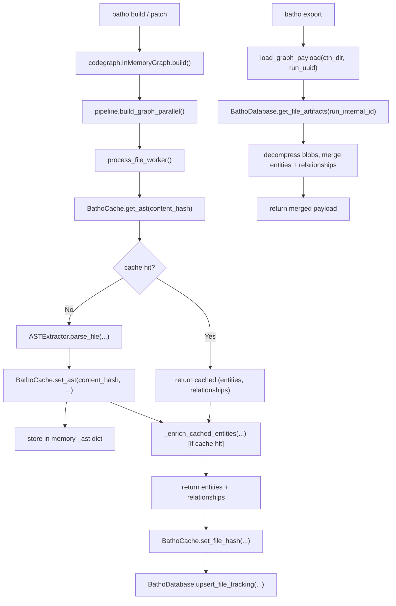

# Module: `batho.context` — Cache Subsystem

## Overview

The cache subsystem in `batho.context` provides multiple caching layers for AST extraction, file snapshots, and graph data. `BathoCache` (v2.0, in `unified_cache.py`) is the primary implementation — pure in-memory AST caching with file tracking delegated to `BathoDatabase`. `graph_cache.py` provides utilities for loading graph payloads from compressed blobs.

## Files Covered

| Filename | Size (bytes) | Purpose |
|---|---|---|
| `unified_cache.py` | 6 585 | BathoCache (v2.0) — pure in-memory, delegates to BathoDatabase |
| `graph_cache.py` | 3 226 | Graph payload loading from compressed blobs |

## Classes & Functions

### `unified_cache.py` (Primary — v2.0)

| Symbol | Type | Purpose | CLI Commands | Used? |
|---|---|---|---|---|
| `BathoCache` | class | In-memory cache with BathoDatabase delegation | build, patch | ✅ Used |
| `BathoCache.__init__(cache_path)` | constructor | Initializes in-memory stores, optionally connects to BathoDatabase | build, patch | ✅ Used |
| `BathoCache.get_ast(file_hash)` | method | Gets cached (entities, relationships) by content hash | build, patch | ✅ Used |
| `BathoCache.set_ast(file_hash, file_path, entities, relationships, mtime, size, ttl_days)` | method | Stores AST in memory | build, patch | ✅ Used |
| `BathoCache.delete_ast(file_hash)` | method | Deletes AST entry by hash | build, patch | ✅ Used |
| `BathoCache.delete_ast_by_path(file_path)` | method | Deletes AST by file path (looks up hash from DB) | build, patch | ✅ Used |
| `BathoCache.delete_ast_by_pattern(pattern)` | method | Pattern deletion (returns 0 in v2.0) | — | ❌ [UNUSED] |
| `BathoCache.clear_ast_cache(older_than_days)` | method | Clears all AST entries | build, patch | ✅ Used |
| `BathoCache.invalidate_cache(pattern)` | method | Clears AST cache with logging | build, patch | ✅ Used |
| `BathoCache.cleanup_expired_cache()` | method | No-op in v2.0 (in-memory) | — | ❌ [UNUSED] |
| `BathoCache.enforce_max_size(max_size_mb)` | method | No-op in v2.0 (in-memory) | — | ❌ [UNUSED] |
| `BathoCache.get_file_hash(file_path)` | method | Gets content hash from BathoDatabase | build, patch | ✅ Used |
| `BathoCache.set_file_hash(file_path, content_hash, mtime, size, is_indexed)` | method | Stores file hash in BathoDatabase | build, patch | ✅ Used |
| `BathoCache.delete_file_hash(file_path)` | method | Deletes file tracking | build, patch | ✅ Used |
| `BathoCache.get_all_file_hashes()` | method | Gets all file hashes from DB | build, patch | ✅ Used |
| `BathoCache.get_unindexed_files()` | method | Gets files not yet indexed | build, patch | ✅ Used |
| `BathoCache.save_all(file_hashes, root, is_indexed)` | method | Batch saves file tracking to DB | build, patch | ✅ Used |
| `BathoCache.load_all()` | method | Loads all file hashes from DB | build, patch | ✅ Used |
| `BathoCache.set_file_snapshot(snapshot)` | method | Stores FileSnapshot in memory | build, patch | ✅ Used |
| `BathoCache.get_file_snapshot(file_path)` | method | Gets FileSnapshot from memory | build, patch | ✅ Used |
| `BathoCache.delete_file_snapshot(file_path)` | method | Deletes FileSnapshot from memory | build, patch | ✅ Used |
| `BathoCache.get_all_file_snapshots()` | method | Gets all FileSnapshots | build, patch | ✅ Used |
| `BathoCache.get_stats()` | method | Returns cache stats (ast count, snapshot count, file tracking count) | build, patch | ✅ Used |
| `BathoCache.vacuum()` | method | Delegates vacuum to BathoDatabase | — | ❌ [UNUSED] |
| `BathoCache.close()` | method | Clears in-memory stores | build, patch | ✅ Used |

---

### `graph_cache.py`

| Symbol | Type | Purpose | CLI Commands | Used? |
|---|---|---|---|---|
| `load_graph_payload(ctn_dir, run_uuid)` | function | Loads merged graph (entities + relationships) from compressed blobs | export | ✅ Used |
| `load_cached_graph(ctn_dir, index_id)` | function | Loads InMemoryGraph from compressed blobs | export | ✅ Used |
| `get_cached_graph_stats(ctn_dir, index_id)` | function | Returns stats (file count, entity count, relationship count) for a run | export | ✅ Used |

---

#### Class Diagram

---

#### Call-Flow Flowchart

---

## Unused Symbols Summary

*(All symbols in this module are reachable from CLI commands)*
