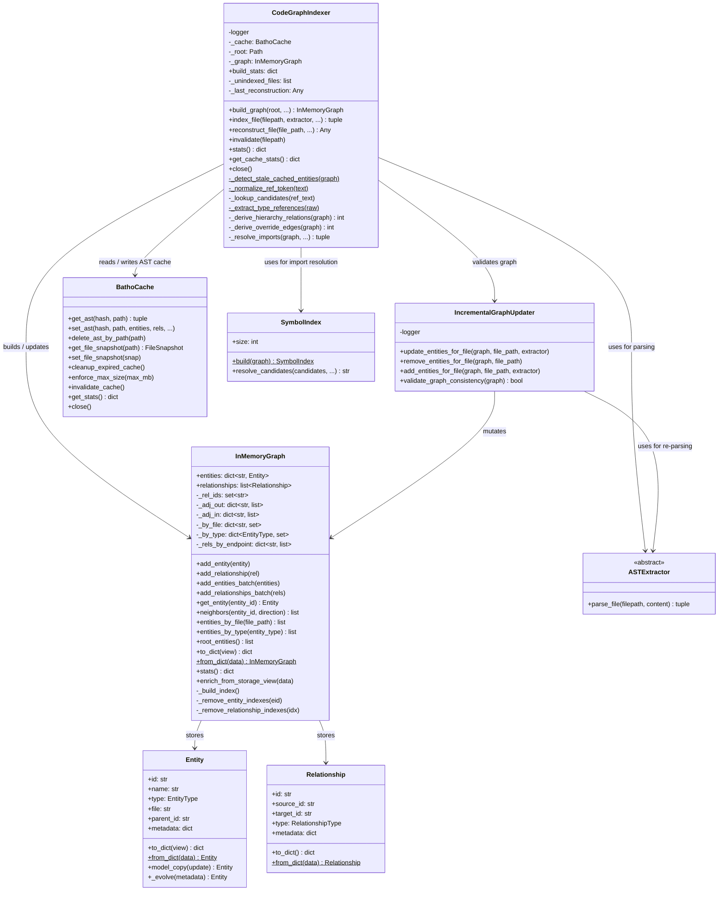
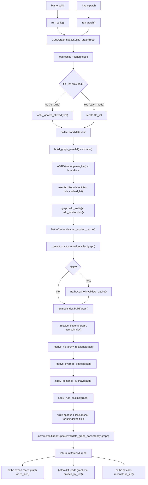

# Module: `batho.context.codegraph`

## Overview

`batho/context/codegraph.py` is the production Code Graph Indexer for Batho. It provides the three core runtime classes that drive all graph construction and maintenance: `InMemoryGraph` (an in-memory graph of code entities and relationships with lazy adjacency indexes and O(k) secondary lookups), `IncrementalGraphUpdater` (transactional file-level add/remove operations for patch operations), and `CodeGraphIndexer` (the top-level orchestrator that walks a repository, dispatches parallel AST extraction via `build_graph_parallel`, resolves cross-file imports, derives hierarchy/override edges, applies semantic overlays and rule plugins, and writes AST results back to the SQLite-backed `BathoCache`). The module is synchronous (no async) and designed for both CLI and daemon usage. It is the primary entry point for `batho build` and `batho patch` pipelines.

## Files Covered

| Filename | Size (bytes) | Purpose |
|---|---|---|
| `codegraph.py` | 65 860 | Production Code Graph Indexer — `InMemoryGraph`, `IncrementalGraphUpdater`, `CodeGraphIndexer` |

## Classes & Functions

### `codegraph.py`

| Symbol | Type | Purpose | CLI Commands | Used? |
|---|---|---|---|---|
| `InMemoryGraph` | class | In-memory store of all extracted `Entity` and `Relationship` objects; maintains lazy adjacency index and three secondary indexes (`_by_file`, `_by_type`, `_rels_by_endpoint`) | build, patch, export, fix, diff | ✅ Used |
| `  __init__` | method | Initialises entity/relationship dicts and all secondary indexes from optional seed data | build, patch, export, fix, diff | ✅ Used |
| `  add_entity` | method | Adds a single entity and updates `_by_file` + `_by_type` indexes | build, patch | ✅ Used |
| `  add_relationship` | method | Deduplicates by `_rel_ids` set, appends relationship, and does incremental adjacency cache update | build, patch | ✅ Used |
| `  add_entities_batch` | method | Batch-add entities in one loop — avoids repeated index lookups | build, patch | ✅ Used |
| `  add_relationships_batch` | method | Batch-add relationships with same dedup + incremental cache strategy as single add | build, patch | ✅ Used |
| `  get_entity` | method | O(1) entity lookup by ID | build, patch, export, fix, diff | ✅ Used |
| `  _build_index` | method | (Re)builds `_adj_out` / `_adj_in` lazy adjacency dictionaries from full relationships list | build, patch, export, fix, diff | ✅ Used |
| `  neighbors` | method | Returns outbound, inbound, or all neighbour entity IDs; triggers lazy index build on first call | export, fix, diff | ✅ Used |
| `  entities_by_file` | method | O(k) lookup of all entities for a given file path using `_by_file` secondary index | build, patch, export, fix, diff | ✅ Used |
| `  entities_by_type` | method | O(k) lookup of all entities of a given `EntityType` using `_by_type` secondary index | build, patch, export, fix, diff | ✅ Used |
| `  _remove_entity_indexes` | method | Removes entity from `_by_file` and `_by_type` secondary indexes (internal helper) | patch | ✅ Used |
| `  _remove_relationship_indexes` | method | No-op placeholder; index rebuild triggered on next `_rels_by_endpoint` access | patch | ✅ Used |
| `  root_entities` | method | Returns entities whose `parent_id` is `None` (top-level graph nodes) | export, diff | ✅ Used |
| `  to_dict` | method | Serialises the graph to a dict with `entities`, `entities_by_id`, and `relationships` keys; accepts a `view` parameter (e.g. `"storage"`) | export | ✅ Used |
| `  from_dict` | classmethod | Deserialises a graph from dict produced by `to_dict` | export, diff | ✅ Used |
| `  stats` | method | Returns diagnostic counters: entity count, relationship count, file count, entity/relationship type breakdowns | build, patch | ✅ Used |
| `  enrich_from_storage_view` | method | Back-fills `raw_content` / `raw_bytes` onto existing entities from a storage-view dict; used when loading from DB | export, diff | ✅ Used |
| `  __len__` | method | Returns `len(self.entities)` | build, patch | ✅ Used |
| `  __contains__` | method | Checks entity ID membership | build, patch | ✅ Used |
| `  __repr__` | method | Human-readable summary string | — | ✅ Used |
| `IncrementalGraphUpdater` | class | Handles transactional file-level graph mutations for incremental patch operations | patch, fix | ✅ Used |
| `  __init__` | method | Initialises a module logger | patch, fix | ✅ Used |
| `  update_entities_for_file` | method | High-level: removes all existing entities for file, then re-parses and adds new entities | patch | ✅ Used |
| `  remove_entities_for_file` | method | O(removed × degree) entity + relationship removal using `_by_file` and `_rels_by_endpoint` secondary indexes; updates adjacency cache incrementally; raises `GraphConsistencyError` on failure | patch | ✅ Used |
| `  add_entities_for_file` | method | Reads file bytes, detects language extractor (via `default_detector` or registry), parses, and adds entities/relationships to graph | patch | ✅ Used |
| `  validate_graph_consistency` | method | Checks all relationship source/target IDs against known entity IDs; allows external prefixes (`external:`, `file:`, etc.) and UNRESOLVED types; returns `bool` | build, fix | ✅ Used |
| `CodeGraphIndexer` | class | Top-level indexer orchestrating full-build and patch-mode indexing pipelines | build, patch, export, fix, diff | ✅ Used |
| `  __init__` | method | Initialises logger, `BathoCache`, optional root path, and housekeeping state (`build_stats`, `_last_reconstruction`, `_unindexed_files`) | build, patch | ✅ Used |
| `  close` | method | Closes `BathoCache` database connection to release file locks | build, patch | ✅ Used |
| `  __enter__` | method | Context manager entry — returns `self` | build, patch | ✅ Used |
| `  __exit__` | method | Context manager exit — calls `close()` | build, patch | ✅ Used |
| `  get_unindexed_files` | method | Returns copy of `_unindexed_files` list of `(abs_path, rel_path)` tuples for files with no supported extractor | build | ✅ Used |
| `  clear_unindexed_files` | method | Clears the unindexed files list | build | ✅ Used |
| `  build_graph` | method | **Core entry point**: walks root dir (or uses `file_list` for patch mode), resolves workers count, delegates to `build_graph_parallel`, then runs import resolution, hierarchy/override derivation, semantic overlay, rule plugins, and cache cleanup. Returns populated `InMemoryGraph`. | build, patch | ✅ Used |
| `  index_file` | method | On-demand single-file indexing: always re-parses and updates cache; returns `(entities, relationships)` tuple | build, patch | ✅ Used |
| `  reconstruct_file` | method | Delegates to `FileReconstructor.reconstruct_file()`; resolves entities from internal `_graph` if not provided | fix | ✅ Used |
| `  invalidate` | method | Deletes a file's AST cache entry via `BathoCache.delete_ast_by_path()` to force re-parse on next build | patch | ✅ Used |
| `  stats` | method | Returns `{"cached_files": N}` from cache stats | — | ✅ Used |
| `  get_cache_stats` | method | Returns full cache statistics dict from `BathoCache.get_stats()` | — | ✅ Used |
| `  _detect_stale_cached_entities` | method | Static; detects legacy `"unresolved:"` prefixed relationship targets or >10 broken references (Phase 8 migration check) | build | ✅ Used |
| `  _normalize_ref_token` | method | Static; strips trailing punctuation, `as` aliases, quotes, and `<>` brackets; converts `::` to `.` | build, patch | ✅ Used |
| `  _lookup_candidates` | method | Classmethod; generates ordered candidate tokens from a reference string (full, tail, stem, last-segment) | build, patch | ✅ Used |
| `  _extract_type_references` | method | Static; parses raw `bases`/`extends`/`implements` metadata into de-duplicated token list; filters language keywords | build | ✅ Used |
| `  _derive_hierarchy_relations` | method | Derives `INHERITS`/`IMPLEMENTS` edges from entity metadata (`bases`, `extends`, `implements` keys); skips duplicates | build | ✅ Used |
| `  _derive_override_edges` | method | Derives `OVERRIDES` edges by walking `CONTAINS` + `INHERITS` graph: finds methods with matching names in ancestor classes | build | ✅ Used |
| `  _resolve_imports` | method | Resolves `EntityType.UNRESOLVED` entities via `SymbolIndex`; re-points relationships to real entity IDs; prunes unresolvable nodes after `max_unresolved_attempts`; also migrates stale `"unresolved:"` string targets | build, patch | ✅ Used |
| `_load_ignore_spec` | constant | Module-level alias for `batho.utils.ignore.load_ignore_spec` (backward-compat re-export) | build, patch | ✅ Used |
| `_is_ignored` | constant | Module-level alias for `batho.utils.ignore.is_ignored` (backward-compat re-export) | build, patch | ✅ Used |

---

#### Class Diagram

---

#### Call-Flow Flowchart

---

## Unused Symbols Summary

*(All symbols in this module are reachable from CLI commands)*
