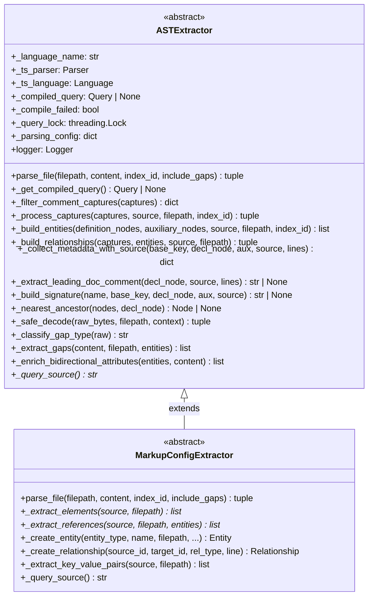
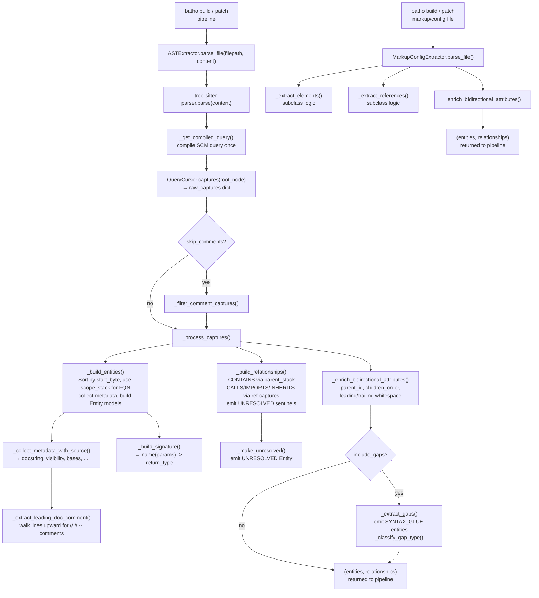

# Module: `batho.context.extractor`

## Overview

`batho/context/extractor.py` is the production-hardened AST extraction engine that turns raw source-code bytes into structured, frozen Pydantic models (`Entity` and `Relationship`). It provides two abstract base classes — `ASTExtractor` for programming-language files and `MarkupConfigExtractor` for markup/config files — that language-specific subclasses fill in by supplying a tree-sitter SCM query string (or custom element-extraction logic). The base classes handle every concern that is identical across languages: tree-sitter parsing, capture grouping, fully-qualified name (FQN) computation via a monotonic scope stack, metadata / docstring collection, CONTAINS and reference relationship building, gap-entity (SYNTAX_GLUE) emission for 100% byte coverage, bidirectional-attribute enrichment (parent_id / children_order / whitespace), and per-file exception isolation so a single bad file never aborts a pipeline scan.

## Files Covered

| Filename | Size (bytes) | Purpose |
|---|---|---|
| `extractor.py` | 58,815 | Abstract AST extraction base classes, capture-processing pipeline, helpers |

## Classes & Functions

### `extractor.py`

| Symbol | Type | Purpose | CLI Commands | Used? |
|---|---|---|---|---|
| `_META_SUFFIXES` | constant | Frozenset of auxiliary capture-name suffixes (`params`, `return_type`, `docstring`, etc.) used to distinguish metadata captures from definition-name captures | build, patch | ✅ Used |
| `_CAPTURE_ENTITY_MAP` | constant | `dict[str, EntityType]` — maps `def.*` capture base keys to `EntityType` enum values | build, patch | ✅ Used |
| `_CAPTURE_REL_MAP` | constant | `dict[str, RelationshipType]` — maps `ref.*` capture base keys to `RelationshipType` values | build, patch | ✅ Used |
| `_node_text` | function | Slice raw source bytes from a tree-sitter `Node` and decode to a clean UTF-8 string | build, patch | ✅ Used |
| `_clean_docstring` | function | Strip surrounding quote characters (including prefixed literals like `b"""`) from a captured docstring node | build, patch | ✅ Used |
| `_relationship_capture_info` | function | Map a raw capture name (e.g. `ref.call`) to a `(RelationshipType, variant)` tuple for use in relationship building | build, patch | ✅ Used |
| `_normalize_import_target` | function | Strip quotes, angle brackets, `as`-aliases, and `::` separators from a raw import string to produce a resolvable module/symbol path | build, patch | ✅ Used |
| `_expand_import_targets` | function | Expand Rust-style grouped imports (`foo::{bar, baz}`) into a flat list of import target candidates; also splits on `/` and `.` | build, patch | ✅ Used |
| `ASTExtractor` | class | Abstract base class for tree-sitter-based language extractors. Handles parsing, capture grouping, entity/relationship building, gap extraction, and bidirectional enrichment | build, patch | ✅ Used |
| `  __init__` | method | Initialise the tree-sitter parser and language, compile a reusable query cache, and bind a structured logger | build, patch | ✅ Used |
| `  _get_compiled_query` | method | Thread-safe lazy compilation of the tree-sitter SCM query; caches success and failure to avoid re-work | build, patch | ✅ Used |
| `  _query_source` | method | **Abstract** — subclasses return the tree-sitter SCM query string for their language | build, patch | ✅ Used |
| `  parse_file` | method | **Primary public API** — parses raw bytes for one file, returns `(entities, relationships)`. Fully exception-isolated; handles error recovery, comment filtering, gap extraction | build, patch | ✅ Used |
| `  _filter_comment_captures` | method | Remove comment-typed nodes from the raw captures dict when `skip_comments` is enabled | build, patch | ✅ Used |
| `  _process_captures` | method | Route raw tree-sitter captures into definition-name nodes vs. auxiliary-metadata nodes, then delegate to `_build_entities` and `_build_relationships` | build, patch | ✅ Used |
| `  _build_entities` | method | Convert grouped definition captures into frozen `Entity` models. Uses a monotonic scope stack to build dot-notation FQNs; appends a 6-char param-hash suffix for overloaded symbols | build, patch | ✅ Used |
| `  _build_relationships` | method | Build `CONTAINS`, `CALLS`, `IMPORTS`, `INHERITS`, `IMPLEMENTS`, and `USES` `Relationship` models from reference captures; emits `UNRESOLVED` sentinel entities for unresolvable targets | build, patch | ✅ Used |
| `  _collect_metadata_with_source` | method | Collect `EntityMetadata` dict from auxiliary captures (`visibility`, `docstring`, `bases`, `extends`, `implements`, `receiver`, `type`); falls back to leading-comment extraction | build, patch | ✅ Used |
| `  _extract_leading_doc_comment` | method | Walk source lines upward from a declaration to collect contiguous comment lines as a fallback docstring. Supports `#`, `//`, `--`, `;`, `%`, and `/* */` block styles | build, patch | ✅ Used |
| `  _build_signature` | method | Construct a human-readable signature string (`name(params) -> return_type`) from auxiliary param/return-type capture nodes | build, patch | ✅ Used |
| `  _nearest_ancestor` | method | Static helper — find the auxiliary-capture node whose ancestor chain includes the given declaration node (resolves overloaded/nested definitions correctly) | build, patch | ✅ Used |
| `  _enrich_entity` | method | Optional hook for subclasses to re-collect full metadata after entity construction via `model_copy()` | — | ❌ [UNUSED] |
| `  _safe_decode` | method | Decode bytes with strict UTF-8; on failure returns replacement-character string plus original `raw_bytes` for lossless reconstruction | build, patch | ✅ Used |
| `  _COMMENT_PREFIXES` | constant | Set of comment-prefix strings used by `_classify_gap_type` and `_extract_gaps` | build, patch | ✅ Used |
| `  _classify_gap_type` | method | Classify uncovered-byte gap content as `whitespace`, `comment`, `import`, `separator`, or `code` | build, patch | ✅ Used |
| `  _extract_gaps` | method | Emit `SYNTAX_GLUE` `Entity` objects for every byte range not covered by semantic entities, enabling 100% file-byte coverage | build, patch | ✅ Used |
| `  _enrich_bidirectional_attributes` | method | Single-pass algorithm (monotonic stack) to resolve `parent_id`, `children_order`, `leading_whitespace`, and `trailing_whitespace` on all entities; evolves each entity at most once | build, patch | ✅ Used |
| `MarkupConfigExtractor` | class | Abstract base class for markup/config file extractors (HTML, CSS, Markdown, JSON, YAML, TOML, HCL). Overrides `parse_file()` to delegate to `_extract_elements` / `_extract_references` instead of SCM query execution | build, patch | ✅ Used |
| `  __init__` | method | Initialise without a real tree-sitter parser (`_ts_parser = None`); set up the structured logger bound to the language name | build, patch | ✅ Used |
| `  _query_source` | method | Returns empty string — markup extractors bypass the SCM query pipeline | build, patch | ✅ Used |
| `  _extract_elements` | method | **Abstract** — subclasses return a list of `Entity` objects for structural elements in the markup/config | build, patch | ✅ Used |
| `  _extract_references` | method | **Abstract** — subclasses return a list of `Relationship` objects linking extracted elements | build, patch | ✅ Used |
| `  parse_file` | method | Parse a markup/config file: calls `_extract_elements`, enriches entities with `raw_content` / `content_hash`, stamps `index_id`, calls `_enrich_bidirectional_attributes`, and optionally emits gap entities | build, patch | ✅ Used |
| `  _create_entity` | method | Helper factory for `Entity` construction with consistent `language` metadata default | build, patch | ✅ Used |
| `  _create_relationship` | method | Helper factory for `Relationship` construction with consistent `line_number` metadata | build, patch | ✅ Used |
| `  _extract_key_value_pairs` | method | Default no-op implementation; subclasses may override to extract key-value pair entities | — | ❌ [UNUSED] |

---

#### Class Diagram

---

#### Call-Flow Flowchart

---

## Unused Symbols Summary

- `_enrich_entity` — optional subclass hook for post-construction metadata enrichment; no language extractor in the codebase currently calls this method. It is reachable in theory via a subclass override, but not invoked by any CLI path.
- `_extract_key_value_pairs` (on `MarkupConfigExtractor`) — declared as a default no-op. No subclass currently calls `super()._extract_key_value_pairs()` or invokes it directly; it is dead code in the current CLI-reachable paths.
