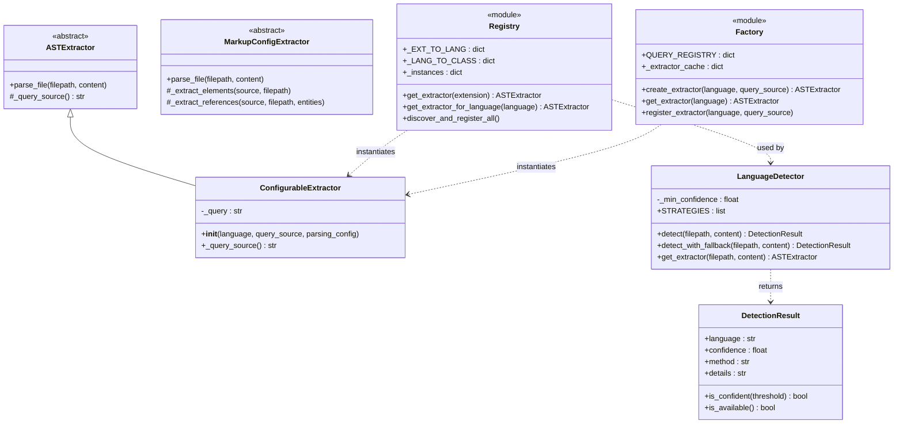
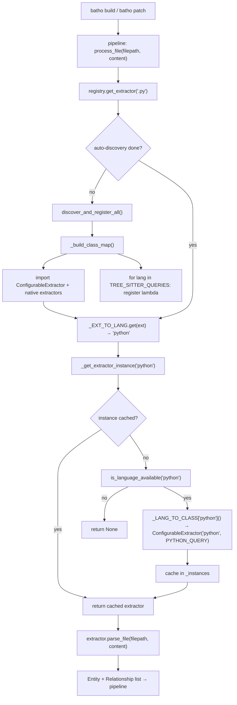
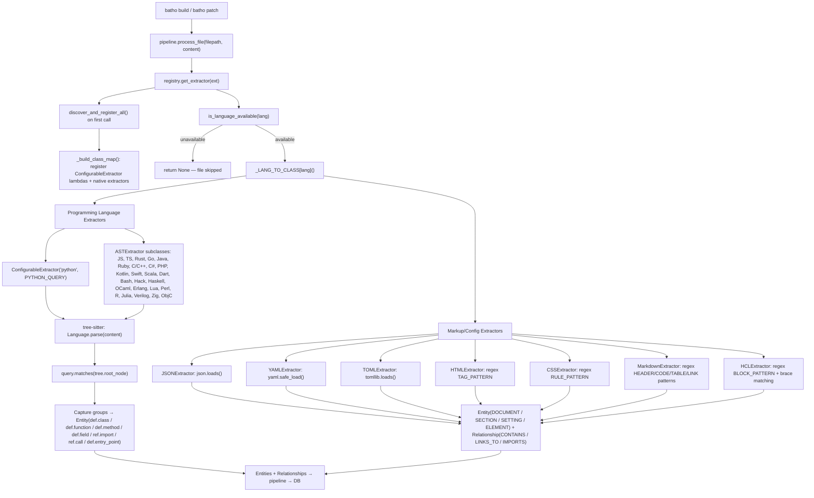

# Module: `batho.context.languages`

## Overview

This sub-package is the language intelligence layer of the Batho context pipeline. It translates raw source files into structured `Entity` and `Relationship` objects for every supported language by means of two distinct extraction strategies: (1) **tree-sitter AST extraction** for programming languages (Python, Rust, Go, Java, TypeScript, C/C++, and ~20 others), and (2) **native regex / stdlib-parser extraction** for markup and configuration formats (JSON, YAML, TOML, HTML, CSS, Markdown, HCL/Terraform). A central **registry** maps file extensions to cached extractor singletons so that each language parser is initialised at most once per process. A multi-strategy **detector** can infer language from extension, shebang, magic bytes, or content heuristics when the extension alone is insufficient. A **factory** layer provides a `ConfigurableExtractor` subclass that wraps a language name + SCM query string, eliminating the ~40-line boilerplate of traditional per-language subclasses. All tree-sitter SCM queries live in a single source-of-truth file (`_queries.py`). The primary CLI entry points that exercise this module are **`batho build`** and **`batho patch`**, both of which call `registry.get_extractor(ext)` during file indexing.

---

## Files Covered

| Filename | Size (bytes) | Purpose |
|---|---|---|
| `__init__.py` | 4 485 | Package bootstrap — re-exports all extractor classes, registry helpers, detector API, and factory API |
| `_common.py` | 9 290 | Shared tree-sitter query fragments (`CommonQueries`, `ImportPatterns`, `CallPatterns`) and query-builder utilities |
| `_queries.py` | 50 284 | Single source-of-truth dictionary `TREE_SITTER_QUERIES` — one SCM query string per programming language (21 languages, ~1 100 lines) |
| `detector.py` | 18 113 | `LanguageDetector` with five ordered strategies: extension → special-filename → shebang → magic-bytes → content-heuristics |
| `factory.py` | 6 513 | `ConfigurableExtractor` (concrete `ASTExtractor` subclass driven by injected query string) + singleton cache, `create_extractor()`, `get_extractor()`, `register_extractor()` |
| `registry.py` | 15 247 | Extension → language name mapping `_EXT_TO_LANG`, lazy singleton cache `_instances`, public `get_extractor(ext)` / `get_extractor_for_language(lang)` API |
| `python.py` | 604 | Thin shim — `PythonExtractor(ConfigurableExtractor)` |
| `javascript.py` | 3 093 | `JavaScriptExtractor(ASTExtractor)` with inline query + `CommonQueries` entry-points |
| `typescript.py` | 3 749 | `TypeScriptExtractor(ASTExtractor)` — adds interfaces, accessibility modifiers, return-type annotations |
| `rust.py` | 3 230 | `RustExtractor(ASTExtractor)` — structs, enums, traits, free functions, impl-block methods |
| `go.py` | 2 895 | `GoExtractor(ASTExtractor)` — functions, methods (with receiver), structs, interfaces |
| `java.py` | 2 911 | `JavaExtractor(ASTExtractor)` — classes (extends/implements), methods, constructors, fields |
| `ruby.py` | 2 719 | `RubyExtractor(ASTExtractor)` — classes, modules, methods, require/load imports |
| `c.py` | 2 482 | `CExtractor(ASTExtractor)` — functions, structs, `#include` |
| `cpp.py` | 3 480 | `CppExtractor(ASTExtractor)` — classes, structs, namespaces, functions, methods |
| `csharp.py` | 3 749 | `CSharpExtractor(ASTExtractor)` — classes, structs, interfaces, enums, methods, properties |
| `kotlin.py` | 3 078 | `KotlinExtractor(ASTExtractor)` — classes, interfaces, object declarations, functions, methods |
| `swift.py` | 3 714 | `SwiftExtractor(ASTExtractor)` — classes, structs, enums, protocols, functions, methods |
| `scala.py` | 3 517 | `ScalaExtractor(ASTExtractor)` — classes, objects (singletons), traits, methods |
| `dart.py` | 3 281 | `DartExtractor(ASTExtractor)` — classes, methods, functions, imports |
| `php.py` | 3 095 | `PHPExtractor(ASTExtractor)` — classes, interfaces, traits, functions, methods, use-statements |
| `hack.py` | 3 466 | `HackExtractor(ASTExtractor)` — classes, interfaces, functions, methods |
| `haskell.py` | 3 107 | `HaskellExtractor(ASTExtractor)` — function bindings and type signatures |
| `ocaml.py` | 3 523 | `OCamlExtractor(ASTExtractor)` — let-bindings (functions), module definitions, module types |
| `erlang.py` | 2 874 | `ErlangExtractor(ASTExtractor)` — function declarations, calls |
| `lua.py` | 2 773 | `LuaExtractor(ASTExtractor)` — function declarations, local function declarations, calls |
| `perl.py` | 2 643 | `PerlExtractor(ASTExtractor)` — subroutine declarations, calls |
| `r.py` | 2 019 | `RExtractor(ASTExtractor)` — function definitions, calls |
| `julia.py` | 3 583 | `JuliaExtractor(ASTExtractor)` — function definitions, short-form assignments, calls |
| `bash.py` | 2 373 | `BashExtractor(ASTExtractor)` — functions, aliases, variable assignments, source statements |
| `objectivec.py` | 4 057 | `ObjectiveCExtractor(ASTExtractor)` — `@interface`/`@implementation`, categories, protocols, methods, properties |
| `verilog.py` | 4 086 | `VerilogExtractor(ASTExtractor)` — module declarations, functions, tasks |
| `zig.py` | 3 625 | `ZigExtractor(ASTExtractor)` — function declarations, container fields |
| `json.py` | 8 424 | `JSONExtractor(MarkupConfigExtractor)` — objects (SECTION), arrays (SECTION), scalars (SETTING), CONTAINS relationships |
| `yaml.py` | 9 446 | `YAMLExtractor(MarkupConfigExtractor)` — mappings (SECTION), sequences (SECTION rollup), scalars (SETTING) |
| `toml.py` | 8 512 | `TOMLExtractor(MarkupConfigExtractor)` — tables (SECTION), arrays (SECTION rollup), scalars (SETTING) |
| `html.py` | 8 271 | `HTMLExtractor(MarkupConfigExtractor)` — tags (ELEMENT), attributes in metadata, LINKS_TO, IMPORTS_STYLE |
| `css.py` | 8 881 | `CSSExtractor(MarkupConfigExtractor)` — rules/at-rules (ELEMENT), properties (SETTING), @import → IMPORTS |
| `markdown.py` | 13 284 | `MarkdownExtractor(MarkupConfigExtractor)` — frontmatter (SETTING), headers/code-blocks/tables (ELEMENT), links (LINKS_TO) |
| `hcl.py` | 12 350 | `HCLExtractor(MarkupConfigExtractor)` — HCL/Terraform blocks (SECTION), attributes (SETTING), resource/var/module references |

---

## Section 1 — Registry, Factory & Detector

### `registry.py`

| Symbol | Type | Purpose | CLI Commands | Used? |
|---|---|---|---|---|
| `_EXT_TO_LANG` | constant | `dict[str, str]` — maps ~70 file extensions (incl. leading dot) to language names; e.g. `".py" → "python"`, `".tsx" → "typescript"` | build, patch | ✅ Used |
| `_TREE_SITTER_LANGUAGES` | constant | `dict[str, str]` — maps language names to tree-sitter-language-pack identifiers (e.g. `"objectivec" → "objc"`) | build, patch | ✅ Used |
| `_NATIVE_LANGUAGES` | constant | `frozenset` — languages that use custom parsers instead of tree-sitter: `{json, yaml, toml, html, css, markdown, hcl}` | build, patch | ✅ Used |
| `is_language_available` | function | Probes `tree-sitter-language-pack` for a language; caches result; always returns `True` for native languages | build, patch | ✅ Used |
| `_build_class_map` | function | Lazily imports all extractor classes + queries and populates `_LANG_TO_CLASS` dict; registers `ConfigurableExtractor` lambdas for all tree-sitter langs and real class refs for native langs | build, patch | ✅ Used |
| `_discover_language_modules` | function | Stub for future auto-discovery of custom extractor modules; currently just sets `_auto_discovery_done` flag | — | ❌ [UNUSED — no custom modules discovered currently] |
| `discover_and_register_all` | function | Public trigger: calls `_build_class_map()` then `_discover_language_modules()`; invoked automatically on first `get_extractor()` call | build, patch | ✅ Used |
| `_get_extractor_instance` | function | Internal: checks availability, builds class map if needed, instantiates via `_LANG_TO_CLASS[lang]()`, caches singleton in `_instances` | build, patch | ✅ Used |
| `get_extractor` | function | **Primary entry point** — resolves a file extension to a cached extractor singleton; triggers auto-discovery on first call | build, patch | ✅ Used |
| `get_extractor_for_language` | function | Like `get_extractor()` but accepts language name directly instead of extension | build, patch | ✅ Used |
| `get_language_for_extension` | function | Utility: returns language string for an extension, or `None` | build, patch | ✅ Used |
| `get_extensions_for_language` | function | Utility: returns all extensions associated with a given language | — | ✅ Used (runtime introspection) |
| `set_parsing_config` | function | Sets global `_parsing_config` dict forwarded to extractors | build, patch | ✅ Used |
| `get_parsing_config` | function | Returns current `_parsing_config` | — | ✅ Used |
| `REGISTRY` | constant | `dict[str, str]` — public read-only copy of `_EXT_TO_LANG` | — | ✅ Used (exported) |

---

### `factory.py`

| Symbol | Type | Purpose | CLI Commands | Used? |
|---|---|---|---|---|
| `ConfigurableExtractor` | class | Concrete `ASTExtractor` subclass whose `_query_source()` returns an injected `query_source` string; avoids per-language subclassing boilerplate | build, patch | ✅ Used |
| `  __init__` | method | Stores `query_source` in `self._query`, calls `super().__init__(language, parsing_config)` | build, patch | ✅ Used |
| `  _query_source` | method | Returns `self._query` (satisfies `ASTExtractor` abstract method) | build, patch | ✅ Used |
| `create_extractor` | function | Factory function — returns `ConfigurableExtractor(language, query_source)` | build, patch | ✅ Used |
| `QUERY_REGISTRY` | constant | Alias for `TREE_SITTER_QUERIES` (backward-compat); exported in `__all__` | — | ✅ Used |
| `_extractor_cache` | constant | Module-level `dict[str, ASTExtractor]` — cache for factory-created instances | build, patch | ✅ Used |
| `get_extractor` | function | Returns cached or newly-created `ConfigurableExtractor` for a language name; secondary to registry's `get_extractor(ext)` | build, patch | ✅ Used |
| `register_extractor` | function | Adds a language + query to `TREE_SITTER_QUERIES` and clears stale cache entry | — | ✅ Used (extensibility API) |
| `list_supported_languages` | function | Delegates to `_queries.list_supported_languages()` — returns sorted list of language keys | — | ✅ Used |
| `clear_extractor_cache` | function | Clears `_extractor_cache`; useful for testing | — | ❌ [UNUSED — test/maintenance only] |
| `PYTHON_QUERY … RUBY_QUERY` | constant | Module-level aliases for `TREE_SITTER_QUERIES["<lang>"]`; exported for backward compatibility | — | ✅ Used (legacy imports) |

---

### `detector.py`

| Symbol | Type | Purpose | CLI Commands | Used? |
|---|---|---|---|---|
| `DetectionResult` | dataclass | Frozen dataclass: `language`, `confidence` (0–1), `method`, `details`; has `is_confident(threshold)` and `is_available()` helpers | build, patch | ✅ Used |
| `detect_by_extension` | function | Checks `_EXT_TO_LANG[filepath.suffix]`; returns `DetectionResult(confidence=1.0, method="extension")` or `None` | build, patch | ✅ Used |
| `_SPECIAL_FILENAME_MAP` | constant | `dict[str, (str, float)]` — maps special filenames like `Dockerfile`, `Makefile`, `.env`, `.gitignore` to (language, confidence) | build, patch | ✅ Used |
| `detect_by_special_filename` | function | Looks up `filepath.name` in `_SPECIAL_FILENAME_MAP`; returns result or `None` | build, patch | ✅ Used |
| `_SHEBANG_PATTERNS` | constant | List of `(re.Pattern, language)` tuples for Python, Ruby, Perl, Bash, Node.js, PHP, Lua, R | build, patch | ✅ Used |
| `detect_by_shebang` | function | Reads first line, checks `#!` prefix, matches against `_SHEBANG_PATTERNS`; confidence 0.9 | build, patch | ✅ Used |
| `_MAGIC_BYTES_PATTERNS` | constant | List of `(bytes_prefix, language, confidence)` for ELF, Java class, PDF, ZIP, GZIP | build, patch | ✅ Used |
| `detect_by_magic_bytes` | function | Checks first 16 bytes against `_MAGIC_BYTES_PATTERNS`; confidence 0.3–0.8 | build, patch | ✅ Used |
| `_CONTENT_HEURISTICS` | constant | List of `(re.Pattern, language, confidence)` regexes matching PHP `<?php`, Hack `<?hh`, HTML tags, TOML `[section]`, JSON `{`, YAML `---`, CSS `{`, Markdown `#`, HCL `resource`/`variable` | build, patch | ✅ Used |
| `detect_by_content_heuristics` | function | Scans first 4 096 bytes against `_CONTENT_HEURISTICS`; confidence 0.5–0.9 | build, patch | ✅ Used |
| `LanguageDetector` | class | Orchestrates the five strategies in priority order; configurable `min_confidence` threshold | build, patch | ✅ Used |
| `  __init__` | method | Sets `self._min_confidence` | build, patch | ✅ Used |
| `  detect` | method | Tries each strategy in order; returns first result ≥ `min_confidence` | build, patch | ✅ Used |
| `  detect_with_fallback` | method | Calls `detect()`, then falls back to special-filename and extension detection if main detection fails | build, patch | ✅ Used |
| `  get_extractor` | method | Combines `detect_with_fallback()` + `get_extractor_for_language()`; returns `ASTExtractor` or `None` | build, patch | ✅ Used |
| `default_detector` | constant | `LanguageDetector(min_confidence=0.5)` — module-level singleton | build, patch | ✅ Used |
| `permissive_detector` | constant | `LanguageDetector(min_confidence=0.3)` | — | ✅ Used (exported) |
| `strict_detector` | constant | `LanguageDetector(min_confidence=0.7)` | — | ✅ Used (exported) |
| `detect_language` | function | Convenience wrapper: `default_detector.detect(Path(filepath), content)` | build, patch | ✅ Used |
| `detect_language_with_fallback` | function | Convenience wrapper: `default_detector.detect_with_fallback(Path(filepath), content)` | build, patch | ✅ Used |

---

#### Class Diagram — Registry / Factory / Detector



---

#### Call-Flow Flowchart — Registry / Factory



---

## Section 2 — `_common.py` Base Classes & Utilities

### `_common.py`

| Symbol | Type | Purpose | CLI Commands | Used? |
|---|---|---|---|---|
| `CommonQueries` | class | Namespace for reusable tree-sitter SCM query fragments shared across multiple extractors | build, patch | ✅ Used |
| `  basic_imports` | method | Stub returning `""` — to be overridden; currently unused base | — | ❌ [UNUSED — override never called] |
| `  basic_calls` | method | Stub returning `""` — same as above | — | ❌ [UNUSED — override never called] |
| `  http_server_entry_points` | method | Returns SCM query matching `app.listen()`, `server.listen()`, `http.listen()` as `@def.entry_point` | build, patch | ✅ Used — consumed by `javascript.py`, `typescript.py`, `_queries.py` |
| `  react_render_entry_points` | method | Returns SCM query matching `ReactDOM.render()` and `createRoot().render()` as `@def.entry_point` | build, patch | ✅ Used — consumed by `javascript.py`, `typescript.py`, `_queries.py` |
| `  class_with_extends` | method | Returns SCM query fragment for `class_declaration` with `extends_clause` | — | ❌ [UNUSED — defined but not called from any extractor] |
| `  class_with_implements` | method | Returns SCM query fragment for `class_declaration` with `implements_clause` | — | ❌ [UNUSED — defined but not called] |
| `  method_with_params_return` | method | Returns SCM query fragment for `method_definition` with params + return type | — | ❌ [UNUSED — defined but not called] |
| `  function_with_params_return` | method | Returns SCM query fragment for `function_declaration` with params + return type | — | ❌ [UNUSED — defined but not called] |
| `ProgrammingLanguageExtractor` | class | Abstract mixin with `COMMON_ENTITY_TYPES` list and `combine_queries(*queries)` static method | — | ❌ [UNUSED — no extractor inherits from it in production; actual extractors inherit ASTExtractor directly] |
| `  COMMON_ENTITY_TYPES` | constant | `["function", "method", "class", "struct", "interface", "module"]` | — | ❌ [UNUSED] |
| `  combine_queries` | method | Joins non-empty query strings with `\n\n` | — | ❌ [UNUSED in production; duplicated by `build_query`] |
| `ImportPatterns` | class | Namespace for common import query fragments | — | ❌ [UNUSED — defined but never imported by language parsers] |
| `  string_import` | method | SCM query for `import_statement` with string `source:` | — | ❌ [UNUSED] |
| `  dotted_name_import` | method | SCM query for `import_statement` with `dotted_name` | — | ❌ [UNUSED] |
| `  qualified_name_import` | method | SCM query for `use_declaration` (PHP/Hack style) | — | ❌ [UNUSED] |
| `CallPatterns` | class | Namespace for common call query fragments | — | ❌ [UNUSED — defined but never imported] |
| `  direct_call` | method | SCM query matching `call_expression` with identifier function | — | ❌ [UNUSED] |
| `  method_call` | method | SCM query matching `call_expression` with member_expression | — | ❌ [UNUSED] |
| `  qualified_call` | method | SCM query matching `call_expression` with field_expression | — | ❌ [UNUSED] |
| `build_query` | function | Module-level helper: joins non-empty segments with `\n\n` | — | ❌ [UNUSED — no callers found in language parsers] |
| `comment_block` | function | Creates a formatted `; ── Title ───` comment separator for query documentation | — | ❌ [UNUSED — utility for query authors, not called at runtime] |

---

## Section 3 — Language Parser Modules

### Architecture Overview

All programming-language parsers follow one of two patterns:

**Pattern A — thin shim** (e.g. `python.py`): 21-line subclass of `ConfigurableExtractor`. Stores no extra state; delegates entirely to the query in `_queries.py`.

**Pattern B — inline query** (e.g. `javascript.py`, `rust.py`): Subclass of `ASTExtractor` that overrides `_query_source()` with an inline SCM query string, optionally appending `CommonQueries` fragments.

Markup/config parsers (`json.py`, `yaml.py`, `toml.py`, `html.py`, `css.py`, `markdown.py`, `hcl.py`) follow **Pattern C**: they subclass `MarkupConfigExtractor` and implement `_extract_elements()` and `_extract_references()` using Python stdlib parsers (`json`, `yaml`, `tomllib`) or compiled regex patterns. They produce `EntityType.DOCUMENT`, `EntityType.SECTION`, `EntityType.SETTING`, and `EntityType.ELEMENT` nodes rather than the programming-language-specific `def.*` captures.

---

### Language Parser Summary Table

| Language | File | Extension(s) | Node Types Extracted | Base Class | Used? |
|---|---|---|---|---|---|
| Python | `python.py` | `.py`, `.pyi` | `def.class`, `def.method`, `def.function`, `def.entry_point`, `ref.import`, `ref.call` | `ConfigurableExtractor` | ✅ Used |
| JavaScript | `javascript.py` | `.js`, `.jsx`, `.mjs`, `.cjs` | `def.function`, `def.class`, `def.method`, `def.entry_point`, `ref.import`, `ref.call` | `ASTExtractor` | ✅ Used |
| TypeScript | `typescript.py` | `.ts`, `.tsx` | `def.class`, `def.interface`, `def.method`, `def.function`, `def.entry_point`, `ref.import`, `ref.call` | `ASTExtractor` | ✅ Used |
| Rust | `rust.py` | `.rs` | `def.struct`, `def.enum`, `def.trait`, `def.function`, `def.method`, `ref.import`, `ref.call` | `ASTExtractor` | ✅ Used |
| Go | `go.py` | `.go` | `def.function`, `def.method` (with receiver), `def.struct`, `def.interface`, `ref.import`, `ref.call` | `ASTExtractor` | ✅ Used |
| Java | `java.py` | `.java` | `def.class` (extends/implements), `def.method`, constructor→`def.method`, `def.field`, `ref.import`, `ref.call` | `ASTExtractor` | ✅ Used |
| Ruby | `ruby.py` | `.rb` | `def.class`, `def.namespace` (module), `def.method`, singleton→`def.method`, `ref.import`, `ref.call` | `ASTExtractor` | ✅ Used |
| C | `c.py` | `.c`, `.h` | `def.function`, `def.struct`, `ref.import` (`#include`), `ref.call` | `ASTExtractor` | ✅ Used |
| C++ | `cpp.py` | `.cpp`, `.cc`, `.cxx`, `.hpp`, `.hxx` | `def.class`, `def.struct`, `def.namespace`, `def.function`, `def.method`, `ref.import`, `ref.call` | `ASTExtractor` | ✅ Used |
| C# | `csharp.py` | `.cs` | `def.class`, `def.struct`, `def.interface`, `def.enum`, `def.method`, `def.property`, `ref.import`, `ref.call` | `ASTExtractor` | ✅ Used |
| PHP | `php.py` | `.php` | `def.class`, `def.interface`, `def.trait`, `def.function`, `def.method`, `ref.import`, `ref.call` | `ASTExtractor` | ✅ Used |
| Kotlin | `kotlin.py` | `.kt`, `.kts` | `def.class`, `def.interface`, `def.object`, `def.method`, `def.function`, `ref.import`, `ref.call` | `ASTExtractor` | ✅ Used |
| Swift | `swift.py` | `.swift` | `def.class`, `def.struct`, `def.enum`, `def.protocol`, `def.function`, `def.method`, `ref.import`, `ref.call` | `ASTExtractor` | ✅ Used |
| Scala | `scala.py` | `.scala`, `.sc` | `def.class`, `def.object`, `def.trait`, `def.method`, `ref.import`, `ref.call` | `ASTExtractor` | ✅ Used |
| Dart | `dart.py` | `.dart` | `def.class`, `def.method`, `def.function`, `ref.import`, `ref.call` | `ASTExtractor` | ✅ Used |
| Hack | `hack.py` | `.hack` | `def.function`, `def.class`, `def.method`, `ref.import`, `ref.call` | `ASTExtractor` | ✅ Used |
| Haskell | `haskell.py` | `.hs`, `.lhs` | `def.function` (bindings + type signatures) | `ASTExtractor` | ✅ Used |
| OCaml | `ocaml.py` | `.ml`, `.mli`, `.fml`, `.fsi` | `def.function` (let-bindings), `def.namespace` (modules), `def.interface` (module types) | `ASTExtractor` | ✅ Used |
| Erlang | `erlang.py` | `.erl`, `.hrl` | `def.function`, `ref.call` | `ASTExtractor` | ✅ Used |
| Lua | `lua.py` | `.lua` | `def.function` (global + local), `ref.call` | `ASTExtractor` | ✅ Used |
| Perl | `perl.py` | `.pl`, `.pm` | `def.function` (subroutines), `ref.call` | `ASTExtractor` | ✅ Used |
| R | `r.py` | `.r`, `.R`, `.rdata`, `.rds` | `def.function`, `ref.call` | `ASTExtractor` | ✅ Used |
| Julia | `julia.py` | `.jl` | `def.function` (long-form + short-form assignment), `ref.call` | `ASTExtractor` | ✅ Used |
| Bash | `bash.py` | `.sh`, `.bash`, `.zsh`, `.fish`, `.ksh`, `.dash` | `def.function`, `def.constant` (alias), `def.field` (variable), `ref.import` (source), `ref.call` | `ASTExtractor` | ✅ Used |
| Objective-C | `objectivec.py` | `.m`, `.mm` | `def.class` (`@interface`/`@implementation`), `def.interface` (categories), `def.protocol`, `def.method`, `def.field`, `ref.import`, `ref.call` | `ASTExtractor` | ✅ Used |
| Verilog | `verilog.py` | `.v`, `.sv`, `.vh` | `def.module`, `def.function`, `def.task` | `ASTExtractor` | ✅ Used |
| Zig | `zig.py` | `.zig` | `def.function`, `def.field` (container fields) | `ASTExtractor` | ✅ Used |
| JSON | `json.py` | `.json` | `DOCUMENT`, `SECTION` (objects/arrays), `SETTING` (scalars), `CONTAINS` relationships | `MarkupConfigExtractor` | ✅ Used |
| YAML | `yaml.py` | `.yaml`, `.yml` | `DOCUMENT`, `SECTION` (mappings/sequences), `SETTING` (scalars), `CONTAINS` relationships | `MarkupConfigExtractor` | ✅ Used |
| TOML | `toml.py` | `.toml` | `DOCUMENT`, `SECTION` (tables/arrays), `SETTING` (scalars), `CONTAINS` relationships | `MarkupConfigExtractor` | ✅ Used |
| HTML | `html.py` | `.html`, `.htm` | `DOCUMENT`, `ELEMENT` (tags with attrs in metadata), `LINKS_TO` (anchors/externals), `IMPORTS_STYLE` (stylesheets) | `MarkupConfigExtractor` | ✅ Used |
| CSS | `css.py` | `.css`, `.scss`, `.sass`, `.less` | `DOCUMENT`, `ELEMENT` (rules/at-rules), `SETTING` (properties), `CONTAINS`, `IMPORTS` (`@import`) | `MarkupConfigExtractor` | ✅ Used |
| Markdown | `markdown.py` | `.md`, `.markdown`, `.mdown`, `.mkd`, `.mkdn` | `DOCUMENT`, `ELEMENT` (headers/code-blocks/tables), `SETTING` (frontmatter), `CONTAINS`, `LINKS_TO` | `MarkupConfigExtractor` | ✅ Used |
| HCL/Terraform | `hcl.py` | `.hcl`, `.tf`, `.tfvars` | `DOCUMENT`, `SECTION` (blocks), `SETTING` (attributes), `CONTAINS`, `REFERENCES` (resources), `USES` (vars), `REFERENCES` (modules) | `MarkupConfigExtractor` | ✅ Used |

---

### Combined Class Diagram — Language Parser Hierarchy

```mermaid
classDiagram
    class ASTExtractor {
        <<abstract>>
        +parse_file()
        #_query_source() str
    }
    class MarkupConfigExtractor {
        <<abstract>>
        +parse_file()
        #_extract_elements()
        #_extract_references()
    }
    class ConfigurableExtractor {
        -_query : str
        +_query_source() str
    }
    ASTExtractor <|-- ConfigurableExtractor

    class PythonExtractor { }
    ConfigurableExtractor <|-- PythonExtractor

    class JavaScriptExtractor { +_query_source() }
    class TypeScriptExtractor { +_query_source() }
    class RustExtractor { +_query_source() }
    class GoExtractor { +_query_source() }
    class JavaExtractor { +_query_source() }
    class RubyExtractor { +_query_source() }
    class CExtractor { +_query_source() }
    class CppExtractor { +_query_source() }
    class CSharpExtractor { +_query_source() }
    class PHPExtractor { +_query_source() }
    class KotlinExtractor { +_query_source() }
    class SwiftExtractor { +_query_source() }
    class ScalaExtractor { +_query_source() }
    class DartExtractor { +_query_source() }
    class BashExtractor { +_query_source() }
    class HackExtractor { +_query_source() }
    class OtherPLExtractors["HaskellExtractor / OCamlExtractor / ErlangExtractor / LuaExtractor / PerlExtractor / RExtractor / JuliaExtractor / VerilogExtractor / ZigExtractor / ObjectiveCExtractor"] { +_query_source() }

    ASTExtractor <|-- JavaScriptExtractor
    ASTExtractor <|-- TypeScriptExtractor
    ASTExtractor <|-- RustExtractor
    ASTExtractor <|-- GoExtractor
    ASTExtractor <|-- JavaExtractor
    ASTExtractor <|-- RubyExtractor
    ASTExtractor <|-- CExtractor
    ASTExtractor <|-- CppExtractor
    ASTExtractor <|-- CSharpExtractor
    ASTExtractor <|-- PHPExtractor
    ASTExtractor <|-- KotlinExtractor
    ASTExtractor <|-- SwiftExtractor
    ASTExtractor <|-- ScalaExtractor
    ASTExtractor <|-- DartExtractor
    ASTExtractor <|-- BashExtractor
    ASTExtractor <|-- HackExtractor
    ASTExtractor <|-- OtherPLExtractors

    class JSONExtractor { +_extract_elements(); +_extract_references() }
    class YAMLExtractor { +_extract_elements(); +_extract_references() }
    class TOMLExtractor { +_extract_elements(); +_extract_references() }
    class HTMLExtractor { +_extract_elements(); +_extract_references() }
    class CSSExtractor { +_extract_elements(); +_extract_references() }
    class MarkdownExtractor { +_extract_elements(); +_extract_references() }
    class HCLExtractor { +_extract_elements(); +_extract_references() }

    MarkupConfigExtractor <|-- JSONExtractor
    MarkupConfigExtractor <|-- YAMLExtractor
    MarkupConfigExtractor <|-- TOMLExtractor
    MarkupConfigExtractor <|-- HTMLExtractor
    MarkupConfigExtractor <|-- CSSExtractor
    MarkupConfigExtractor <|-- MarkdownExtractor
    MarkupConfigExtractor <|-- HCLExtractor
```



---

### Combined Call-Flow Flowchart — CLI → Factory → Language Parser → Extraction



---

## Section 4 — `_queries.py`

### Overview

`_queries.py` is the **single source of truth** for all tree-sitter SCM (S-expression) query strings used by the programming language extractors. Markup/config languages (JSON, YAML, TOML, HTML, CSS, Markdown, HCL) are **not** represented here because they use Python-native parsers.

**Total**: 1 113 lines / 50 284 bytes covering **21 programming languages**.

| Symbol | Type | Purpose | CLI Commands | Used? |
|---|---|---|---|---|
| `PYTHON_QUERY` | constant | SCM query for Python — class defs (with bases + docstring), method defs, function defs (module-level, decorated, nested), imports, calls, `if __name__ == "__main__"` entry-point | build, patch | ✅ Used |
| `JAVASCRIPT_QUERY` | constant | SCM query for JavaScript — function decls, arrow functions, class decls, method defs, ES6 imports, `require()`, calls, HTTP server + React render entry-points (via `CommonQueries`) | build, patch | ✅ Used |
| `TYPESCRIPT_QUERY` | constant | SCM query for TypeScript — all of JavaScript plus interface declarations, accessibility modifiers on methods, return-type annotations | build, patch | ✅ Used |
| `RUST_QUERY` | constant | SCM query for Rust — struct/enum/trait items, source-file-scoped function_item, impl-block function_item (as methods), use declarations, calls | build, patch | ✅ Used |
| `GO_QUERY` | constant | SCM query for Go — function/method declarations (with receiver), struct/interface type_specs, import_spec, calls | build, patch | ✅ Used |
| `JAVA_QUERY` | constant | SCM query for Java — class_declaration (extends/implements/modifiers), method_declaration, constructor_declaration, field_declaration, import_declaration (regular + static), method_invocation | build, patch | ✅ Used |
| `RUBY_QUERY` | constant | SCM query for Ruby — class/module/method/singleton_method nodes, require/require_relative/load (with `#match?` predicate), method calls | build, patch | ✅ Used |
| `C_QUERY` | constant | SCM query for C — function_definition (direct + pointer-returning), struct_specifier (with body), typedef struct, `#include` via preproc_include, calls | build, patch | ✅ Used |
| `CPP_QUERY` | constant | SCM query for C++ — class_specifier, struct_specifier, namespace_definition, function definitions (direct, pointer-returning, field-returning, qualified), `#include`, calls (identifier + field + qualified) | build, patch | ✅ Used |
| `CSHARP_QUERY` | constant | SCM query for C# — class/struct/interface/enum declarations, method/constructor/property declarations, using_directive, invocation_expression, object_creation_expression | build, patch | ✅ Used |
| `PHP_QUERY` | constant | SCM query for PHP — class/interface/trait declarations, method/function declarations, use_declaration (namespace_use_clause), function/method/method call expressions | build, patch | ✅ Used |
| `KOTLIN_QUERY` | constant | SCM query for Kotlin — class/interface/object declarations, class-body function_declaration (methods), top-level function_declaration, import_header, call_expression (simple + member access) | build, patch | ✅ Used |
| `SWIFT_QUERY` | constant | SCM query for Swift — class/struct/enum/protocol declarations, function declarations (top-level + inside each composite type body), import_declaration, call_expression | build, patch | ✅ Used |
| `SCALA_QUERY` | constant | SCM query for Scala — class_definition, object_definition (singleton), trait_definition, function_definition (methods), import_declaration, call_expression | build, patch | ✅ Used |
| `DART_QUERY` | constant | SCM query for Dart — class_definition, method_declaration, function_signature, import_statement (configurable_uri + dotted_identifier_list), method_invocation | build, patch | ✅ Used |
| `BASH_QUERY` | constant | SCM query for Bash — function_definition (name only), command name (as ref.call); simpler than the inline query in `bash.py` | build, patch | ✅ Used |
| `LUA_QUERY` | constant | SCM query for Lua — function_declaration, local_function_declaration, function_call | build, patch | ✅ Used |
| `R_QUERY` | constant | SCM query for R — function_definition (assignment form), call | build, patch | ✅ Used |
| `PERL_QUERY` | constant | SCM query for Perl — subroutine_declaration_statement, call_expression | build, patch | ✅ Used |
| `JULIA_QUERY` | constant | SCM query for Julia — function_definition, short-form assignment (single-expression functions), call_expression | build, patch | ✅ Used |
| `HASKELL_QUERY` | constant | SCM query for Haskell — function bindings (patterns), top-level type signatures | build, patch | ✅ Used |
| `ERLANG_QUERY` | constant | SCM query for Erlang — function_declaration (atom name + arguments), call (atom) | build, patch | ✅ Used |
| `OCAML_QUERY` | constant | SCM query for OCaml — let_binding with function_expression (functions), module_definition, module_type_definition | build, patch | ✅ Used |
| `HACK_QUERY` | constant | SCM query for Hack — function_declaration, class_declaration (extends/implements), method_declaration (visibility + return type) | build, patch | ✅ Used |
| `ZIG_QUERY` | constant | SCM query for Zig — function_declaration (params + return type), container_field (field name + type) | build, patch | ✅ Used |
| `VERILOG_QUERY` | constant | SCM query for Verilog — module_declaration, function body declaration, task body declaration | build, patch | ✅ Used |
| `OBJECTIVEC_QUERY` | constant | SCM query for Objective-C — `@interface` (with extends + protocol params), categories + extensions, protocol_declaration, method_declaration/definition (instance `-` and class `+`), property_declaration, `@implementation`, `#import`, message_expression selector | build, patch | ✅ Used |
| `TREE_SITTER_QUERIES` | constant | Master `dict[str, str]` registry — 21 language keys → query string values; used by `factory.py` and `registry.py` | build, patch | ✅ Used |
| `get_query` | function | Convenience accessor: `TREE_SITTER_QUERIES.get(language.lower())` | — | ✅ Used |
| `list_supported_languages` | function | `sorted(TREE_SITTER_QUERIES.keys())` — returns 21 language names | — | ✅ Used |

### Query Structure Conventions

Every query string follows a consistent inline comment style:

```
; ── <Section Title> ───────────────────────────────────────────────────────
(tree_sitter_node_type
  field: (child_node) @capture.name)
```

Capture name conventions are defined globally in `__init__.py`:

| Capture Prefix | Meaning |
|---|---|
| `@def.class.name` | Identifier node of a class definition |
| `@def.class.extends` | Superclass identifier |
| `@def.class.implements` | Interface identifier(s) |
| `@def.class.bases` | Base class list (Python `argument_list`) |
| `@def.method.name` | Method identifier |
| `@def.method.params` | Method parameter list node |
| `@def.method.return_type` | Return type annotation node |
| `@def.method.visibility` | Accessibility modifier node |
| `@def.method.receiver` | Go method receiver / Objective-C `+`/`-` |
| `@def.method.trait` | Rust `impl Trait for Type` trait name |
| `@def.function.name` | Top-level function identifier |
| `@def.function.params` | Function parameter list |
| `@def.function.return_type` | Function return type annotation |
| `@def.function.visibility` | Visibility modifier |
| `@def.function.docstring` | Docstring node (Python) |
| `@def.struct.name` | Struct type identifier |
| `@def.enum.name` | Enum type identifier |
| `@def.trait.name` | Trait/trait-definition identifier |
| `@def.interface.name` | Interface declaration identifier |
| `@def.namespace.name` | Namespace / module identifier |
| `@def.field.name` | Field/property name |
| `@def.field.type` | Field/property type |
| `@def.entry_point` | Entry-point node (main guard, server listen, React render) |
| `@ref.call` | Function/method call reference |
| `@ref.import.module` | Import module path |
| `@ref.import.symbol` | Imported symbol (Python `from x import y`) |
| `@ref.import.require` | CommonJS `require()` string argument |
| `@ref.import.static` | Java static import |
| `@ref.import.path` | Bash `source` path |

Some queries use **predicate filters** (tree-sitter `#eq?` / `#match?`) to restrict matches — e.g., Ruby's `(#match? @method "^require(_relative)?$")` and Python's `__name__ == "__main__"` entry-point guard.

---

## Unused Symbols Summary

| Symbol | Location | Reason Unreachable |
|---|---|---|
| `CommonQueries.basic_imports` | `_common.py` | Stub returning `""` — never called by any extractor |
| `CommonQueries.basic_calls` | `_common.py` | Stub returning `""` — never called by any extractor |
| `CommonQueries.class_with_extends` | `_common.py` | Defined but no extractor calls it; extractors write equivalent inline queries |
| `CommonQueries.class_with_implements` | `_common.py` | Same as above |
| `CommonQueries.method_with_params_return` | `_common.py` | Same as above |
| `CommonQueries.function_with_params_return` | `_common.py` | Same as above |
| `ProgrammingLanguageExtractor` | `_common.py` | Abstract mixin that no production extractor inherits from |
| `ProgrammingLanguageExtractor.COMMON_ENTITY_TYPES` | `_common.py` | Class variable on unused class |
| `ProgrammingLanguageExtractor.combine_queries` | `_common.py` | Static method on unused class |
| `ImportPatterns` (all methods) | `_common.py` | Namespace never imported by any language parser |
| `CallPatterns` (all methods) | `_common.py` | Namespace never imported by any language parser |
| `build_query` | `_common.py` | Module-level utility never called at runtime |
| `comment_block` | `_common.py` | Formatting utility for query authors, not called at runtime |
| `clear_extractor_cache` | `factory.py` | Maintenance/test helper — no production caller |
| `_discover_language_modules` | `registry.py` | Stub — sets a flag but performs no actual discovery |
| `permissive_detector` | `detector.py` | Exported but not used by the build/patch pipeline |
| `strict_detector` | `detector.py` | Exported but not used by the build/patch pipeline |
