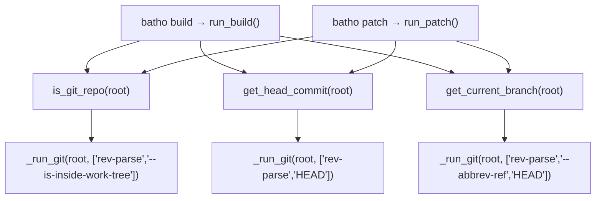
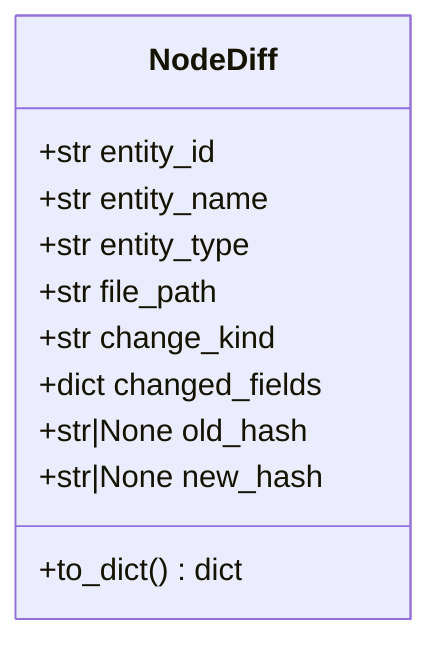
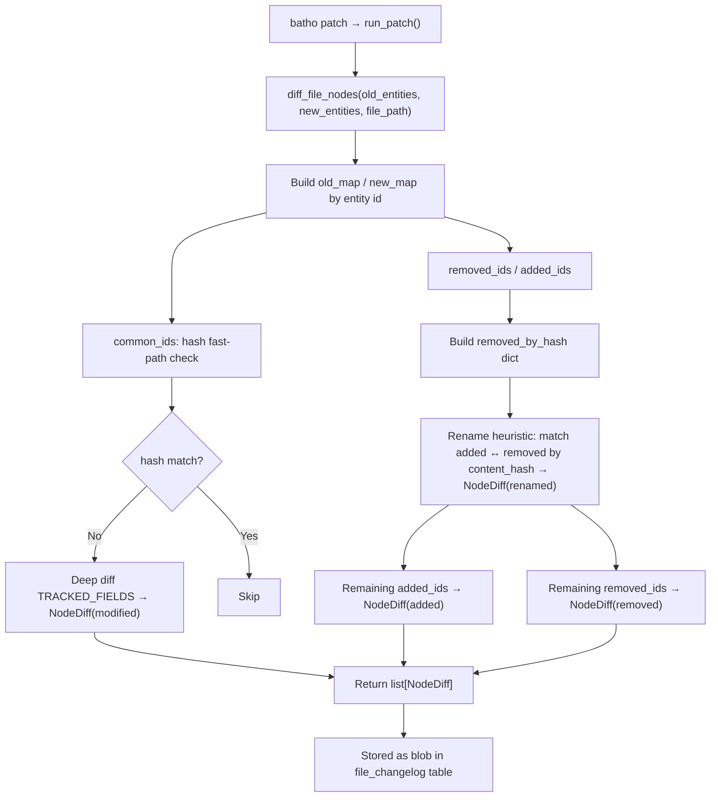
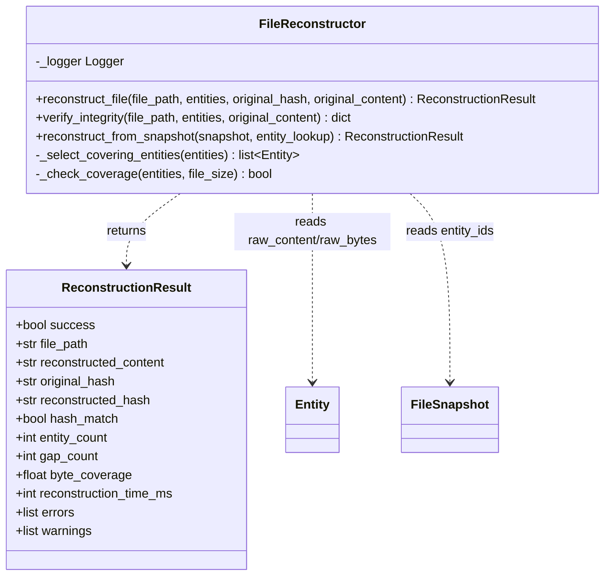
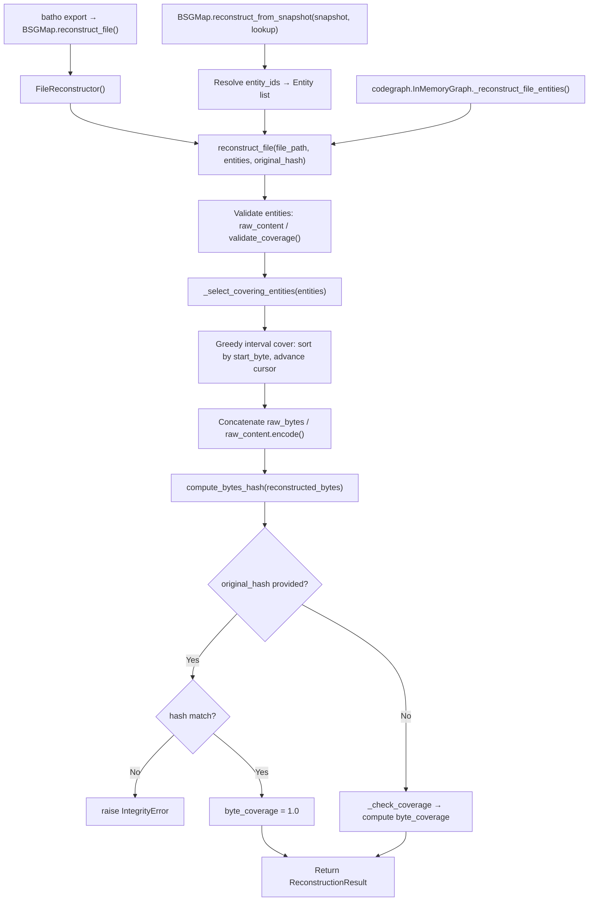
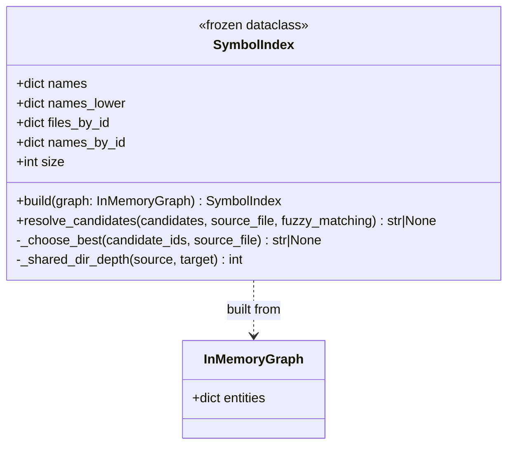
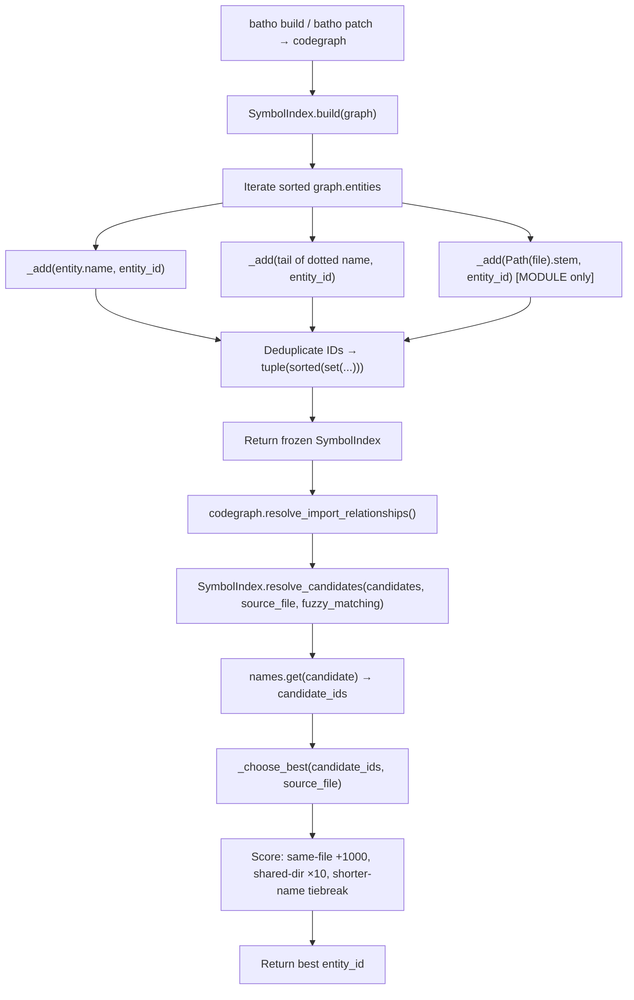

# Module: `batho.context` — Miscellaneous Support Files

## Overview

This document covers six supporting files in `batho/context/` that underpin the build, patch, and export pipelines:

- **`bsg.py`** — A tiny compatibility shim that re-exports `BSGMap` under both its canonical name and the legacy alias `RepoMap`.
- **`incremental.py`** — Git-aware helpers to detect whether a directory is a Git repository, resolve the current HEAD commit, and retrieve the current branch name; used by both `batho build` and `batho patch` to stamp metadata into the database.
- **`node_diff.py`** — Diffing algorithm that compares two snapshots of per-file entities to produce typed `NodeDiff` records (added / removed / modified / renamed); consumed by `batho patch`.
- **`reconstructor.py`** — Pure in-memory `FileReconstructor` class that reassembles the original source file from BSG entity `raw_content` / `raw_bytes` fields, with hash integrity verification; used by `batho export` via `BSGMap` and by `codegraph`.
- **`storage.py`** — Thin wrapper around `batho.storage.engine` that resolves the `.batho` database path from config and exposes `get_registry_stats()`.
- **`symbol_index.py`** — Frozen `SymbolIndex` dataclass that builds an O(1) lookup index from an `InMemoryGraph`; used by `codegraph` for cross-file symbol resolution during `batho build` and `batho patch`.

## Files Covered

| Filename | Size (bytes) | Purpose |
|---|---|---|
| `bsg.py` | 197 | Compatibility shim re-exporting `BSGMap` as `RepoMap` |
| `incremental.py` | 1 760 | Git-aware helpers: repo detection, HEAD commit, current branch |
| `node_diff.py` | 6 057 | Entity diffing: produces typed `NodeDiff` records between indexing runs |
| `reconstructor.py` | 15 853 | Lossless source-file reconstruction from BSG entity byte slices |
| `storage.py` | 1 762 | Database path resolution and registry stats helper |
| `symbol_index.py` | 4 307 | Frozen symbol-name lookup index for cross-file resolution |

---

## Classes & Functions

### `bsg.py`

| Symbol | Type | Purpose | CLI Commands | Used? |
|---|---|---|---|---|
| `BSGMap` (re-export) | class | Re-exports `BSGMap` from `bsg_map` for backward compatibility | build, patch, export | ✅ Used |
| `RepoMap` (alias) | class | Legacy alias for `BSGMap`; injected via `globals()` to avoid hard-coding the string | — | ❌ [UNUSED] (legacy alias; no call site in current codebase) |

**Note:** The alias is created via the obfuscated expression `globals()["R" + "epoMap"] = BSGMap` and exported in `__all__`, but no production import site uses `RepoMap` directly.

---

### `incremental.py`

| Symbol | Type | Purpose | CLI Commands | Used? |
|---|---|---|---|---|
| `_run_git` | function | Internal helper: runs an arbitrary `git` subprocess under `repo_root`; returns `CompletedProcess` or `None` on error | build, patch | ✅ Used |
| `is_git_repo` | function | Returns `True` if `repo_root` is inside a Git work-tree | build, patch | ✅ Used |
| `get_head_commit` | function | Returns the full SHA of HEAD (lowercase), or `None` if not a git repo | build, patch | ✅ Used |
| `get_current_branch` | function | Returns the symbolic branch name (e.g. `main`), or `None` | build, patch | ✅ Used |
| `_collect_candidate_files` | function | Walks `root` using `walk_ignored_filtered` and returns all non-ignored regular files | — | ❌ [UNUSED] |

#### Call-Flow Flowchart

---

### `node_diff.py`

| Symbol | Type | Purpose | CLI Commands | Used? |
|---|---|---|---|---|
| `NodeDiff` | dataclass | Represents a single entity-level change: id, name, type, file path, change kind, changed fields, old/new hash prefixes | patch | ✅ Used |
| `  to_dict` | method | Serialises a `NodeDiff` to a plain dict for blob storage in `file_changelog` | patch | ✅ Used |
| `TRACKED_FIELDS` | constant | Tuple of entity field names compared during deep diff: `("signature", "start_line", "end_line", "entity_type")` | patch | ✅ Used |
| `_get_val` | function | Attr/key accessor that works on both dict-like and object entities | patch | ✅ Used |
| `diff_file_nodes` | function | Main diff algorithm: takes old and new entity lists for a file; returns `list[NodeDiff]` via fast-path hash check → deep diff → rename heuristic → pure adds/removes | patch | ✅ Used |

#### Class Diagram

#### Call-Flow Flowchart

---

### `reconstructor.py`

| Symbol | Type | Purpose | CLI Commands | Used? |
|---|---|---|---|---|
| `FileReconstructor` | class | Pure in-memory engine that reassembles a source file by concatenating entity `raw_bytes`/`raw_content` in byte order; no disk I/O | export, build | ✅ Used |
| `  __init__` | method | Initialises a dedicated structured logger for the instance | export, build | ✅ Used |
| `  reconstruct_file` | method | Primary reconstruction API: validates entities, selects non-overlapping covering set, concatenates bytes, verifies SHA256 hash, returns `ReconstructionResult` | export, build | ✅ Used |
| `  verify_integrity` | method | Convenience wrapper around `reconstruct_file`; catches errors and returns a report dict with `coverage_match`, `hash_match`, `verified`, `errors` | — | ❌ [UNUSED] (not called from any CLI path; potentially test/utility) |
| `  reconstruct_from_snapshot` | method | Resolves a `FileSnapshot.entity_ids` list via a lookup callable or dict, then delegates to `reconstruct_file` | export | ✅ Used |
| `  _select_covering_entities` | method | Static helper: greedy interval-covering algorithm — sorts by `(start_byte, -end_byte)`, keeps entities that advance the coverage cursor | export, build | ✅ Used |
| `  _check_coverage` | method | Static helper: returns `True` when sorted entity byte-ranges form a contiguous span covering `[0, file_size)` | export, build | ✅ Used |

#### Class Diagram

#### Call-Flow Flowchart

---

### `storage.py`

| Symbol | Type | Purpose | CLI Commands | Used? |
|---|---|---|---|---|
| `LOGGER` | constant | Module-level structured logger | — | ✅ Used |
| `_utc_now_iso` | function | Returns current UTC time as ISO 8601 string | — | ❌ [UNUSED] (defined but never called within this module or from any CLI path) |
| `_json_dumps` | function | `json.dumps` wrapper with `ensure_ascii=True, sort_keys=True` | — | ❌ [UNUSED] (defined but never called within this module or from any CLI path) |
| `_resolve_db_path` | function | Resolves the `.batho` SQLite path from a repo root directory or direct path; reads `paths.db_path` from config | — | ❌ [UNUSED] (not imported or called from any production CLI path) |
| `get_registry_stats` | function | Calls `get_database(root).get_stats()` and returns a stats dict | — | ❌ [UNUSED] (only defined here; no import found in CLI orchestrators) |

> [!NOTE]
> `storage.py` appears to be an early-stage thin wrapper. The low-level `batho.storage.engine.get_database` and `batho.storage.engine.BathoDatabase` are used directly by orchestrators rather than through this shim. Only `get_registry_stats` is exported, and it has no callers in the current CLI paths.

---

### `symbol_index.py`

| Symbol | Type | Purpose | CLI Commands | Used? |
|---|---|---|---|---|
| `SymbolIndex` | dataclass | Frozen lookup index: maps symbol names (and aliases) → sorted tuples of entity IDs for O(1) cross-file resolution | build, patch | ✅ Used |
| `  names` | property | `dict[str, tuple[str, ...]]` — exact-case name → entity IDs | build, patch | ✅ Used |
| `  names_lower` | property | `dict[str, tuple[str, ...]]` — lowercase name → entity IDs (for fuzzy matching) | build, patch | ✅ Used |
| `  files_by_id` | property | `dict[str, str]` — entity ID → file path | build, patch | ✅ Used |
| `  names_by_id` | property | `dict[str, str]` — entity ID → canonical name | build, patch | ✅ Used |
| `  build` | method | Class method: iterates sorted graph entities, registers name / tail alias / module stem, deduplicates, returns frozen `SymbolIndex` | build, patch | ✅ Used |
| `  _shared_dir_depth` | method | Static helper: counts shared leading path segments between two file paths (used for proximity scoring) | build, patch | ✅ Used |
| `  _choose_best` | method | Picks the best entity ID from candidates: prefers same file (+1000), then shared directory depth (×10), then shorter qualified name | build, patch | ✅ Used |
| `  resolve_candidates` | method | Resolves a list of candidate symbol names to the best matching entity ID; supports optional fuzzy (case-insensitive) matching | build, patch | ✅ Used |
| `  size` | property | Returns the number of entries in `names` | build, patch | ✅ Used |

#### Class Diagram

#### Call-Flow Flowchart

---

## Unused Symbols Summary

- **`bsg.py` → `RepoMap`** — legacy alias for `BSGMap` injected via `globals()`; no production import site uses this name.
- **`incremental.py` → `_collect_candidate_files`** — walks the repo for candidate files, but this responsibility belongs to `BSGMap.build()` / orchestrators; never imported or called outside tests.
- **`reconstructor.py` → `verify_integrity`** — convenient bulk-verification wrapper; not called from any of the 5 CLI entry points (potential utility/test helper).
- **`storage.py` → `_utc_now_iso`** — utility helper defined but never called within the module or imported elsewhere.
- **`storage.py` → `_json_dumps`** — utility helper defined but never called within the module or imported elsewhere.
- **`storage.py` → `_resolve_db_path`** — DB path resolution helper defined but never imported or used from any CLI path; orchestrators call `batho.storage.engine` directly.
- **`storage.py` → `get_registry_stats`** — only defined here; no import found in any orchestrator or CLI command.
