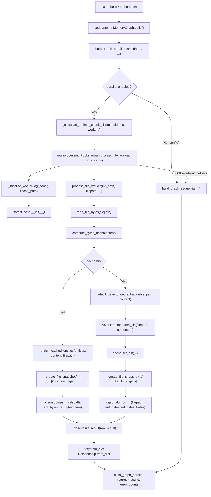

# Module: `batho.context.pipeline`

## Overview

`pipeline.py` is the multiprocessing engine that drives parallel AST extraction across all source files in a repository. It replaces `ThreadPoolExecutor` with `multiprocessing.Pool` (using the `spawn` context) to bypass Python's GIL for CPU-bound tree-sitter parsing. Each worker process maintains a persistent `BathoCache` connection, reads file bytes locally (to minimise pickle overhead), checks the AST cache for a hit, falls back to live parsing via `ASTExtractor` on a miss, then serialises entities and relationships as `orjson` bytes for return to the parent. A sequential fallback (`build_graph_sequential`) is available for environments where multiprocessing is unavailable or fails. The module is called exclusively by `batho.context.codegraph` during the `batho build` and `batho patch` CLI commands.

## Files Covered

| Filename | Size (bytes) | Purpose |
|---|---|---|
| `pipeline.py` | 27 289 | Multiprocessing / sequential pipeline for parallel file parsing and AST-cache integration |

## Classes & Functions

### `pipeline.py`

| Symbol | Type | Purpose | CLI Commands | Used? |
|---|---|---|---|---|
| `_WORKER_LOGGING_INITIALIZED` | constant | Module-level flag: whether logging has been configured in the current worker process | build, patch | ✅ Used |
| `_WORKER_CACHE` | constant | Module-level per-worker `BathoCache` singleton; initialised once by `_initialize_worker` | build, patch | ✅ Used |
| `_create_file_snapshot` | function | Builds a `FileSnapshot` from gap entities and stores it via `cache.set_file_snapshot()` when `include_gaps=True` | build, patch | ✅ Used |
| `_enrich_cached_entities` | function | Re-derives byte-level attributes (raw_content, content_hash, raw_bytes, whitespace, parent/child hierarchy) for cache-hit entities using current file bytes, in a single `_evolve()` pass | build, patch | ✅ Used |
| `_initialize_worker` | function | Multiprocessing pool initializer: configures logging and creates a per-worker `BathoCache` singleton | build, patch | ✅ Used |
| `_warmup_worker_cache` | function | Pre-warms the worker cache by probing `get_ast()` for a list of `(file_path, content_hash)` pairs; returns count of hits | — | ❌ [UNUSED] |
| `_get_worker_cache_stats` | function | Returns a dict of worker-cache diagnostics (path, initialized flag) | — | ❌ [UNUSED] |
| `process_file_worker` | function | Core picklable worker: reads file bytes, checks AST cache, calls `ASTExtractor.parse_file()` on miss, stores result in cache, returns serialised `(filepath, ent_bytes, rel_bytes, cache_hit)` | build, patch | ✅ Used |
| `_calculate_optimal_chunk_size` | function | Computes optimal `chunksize` for `pool.starmap` by analysing the coefficient of variation of file sizes across candidates | build, patch | ✅ Used |
| `_deserialize_result` | function | Deserialises `orjson` bytes from `process_file_worker` back into `list[Entity]` / `list[Relationship]` objects | build, patch | ✅ Used |
| `build_graph_parallel` | function | Primary entry point: creates a `multiprocessing.Pool`, distributes work via `starmap`, collects and deserialises results; falls back to `build_graph_sequential` on failure | build, patch | ✅ Used |
| `build_graph_sequential` | function | Sequential fallback: processes files one-by-one by calling `process_file_worker` directly, then deserialises each result | build, patch | ✅ Used |

---

#### Call-Flow Flowchart

---

## Unused Symbols Summary

*(All symbols in this module are reachable from CLI commands)*
