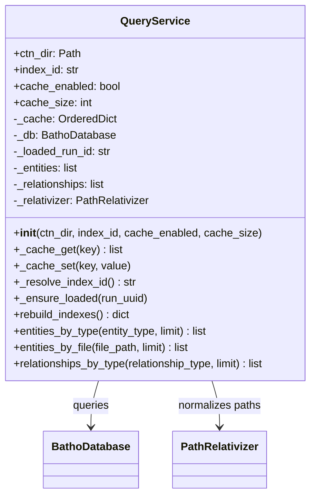
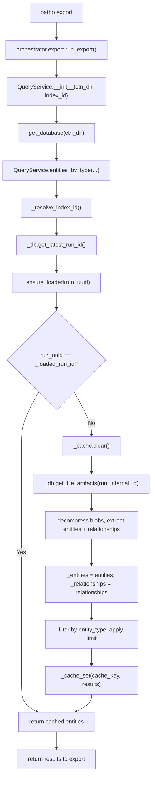

# Module: `batho.context.query`

## Overview

`query.py` provides the `QueryService` class — an in-memory query interface over decompressed file artifact blobs from the `.batho` SQLite database. It loads compressed graph data on-demand, caches query results with LRU eviction, and supports filtering entities/relationships by type or file. The module is used by `batho export` to retrieve graph data for artifact generation.

## Files Covered

| Filename | Size (bytes) | Purpose |
|---|---|---|
| `query.py` | 7 253 | QueryService for in-memory graph querying |

## Classes & Functions

### `query.py`

| Symbol | Type | Purpose | CLI Commands | Used? |
|---|---|---|---|---|
| `QueryService` | class | In-memory query interface over decompressed file artifacts | export | ✅ Used |
| `QueryService.__init__(ctn_dir, index_id, cache_enabled, cache_size)` | constructor | Initializes query service, connects to BathoDatabase, sets up LRU cache | export | ✅ Used |
| `QueryService._cache_get(key)` | method | LRU cache lookup (moves to end on hit) | export | ✅ Used |
| `QueryService._cache_set(key, value)` | method | LRU cache insert with eviction | export | ✅ Used |
| `QueryService._resolve_index_id()` | method | Returns provided index_id or latest run_uuid from DB | export | ✅ Used |
| `QueryService._ensure_loaded(run_uuid)` | method | Loads all file blobs for run into memory if not already loaded | export | ✅ Used |
| `QueryService.rebuild_indexes()` | method | No-op (data loaded from blobs on demand) | — | ❌ [UNUSED] |
| `QueryService.entities_by_type(entity_type, limit)` | method | Returns entities filtered by type (uppercase, capped limit) | export | ✅ Used |
| `QueryService.entities_by_file(file_path, limit)` | method | Returns entities from a specific file (path normalized) | export | ✅ Used |
| `QueryService.relationships_by_type(relationship_type, limit)` | method | Returns relationships filtered by type (uppercase, capped limit) | export | ✅ Used |

---

#### Class Diagram

---

#### Call-Flow Flowchart

---

## Unused Symbols Summary

*(All symbols in this module are reachable from CLI commands)*
