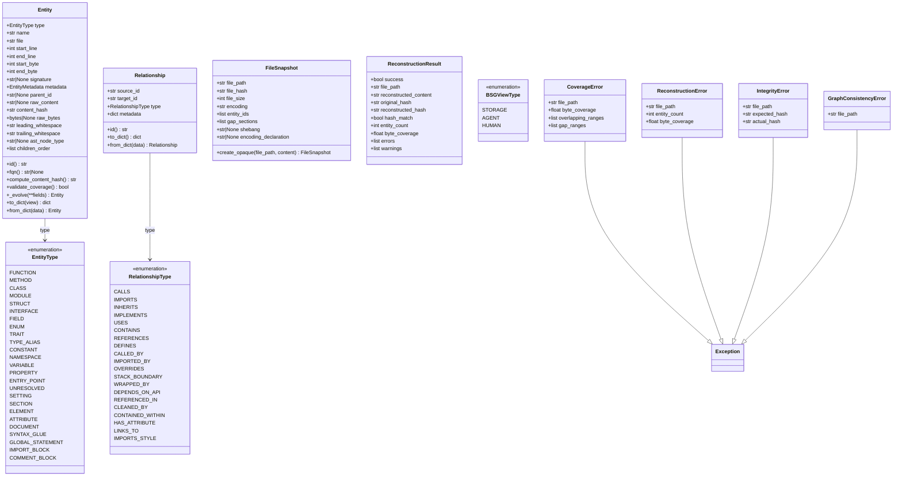
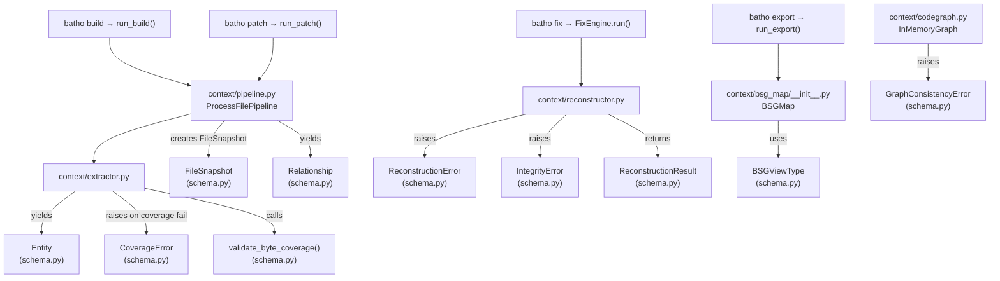

# Module: `batho.context.schema`

## Overview

`schema.py` is the central type-definition module for the entire Batho system. It defines the frozen Pydantic models (`Entity`, `Relationship`, `FileSnapshot`, `ReconstructionResult`), all domain enumerations (`EntityType`, `RelationshipType`, `BSGViewType`), four exception classes used throughout the pipeline, a `TypeAlias` (`EntityMetadata`), and the standalone `validate_byte_coverage()` utility. Every other module in Batho that deals with code-graph data imports its types exclusively from this file — no raw dicts leak past this boundary.

## Files Covered

| Filename | Size (bytes) | Purpose |
|---|---|---|
| `schema.py` | 20,330 | Shared type hierarchy — exceptions, enums, Pydantic models, coverage validation |

## Classes & Functions

### `schema.py`

| Symbol | Type | Purpose | CLI Commands | Used? |
|---|---|---|---|---|
| `CoverageError` | class | Exception raised when byte coverage validation fails; carries `file_path`, `byte_coverage`, `overlapping_ranges`, `gap_ranges` | build, patch, export, fix | ✅ Used |
| `ReconstructionError` | class | Exception raised when file reconstruction fails; carries `file_path`, `entity_count`, `byte_coverage` | build, patch, export, fix | ✅ Used |
| `IntegrityError` | class | Exception raised when reconstructed content hash does not match original; carries `file_path`, `expected_hash`, `actual_hash` | build, patch, export, fix | ✅ Used |
| `GraphConsistencyError` | class | Exception raised when graph consistency check fails inside `InMemoryGraph`; carries `file_path` | build, patch | ✅ Used |
| `EntityMetadata` | TypeAlias | `Dict[str, Any]` — metadata dict attached to `Entity` objects | build, patch, export, fix, diff | ✅ Used |
| `EntityType` | class | Enum of all extractable code-entity kinds (FUNCTION, METHOD, CLASS, MODULE, STRUCT, INTERFACE, FIELD, ENUM, TRAIT, TYPE_ALIAS, CONSTANT, NAMESPACE, VARIABLE, PROPERTY, ENTRY_POINT, UNRESOLVED, SETTING, SECTION, ELEMENT, ATTRIBUTE, DOCUMENT, SYNTAX_GLUE, GLOBAL_STATEMENT, IMPORT_BLOCK, COMMENT_BLOCK) | build, patch, export, fix, diff | ✅ Used |
| `  EntityType.__str__` | method | Returns lowercased enum name | build, patch, export, fix, diff | ✅ Used |
| `RelationshipType` | class | Enum of all relationship kinds (CALLS, IMPORTS, INHERITS, IMPLEMENTS, USES, CONTAINS, REFERENCES, DEFINES, CALLED_BY, IMPORTED_BY, OVERRIDES, STACK_BOUNDARY, WRAPPED_BY, DEPENDS_ON_API, REFERENCED_IN, CLEANED_BY, CONTAINED_WITHIN, HAS_ATTRIBUTE, LINKS_TO, IMPORTS_STYLE) | build, patch, export, fix, diff | ✅ Used |
| `  RelationshipType.__str__` | method | Returns lowercased enum name | build, patch, export, fix, diff | ✅ Used |
| `BSGViewType` | class | Enum controlling BSGMap serialization view: `STORAGE` (full-fidelity), `AGENT` (LLM-optimized), `HUMAN` (reserved) | build, export | ✅ Used |
| `  BSGViewType.__str__` | method | Returns lowercased enum name | build, export | ✅ Used |
| `Entity` | class | Frozen Pydantic model representing a single code entity extracted from source. Key fields: `type`, `name`, `file`, `start_line`, `end_line`, `start_byte`, `end_byte`, `signature`, `metadata`, `parent_id`, `raw_content`, `content_hash`, `raw_bytes`, `leading_whitespace`, `trailing_whitespace`, `ast_node_type`, `children_order` | build, patch, export, fix, diff | ✅ Used |
| `  Entity.id` | property | `computed_field` — deterministic SHA-based ID from `(type.name, name, file)` via `generate_entity_id()` | build, patch, export, fix, diff | ✅ Used |
| `  Entity.fqn` | property | Fully qualified name: returns `signature` if set; `name` for class/module/namespace; else `None` | build, patch, export, fix, diff | ✅ Used |
| `  Entity.compute_content_hash` | method | SHA-256 of `raw_content.encode("utf-8")` | build, patch | ✅ Used |
| `  Entity.validate_coverage` | method | Verifies `(end_byte - start_byte)` matches actual byte length of raw content (prefers `raw_bytes` over UTF-8 encode) | build, patch | ✅ Used |
| `  Entity._evolve` | method | Returns modified copy via `model_copy(update=...)` without full reconstruction overhead | build, patch | ✅ Used |
| `  Entity.to_dict` | method | Serializes entity to dict; `view="agent"` omits `raw_content`/`content_hash`; `view="storage"` includes all reconstruction fields | build, patch, export | ✅ Used |
| `  Entity.from_dict` | method | Classmethod — deserializes from dict, normalizes `EntityType` string keys, converts `raw_bytes` from hex | build, patch, export | ✅ Used |
| `  Entity.__str__` | method | Human-readable: `"name signature (type) [Lstart-end]"` | — | ✅ Used |
| `  Entity.__hash__` | method | Hashes on `self.id` for use in sets/dicts | build, patch, export | ✅ Used |
| `  Entity.__eq__` | method | Equality via `self.id == other.id` | build, patch, export | ✅ Used |
| `Relationship` | class | Frozen Pydantic model for a directed edge between two entities. Fields: `source_id`, `target_id`, `type` (RelationshipType), `metadata` | build, patch, export, fix, diff | ✅ Used |
| `  Relationship.id` | property | `computed_field` — deterministic ID from `(source_id, target_id, type.name)` | build, patch, export, fix, diff | ✅ Used |
| `  Relationship.to_dict` | method | Serializes to dict with `id`, `source_id`, `target_id`, `type` (name string), `metadata` | build, patch, export | ✅ Used |
| `  Relationship.from_dict` | method | Classmethod — deserializes from dict; normalizes `RelationshipType` string keys | build, patch, export | ✅ Used |
| `  Relationship.__str__` | method | `"source_id --[type]--> target_id"` | — | ✅ Used |
| `  Relationship.__hash__` | method | Hashes on `self.id` | build, patch, export | ✅ Used |
| `  Relationship.__eq__` | method | Equality via `self.id == other.id` | build, patch, export | ✅ Used |
| `FileSnapshot` | class | Frozen Pydantic model for file-level metadata needed for reconstruction. Fields: `file_path`, `file_hash`, `file_size`, `encoding`, `entity_ids`, `gap_sections`, `shebang`, `encoding_declaration`, `file_level_comments`, `created_at`, `updated_at` | build, patch, export | ✅ Used |
| `  FileSnapshot.create_opaque` | method | Classmethod factory — creates a snapshot for binary/unindexable files with empty entity_ids | build, export | ✅ Used |
| `ReconstructionResult` | class | Frozen Pydantic model summarising a reconstruction attempt. Fields: `success`, `file_path`, `reconstructed_content`, `original_hash`, `reconstructed_hash`, `hash_match`, `entity_count`, `gap_count`, `byte_coverage`, `reconstruction_time_ms`, `errors`, `warnings` | fix | ✅ Used |
| `validate_byte_coverage` | function | Validates that a list of `Entity` objects provides complete, non-overlapping byte coverage of a file; returns a report dict; raises `CoverageError` when `strict=True` | build, patch | ⚠️ Defined in schema.py but only called internally from `extractor.py`; no direct import from schema at CLI level |

## Unused Symbols Summary

- `validate_byte_coverage` — reachable transitively via `batho.context.extractor` during `build`/`patch`, but it is never directly imported from `schema.py` outside of `extractor.py`; it is fully live in the production pipeline. No symbols in `schema.py` are truly dead from all CLI paths.

---

#### Class Diagram

#### Call-Flow Flowchart

