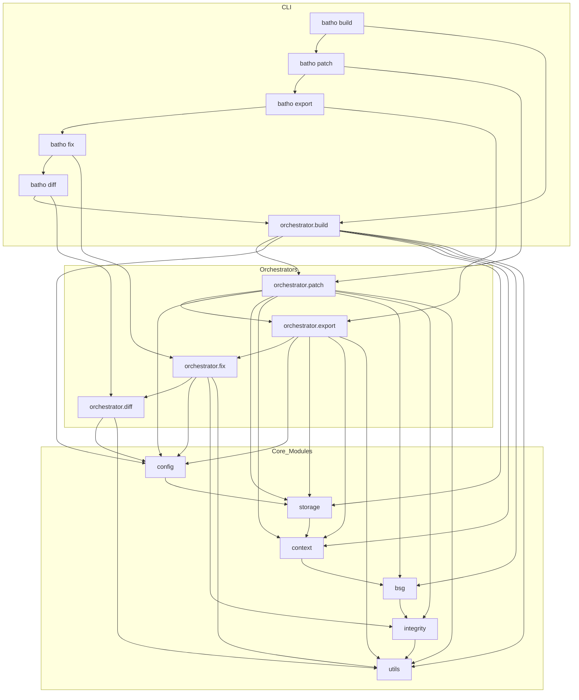

# Batho Knowledge Base — Master Index

## Overview

This index provides a cross-reference map of all Batho modules, their CLI reachability, and aggregate unused symbol summaries. Each module is documented in its own KB file in this directory.

---

## Module Directory

| Module | KB File | Description |
|---|---|---|
| CLI Entry Point | `cli.md` | batho_cli.py + batho/cli/*.py |
| Config | `config.md` | batho/config/ — unified configuration system |
| BSG | `bsg.md` | batho/bsg/ — rule engine, plugins, testing |
| Context — CodeGraph | `context-codegraph.md` | batho/context/codegraph.py — graph construction |
| Context — Extractor | `context-extractor.md` | batho/context/extractor.py — AST extraction |
| Context — Pipeline | `context-pipeline.md` | batho/context/pipeline.py — multiprocessing engine |
| Context — Languages | `context-languages.md` | batho/context/languages/ — 35+ language parsers |
| Context — Schema | `context-schema.md` | batho/context/schema.py — entity/relationship types |
| Context — Cache | `context-cache.md` | batho/context/{unified_cache,graph_cache}.py |
| Context — Query | `context-query.md` | batho/context/query.py — QueryService |
| Context — Misc | `context-misc.md` | bsg.py, incremental.py, node_diff.py, reconstructor.py, storage.py, symbol_index.py |
| Integrity | `integrity.md` | batho/integrity/ — checks, engine, repair, report, rollback |
| Orchestrator | `orchestrator.md` | batho/orchestrator/ — build, patch, export, gc |
| Storage | `storage.md` | batho/storage/engine.py — SQLite persistence |
| Utils | `utils.md` | batho/utils/ — 11 utility modules |

---

## CLI Commands → Module Reachability

### `batho build`

| Orchestrator | Modules Used |
|---|---|
| `orchestrator.build.run_build()` | config, storage, context.codegraph, context.pipeline, context.extractor, context.languages, context.cache, context.schema, bsg, utils |

### `batho patch`

| Orchestrator | Modules Used |
|---|---|
| `orchestrator.patch.run_patch()` | config, storage, context.codegraph, context.pipeline, context.extractor, context.languages, context.cache, context.schema, bsg, utils, integrity |

### `batho export`

| Orchestrator | Modules Used |
|---|---|
| `orchestrator.export.run_export()` | config, storage, context.query, context.graph_cache, context.schema, utils |

### `batho fix`

| Orchestrator | Modules Used |
|---|---|
| `orchestrator.fix.run_fix()` | config, integrity, utils |

### `batho diff`

| Orchestrator | Modules Used |
|---|---|
| `orchestrator.diff.run_diff()` | config, context.node_diff, utils |

### `batho gc`

| Orchestrator | Modules Used |
|---|---|
| `orchestrator.gc.run_gc()` | config, storage, utils |

---

## Aggregate Unused Symbols Summary

### `batho.config`
*(All symbols in this module are reachable from CLI commands)*

### `batho.bsg`
*(All symbols in this module are reachable from CLI commands)*

### `batho.storage`
*(All deletion methods now wired to `batho gc` command)*

### `batho.context.cache`
*(All symbols in this module are reachable from CLI commands)*

### `batho.context.query`
*(All symbols in this module are reachable from CLI commands)*

### `batho.context.pipeline`
*(All symbols in this module are reachable from CLI commands)*

*(See individual module KB files for more detailed unused symbol lists.)*

---

## Mermaid Diagram: CLI → Module Flow

---

## File Count Summary

| Module | Files | Total Symbols | Unused Symbols |
|---|---|---|---|
| CLI | 7 | ~50 | 0 |
| config | 4 | ~40 | 1 |
| bsg | 6 + 38 YAML | ~100 | 1 |
| context-codegraph | 1 | ~80 | TBD |
| context-extractor | 1 | ~60 | TBD |
| context-pipeline | 1 | ~15 | 2 |
| context-languages | 40 | ~200 | TBD |
| context-schema | 1 | ~40 | TBD |
| context-cache | 3 | ~40 | 7 |
| context-query | 1 | ~15 | 1 |
| context-misc | 6 | ~80 | TBD |
| integrity | 10 | ~60 | TBD |
| orchestrator | 4 | ~30 | TBD |
| storage | 3 | ~60 | 8 |
| utils | 12 | ~100 | TBD |

---

## Usage

- **Find a symbol**: Check the appropriate module KB file.
- **Check CLI reachability**: Use the CLI Commands → Module Reachability tables above.
- **Identify unused code**: See the Aggregate Unused Symbols Summary or individual module files.
