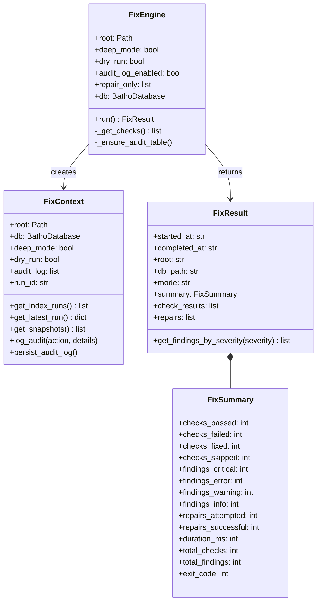
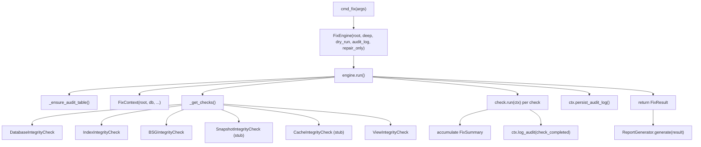
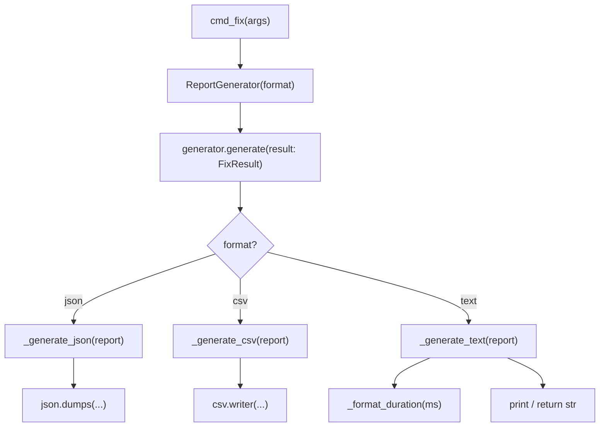
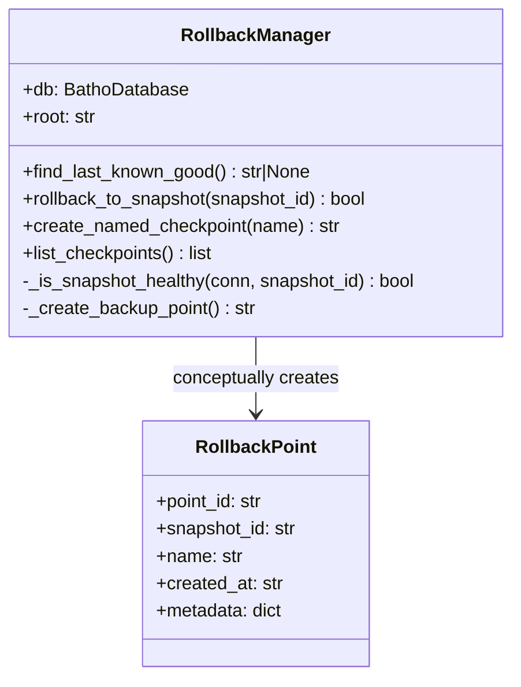
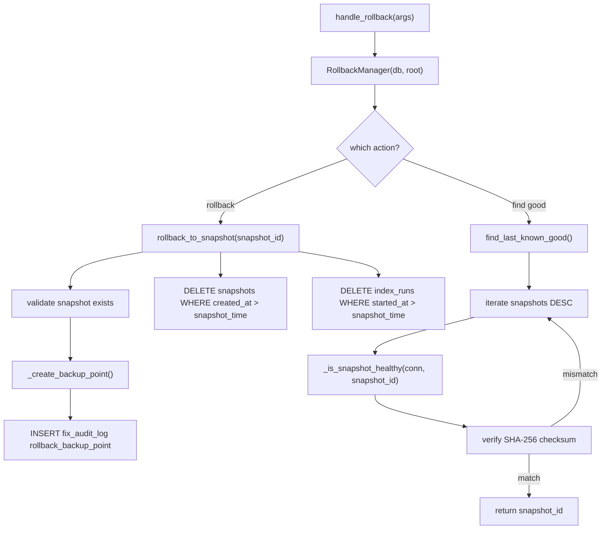
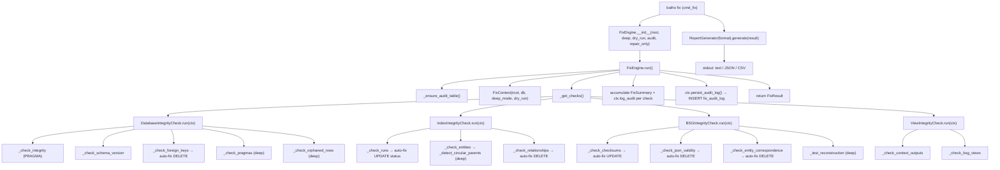

# Module: `batho.integrity`

## Overview

The `batho.integrity` module implements the `batho fix` command — a full integrity verification and auto-repair system for the artifact database. It orchestrates a configurable pipeline of typed integrity checks across six domains (database, index, BSG, snapshots, cache, views), collects structured `Finding` objects for every anomaly discovered, applies inline auto-repairs where possible, persists an audit trail to `fix_audit_log`, and produces human-readable, JSON, or CSV reports of the results. The module also provides a `RollbackManager` that can restore the database to a prior known-good snapshot by deleting all data newer than a target point.

---

## Files Covered

| Filename | Size (bytes) | Purpose |
|---|---|---|
| `integrity/__init__.py` | 631 | Package public API; re-exports key classes |
| `integrity/engine.py` | 11,827 | `FixContext`, `FixSummary`, `FixResult`, `FixEngine` — orchestrates the full fix run |
| `integrity/repair.py` | 4,002 | `RepairStrategy` protocol + five concrete strategy stubs (`OrphanedRowRepair`, `CorruptedBSGRepair`, `BrokenSnapshotChainRepair`, `ChecksumMismatchRepair`, `ExpiredCacheRepair`) |
| `integrity/report.py` | 8,601 | `FixReport` dataclass + `ReportGenerator` (text / JSON / CSV output) |
| `integrity/rollback.py` | 9,260 | `RollbackPoint`, `RollbackManager` — snapshot-based rollback and checkpoint management |
| `integrity/checks/__init__.py` | 1,919 | Base framework: `Severity`, `CheckStatus`, `Finding`, `CheckResult`, `IntegrityCheck` protocol; registers concrete checks |
| `integrity/checks/database.py` | 13,641 | `DatabaseIntegrityCheck` — SQLite PRAGMA checks, schema version, FK constraints, orphaned rows |
| `integrity/checks/index.py` | 16,673 | `IndexIntegrityCheck` — index runs, entity consistency, relationship integrity, circular parent detection |
| `integrity/checks/bsg.py` | 15,037 | `BSGIntegrityCheck` — BSG checksum validation, JSON validity, entity correspondence, reconstruction test |
| `integrity/checks/views.py` | 7,503 | `ViewIntegrityCheck` — context output validation, BSG view_type consistency |

---

## Classes & Functions

### `integrity/__init__.py`

| Symbol | Type | Purpose | CLI Commands | Used? |
|---|---|---|---|---|
| *(re-exports only)* | — | Publishes `FixEngine`, `FixContext`, `FixResult`, `CheckResult`, `CheckStatus`, `Finding`, `IntegrityCheck`, `Severity`, `FixReport`, `RepairRecord` | fix | ✅ Used |

---

### `integrity/engine.py`

| Symbol | Type | Purpose | CLI Commands | Used? |
|---|---|---|---|---|
| `FixContext` | dataclass | Shared context passed into every check; holds `root`, `db`, `deep_mode`, `dry_run`, `audit_log`, `run_id`; provides lazy-loaded data accessors | fix | ✅ Used |
| `  get_index_runs` | method | Lazily fetches all `index_runs` rows from DB (cached in `_index_runs`) | fix | ✅ Used |
| `  get_latest_run` | method | Returns the most recent `completed` index run from the cached list | fix | ✅ Used |
| `  get_snapshots` | method | Lazily fetches all `snapshots` rows (cached in `_snapshots`) | fix | ✅ Used |
| `  log_audit` | method | Appends a structured audit entry to the in-memory `audit_log` list | fix | ✅ Used |
| `  persist_audit_log` | method | Bulk-inserts all in-memory audit entries into `fix_audit_log` table and clears the list | fix | ✅ Used |
| `FixSummary` | dataclass | Accumulates pass/fail/fixed/skipped counts and finding severity tallies for the entire run | fix | ✅ Used |
| `  total_checks` | property | Sum of `checks_passed + checks_failed + checks_fixed + checks_skipped` | fix | ✅ Used |
| `  total_findings` | property | Sum of all finding severity counts | fix | ✅ Used |
| `  exit_code` | property | Derives shell exit code: `2` = critical findings; `1` = unrepaired errors; `0` = clean | fix | ✅ Used |
| `FixResult` | dataclass | Final result object returned from `FixEngine.run()`; contains metadata, `FixSummary`, list of `CheckResult`s and repairs | fix | ✅ Used |
| `  get_findings_by_severity` | method | Filters all findings across all check results by a given `Severity` | fix | ✅ Used |
| `FixEngine` | class | Top-level orchestrator; initialised by `cmd_fix`; runs all checks in sequence and returns `FixResult` | fix | ✅ Used |
| `  __init__` | method | Stores `root`, `deep_mode`, `dry_run`, `audit_log_enabled`, `repair_only`; lazily initialises DB and check list | fix | ✅ Used |
| `  db` | property | Lazy-loads `BathoDatabase` via `get_database(self.root)` | fix | ✅ Used |
| `  _get_checks` | method | Instantiates all six check classes; filters by `repair_only` list if provided | fix | ✅ Used |
| `  run` | method | Entry point called by CLI: ensures audit table, creates `FixContext`, iterates checks, tallies `FixSummary`, persists audit log, returns `FixResult` | fix | ✅ Used |
| `  _ensure_audit_table` | method | Issues `CREATE TABLE IF NOT EXISTS fix_audit_log` on the live DB connection | fix | ✅ Used |

#### Class Diagram

#### Call-Flow Flowchart

---

### `integrity/repair.py`

| Symbol | Type | Purpose | CLI Commands | Used? |
|---|---|---|---|---|
| `RepairRecord` | dataclass | Records the outcome of a repair operation: strategy name, success flag, timestamp, details, optional error | fix | ✅ Used |
| `RepairStrategy` | class (Protocol) | Structural protocol defining the `can_repair(finding)`, `repair(finding, ctx)`, `rollback(finding, ctx)` interface for all repair strategies | fix | ✅ Used |
| `OrphanedRowRepair` | class | Strategy stub: matches findings about orphaned FK violations; actual deletion delegated to check-specific code | fix | ✅ Used |
| `  can_repair` | method | Returns `True` if `"orphaned"` and `"foreign key"` appear in the finding message | fix | ✅ Used |
| `  repair` | method | Stub — returns `True`; real logic lives inside `DatabaseIntegrityCheck._check_foreign_keys` | fix | ✅ Used |
| `  rollback` | method | Returns `False` — deletions cannot be undone without a backup | fix | ✅ Used |
| `CorruptedBSGRepair` | class | Strategy stub for BSG checksum / invalid-JSON findings; repair returns `False` (requires full regeneration) | fix | ✅ Used |
| `  can_repair` | method | Returns `True` for BSG findings whose message contains `"checksum"` or `"invalid json"` | fix | ✅ Used |
| `  repair` | method | Stub — returns `False`; full BSG regeneration not implemented | fix | ✅ Used |
| `BrokenSnapshotChainRepair` | class | Strategy stub for orphaned snapshot `parent_id` references; nullifies broken chain links | fix | ✅ Used |
| `  can_repair` | method | Returns `True` for snapshot findings containing `"orphaned"` | fix | ✅ Used |
| `  repair` | method | Stub — returns `True`; actual `parent_id` nullification lives in snapshot check | fix | ✅ Used |
| `ChecksumMismatchRepair` | class | Strategy stub for checksum-mismatch findings; actual recomputation done inline in BSG check | fix | ✅ Used |
| `  can_repair` | method | Returns `True` when `"checksum mismatch"` is in the finding message | fix | ✅ Used |
| `  rollback` | method | Returns `True` — old checksum was already wrong, no meaningful rollback needed | fix | ✅ Used |
| `ExpiredCacheRepair` | class | Strategy stub for expired AST cache entries; deletion done inline in cache check | fix | ✅ Used |
| `  can_repair` | method | Returns `True` for cache findings containing `"expired"` | fix | ✅ Used |

> **Note:** All five repair classes are strategy *stubs*. Their `repair()` bodies are either `return True` or `return False` with comments indicating that the actual logic is implemented inline within the respective `IntegrityCheck._check_*` methods. The `RepairStrategy` protocol and `RepairRecord` dataclass are the only pieces actively consumed by other modules.

---

### `integrity/report.py`

| Symbol | Type | Purpose | CLI Commands | Used? |
|---|---|---|---|---|
| `FixReport` | dataclass | Structured container built from a `FixResult`; pre-computes `findings_by_severity` dict in `__post_init__` | fix | ✅ Used |
| `  __post_init__` | method | Populates `findings_by_severity` from `FixSummary` counters if not supplied | fix | ✅ Used |
| `ReportGenerator` | class | Converts a `FixResult` into a formatted string in `text`, `json`, or `csv` mode | fix | ✅ Used |
| `  __init__` | method | Stores `format` (lowercased); defaults to `"text"` | fix | ✅ Used |
| `  generate` | method | Builds `FixReport` from `FixResult`, dispatches to format-specific private method | fix | ✅ Used |
| `  _generate_json` | method | Serialises full `FixReport` (summary, per-check results, all findings) to indented JSON | fix | ✅ Used |
| `  _generate_csv` | method | Writes one row per non-INFO finding with columns: timestamp, check_name, severity, message, auto_fixed, details | fix | ✅ Used |
| `  _generate_text` | method | Produces emoji-annotated human-readable text: header, summary counts, repairs, unresolved issues, footer | fix | ✅ Used |
| `  _format_duration` | method | Converts milliseconds to a human-readable string (`ms`, `s`, `m s`) | fix | ✅ Used |

#### Call-Flow Flowchart

---

### `integrity/rollback.py`

| Symbol | Type | Purpose | CLI Commands | Used? |
|---|---|---|---|---|
| `RollbackPoint` | dataclass | Named rollback point with `point_id`, `snapshot_id`, `name`, `created_at`, `metadata` | fix | ✅ Used |
| `RollbackManager` | class | Manages snapshot-based rollback and named checkpoint operations | fix | ✅ Used |
| `  __init__` | method | Stores `db: BathoDatabase` and `root: str` | fix | ✅ Used |
| `  find_last_known_good` | method | Iterates snapshots newest-to-oldest; calls `_is_snapshot_healthy` for each; returns first healthy `snapshot_id` | fix | ✅ Used |
| `  _is_snapshot_healthy` | method | Validates a single snapshot: checks it exists and (if `checksum` present) recomputes SHA-256 of core fields to verify integrity | fix | ✅ Used |
| `  rollback_to_snapshot` | method | Validates snapshot exists, calls `_create_backup_point`, then deletes all `snapshots` and `index_runs` (and their cascade-deleted children) newer than the target | fix | ✅ Used |
| `  _create_backup_point` | method | Writes a `rollback_backup_point` audit entry to `fix_audit_log` before performing any destructive rollback | fix | ✅ Used |
| `  create_named_checkpoint` | method | Records a named checkpoint by inserting a `create_checkpoint` entry into `fix_audit_log` referencing the latest snapshot | fix | ✅ Used |
| `  list_checkpoints` | method | Queries `fix_audit_log` for all `create_checkpoint` actions; returns list of checkpoint dicts | fix | ✅ Used |

#### Class Diagram

#### Call-Flow Flowchart

---

### `integrity/checks/__init__.py`

| Symbol | Type | Purpose | CLI Commands | Used? |
|---|---|---|---|---|
| `Severity` | class (Enum) | Four severity levels: `CRITICAL`, `ERROR`, `WARNING`, `INFO` | fix | ✅ Used |
| `CheckStatus` | class (Enum) | Four check outcomes: `PASSED`, `FAILED`, `FIXED`, `SKIPPED` | fix | ✅ Used |
| `Finding` | dataclass | One integrity finding: `check_name`, `severity`, `message`, `details`, `auto_fixed`, `fix_attempted`, `fix_error` | fix | ✅ Used |
| `CheckResult` | dataclass | Result of a single check run: `check_name`, `status`, `duration_ms`, `findings`, `metrics` | fix | ✅ Used |
| `IntegrityCheck` | class (Protocol) | Structural interface requiring `name`, `description`, `run(ctx) → CheckResult`, `supports_quick_mode() → bool` | fix | ✅ Used |

---

### `integrity/checks/database.py`

| Symbol | Type | Purpose | CLI Commands | Used? |
|---|---|---|---|---|
| `DatabaseIntegrityCheck` | class | Runs up to 5 SQLite-level checks; always runs checks 1–3; checks 4–5 only in deep mode | fix | ✅ Used |
| `  run` | method | Entry point: dispatches to all sub-checks, aggregates findings, computes `CheckStatus` | fix | ✅ Used |
| `  _check_integrity` | method | Runs `PRAGMA integrity_check`; emits CRITICAL if result ≠ `"ok"` | fix | ✅ Used |
| `  _check_schema_version` | method | Compares `db_meta.schema_version` against `batho.storage.engine.SCHEMA_VERSION`; emits ERROR on mismatch | fix | ✅ Used |
| `  _check_foreign_keys` | method | Runs `PRAGMA foreign_key_check`; auto-fixes by deleting orphaned rows by rowid if `dry_run=False` | fix | ✅ Used |
| `  _check_pragmas` | method | Deep-mode only: validates `journal_mode=wal`, `foreign_keys=1`, `page_size=DEFAULT_PAGE_SIZE`; emits WARNING on deviation | fix | ✅ Used |
| `  _check_orphaned_rows` | method | Deep-mode only: LEFT JOIN scan across 5 table-column pairs to detect orphaned FK references | fix | ✅ Used |

**Orphaned-row checks table:**

| Child Table | Child Column | Parent Table | Parent Column |
|---|---|---|---|
| `graph_entities` | `run_id` | `index_runs` | `run_id` |
| `graph_relationships` | `run_id` | `index_runs` | `run_id` |
| `bsg_entries` | `run_id` | `index_runs` | `run_id` |
| `context_outputs` | `run_id` | `index_runs` | `run_id` |
| `snapshots` | `parent_id` | `snapshots` | `snapshot_id` |

---

### `integrity/checks/index.py`

| Symbol | Type | Purpose | CLI Commands | Used? |
|---|---|---|---|---|
| `IndexIntegrityCheck` | class | Validates index runs, entity consistency, and relationship integrity | fix | ✅ Used |
| `  run` | method | Calls `ctx.get_index_runs()`; dispatches to three sub-checks; returns `CheckResult` | fix | ✅ Used |
| `  _check_runs` | method | Detects runs stuck in `"running"` status and auto-fixes by marking them `"failed"`; checks entity/rel count consistency for completed runs | fix | ✅ Used |
| `  _check_entities` | method | Checks for invalid line ranges (`start_line > end_line`), duplicate `entity_id` within a run; in deep mode also calls `_detect_circular_parents` | fix | ✅ Used |
| `  _check_relationships` | method | Detects dangling relationships (source or target entity missing from same run); auto-deletes dangling rows if not dry_run | fix | ✅ Used |
| `  _detect_circular_parents` | method | Loads `entity_id → parent_id` map for a run; walks ancestry chains to detect cycles | fix | ✅ Used |

**Quick vs deep mode behaviour:**

| Sub-check | Quick mode | Deep mode |
|---|---|---|
| `_check_runs` | All runs | All runs |
| `_check_entities` | Latest run only (`runs[:1]`) | All runs + circular parent detection |
| `_check_relationships` | Latest run only | All runs |

---

### `integrity/checks/bsg.py`

| Symbol | Type | Purpose | CLI Commands | Used? |
|---|---|---|---|---|
| `BSGIntegrityCheck` | class | Validates BSG entries: checksums, JSON validity, entity correspondence, and (deep) reconstruction | fix | ✅ Used |
| `  run` | method | Loads all `bsg_entries`; samples 10% in quick mode; dispatches to four sub-checks; returns `CheckResult` | fix | ✅ Used |
| `  _check_checksums` | method | Recomputes `SHA-256(bsg_json)` for each entry; auto-fixes by UPDATEing the stored checksum | fix | ✅ Used |
| `  _check_json_validity` | method | Parses `bsg_json` and validates it's a `dict` or `list`; auto-fixes by DELETEing invalid entries | fix | ✅ Used |
| `  _check_entity_correspondence` | method | For each BSG entry, checks that at least one `graph_entities` row exists for the same `(run_id, file_path)`; auto-deletes orphaned BSG entries | fix | ✅ Used |
| `  _test_reconstruction` | method | Deep-mode only: tries to parse BSG JSON and extract `nodes`/`entities`; flags entries missing `name` or `id` fields | fix | ✅ Used |

**Sampling strategy:**

| Mode | Entries checked |
|---|---|
| quick (≤100 entries) | All entries |
| quick (>100 entries) | 10% random sample (`max(10, total // 10)`) |
| deep | All entries |

---

### `integrity/checks/views.py`

| Symbol | Type | Purpose | CLI Commands | Used? |
|---|---|---|---|---|
| `ViewIntegrityCheck` | class | Validates context outputs and BSG view type consistency | fix | ✅ Used |
| `  run` | method | Calls `_check_context_outputs` and `_check_bsg_views`; returns `CheckResult` | fix | ✅ Used |
| `  _check_context_outputs` | method | Reads `context_outputs`; in quick mode samples 10 entries; checks `content` is a `str`; flags outputs >10 MB | fix | ✅ Used |
| `  _check_bsg_views` | method | Counts files with multiple `view_type`s; validates all `view_type` values are in `{'agent', 'storage', 'human'}` | fix | ✅ Used |

---

## Missing / Stub Implementations

### `SnapshotIntegrityCheck` and `CacheIntegrityCheck`

`FixEngine._get_checks()` imports and instantiates both `SnapshotIntegrityCheck` and `CacheIntegrityCheck` from `batho.integrity.checks`, but **neither class is defined anywhere** in the `checks/` package. The `checks/__init__.py` does not export them. At runtime this will raise an `ImportError`, effectively meaning those two check slots are dead code placeholders. Any `batho fix` invocation that attempts to import these classes will fail unless they are added to the package.

---

## Unused Symbols Summary

| Symbol | Location | Reason |
|---|---|---|
| `SnapshotIntegrityCheck` | `engine.py` (import only) | Referenced in `_get_checks()` but class is **not implemented** in the checks package — will raise `ImportError` |
| `CacheIntegrityCheck` | `engine.py` (import only) | Same as above — class not implemented |
| `OrphanedRowRepair.repair` | `repair.py` | Stub body (`return True`); real FK repair logic is inlined in `DatabaseIntegrityCheck._check_foreign_keys` |
| `CorruptedBSGRepair.repair` | `repair.py` | Stub body (`return False`); BSG regeneration not implemented |
| `BrokenSnapshotChainRepair.repair` | `repair.py` | Stub body (`return True`); referenced snapshot chain repair not yet wired up |
| `RepairRecord` | `repair.py` | Exported in `__all__` and re-exported from `integrity/__init__.py`, but never populated or returned by any check; the `FixResult.repairs` list is always empty (`[]`) in the engine |
| `RollbackPoint` | `rollback.py` | Exported dataclass but never instantiated; `RollbackManager` methods return raw strings and dicts rather than `RollbackPoint` instances |
| `RollbackManager.create_named_checkpoint` | `rollback.py` | No CLI subcommand calls this; only `rollback_to_snapshot` and `find_last_known_good` are reached from `handle_rollback` |
| `RollbackManager.list_checkpoints` | `rollback.py` | No CLI subcommand calls this; reachable only via direct API use |

---

## Full Call-Flow: `batho fix`

