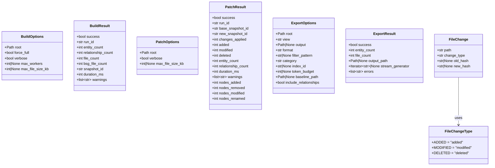
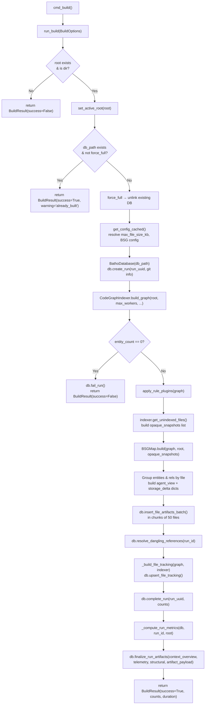
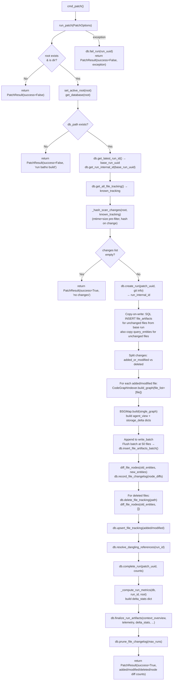
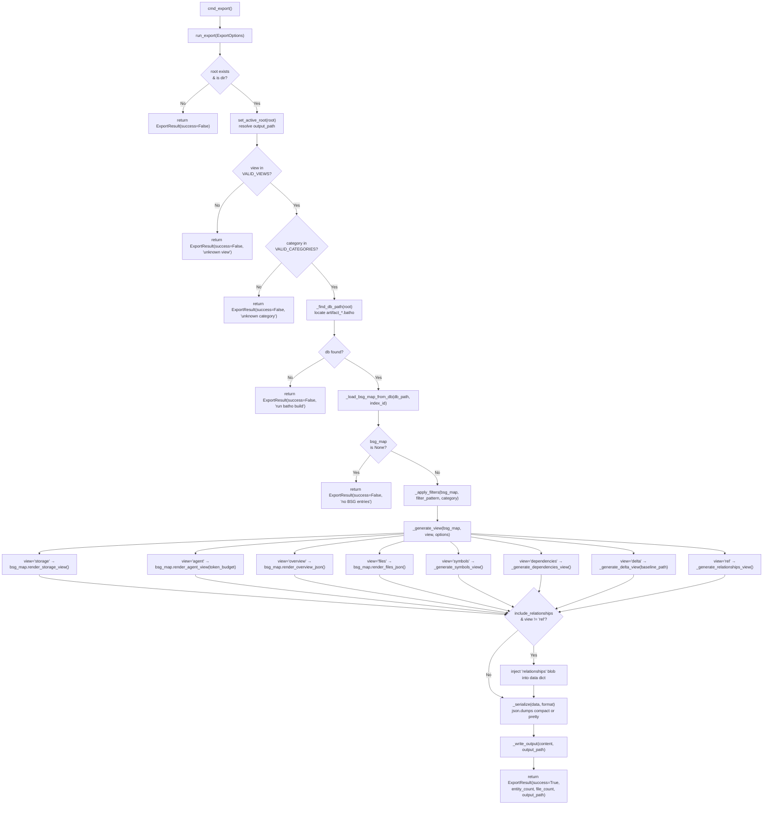

# Module: `batho.orchestrator`

## Overview

The `batho.orchestrator` package is the **primary dispatch layer** for Batho's three data-mutation CLI commands: `build`, `patch`, and `export`. Each sub-module encapsulates all business logic for one command — validating inputs, driving the parsing pipeline, persisting results to the SQLite artifact database, computing run metrics, and returning a typed result dataclass. No UI or CLI argument parsing lives here; the orchestrators receive strongly typed `*Options` dataclasses from the CLI layer and return `*Result` dataclasses back. This strict boundary makes the orchestrators independently testable and reusable from non-CLI callers (e.g., API servers, test harnesses).

---

## Files Covered

| Filename | Size (bytes) | Purpose |
|---|---|---|
| `__init__.py` | 349 | Re-exports `ExportOptions`, `ExportResult`, `run_export`, `PatchOptions`, `PatchResult`, `run_patch` as the public surface of the package. `BuildOptions`/`BuildResult`/`run_build` are **not** re-exported here (build.py is imported directly by the CLI). |
| `build.py` | 21 192 | Full-index build orchestrator (`batho build`). Drives `CodeGraphIndexer`, `BSGMap`, batch file-artifact writes, file tracking, cross-file reference resolution, and run-metrics finalization. |
| `patch.py` | 22 746 | Incremental patch orchestrator (`batho patch`). Hash-based filesystem change detection, copy-on-write blob propagation for unchanged files, per-file re-parse, node-level diffing, and delta stats. |
| `export.py` | 18 802 | Export orchestrator (`batho export`). Loads a `BSGMap` from the artifact DB, applies glob/category filters, dispatches to one of eight view renderers, serializes to JSON, and writes output. |
| `gc.py` | ~5 000 | GC orchestrator (`batho gc`). Garbage collection for old runs, vacuum for SQLite optimization, storage status reporting. |

---

## Classes & Functions

### `__init__.py`

| Symbol | Type | Purpose | CLI Commands | Used? |
|---|---|---|---|---|
| `ExportOptions` | TypeAlias (re-export) | Public re-export from `export.py` | export | ✅ Used |
| `ExportResult` | TypeAlias (re-export) | Public re-export from `export.py` | export | ✅ Used |
| `run_export` | function (re-export) | Public re-export from `export.py` | export | ✅ Used |
| `PatchOptions` | TypeAlias (re-export) | Public re-export from `patch.py` | patch | ✅ Used |
| `PatchResult` | TypeAlias (re-export) | Public re-export from `patch.py` | patch | ✅ Used |
| `run_patch` | function (re-export) | Public re-export from `patch.py` | patch | ✅ Used |

> **Note:** `BuildOptions`, `BuildResult`, and `run_build` are intentionally absent from `__all__`. The build CLI imports directly from `batho.orchestrator.build`.

---

### `build.py`

| Symbol | Type | Purpose | CLI Commands | Used? |
|---|---|---|---|---|
| `BuildOptions` | dataclass | Input parameters for a build run (`root`, `force_full`, `verbose`, `max_workers`, `max_file_size_kb`) | build | ✅ Used |
| `BuildResult` | dataclass | Outcome of a build run — counts, timing, warnings, snapshot ID | build | ✅ Used |
| `run_build` | function | Main build orchestrator; entry point from `cmd_build()` | build | ✅ Used |
| `_generate_run_id` | function | Generates `build_<timestamp>_<8hex>` unique run identifier | build | ✅ Used |
| `_compute_run_metrics` | function | Queries DB for entity/relationship/file stats and assembles `context_overview`, `structural_metrics`, and `artifact_payload` dicts for `finalize_run_artifacts` | build, patch | ✅ Used |
| `_build_file_tracking` | function | Iterates over graph entities and unindexed files to produce `file_tracking` records (path, hash, mtime, size, encoding, `is_indexed`) | build | ✅ Used |

#### Class Diagram

#### Call-Flow Flowchart — `batho build`

---

### `patch.py`

| Symbol | Type | Purpose | CLI Commands | Used? |
|---|---|---|---|---|
| `FileChangeType` | class | Namespace constants for change classification: `ADDED`, `MODIFIED`, `DELETED` | patch | ✅ Used |
| `FileChange` | dataclass | Represents a single file change (path, change_type, old_hash, new_hash) | patch | ✅ Used |
| `PatchOptions` | dataclass | Input parameters for a patch run (`root`, `verbose`, `max_file_size_kb`) | patch | ✅ Used |
| `PatchResult` | dataclass | Outcome of a patch run — counts, timing, node-level diff stats, warnings | patch | ✅ Used |
| `_generate_run_id` | function | Generates `patch_<timestamp>_<8hex>` unique run identifier | patch | ✅ Used |
| `_hash_scan_changes` | function | Filesystem scan comparing known file-tracking records against current disk state; produces a list of `FileChange` objects. Uses mtime+size as cheap pre-filter before hashing. | patch | ✅ Used |
| `run_patch` | function | Main patch orchestrator; entry point from `cmd_patch()` | patch | ✅ Used |

#### Call-Flow Flowchart — `batho patch`

---

### `export.py`

| Symbol | Type | Purpose | CLI Commands | Used? |
|---|---|---|---|---|
| `ExportOptions` | dataclass | Input parameters for an export run (view, output, format, filter_pattern, category, index_id, token_budget, baseline_path, include_relationships) | export | ✅ Used |
| `ExportResult` | dataclass | Outcome of an export run (entity_count, file_count, output_path, errors) | export | ✅ Used |
| `VALID_VIEWS` | constant | Frozenset of allowed view names: `storage`, `agent`, `overview`, `files`, `symbols`, `dependencies`, `delta`, `rel` | export | ✅ Used |
| `VALID_CATEGORIES` | constant | Frozenset of allowed category filters: `source`, `test`, `doc`, `config`, `infra`, `all` | export | ✅ Used |
| `run_export` | function | Main export orchestrator; entry point from `cmd_export()` | export | ✅ Used |
| `_find_db_path` | function | Locates the `artifact_<dirname>.batho` file for the given root path | export | ✅ Used |
| `_load_bsg_map_from_db` | function | Loads file artifacts from the DB, reconstructs `by_file` entity map, relationships, and dependency graph; builds and returns a `BSGMap` instance | export | ✅ Used |
| `_apply_filters` | function | Applies optional glob `pattern` and `category` filters to a `BSGMap`; returns a new filtered `BSGMap` | export | ✅ Used |
| `_resolve_file_category` | function | Determines a file's category string (`SOURCE`, `TEST`, `CONFIG`, `DOC`, `INFRA`) from entity metadata or path heuristics | export | ✅ Used |
| `_generate_view` | function | Dispatcher — routes view name to the appropriate renderer; injects `relationships` blob if `include_relationships` is set | export | ✅ Used |
| `_generate_symbols_view` | function | Produces a flat symbol-index JSON view (`symbols` view type) | export | ✅ Used |
| `_generate_dependencies_view` | function | Produces a dependency graph JSON view with forward and reverse dependency edges (`dependencies` view type) | export | ✅ Used |
| `_generate_delta_view` | function | Loads a baseline export JSON file, calls `BSGMap.render_delta()`, and serializes the diff (`delta` view type) | export | ✅ Used |
| `_generate_relationships_view` | function | Produces a combined relationship + dependency JSON view (`rel` view type) | export | ✅ Used |
| `_serialize` | function | Converts a dict to compact or pretty-printed JSON string | export | ✅ Used |
| `_write_output` | function | Writes serialized JSON content to a file (creates parent directories as needed) | export | ✅ Used |

#### Call-Flow Flowchart — `batho export`

---

## Unused Symbols Summary

All symbols in this module are reachable from the CLI. No unused symbols were identified:

- `_generate_run_id` in both `build.py` and `patch.py` — called directly inside `run_build` / `run_patch`.
- `_compute_run_metrics` in `build.py` — called by both `run_build` (build.py) and `run_patch` (patch.py, imported explicitly: `from batho.orchestrator.build import _compute_run_metrics`).
- `_build_file_tracking` in `build.py` — called inside `run_build`.
- `_hash_scan_changes` in `patch.py` — called inside `run_patch`.
- `FileChangeType` / `FileChange` in `patch.py` — used throughout `_hash_scan_changes` and `run_patch`.
- All helpers in `export.py` (`_find_db_path`, `_load_bsg_map_from_db`, `_apply_filters`, `_resolve_file_category`, `_generate_view`, `_generate_symbols_view`, `_generate_dependencies_view`, `_generate_delta_view`, `_generate_relationships_view`, `_serialize`, `_write_output`) — all called from `run_export`.
- `VALID_VIEWS` / `VALID_CATEGORIES` — used as validation sets in `run_export`.

> **Note on `ExportResult.stream_generator`:** The field is declared in `ExportResult` (type `Iterator[str] | None`) but is never populated by `run_export` in the current implementation. The streaming path was likely planned but not yet implemented. This field is **effectively dead code** in v1.1.0.

---

## Cross-Module Notes

### Copy-on-Write Design in `patch.py`
The patch orchestrator implements a **blob-level copy-on-write** strategy to avoid re-parsing unchanged files:
1. Unchanged file artifacts are bulk-copied from the base run via SQL `INSERT ... SELECT` (excluding changed file IDs).
2. `query_entities` rows for unchanged files are similarly copied, filtered by file path.
3. Only files in `added_or_modified` are re-parsed through `CodeGraphIndexer`.

This means the new run's `file_artifacts` table contains a complete, self-consistent snapshot without re-processing the entire codebase.

### Batch Write Strategy (Both `build.py` and `patch.py`)
Both orchestrators accumulate file artifacts into a `write_batch` list and flush to DB when the batch reaches **50 files** (via `db.insert_file_artifacts_batch()`). This amortizes SQLite transaction overhead over many files while keeping memory use bounded.

### `_compute_run_metrics` is Shared
`patch.py` imports `_compute_run_metrics` directly from `batho.orchestrator.build`, making it a shared utility despite being defined in `build.py`. Both commands produce identical context_overview / structural_metrics / artifact_payload JSON blobs for their run artifacts.

### View Router in `export.py`
The `_generate_view` function acts as a **strategy dispatcher** — the `view` string (one of 8 valid values) selects a renderer. The `rel` view returns early before the `include_relationships` injection step, since it already contains the full relationship blob natively.

### GC Command (`batho gc`)
The `gc` orchestrator provides storage maintenance:
- `gc run <run_uuid>` — deletes specific run and all artifacts
- `gc runs --older-than N` — deletes runs older than N days
- `gc vacuum` — runs SQLite VACUUM to reclaim disk space
- `gc status` — shows storage statistics (db size, run count, artifact counts)

Uses the wired-up deletion methods in `BathoDatabase` (`delete_run`, `delete_file_artifacts_for_run`, `delete_snapshots_for_run`, etc.).

### Git Metadata is Informational Only
Both `build.py` and `patch.py` query `is_git_repo()`, `get_head_commit()`, and `get_current_branch()` to attach git context to the run record. However, **change detection in `patch.py` is entirely hash-based** (via `_hash_scan_changes`). Git is not used for diff computation — the docstring explicitly states: *"Git is no longer used for change detection; it is only captured for metadata."*
