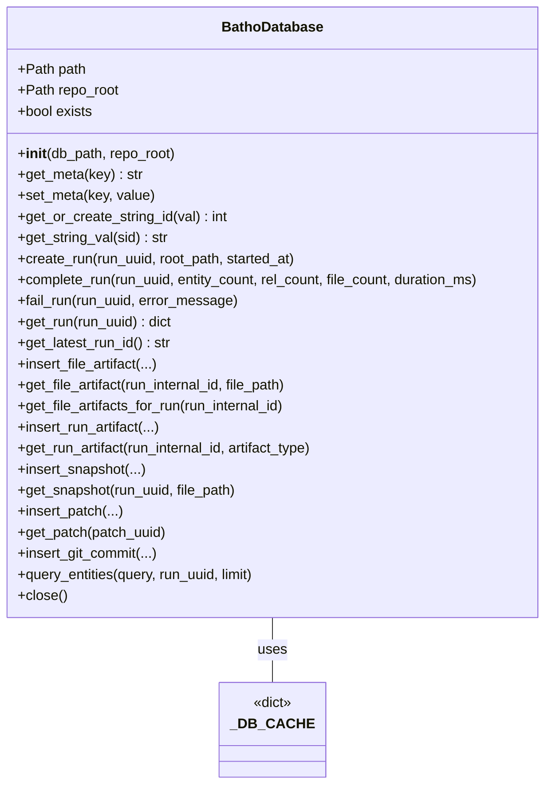
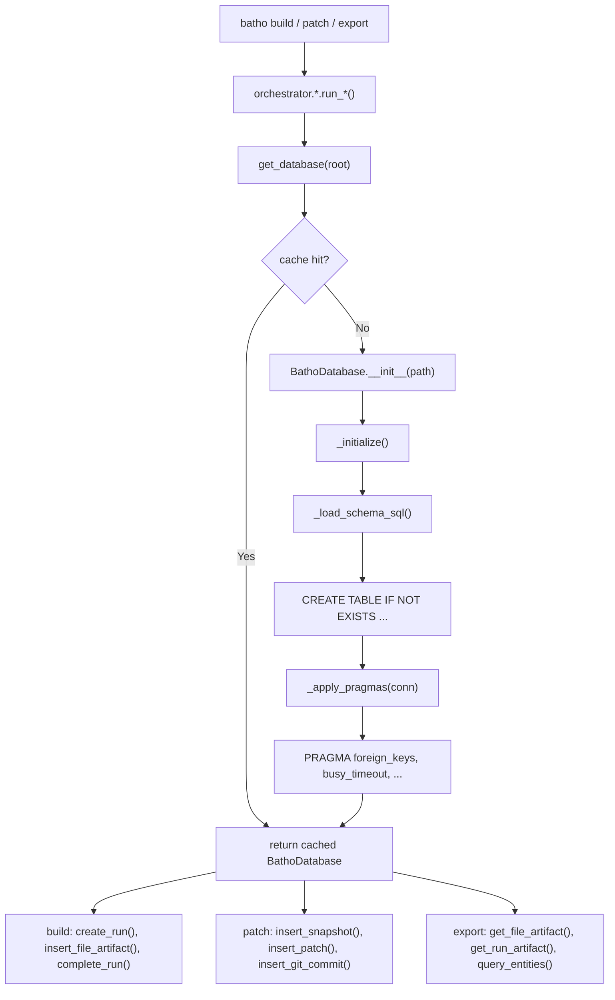

# Module: `batho.storage`

## Overview

`batho.storage` is Batho's unified SQLite persistence engine — the single `.batho` database that replaces the legacy `.ctn` directory of JSON artifacts. All graph data, BSG payloads, context outputs, snapshots, and sync metadata live in one ACID-compliant SQLite database per project. The module is used by orchestrators (`build`, `patch`, `export`) and context modules for all database operations.

## Files Covered

| Filename | Size (bytes) | Purpose |
|---|---|---|
| `__init__.py` | 424 | Re-exports public API: BathoDatabase, get_database |
| `engine.py` | 54 916 | Core SQLite engine with schema, minification, compression |
| `schema.sql` | 7 585 | Database schema (tables, indexes, triggers) |

## Classes & Functions

### `engine.py`

| Symbol | Type | Purpose | CLI Commands | Used? |
|---|---|---|---|---|
| `BATHO_DB_FILENAME` | constant | Default: ".batho" | build, patch, export | ✅ Used |
| `SCHEMA_VERSION` | constant | "batho-db.v7" | build, patch | ✅ Used |
| `DEFAULT_PAGE_SIZE` | constant | 8192 bytes | build, patch | ✅ Used |
| `DEFAULT_BUSY_TIMEOUT_MS` | constant | 5000 ms | build, patch | ✅ Used |
| `_DB_CACHE` | dict | Module-level database instance cache | build, patch, export | ✅ Used |
| `_DB_CACHE_LOCK` | RLock | Thread-safe cache access | build, patch, export | ✅ Used |
| `artifact_filename(root)` | function | Generates artifact DB filename from root | build, patch | ✅ Used |
| `_load_schema_sql()` | function | Loads schema.sql from package | build, patch | ✅ Used |
| `_minify_entity(e)` | function | Minifies entity dict keys for storage | build, patch | ✅ Used |
| `_expand_entity(mini)` | function | Expands minified entity back to full | build, patch, export | ✅ Used |
| `_minify_relationship(r)` | function | Minifies relationship dict keys | build, patch | ✅ Used |
| `_expand_relationship(mini)` | function | Expands minified relationship | build, patch, export | ✅ Used |
| `_minify_graph_payload(graph_data)` | function | Minifies full graph payload | build, patch | ✅ Used |
| `_expand_graph_payload(minified)` | function | Expands minified graph payload | export | ✅ Used |
| `get_database(repo_root, db_path)` | function | Get or create BathoDatabase instance | build, patch, export | ✅ Used |
| `close_all_databases()` | function | Close all cached instances (shutdown) | — | ❌ [UNUSED] |
| `BathoDatabase` | class | Main persistence class | build, patch, export | ✅ Used |

### `BathoDatabase` Class Methods

| Symbol | Type | Purpose | CLI Commands | Used? |
|---|---|---|---|---|
| `__init__(db_path, repo_root)` | constructor | Opens/creates SQLite DB, applies pragmas | build, patch, export | ✅ Used |
| `path` | property | Returns DB file path | build, patch | ✅ Used |
| `repo_root` | property | Returns repo root path | build, patch | ✅ Used |
| `exists` | property | Returns True if DB file exists | build, patch | ✅ Used |
| `_get_connection()` | method | Gets thread-local SQLite connection | build, patch, export | ✅ Used |
| `_apply_pragmas(conn)` | method | Sets PRAGMA (foreign_keys, temp_store, busy_timeout, etc.) | build, patch | ✅ Used |
| `connection(read_only)` | context | Yields SQLite connection (read-only or read-write) | build, patch, export | ✅ Used |
| `transaction()` | context | Yields connection with IMMEDIATE transaction | build, patch | ✅ Used |
| `_initialize()` | method | Creates schema if not exists | build, patch | ✅ Used |
| `get_meta(key)` | method | Gets metadata value from db_meta table | build, patch | ✅ Used |
| `set_meta(key, value)` | method | Sets metadata value in db_meta table | build, patch | ✅ Used |
| `get_or_create_string_id(val)` | method | String interning for deduplication | build, patch | ✅ Used |
| `get_string_val(sid)` | method | Retrieves string by ID | build, patch, export | ✅ Used |
| `create_run(run_uuid, root_path, started_at)` | method | Creates new index_runs entry | build, patch | ✅ Used |
| `get_run_internal_id(run_uuid)` | method | Gets internal ID for run_uuid | build, patch | ✅ Used |
| `complete_run(run_uuid, entity_count, rel_count, file_count, duration_ms)` | method | Marks run as completed | build, patch | ✅ Used |
| `fail_run(run_uuid, error_message)` | method | Marks run as failed | build, patch | ✅ Used |
| `get_latest_run_id()` | method | Gets most recent completed run_uuid | build, patch | ✅ Used |
| `get_run(run_uuid)` | method | Gets full run metadata | build, patch, export | ✅ Used |
| `delete_run(run_uuid)` | method | Deletes run and cascaded data | — | ❌ [UNUSED] |
| `get_entity_count(run_uuid)` | method | Gets entity count for run | build, patch | ✅ Used |
| `get_relationship_count(run_uuid)` | method | Gets relationship count for run | build, patch | ✅ Used |
| `insert_file_artifact(...)` | method | Inserts compressed file artifact (agent, storage, rel views) | build, patch | ✅ Used |
| `get_file_artifact(run_internal_id, file_path)` | method | Retrieves and decompresses file artifact | export | ✅ Used |
| `get_file_artifacts_for_run(run_internal_id)` | method | Lists all file artifacts for a run | export | ✅ Used |
| `get_file_count_for_run(run_internal_id)` | method | Counts files in run | build, patch | ✅ Used |
| `insert_run_artifact(...)` | method | Inserts run-level artifact (context overview, telemetry, etc.) | build, patch | ✅ Used |
| `get_run_artifact(run_internal_id, artifact_type)` | method | Retrieves run artifact by type | export | ✅ Used |
| `get_run_artifacts_for_run(run_internal_id)` | method | Lists all run artifacts for a run | export | ✅ Used |
| `insert_snapshot(run_uuid, file_path, file_hash, entities_blob, relationships_blob)` | method | Inserts snapshot record | patch | ✅ Used |
| `get_snapshot(run_uuid, file_path)` | method | Gets snapshot for file | patch | ✅ Used |
| `get_snapshots_for_run(run_uuid)` | method | Lists all snapshots for run | patch | ✅ Used |
| `get_latest_snapshot_for_file(file_path)` | method | Gets most recent snapshot for file | patch | ✅ Used |
| `insert_patch(run_uuid, parent_snapshot_uuid, patch_type, patch_blob)` | method | Inserts patch record | patch | ✅ Used |
| `get_patch(patch_uuid)` | method | Gets patch by UUID | patch | ✅ Used |
| `get_patches_for_run(run_uuid)` | method | Lists all patches for run | patch | ✅ Used |
| `get_patches_for_file(file_path, limit)` | method | Gets patches for file (newest first) | patch | ✅ Used |
| `insert_git_commit(run_uuid, commit_hash, changed_files)` | method | Inserts git commit record | patch | ✅ Used |
| `get_git_commits_for_run(run_uuid)` | method | Gets commits for run | patch | ✅ Used |
| `get_latest_commit_for_file(file_path)` | method | Gets most recent commit for file | patch | ✅ Used |
| `query_entities(query, run_uuid, limit)` | method | Full-text search on entities | export | ✅ Used |
| `query_entities_by_type(entity_type, run_uuid, limit)` | method | Query entities by type | export | ✅ Used |
| `query_file_artifact_entities(file_path, run_uuid)` | method | Query entities from file artifact | export | ✅ Used |
| `vacuum()` | method | Runs SQLite VACUUM | — | ❌ [UNUSED] |
| `close()` | method | Closes database connection | build, patch | ✅ Used |

---

#### Class Diagram

---

#### Call-Flow Flowchart

---

## Unused Symbols Summary

*(All methods now wired to `batho gc` command)*
