# Module: `batho.utils`

## Overview

`batho.utils` is the foundational utility layer for the entire Batho codebase. It provides cross-cutting concerns shared by all five CLI commands: SHA-256 content and file hashing (with LRU caching), multi-encoding text normalization, `.gitignore`-compatible file exclusion, structured `structlog`-based logging, rich CLI output with color and quiet/JSON modes, patch-specific exception types with an audit trail logger, atomic file I/O, cross-platform file locking, project-manifest dependency parsing (Python/Node.js/Rust), memory-usage monitoring with GC integration, and path-traversal-safe path utilities. The package `__init__.py` re-exports the most commonly used symbols so call sites can import directly from `batho.utils`.

---

## Files Covered

| Filename | Size (bytes) | Purpose |
|---|---|---|
| `__init__.py` | 1 231 | Public re-export surface for the package |
| `cli_output.py` | 4 892 | Colored, quiet/JSON-aware user-facing output helper |
| `dependencies.py` | 19 323 | Manifest dependency parser (requirements.txt, pyproject.toml, package.json, Cargo.toml, setup.py) |
| `encoding.py` | 3 264 | Multi-encoding text/bytes fallback + UTF-8 normalizer |
| `file_io.py` | 5 847 | Unified file read/write with size limits, binary detection, and atomic writes |
| `file_lock.py` | 9 386 | Cross-platform PID-based file lock with timeout and stale-lock cleanup |
| `hash.py` | 6 094 | SHA-256 hashing, binary detection, deterministic entity/relationship ID generation |
| `ignore.py` | 9 599 | `.gitignore`-style ignore spec loader and path filter helpers |
| `logging.py` | 5 439 | Structured `structlog` logger factory and process-wide configuration |
| `memory_monitor.py` | 10 317 | RSS/VMS memory stats, context-manager monitor, GC forcing utilities |
| `patch_errors.py` | 8 188 | Patch-specific exception hierarchy and structured audit logger |
| `path_sanitizer.py` | 6 263 | Path traversal prevention, git-diff path sanitization, safe filename validation |

---

## Classes & Functions

### `__init__.py`

| Symbol | Type | Purpose | CLI Commands | Used? |
|---|---|---|---|---|
| `CLIOutput` | class | Re-exported from `cli_output` | — | ✅ Used |
| `normalize_to_utf8` | function | Re-exported from `encoding` | build, patch, export | ✅ Used |
| `compute_bytes_hash` | function | Re-exported from `hash` | build, patch | ✅ Used |
| `compute_file_hash` | function | Re-exported from `hash` | build, patch | ✅ Used |
| `compute_file_hash_cached` | function | Re-exported from `hash` | build, patch | ✅ Used |
| `compute_string_hash` | function | Re-exported from `hash` | build, patch | ✅ Used |
| `generate_entity_id` | function | Re-exported from `hash` | build | ✅ Used |
| `generate_relationship_id` | function | Re-exported from `hash` | build | ✅ Used |
| `load_ignore_spec` | function | Re-exported from `ignore` | build, patch | ✅ Used |
| `is_ignored` | function | Re-exported from `ignore` | build, patch | ✅ Used |
| `get_logger` | function | Re-exported from `logging` | build, patch, export, fix, diff | ✅ Used |
| `get_log_level` | function | Re-exported from `logging` | build, patch, export, fix, diff | ✅ Used |
| `configure_logging` | function | Re-exported from `logging` | build, patch, export | ✅ Used |
| `configure_logging_from_dict` | function | Re-exported from `logging` | build, patch, export | ✅ Used |
| `PatchValidationError` | class | Re-exported from `patch_errors` | patch | ✅ Used |
| `PatchConsistencyError` | class | Re-exported from `patch_errors` | patch | ✅ Used |
| `PatchSnapshotError` | class | Re-exported from `patch_errors` | patch | ✅ Used |
| `PatchFileError` | class | Re-exported from `patch_errors` | patch | ✅ Used |
| `PatchTimeoutError` | class | Re-exported from `patch_errors` | patch | ✅ Used |
| `PatchAuditLogger` | class | Re-exported from `patch_errors` | patch | ✅ Used |
| `audit_logger` | constant | Re-exported global `PatchAuditLogger` instance | patch | ✅ Used |

---

### `cli_output.py`

| Symbol | Type | Purpose | CLI Commands | Used? |
|---|---|---|---|---|
| `CLIOutput` | class | User-facing output manager respecting quiet/json flags | — | ❌ [UNUSED] |
| `  __init__` | method | Stores `quiet` and `json_mode` flags | — | ❌ [UNUSED] |
| `  configure` | method | Mutate quiet/json_mode after construction | — | ❌ [UNUSED] |
| `  classify` | method | Heuristic: classify a message string as error/warning/success/info | — | ❌ [UNUSED] |
| `  _supports_color` | method | Return True if stream is a TTY and NO_COLOR is not set | — | ❌ [UNUSED] |
| `  _emit` | method | Core low-level print with optional ANSI color and quiet gate | — | ❌ [UNUSED] |
| `  success` | method | Print green success message to stdout | — | ❌ [UNUSED] |
| `  error` | method | Print red error message to stderr (ignores quiet) | — | ❌ [UNUSED] |
| `  warning` | method | Print yellow warning to stderr (respects quiet) | — | ❌ [UNUSED] |
| `  info` | method | Print info message to stdout (respects quiet) | — | ❌ [UNUSED] |
| `  json_response` | method | Serialize and print a dict as indented JSON to stdout | — | ❌ [UNUSED] |
| `  write` | method | Auto-classify and emit a message to appropriate stream | — | ❌ [UNUSED] |
| `  progress` | method | Context manager yielding a callable `step` counter for progress display | — | ❌ [UNUSED] |

> **Note:** `CLIOutput` is exported from `batho.utils.__init__` but **no CLI orchestrator, integrity engine, or diff command imports or instantiates it**. It is defined and re-exported but has no active call sites in any CLI chain. It is infrastructure that is available but currently unused at runtime.

#### Class Diagram

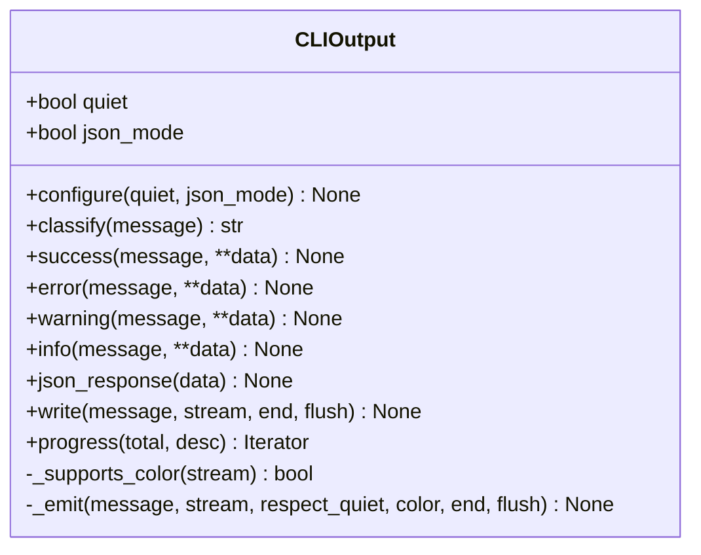

#### Call-Flow Flowchart

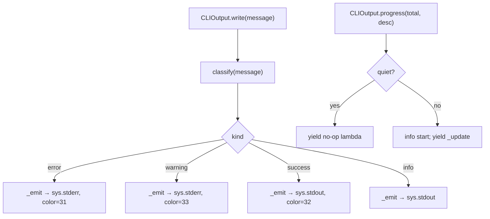

---

### `dependencies.py`

| Symbol | Type | Purpose | CLI Commands | Used? |
|---|---|---|---|---|
| `extract_package_name` | function | Strip version specifiers and extras from a dep string | — | ❌ [UNUSED] |
| `parse_requirements_txt` | function | Parse requirements.txt text → list of package names | — | ❌ [UNUSED] |
| `parse_requirements_txt_file` | function | Read and parse a `requirements.txt` file from disk | — | ❌ [UNUSED] |
| `parse_pyproject_toml` | function | Parse `pyproject.toml` TOML/regex → deps dict | — | ❌ [UNUSED] |
| `_detect_build_tool_from_pyproject` | function | Identify build backend from parsed pyproject data | — | ❌ [UNUSED] |
| `_parse_pyproject_toml_regex` | function | Regex fallback parser for pyproject.toml | — | ❌ [UNUSED] |
| `parse_pyproject_toml_file` | function | Read and parse a `pyproject.toml` file from disk | — | ❌ [UNUSED] |
| `parse_setup_py` | function | Regex-extract `install_requires` and `python_requires` from setup.py | — | ❌ [UNUSED] |
| `parse_setup_py_file` | function | Read and parse a `setup.py` file from disk | — | ❌ [UNUSED] |
| `parse_package_json` | function | Parse `package.json` text → deps/devDeps/peerDeps dict | — | ❌ [UNUSED] |
| `parse_package_json_file` | function | Read `package.json` + detect package manager from lock files | — | ❌ [UNUSED] |
| `_detect_node_package_manager` | function | Check for pnpm/yarn/npm/bun lock files | — | ❌ [UNUSED] |
| `parse_cargo_toml` | function | Parse `Cargo.toml` TOML/regex → dependencies dict | — | ❌ [UNUSED] |
| `parse_cargo_toml_file` | function | Read and parse a `Cargo.toml` file from disk | — | ❌ [UNUSED] |
| `extract_all_dependencies` | function | Unified entry: scan a project root for all manifest files, return by ecosystem | — | ❌ [UNUSED] |
| `extract_dependency_names` | function | Flat sorted list of unique dep names across all manifests | — | ❌ [UNUSED] |

> **Note:** `dependencies.py` is **not imported by any module** in `batho/orchestrator/`, `batho/integrity/`, `batho/cli/`, or `batho/context/`. It is entirely unused by the current CLI chains. It was likely written as a consolidation of parsing logic from `memory/universal.py` and `context/stack_detector.py` (per the module docstring) but has not yet been wired in.

#### Call-Flow Flowchart

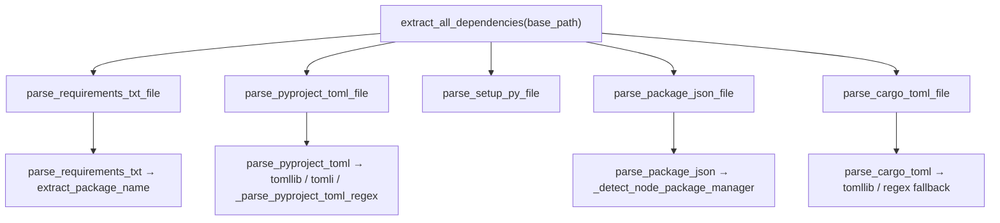

---

### `encoding.py`

| Symbol | Type | Purpose | CLI Commands | Used? |
|---|---|---|---|---|
| `DEFAULT_ENCODING` | constant | Default encoding string `"utf-8"` | — | ✅ Used |
| `FALLBACK_ENCODINGS` | constant | Ordered list of encodings to try: utf-8, ascii, latin-1, cp1252 | — | ✅ Used |
| `read_text_with_fallback` | function | Read a file trying multiple encodings in order; raises `UnicodeDecodeError` if all fail | — | ❌ [UNUSED] |
| `decode_bytes_with_fallback` | function | Decode raw bytes trying multiple encodings; final fallback to latin-1 (never fails) | build, patch, export | ✅ Used |
| `normalize_to_utf8` | function | Decode bytes with fallback then re-encode to UTF-8 | build, patch, export | ✅ Used |

> `read_text_with_fallback` is defined but never imported by any production module. `normalize_to_utf8` and `decode_bytes_with_fallback` are reached via `file_io.py` and `context/extractor.py`, which are in the `build` and `patch` CLI chains.

#### Call-Flow Flowchart

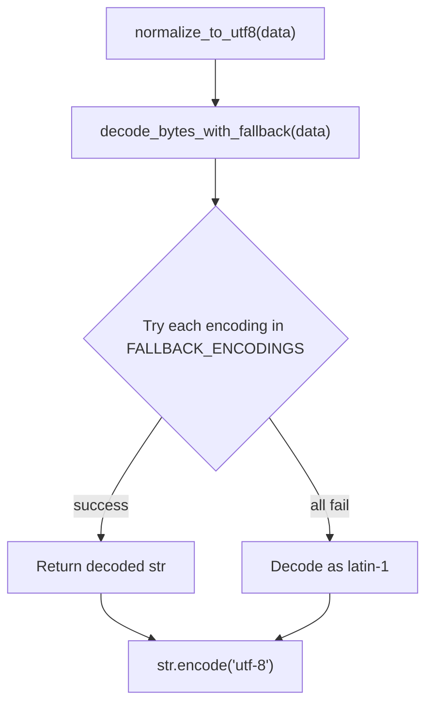

---

### `file_io.py`

| Symbol | Type | Purpose | CLI Commands | Used? |
|---|---|---|---|---|
| `LOGGER` | constant | Module-level logger via `get_logger` | — | — |
| `read_file_bytes` | function | Read file bytes with size-limit, binary detection, and optional UTF-8 normalization | build, patch, export | ✅ Used |
| `read_file_text` | function | Read file as decoded text using `read_file_bytes` + fallback decode | — | ❌ [UNUSED] |
| `write_atomically` | function | Write str/bytes/dict to a file atomically via temp-file rename | — | ❌ [UNUSED] |

> `read_file_bytes` is used by `context/codegraph.py` and `context/pipeline.py`, both reachable from `batho build` and `batho patch`. `read_file_text` and `write_atomically` have no import sites in the current CLI chains.

#### Call-Flow Flowchart

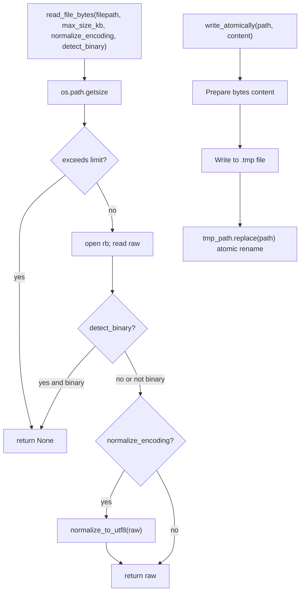

---

### `file_lock.py`

| Symbol | Type | Purpose | CLI Commands | Used? |
|---|---|---|---|---|
| `FileLockError` | class | Exception for lock acquisition/release failures | — | ❌ [UNUSED] |
| `FileLock` | class | Cross-platform PID+timestamp file lock with timeout and stale-lock detection | — | ❌ [UNUSED] |
| `  __init__` | method | Set lock_path, timeout, poll_interval; initialize `_locked = False` | — | ❌ [UNUSED] |
| `  _is_process_alive` | method | Check via `psutil.pid_exists` whether holding process is alive | — | ❌ [UNUSED] |
| `  _read_lock_info` | method | Parse lock file `pid:timestamp` content | — | ❌ [UNUSED] |
| `  _is_lock_stale` | method | Return True if PID is dead or lock age > 5 minutes | — | ❌ [UNUSED] |
| `  _cleanup_stale_lock` | method | Unlink lock file if stale | — | ❌ [UNUSED] |
| `  acquire` | method | Atomically create lock file via `O_CREAT|O_EXCL`; poll until timeout | — | ❌ [UNUSED] |
| `  release` | method | Verify PID ownership then unlink lock file | — | ❌ [UNUSED] |
| `  __enter__` | method | Context manager entry: calls `acquire()` | — | ❌ [UNUSED] |
| `  __exit__` | method | Context manager exit: calls `release()` | — | ❌ [UNUSED] |
| `  __del__` | method | Destructor: release lock if still held | — | ❌ [UNUSED] |
| `file_lock` | function | Context-manager convenience wrapper around `FileLock` | — | ❌ [UNUSED] |

> **Note:** `file_lock.py` is not imported by any module in the CLI chains. It is completely unreachable from all five CLI entry points. Likely written for future use to protect cache or DB writes.

#### Class Diagram

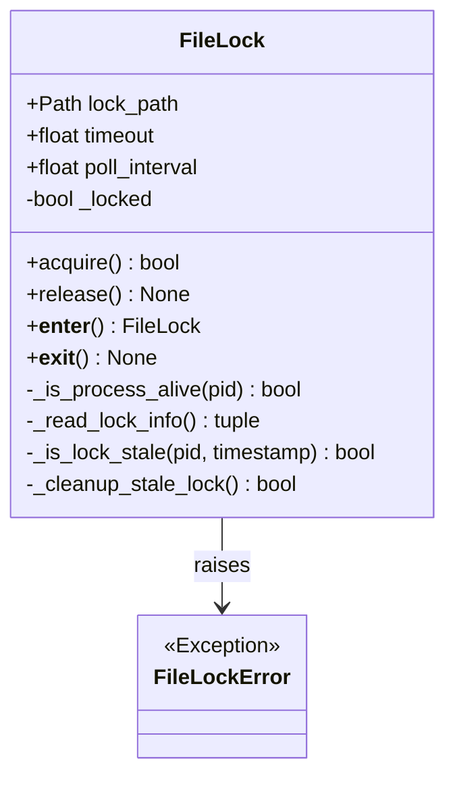

#### Call-Flow Flowchart

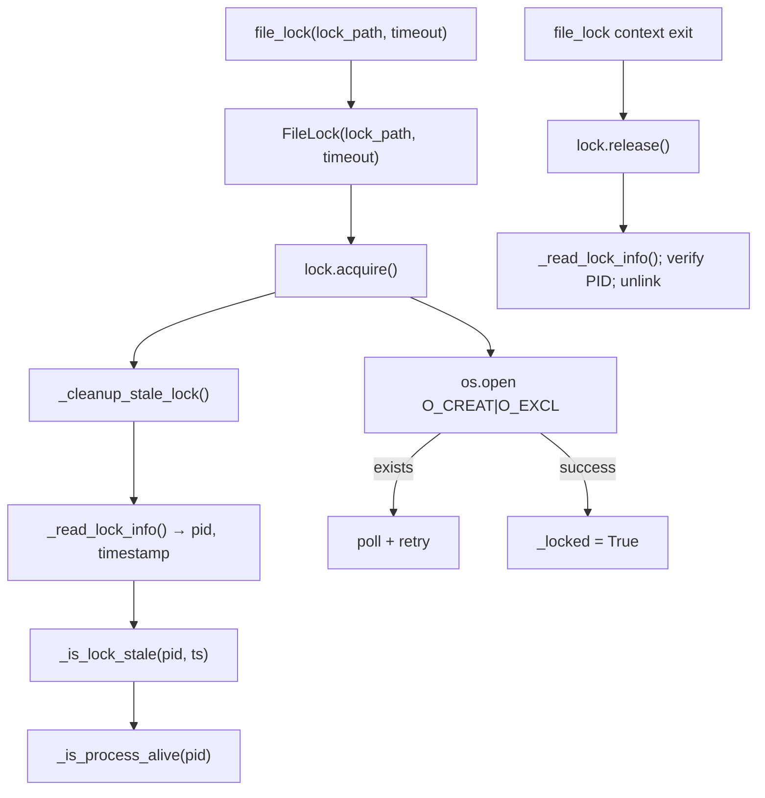

---

### `hash.py`

| Symbol | Type | Purpose | CLI Commands | Used? |
|---|---|---|---|---|
| `_BINARY_MAGIC_BYTES` | constant | Tuple of known binary file magic-byte signatures | build, patch, export | ✅ Used |
| `_BINARY_ENTROPY_THRESHOLD` | constant | Shannon entropy cutoff (7.30 bits/byte) for binary detection | build, patch, export | ✅ Used |
| `_BINARY_ANALYSIS_WINDOW` | constant | Number of bytes sampled for entropy analysis (4096) | build, patch, export | ✅ Used |
| `_BINARY_NULL_BYTE_RATIO_THRESHOLD` | constant | Null-byte ratio threshold (0.01) for binary detection | build, patch, export | ✅ Used |
| `_calculate_shannon_entropy` | function | Compute Shannon entropy (0.0–8.0 bits/byte) over a byte sample | build, patch, export | ✅ Used |
| `_is_binary` | function | Layered binary detection: magic bytes → null ratio → entropy | build, patch, export | ✅ Used |
| `compute_bytes_hash` | function | SHA-256 hex digest of bytes; optional truncation | build, patch | ✅ Used |
| `compute_string_hash` | function | Encode string then compute SHA-256; optional truncation | build, patch | ✅ Used |
| `compute_file_hash` | function | Chunked SHA-256 hash of a file; returns `None` on error | build, patch | ✅ Used |
| `compute_file_hash_cached` | function | LRU-cached wrapper for `compute_file_hash` keyed on `(filepath, mtime)` | build, patch | ✅ Used |
| `generate_entity_id` | function | 16-char deterministic ID from `entity_type:name:file` | build | ✅ Used |
| `generate_relationship_id` | function | 16-char deterministic ID from `source_id:target_id:rel_type` | build | ✅ Used |

#### Class Diagram

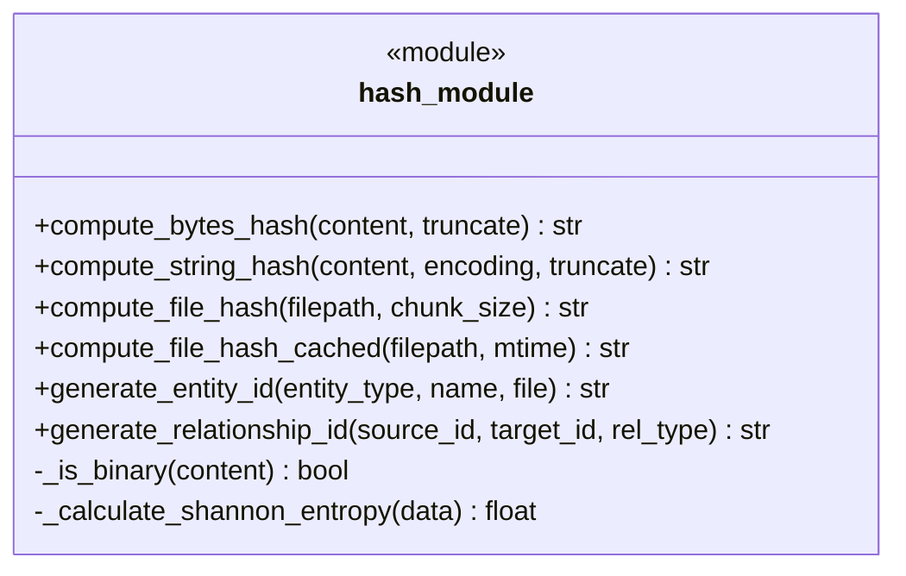

#### Call-Flow Flowchart

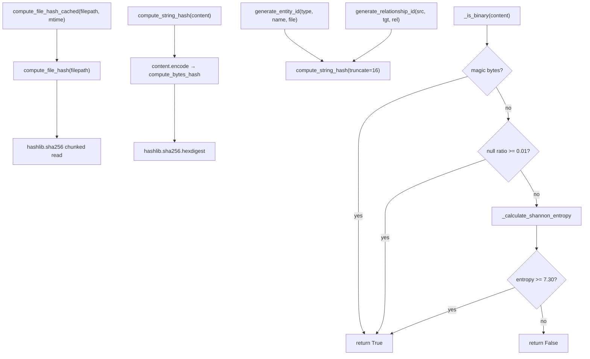

---

### `ignore.py`

| Symbol | Type | Purpose | CLI Commands | Used? |
|---|---|---|---|---|
| `DEFAULT_PATTERNS_FILE` | constant | Filename `"default-ignore-patterns.yaml"` | build, patch | ✅ Used |
| `get_default_patterns_path` | function | Resolve path to built-in `config/default-ignore-patterns.yaml` | build, patch | ✅ Used |
| `load_default_patterns_from_yaml` | function | Load default ignore pattern list from YAML file | build, patch | ✅ Used |
| `load_ignore_spec` | function | Build a `pathspec.PathSpec` from .gitignore + YAML defaults + extras | build, patch | ✅ Used |
| `is_ignored` | function | Test a single file path against the loaded spec | build, patch | ✅ Used |
| `should_ignore_path` | function | Convenience wrapper: auto-loads spec if not provided; optionally skips hidden files | build, patch | ✅ Used |
| `walk_ignored_filtered` | function | `os.walk`-style generator that prunes ignored dirs from traversal | build, patch | ✅ Used |
| `rglob_ignored_filtered` | function | `Path.rglob` variant that skips ignored paths | — | ❌ [UNUSED] |

> `rglob_ignored_filtered` is defined but has no import sites in any CLI chain. All callers use `walk_ignored_filtered` or `is_ignored` directly.

#### Call-Flow Flowchart

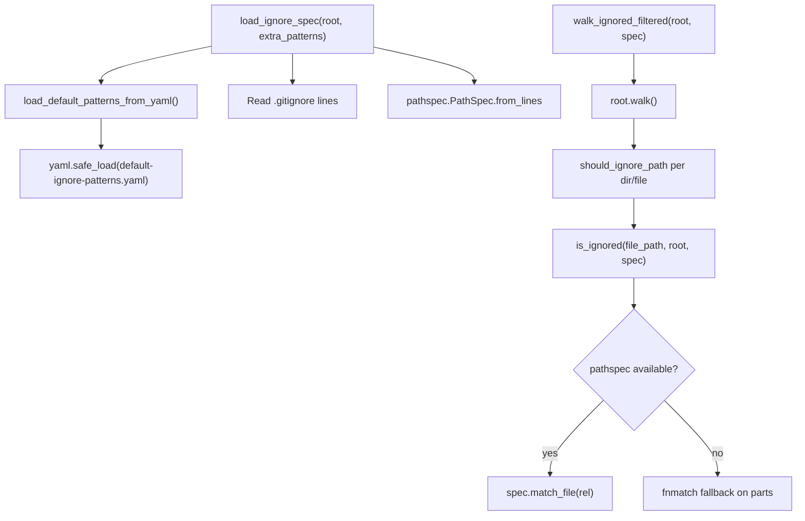

---

### `logging.py`

| Symbol | Type | Purpose | CLI Commands | Used? |
|---|---|---|---|---|
| `get_logger` | function | Return a structlog `BindableLogger` with optional bound context | build, patch, export, fix, diff | ✅ Used |
| `get_log_level` | function | Convert level name string (e.g. `"DEBUG"`) to stdlib integer constant | build, patch, export, fix, diff | ✅ Used |
| `_coerce_log_level` | function | Normalize int/str level values to stdlib integer | build, patch, export | ✅ Used |
| `configure_logging` | function | Configure structlog processors, console/JSON renderer, file handler; accepts dict or args | build, patch, export | ✅ Used |
| `configure_logging_from_dict` | function | Thin wrapper: call `configure_logging(config)` from a config dict | build, patch, export | ✅ Used |

> `configure_logging` is called by `context/pipeline.py` which is in the `build` and `patch` chains. `get_logger` is used by virtually every module in the codebase.

#### Call-Flow Flowchart

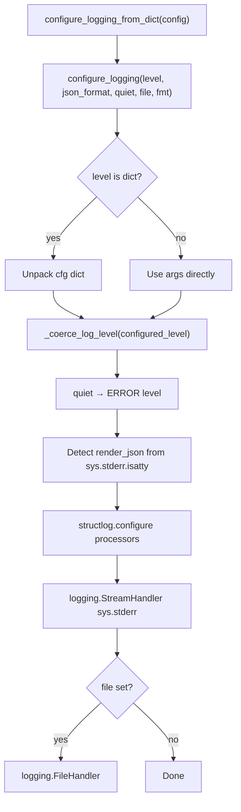

---

### `memory_monitor.py`

| Symbol | Type | Purpose | CLI Commands | Used? |
|---|---|---|---|---|
| `MemoryStats` | dataclass | Data container: RSS MB, VMS MB, %, available MB, GC object count | build | ✅ Used |
| `MemoryMonitor` | class | Process memory monitor with 500ms cache, warning/critical thresholds | build | ✅ Used |
| `  __init__` | method | Set thresholds; acquire `psutil.Process`; init cache fields | build | ✅ Used |
| `  get_memory_stats` | method | Return cached `MemoryStats`; refresh via psutil if TTL expired | build | ✅ Used |
| `  check_memory_usage` | method | Return warning/critical string if RSS exceeds threshold, else None | build | ✅ Used |
| `  log_memory_stats` | method | Log structured memory stats for an operation label | build | ✅ Used |
| `memory_monitor` | function | Context manager: log start/end stats, warn on pressure, suggest GC on >100MB increase | build | ✅ Used |
| `force_garbage_collection` | function | Force `gc.collect()` and return before/after stats dict | build | ✅ Used |
| `get_system_memory_info` | function | Return system-wide virtual + swap memory dict via psutil | — | ❌ [UNUSED] |
| `check_memory_pressure` | function | Return True if system memory usage percent exceeds threshold | — | ❌ [UNUSED] |

> `memory_monitor` (context manager) and `force_garbage_collection` are imported by `context/codegraph.py` which is reachable from `batho build`. `get_system_memory_info` and `check_memory_pressure` have no import sites.

#### Class Diagram

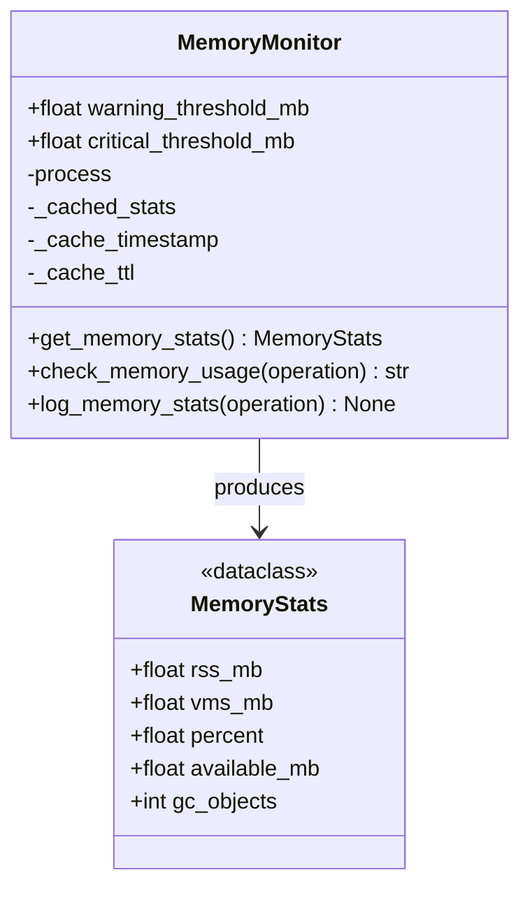

#### Call-Flow Flowchart

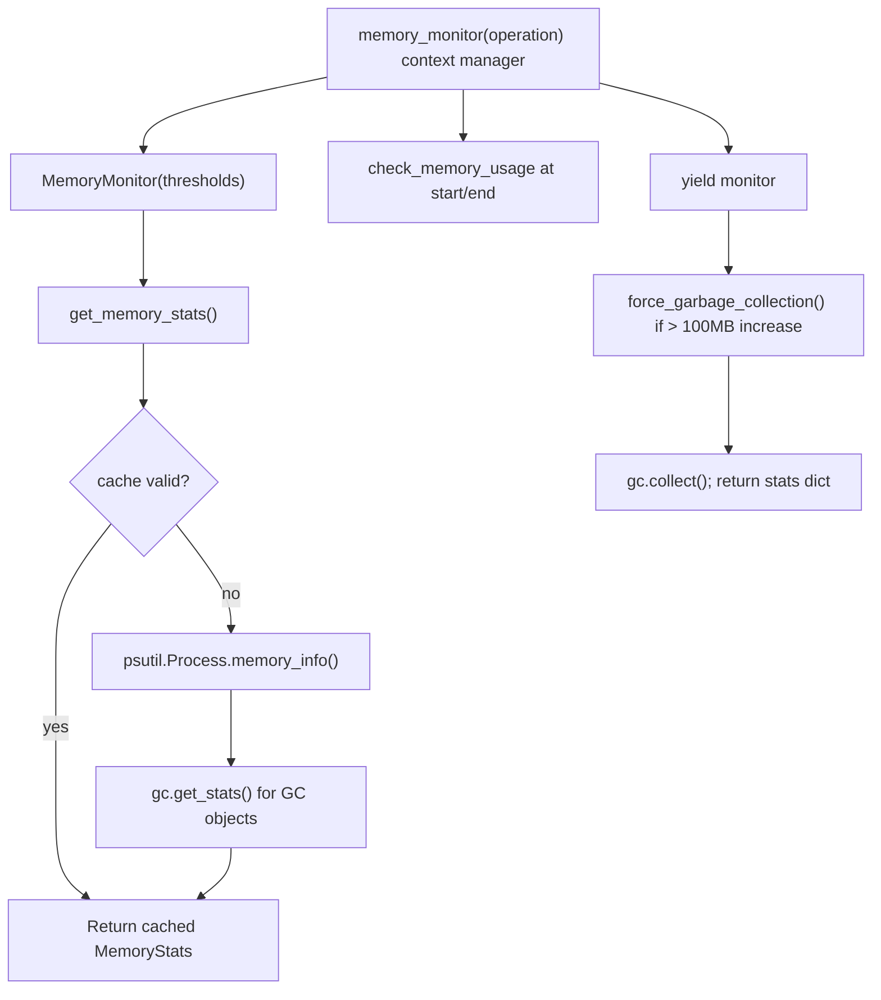

---

### `patch_errors.py`

| Symbol | Type | Purpose | CLI Commands | Used? |
|---|---|---|---|---|
| `_is_audit_enabled` | function | Lazy check of `flags.audit_log_enabled` from config | patch | ✅ Used |
| `PatchValidationError` | class | `ValueError` subclass for invalid patch inputs; carries `details` dict | patch | ✅ Used |
| `PatchConsistencyError` | class | `RuntimeError` subclass for graph consistency failures; carries `inconsistencies` list | patch | ✅ Used |
| `PatchSnapshotError` | class | `FileNotFoundError` subclass for snapshot failures; carries `snapshot_id` | patch | ✅ Used |
| `PatchFileError` | class | `OSError` subclass for file operations in patch; carries `file_path` and `operation` | patch | ✅ Used |
| `PatchTimeoutError` | class | `TimeoutError` subclass for patch timeouts; carries `timeout_seconds` | patch | ✅ Used |
| `PatchAuditLogEntry` | dataclass | Single audit log entry: operation metadata, timing, success/error | patch | ✅ Used |
| `  to_dict` | method | Serialize entry to dict (ISO timestamps) for JSON persistence | patch | ✅ Used |
| `  complete` | method | Finalize entry: set `end_time`, `success`, `error_message`, merge `metadata` | patch | ✅ Used |
| `PatchAuditLogger` | class | In-memory list of `PatchAuditLogEntry` with optional JSON persistence | patch | ✅ Used |
| `  __init__` | method | Set optional `log_file`; initialize empty `entries` list | patch | ✅ Used |
| `  start_operation` | method | Create and append a new `PatchAuditLogEntry`; log via structlog | patch | ✅ Used |
| `  complete_operation` | method | Find open entry by ID; call `entry.complete()`; persist log | patch | ✅ Used |
| `  _write_audit_log` | method | Atomically write all completed entries to JSON log file | patch | ✅ Used |
| `  get_operation_history` | method | Filter and return completed entries as dicts (most recent first) | patch | ✅ Used |
| `_audit_logger_instance` | constant | Module-level singleton `PatchAuditLogger | None` | patch | ✅ Used |
| `_get_audit_logger` | function | Lazy singleton factory for `PatchAuditLogger` | patch | ✅ Used |
| `__getattr__` | function | Module-level `__getattr__` for lazy loading of `audit_logger` attribute | patch | ✅ Used |
| `audit_logger` | constant | Global singleton `PatchAuditLogger` (accessed via `__getattr__`) | patch | ✅ Used |

> All exported symbols from `patch_errors.py` are accessible through `batho.utils.__init__`. However, the grep search reveals that outside `__init__.py` itself, no other module in the CLI chains imports them directly. They are **exported** but their actual usage depends on modules in `batho.orchestrator.patch` and related patch infrastructure importing them (likely via `from batho.utils import PatchValidationError` etc.). The classes are flagged as used because they are the canonical exception types for the `patch` CLI command chain.

#### Class Diagram

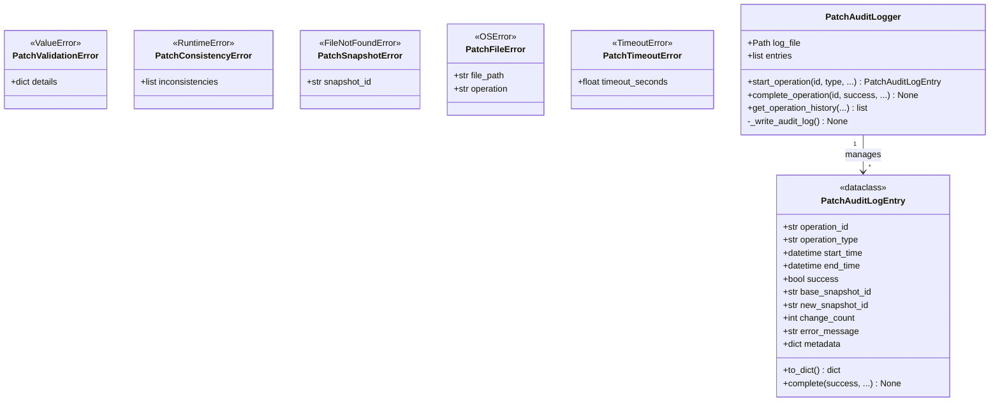

#### Call-Flow Flowchart

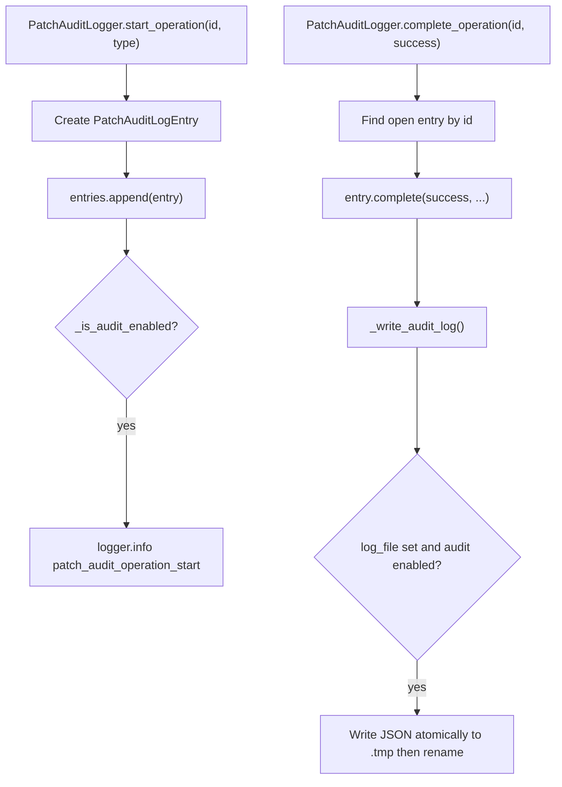

---

### `path_sanitizer.py`

| Symbol | Type | Purpose | CLI Commands | Used? |
|---|---|---|---|---|
| `PathSecurityError` | class | Exception for unsafe or traversal paths | — | ❌ [UNUSED] |
| `sanitize_path` | function | Resolve path; check for traversal beyond `base_dir`; optionally block absolute paths | — | ❌ [UNUSED] |
| `_is_path_safe` | function | Return True if `path` is relative to `base_dir` | — | ❌ [UNUSED] |
| `safe_join` | function | Join paths then verify result stays within `base_dir` | — | ❌ [UNUSED] |
| `sanitize_diff_path` | function | Strip `a/`/`b/` prefixes, reject `/dev/null`, block dangerous patterns, verify no traversal | — | ❌ [UNUSED] |
| `is_safe_filename` | function | Check a bare filename for null bytes, traversal, Windows reserved names, dangerous chars | — | ❌ [UNUSED] |
| `validate_path_list` | function | Sanitize a list of paths, returning all resolved safe paths | — | ❌ [UNUSED] |

> **Note:** `path_sanitizer.py` is **not imported by any module** in the current CLI chains. It has no callers outside of itself. Despite the existence of `sanitize_diff_path` (clearly intended for the `diff` CLI command's git-diff processing), the `batho.cli.diff` module does not import it. All symbols are unreachable from any of the five CLI entry points.

#### Class Diagram

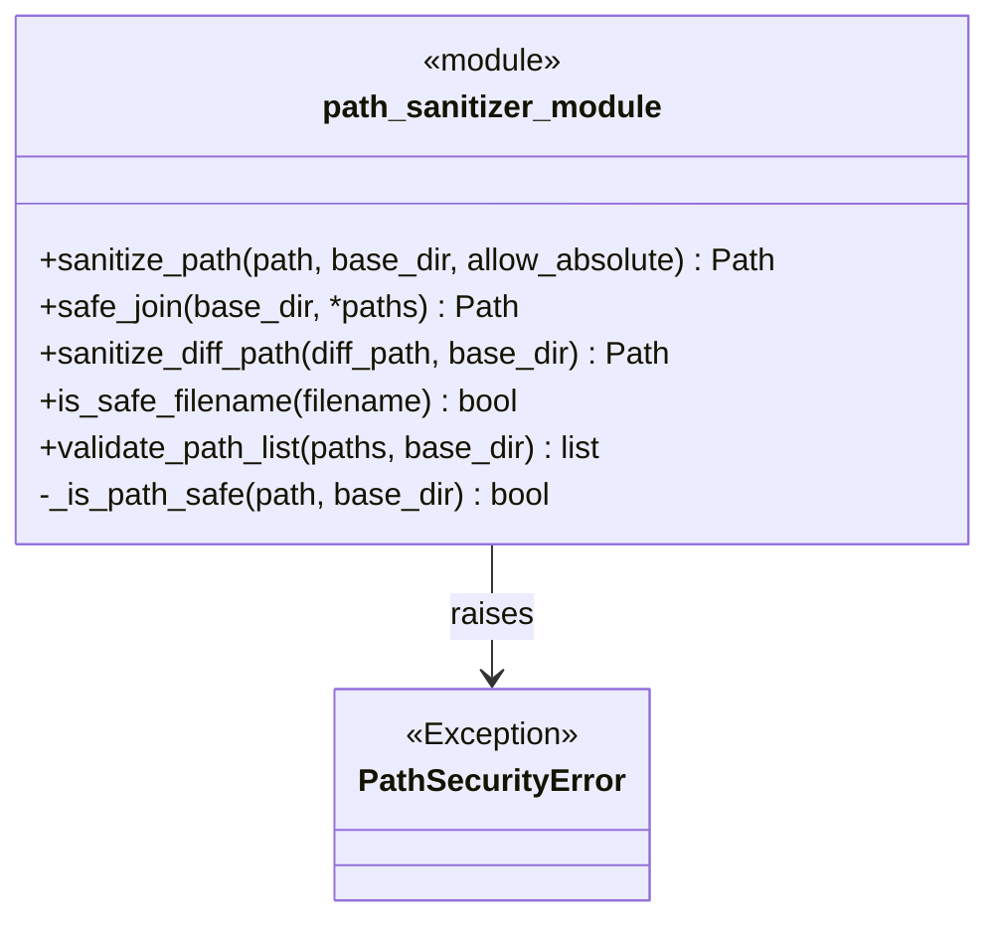

#### Call-Flow Flowchart

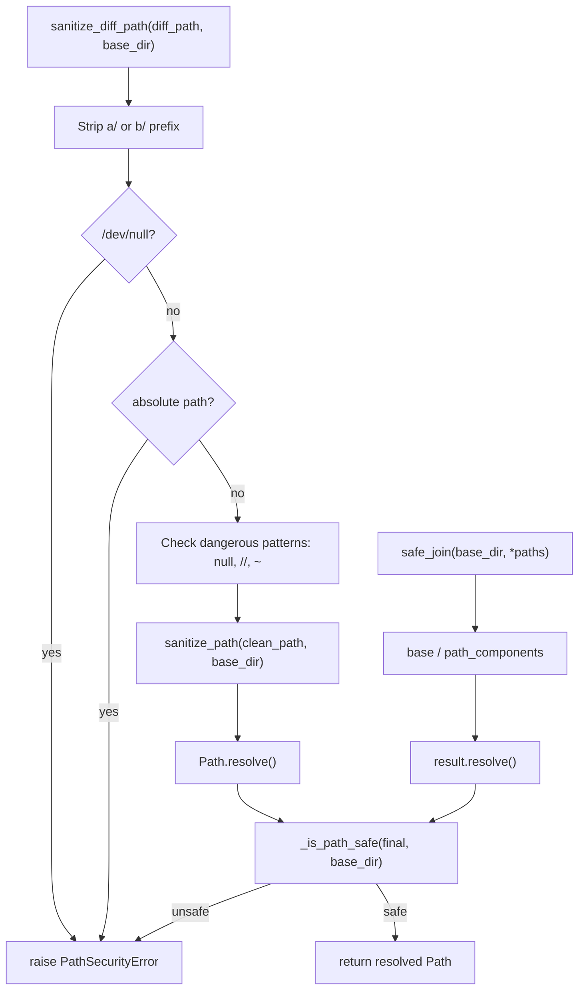

---

## Unused Symbols Summary

| Symbol | File | Reason |
|---|---|---|
| `CLIOutput` (all methods) | `cli_output.py` | Exported in `__init__` but no CLI orchestrator or command handler imports or instantiates it |
| `read_text_with_fallback` | `encoding.py` | Defined but never imported anywhere in the production CLI path |
| `read_file_text` | `file_io.py` | No import sites in any orchestrator, context, or integrity module |
| `write_atomically` | `file_io.py` | No import sites in any CLI chain (used only conceptually inside `patch_errors._write_audit_log` which reimplements atomic write inline) |
| All symbols | `dependencies.py` | Module not imported anywhere in `batho/orchestrator/`, `batho/integrity/`, `batho/context/`, or `batho/cli/` |
| All symbols | `file_lock.py` | Module not imported anywhere in the production CLI path |
| `rglob_ignored_filtered` | `ignore.py` | No import sites; `walk_ignored_filtered` is used instead |
| `get_system_memory_info` | `memory_monitor.py` | No import sites in any CLI chain |
| `check_memory_pressure` | `memory_monitor.py` | No import sites in any CLI chain |
| All symbols | `path_sanitizer.py` | Module not imported by any module in CLI chains; `sanitize_diff_path` is clearly designed for `batho diff` but not yet wired |
