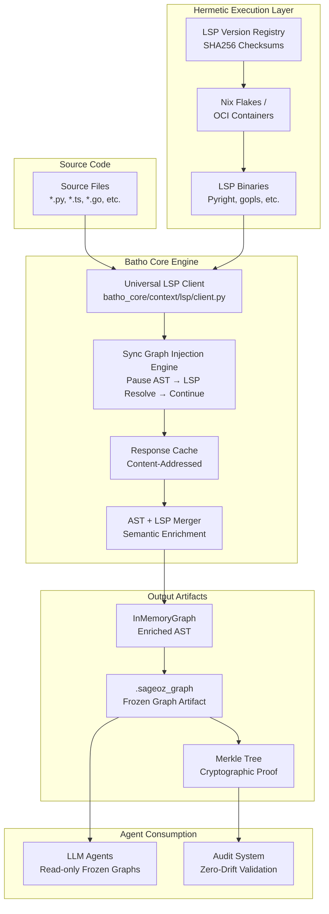
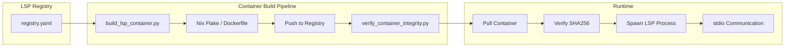
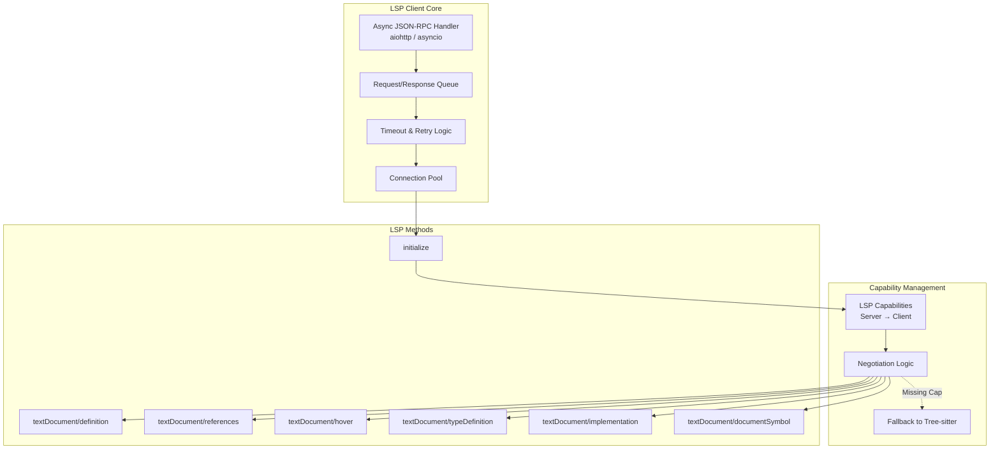
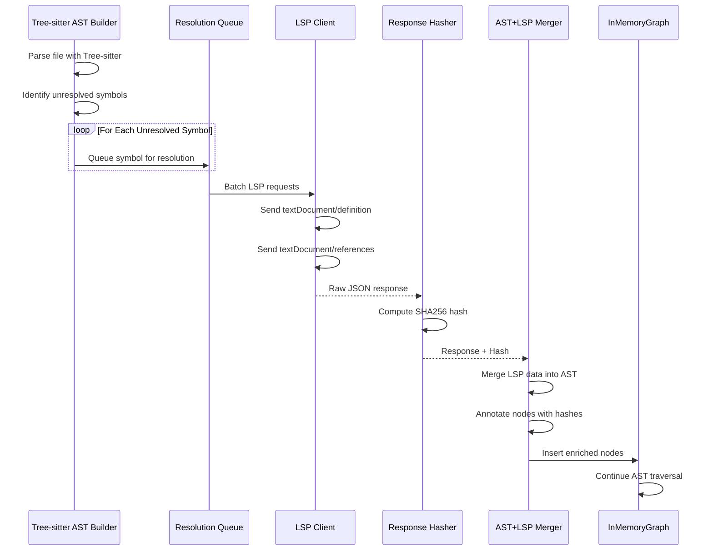
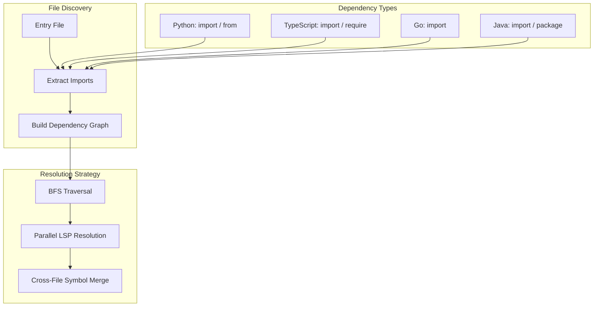
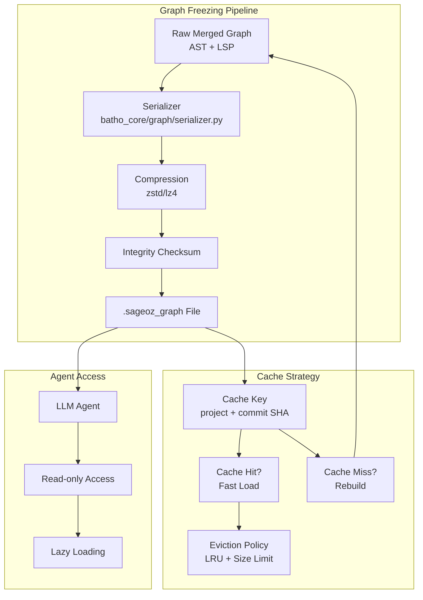
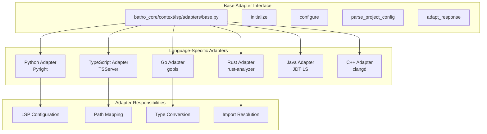
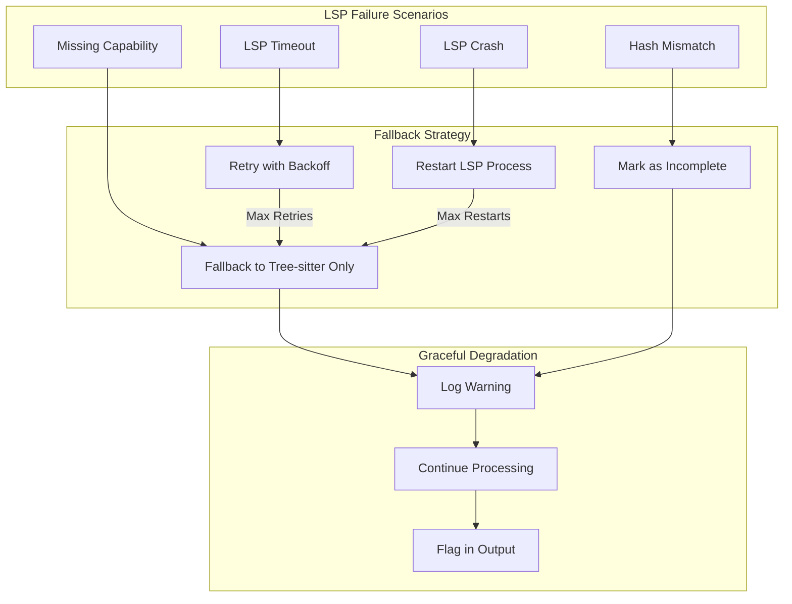
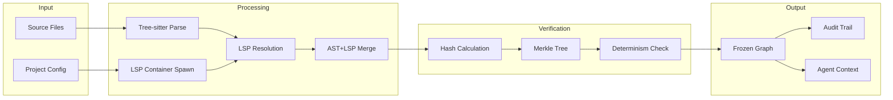

# Batho LSP Integration Architecture

## System Overview

The Batho LSP Integration creates a **100% deterministic, hermetic context engine** that combines Tree-sitter AST parsing with LSP semantic analysis across 35+ languages.



## Component Architecture

### 1. Hermetic Container Layer



**Key Design Decisions:**
- **Nix Flakes** preferred for reproducible builds
- **OCI Containers** as fallback for broader compatibility
- **SHA256 checksums** for every LSP binary
- **Immutable container registry** - never overwrite, only version

---

### 2. Universal LSP Client Architecture



---

### 3. Synchronous Graph Injection Flow



**Critical Design Points:**
- **Synchronous pause**: AST building stops until LSP resolves
- **Batching**: Multiple symbols resolved in parallel
- **Content hashing**: Every LSP response hashed for audit
- **Timeout handling**: Graceful degradation if LSP slow/fails

---

### 4. Cross-File Resolution Architecture



---

### 5. Frozen Graph & Caching Architecture



---

### 6. Merkle Tree Audit Architecture

```mermaid
flowchart TB
    subgraph "Merkle Tree Construction"
        LEAF1[Leaf: Source SHA256]
        LEAF2[Leaf: LSP Binary SHA256]
        LEAF3[Leaf: Config SHA256]
        LEAF4[Leaf: Response Hashes]
        
        HASH12[Hash(Node1+Node2)]
        HASH34[Hash(Node3+Node4)]
        
        ROOT[Root Hash<br/>Cryptographic Proof]
    end

    subgraph "Verification"
        TIME[Time Travel<br/>Historical Context]
        RECON[Reconstruct Graph]
        COMPARE[Compare Root Hashes]
        PROOF[Mathematical Proof<br/>of Determinism]
    end

    LEAF1 --> HASH12
    LEAF2 --> HASH12
    LEAF3 --> HASH34
    LEAF4 --> HASH34
    HASH12 --> ROOT
    HASH34 --> ROOT
    
    ROOT --> TIME
    TIME --> RECON
    RECON --> COMPARE
    COMPARE --> PROOF
```

---

### 7. Language Adapter Architecture



---

### 8. Error Handling & Fallback Architecture



---

### 9. Data Flow Overview



---

## Directory Structure

```
batho_core/
├── context/
│   ├── lsp/
│   │   ├── __init__.py
│   │   ├── client.py           # Universal LSP client
│   │   ├── process_manager.py  # LSP process management
│   │   ├── cache.py            # Response caching
│   │   ├── hasher.py           # Response hashing
│   │   ├── capabilities.py     # Capability negotiation
│   │   ├── adapters/
│   │   │   ├── __init__.py
│   │   │   ├── base.py         # Base adapter interface
│   │   │   ├── python.py       # Pyright adapter
│   │   │   ├── typescript.py   # TSServer adapter
│   │   │   ├── go.py           # gopls adapter
│   │   │   ├── rust.py         # rust-analyzer adapter
│   │   │   ├── java.py         # JDT LS adapter
│   │   │   └── cpp.py          # clangd adapter
│   │   └── containers/
│   │       ├── registry.yaml   # LSP version registry
│   │       ├── build/
│   │       │   └── build_lsp_container.py
│   │       └── verify/
│   │           └── verify_container_integrity.py
│   ├── graph.py                # Modified InMemoryGraph
│   └── merger.py               # AST+LSP merge engine
├── audit/
│   ├── __init__.py
│   ├── merkle.py               # Merkle tree implementation
│   ├── time_travel.py          # Context reconstruction
│   ├── reports.py              # Audit report generation
│   └── storage.py              # Audit data storage
└── graph/
    ├── __init__.py
    ├── serializer.py           # Graph serialization
    └── frozen_format.py        # Frozen graph format
```

---

## Integration Points

### With Existing Batho Components:

1. **Tree-sitter Integration**: `batho_core/context/` extended with LSP submodules
2. **Graph System**: `InMemoryGraph` modified for synchronous injection
3. **Config System**: Extended to support LSP configuration
4. **CLI**: New commands for cache management, audit reports

### External Integrations:

1. **Container Runtime**: Docker/Podman or Nix daemon
2. **LSP Binaries**: 35+ language servers in containers
3. **Version Control**: Git for source versioning and audit trail
4. **Storage**: Local filesystem + optional distributed cache

---

## Security Considerations

1. **Hermetic Execution**: No access to host machine environment
2. **Immutable Binaries**: SHA256 verification prevents tampering
3. **Audit Trail**: Complete cryptographic proof of every run
4. **No Network**: LSP containers should not make external network calls
5. **Resource Limits**: CPU/memory constraints on LSP processes

---

## Performance Targets

| Metric | Target | Notes |
|--------|--------|-------|
| Cold Start | < 30s | First run with no cache |
| Warm Start | < 5s | With frozen graph cache |
| LSP Resolution | < 500ms/symbol | For symbols in scope |
| Cross-File | < 2s/file | Dependency resolution |
| Graph Freeze | < 1s/1000 nodes | Serialization speed |
| Graph Load | < 500ms/1000 nodes | Deserialization speed |

---

**Document Version**: 1.0  
**Last Updated**: 2026-03-31
