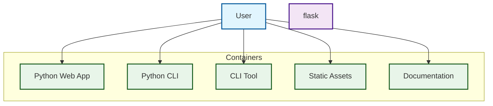

```mermaid
flowchart TD
classDef person fill:#E1F5FE,stroke:#01579B,stroke-width:2px
classDef system fill:#F3E5F5,stroke:#4A148C,stroke-width:2px
classDef container fill:#E8F5E9,stroke:#1B5E20,stroke-width:2px
user["User"]:::person
system["flask"]:::system

subgraph Containers
  container-1["Python Web App"]:::container
  container-2["Python CLI"]:::container
  container-3["CLI Tool"]:::container
  container-4["Static Assets"]:::container
  container-5["Documentation"]:::container
end

%% Relationships
user --> container-1
user --> container-2
user --> container-3
user --> container-4
user --> container-5
```
